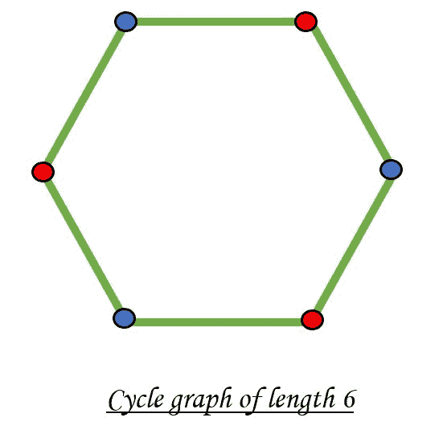

# 使用 DFS 检查给定图是否为二分图

> 原文： [https://www.geeksforgeeks.org/check-if-a-given-graph-is-bipartite-using-dfs/](https://www.geeksforgeeks.org/check-if-a-given-graph-is-bipartite-using-dfs/)

给定一个连通图，请检查该图是否为[双向](http://www.geeksforgeeks.org/bipartite-graph/)。 如果可以使用两种颜色对图形进行着色，从而用一组相同的颜色对一组顶点进行着色，则二部图是可行的。 注意，可以使用两种颜色以均匀的周期为周期图着色。 例如，请参见下图。



不可能使用两种颜色用奇数周期为周期图着色。


在先前的[帖子](https://www.geeksforgeeks.org/bipartite-graph/)中，已经讨论了使用 [BFS](http://www.geeksforgeeks.org/breadth-first-traversal-for-a-graph/) 的方法。 在这篇文章中，已经实现了使用 [DFS](http://www.geeksforgeeks.org/depth-first-traversal-for-a-graph/) 的方法。

下面给出的是检查图的二部性的算法。

*   使用 *color []* 数组为每个表示相反颜色的节点存储 0 或 1。

*   从任何节点调用函数 [DFS](http://www.geeksforgeeks.org/depth-first-traversal-for-a-graph/) 。

*   如果先前尚未访问过节点 u，则将！color [v]分配给 color [u]，然后再次调用 DFS 来访问连接到 u 的节点。

*   如果在任何时候 color [u]等于！color [v]，则该节点是二分的。

*   修改 DFS 函数，使其在最后返回一个布尔值。

下面是上述方法的实现：

## C++

```cpp

// C++ program to check if a connected
// graph is bipartite or not suing DFS
#include <bits/stdc++.h>
using namespace std;

// function to store the connected nodes
void addEdge(vector<int> adj[], int u, int v)
{
    adj[u].push_back(v);
    adj[v].push_back(u);
}

// function to check whether a graph is bipartite or not
bool isBipartite(vector<int> adj[], int v,
                 vector<bool>& visited, vector<int>& color)
{

    for (int u : adj[v]) {

        // if vertex u is not explored before
        if (visited[u] == false) {

            // mark present vertic as visited
            visited[u] = true;

            // mark its color opposite to its parent
            color[u] = !color[v];

            // if the subtree rooted at vertex v is not bipartite
            if (!isBipartite(adj, u, visited, color))
                return false;
        }

        // if two adjacent are colored with same color then
        // the graph is not bipartite
        else if (color[u] == color[v])
            return false;
    }
    return true;
}

// Driver Code
int main()
{
    // no of nodes
    int N = 6;

    // to maintain the adjacency list of graph
    vector<int> adj[N + 1];

    // to keep a check on whether
    // a node is discovered or not
    vector<bool> visited(N + 1);

    // to color the vertices
    // of graph with 2 color
    vector<int> color(N + 1);

    // adding edges to the graph
    addEdge(adj, 1, 2);
    addEdge(adj, 2, 3);
    addEdge(adj, 3, 4);
    addEdge(adj, 4, 5);
    addEdge(adj, 5, 6);
    addEdge(adj, 6, 1);

    // marking the source node as visited
    visited[1] = true;

    // marking the source node with a color
    color[1] = 0;

    // Function to check if the graph
    // is Bipartite or not
    if (isBipartite(adj, 1, visited, color)) {
        cout << "Graph is Bipartite";
    }
    else {
        cout << "Graph is not Bipartite";
    }

    return 0;
}

```

## Java

```java

// Java program to check if a connected 
// graph is bipartite or not suing DFS 
import java.util.*;

class GFG{

// Function to store the connected nodes 
static void addEdge(ArrayList<ArrayList<Integer>> adj, 
                    int u, int v) 
{ 
    adj.get(u).add(v); 
    adj.get(v).add(u); 
} 

// Function to check whether a 
// graph is bipartite or not 
static boolean isBipartite(ArrayList<ArrayList<Integer>> adj,
                           int v, boolean visited[], 
                           int color[]) 
{ 
    for(int u : adj.get(v))
    { 

        // If vertex u is not explored before 
        if (visited[u] == false)
        { 

            // Mark present vertic as visited 
            visited[u] = true; 

            // Mark its color opposite to its parent 
            color[u] = 1 - color[v]; 

            // If the subtree rooted at vertex 
            // v is not bipartite 
            if (!isBipartite(adj, u, visited, color)) 
                return false; 
        } 

        // If two adjacent are colored with
        // same color then the graph is
        // not bipartite 
        else if (color[u] == color[v]) 
            return false; 
    } 
    return true; 
} 

// Driver Code 
public static void main(String args[]) 
{ 

    // No of nodes 
    int N = 6; 

    // To maintain the adjacency list of graph 
    ArrayList<
    ArrayList<Integer>> adj = new ArrayList<
                                  ArrayList<Integer>>(N + 1); 

    // Initialize all the vertex
    for(int i = 0; i <= N; i++)
    {
        adj.add(new ArrayList<Integer>());
    }

    // To keep a check on whether 
    // a node is discovered or not 
    boolean visited[] = new boolean[N + 1]; 

    // To color the vertices 
    // of graph with 2 color 
    int color[] = new int[N + 1]; 

    // The value '-1' of colorArr[i] is 
    // used to indicate that no color is 
    // assigned to vertex 'i'. The value 
    // 1 is used to indicate first color 
    // is assigned and value 0 indicates  
    // second color is assigned. 
    Arrays.fill(color, -1);

    // Adding edges to the graph 
    addEdge(adj, 1, 2); 
    addEdge(adj, 2, 3); 
    addEdge(adj, 3, 4); 
    addEdge(adj, 4, 5); 
    addEdge(adj, 5, 6); 
    addEdge(adj, 6, 1); 

    // Marking the source node as visited 
    visited[1] = true; 

    // Marking the source node with a color 
    color[1] = 0; 

    // Function to check if the graph 
    // is Bipartite or not 
    if (isBipartite(adj, 1, visited, color))
    { 
        System.out.println("Graph is Bipartite"); 
    } 
    else
    { 
        System.out.println("Graph is not Bipartite"); 
    } 
} 
}

// This code is contributed by adityapande88

```

## Python

```py

# Python3 program to check if a connected
# graph is bipartite or not suing DFS

# Function to store the connected nodes
def addEdge(adj, u, v):

    adj[u].append(v)
    adj[v].append(u)

# Function to check whether a graph is 
# bipartite or not
def isBipartite(adj, v, visited, color):

    for u in adj[v]: 

        # If vertex u is not explored before
        if (visited[u] == False):

            # Mark present vertic as visited
            visited[u] = True

            # Mark its color opposite to its parent
            color[u] = not color[v]

            # If the subtree rooted at vertex v 
            # is not bipartite
            if (not isBipartite(adj, u,
                                visited, color)):
                return false

        # If two adjacent are colored with
        # same color then the graph is not 
        # bipartite
        elif (color[u] == color[v]):
            return Talse

    return True

# Driver Code
if __name__=='__main__':

    # No of nodes
    N = 6

    # To maintain the adjacency list of graph
    adj = [[] for i in range(N + 1)]

    # To keep a check on whether
    # a node is discovered or not
    visited = [0 for i in range(N + 1)]

    # To color the vertices
    # of graph with 2 color
    color = [0 for i in range(N + 1)]

    # Adding edges to the graph
    addEdge(adj, 1, 2)
    addEdge(adj, 2, 3)
    addEdge(adj, 3, 4)
    addEdge(adj, 4, 5)
    addEdge(adj, 5, 6)
    addEdge(adj, 6, 1)

    # Marking the source node as visited
    visited[1] = True

    # Marking the source node with a color
    color[1] = 0

    # Function to check if the graph
    # is Bipartite or not
    if (isBipartite(adj, 1, visited, color)):
        print("Graph is Bipartite")
    else:
        print("Graph is not Bipartite")

# This code is contributed by rutvik_56

```

## C#

```cs

// C# program to check if a connected 
// graph is bipartite or not suing DFS 
using System;
using System.Collections.Generic;

class GFG{

// Function to store the connected nodes 
static void addEdge(List<List<int>> adj, 
                    int u, int v) 
{ 
    adj[u].Add(v); 
    adj[v].Add(u); 
} 

// Function to check whether a 
// graph is bipartite or not 
static bool isBipartite(List<List<int>> adj,
                        int v, bool []visited, 
                        int []color) 
{ 
    foreach(int u in adj[v])
    { 

        // If vertex u is not explored before 
        if (visited[u] == false)
        { 

            // Mark present vertic as visited 
            visited[u] = true; 

            // Mark its color opposite to its parent 
            color[u] = 1 - color[v]; 

            // If the subtree rooted at vertex 
            // v is not bipartite 
            if (!isBipartite(adj, u, visited, color)) 
                return false; 
        } 

        // If two adjacent are colored with
        // same color then the graph is
        // not bipartite 
        else if (color[u] == color[v]) 
            return false; 
    } 
    return true; 
} 

// Driver Code 
public static void Main(String []args) 
{ 

    // No of nodes 
    int N = 6; 

    // To maintain the adjacency list of graph 
    List<List<int>> adj = new List<List<int>>(N + 1); 

    // Initialize all the vertex
    for(int i = 0; i <= N; i++)
    {
        adj.Add(new List<int>());
    }

    // To keep a check on whether 
    // a node is discovered or not 
    bool []visited = new bool[N + 1]; 

    // To color the vertices 
    // of graph with 2 color 
    int []color = new int[N + 1]; 

    // The value '-1' of colorArr[i] is 
    // used to indicate that no color is 
    // assigned to vertex 'i'. The value 
    // 1 is used to indicate first color 
    // is assigned and value 0 indicates  
    // second color is assigned. 
    for(int i = 0; i <= N; i++)   
        color[i] = -1;

    // Adding edges to the graph 
    addEdge(adj, 1, 2); 
    addEdge(adj, 2, 3); 
    addEdge(adj, 3, 4); 
    addEdge(adj, 4, 5); 
    addEdge(adj, 5, 6); 
    addEdge(adj, 6, 1); 

    // Marking the source node as visited 
    visited[1] = true; 

    // Marking the source node with a color 
    color[1] = 0; 

    // Function to check if the graph 
    // is Bipartite or not 
    if (isBipartite(adj, 1, visited, color))
    { 
        Console.WriteLine("Graph is Bipartite"); 
    } 
    else
    { 
        Console.WriteLine("Graph is not Bipartite"); 
    } 
} 
}

// This code is contributed by Princi Singh

```

**Output:** 

```
Graph is Bipartite
```

**时间复杂度**：O（N）

**辅助空间**：O（N）

被誉为业界最抢手的技能之一，拥有我们的 [**C ++ STL**](https://practice.geeksforgeeks.org/courses/cpp-stl?utm_source=geeksforgeeks&utm_medium=article&utm_campaign=GFG_Article_Bottom_CPP_STL) 课程的编码基础，并通过严格的问题解决方法掌握了这些概念。

* * *

* * *

如果您喜欢 GeeksforGeeks 并希望做出贡献，则还可以使用 [tribution.geeksforgeeks.org](https://contribute.geeksforgeeks.org/) 撰写文章，或将您的文章邮寄至 tribution@geeksforgeeks.org。 查看您的文章出现在 GeeksforGeeks 主页上，并帮助其他 Geeks。

如果您发现任何不正确的地方，请单击下面的“改进文章”按钮，以改进本文。