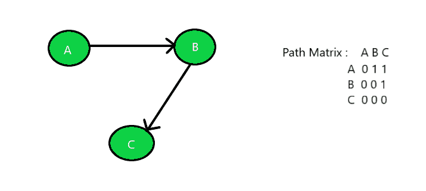
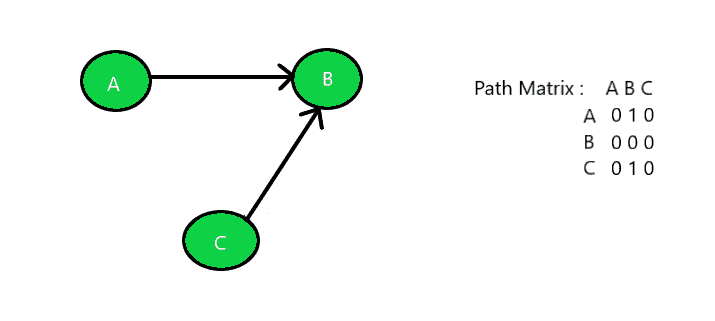

# 检查图形是牢固，单边还是弱连接

> 原文： [https://www.geeksforgeeks.org/check-if-a-graph-is-strongly-unilaterally-or-weakly-connected/](https://www.geeksforgeeks.org/check-if-a-graph-is-strongly-unilaterally-or-weakly-connected/)

给定一个未加权的有向[图](https://www.geeksforgeeks.org/graph-and-its-representations/)`G`作为路径矩阵，任务是找出该图是[是强连通的](https://www.geeksforgeeks.org/connectivity-in-a-directed-graph/)还是单侧连通或弱连通。

> **强连接**：如果图中的每对顶点（u，v）包含彼此之间的路径，则称该图为**强连接**。 在未加权的有向图 G 中，每对顶点 u 和 v 在它们之间的每个方向上都应具有一条路径，即双向路径。 这种图的路径矩阵的元素将包含所有 **1 的**。
> **单边连接**：如果图中包含每对顶点 u 的从 u 到 v 的定向路径或从 v 到 u 的定向路径，则称该图为**单边连接**。 因此，至少对于任何一对顶点，一个顶点都应可从另一个顶点到达。 这样的路径矩阵宁可具有包含 **1 的**的上三角形元素，也可以包含包含 **1 的**的下三角形元素。
> **弱连接**：如果在任意两对顶点之间不存在任何路径，则称图为**弱连接**。 因此，如果图 G 不包含有向路径（对于每对顶点 u，v，从 u 到 v 或从 v 到 u），则它是弱连接的。 该图的这种路径矩阵的元素将是随机的。

**示例**：

> **输入**：下面是带有路径矩阵的给定图：
> 
> 
> 
> **输出**：强连接图
> **输入**：下面是带有路径矩阵的给定图：
> 
> 
> 
> **输出**：单边连接图
> **输入**：下面是带有路径矩阵的给定图：
> 
> 
> 
> **输出**：弱连接图

**方法**：

1.  对于要为[，**，强连通的**，](https://www.geeksforgeeks.org/strongly-connected-components/)的图，请使用[中讨论的方法遍历给定的路径矩阵。此](https://www.geeksforgeeks.org/traverse-a-given-matrix-using-recursion/)文章检查单元格中的所有值是否均为`1`与否。 如果是，则打印**“强连接图”** ，否则检查其他两个图。
2.  对于要为**单边连接**的图，请使用[本文](https://www.geeksforgeeks.org/traverse-a-given-matrix-using-recursion/)文章中讨论的方法遍历给定的路径矩阵，并检查以下内容：
    *   如果主对角线上的所有值均为 **1s** ，除此以外的所有其他值均为 **0s** 。
    *   如果主对角线以下的所有值均为 **1s** ，除此以外的所有值均为 **0s** 。
3.  如果满足以上两个条件之一，则给定图为**单边连接**，否则图为**弱连接图**。

下面是上述方法的实现：

## C++

```cpp

// C++ implementation of the approach 

#include <bits/stdc++.h> 
using namespace std; 
#define V 3 

// Function to find the characteristic 
// of the given graph 
int checkConnected(int graph[][V], int n) 
{ 

    // Check whether the graph is 
    // strongly connected or not 
    bool strongly = true; 

    // Traverse the path matrix 
    for (int i = 0; i < n; i++) { 

        for (int j = 0; j < n; j++) { 

            // If all the elements are 
            // not equal then the graph 
            // is not strongly connected 
            if (graph[i][j] != graph[j][i]) { 
                strongly = false; 
                break; 
            } 
        } 

        // Break out of the loop if false 
        if (!strongly) { 
            break; 
        } 
    } 
    // If true then print strongly 
    // connected and return 
    if (strongly) { 
        cout << "Strongly Connected"; 
        return 0; 
    } 

    // Check whether the graph is 
    // Unilaterally connected by 
    // checking Upper Triangle element 
    bool uppertri = true; 

    // Traverse the path matrix 
    for (int i = 0; i < n; i++) { 

        for (int j = 0; j < n; j++) { 

            // If uppertriangle elements 
            // are 0 then break out of the 
            // loop and check the elements 
            // of lowertriangle matrix 
            if (i > j && graph[i][j] == 0) { 
                uppertri = false; 
                break; 
            } 
        } 

        // Break out of the loop if false 
        if (!uppertri) { 
            break; 
        } 
    } 

    // If true then print unilaterally 
    // connected and return 
    if (uppertri) { 
        cout << "Unilaterally Connected"; 
        return 0; 
    } 

    // Check lowertraingle elements 
    bool lowertri = true; 

    // Traverse the path matrix 
    for (int i = 0; i < n; i++) { 

        for (int j = 0; j < n; j++) { 

            // If lowertraingle elements 
            // are 0 then break cause 
            // 1's are expected 
            if (i < j && graph[i][j] == 0) { 
                lowertri = false; 
                break; 
            } 
        } 

        // Break out of the loop if false 
        if (!lowertri) { 
            break; 
        } 
    } 

    // If true then print unilaterally 
    // connected and return 
    if (lowertri) { 
        cout << "Unilaterally Connected"; 
        return 0; 
    } 

    // If elements are in random order 
    // unsynchronized then print weakly 
    // connected and return 
    else { 
        cout << "Weakly Connected"; 
    } 

    return 0; 
} 

// Driver Code 
int main() 
{ 
    // Number of nodes 
    int n = 3; 

    // Given Path Matrix 
    int graph[V][V] = { 
        { 0, 1, 1 }, 
        { 0, 0, 1 }, 
        { 0, 0, 0 }, 
    }; 

    // Function Call 
    checkConnected(graph, n); 
    return 0; 
} 

```

## Java

```java

// Java implementation of the above approach 
import java.util.*; 

class GFG{ 

static final int V = 3; 

// Function to find the characteristic 
// of the given graph 
static int checkConnected(int graph[][], int n) 
{ 

    // Check whether the graph is 
    // strongly connected or not 
    boolean strongly = true; 

    // Traverse the path matrix 
    for(int i = 0; i < n; i++) 
    { 
        for(int j = 0; j < n; j++) 
        { 

            // If all the elements are 
            // not equal then the graph 
            // is not strongly connected 
            if (graph[i][j] != graph[j][i]) 
            { 
                strongly = false; 
                break; 
            } 
        } 

        // Break out of the loop if false 
        if (!strongly) 
        { 
            break; 
        } 
    } 

    // If true then print strongly 
    // connected and return 
    if (strongly) 
    { 
        System.out.print("Strongly Connected"); 
        return 0; 
    } 

    // Check whether the graph is 
    // Unilaterally connected by 
    // checking Upper Triangle element 
    boolean uppertri = true; 

    // Traverse the path matrix 
    for(int i = 0; i < n; i++) 
    { 
        for(int j = 0; j < n; j++) 
        { 

            // If uppertriangle elements 
            // are 0 then break out of the 
            // loop and check the elements 
            // of lowertriangle matrix 
            if (i > j && graph[i][j] == 0) 
            { 
                uppertri = false; 
                break; 
            } 
        } 

        // Break out of the loop if false 
        if (!uppertri) 
        { 
            break; 
        } 
    } 

    // If true then print unilaterally 
    // connected and return 
    if (uppertri) 
    { 
        System.out.print("Unilaterally Connected"); 
        return 0; 
    } 

    // Check lowertraingle elements 
    boolean lowertri = true; 

    // Traverse the path matrix 
    for(int i = 0; i < n; i++) 
    { 
        for(int j = 0; j < n; j++) 
        { 

            // If lowertraingle elements 
            // are 0 then break cause 
            // 1's are expected 
            if (i < j && graph[i][j] == 0) 
            { 
                lowertri = false; 
                break; 
            } 
        } 

        // Break out of the loop if false 
        if (!lowertri) 
        { 
            break; 
        } 
    } 

    // If true then print unilaterally 
    // connected and return 
    if (lowertri) 
    { 
        System.out.print("Unilaterally Connected"); 
        return 0; 
    } 

    // If elements are in random order 
    // unsynchronized then print weakly 
    // connected and return 
    else
    { 
        System.out.print("Weakly Connected"); 
    } 
    return 0; 
} 

// Driver Code 
public static void main(String[] args) 
{ 

    // Number of nodes 
    int n = 3; 

    // Given Path Matrix 
    int graph[][] = { { 0, 1, 1 }, 
                      { 0, 0, 1 }, 
                      { 0, 0, 0 } }; 

    // Function call 
    checkConnected(graph, n); 
} 
} 

// This code is contributed by 29AjayKumar 

```

## Python3

```

# Python3 implementation of 
# the above approach
V = 3

# Function to find the 
# characteristic of the 
# given graph 
def checkConnected(graph, n):

    # Check whether the graph is 
    # strongly connected or not 
    strongly = True; 

    # Traverse the path 
    # matrix 
    for i in range(n):
        for j in range(n):

            # If all the elements are 
            # not equal then the graph 
            # is not strongly connected 
            if (graph[i][j] != graph[j][i]):
                strongly = False; 
                break

        # Break out of the 
        # loop if false 
        if not strongly: 
           break; 

    # If true then print 
    # strongly connected and return 
    if (strongly):
        print("Strongly Connected"); 
        exit()    

    # Check whether the graph is 
    # Unilaterally connected by 
    # checking Upper Triangle element 
    uppertri = True; 

    # Traverse the path matrix 
    for i in range(n):
        for j in range(n):

            # If uppertriangle elements 
            # are 0 then break out of the 
            # loop and check the elements 
            # of lowertriangle matrix 
            if (i > j and graph[i][j] == 0):
                uppertri = False; 
                break;             

        # Break out of the 
        # loop if false 
        if not uppertri:
            break;     

    # If true then print 
    # unilaterally connected 
    # and return 
    if uppertri:
        print("Unilaterally Connected"); 
        exit() 

    # Check lowertraingle elements 
    lowertri = True; 

    # Traverse the path matrix 
    for i in range(n):
        for j in range(n):

            # If lowertraingle elements 
            # are 0 then break cause 
            # 1's are expected 
            if (i < j and graph[i][j] == 0):
                lowertri = False; 
                break; 

        # Break out of the 
        # loop if false 
        if not lowertri:
            break;         

    # If true then print 
    # unilaterally connected 
    # and return 
    if lowertri: 
        print("Unilaterally Connected")
        exit()

    # If elements are in random order 
    # unsynchronized then print weakly 
    # connected and return 
    else:
        print("Weakly Connected")

    exit()

if __name__ == "__main__":

    # Number of nodes 
    n = 3; 

    # Given Path Matrix 
    graph = [[0, 1, 1], 
             [0, 0, 1], 
             [0, 0, 0]];

    # Function Call 
    checkConnected(graph, n); 

 # This code is contributed by rutvik_56

```

## C#

```cs

// C# implementation of the above approach
using System;

class GFG{

//static readonly int V = 3;

// Function to find the characteristic
// of the given graph
static int checkConnected(int [,]graph, int n)
{

    // Check whether the graph is
    // strongly connected or not
    bool strongly = true;

    // Traverse the path matrix
    for(int i = 0; i < n; i++)
    {
        for(int j = 0; j < n; j++) 
        {

            // If all the elements are
            // not equal then the graph
            // is not strongly connected
            if (graph[i, j] != graph[j, i])
            {
                strongly = false;
                break;
            }
        }

        // Break out of the loop if false
        if (!strongly)
        {
            break;
        }
    }

    // If true then print strongly
    // connected and return
    if (strongly)
    {
        Console.Write("Strongly Connected");
        return 0;
    }

    // Check whether the graph is
    // Unilaterally connected by
    // checking Upper Triangle element
    bool uppertri = true;

    // Traverse the path matrix
    for(int i = 0; i < n; i++) 
    {
        for(int j = 0; j < n; j++)  
        { 

            // If uppertriangle elements 
            // are 0 then break out of the 
            // loop and check the elements 
            // of lowertriangle matrix 
            if (i > j && graph[i, j] == 0) 
            { 
                uppertri = false; 
                break; 
            } 
        }

        // Break out of the loop if false
        if (!uppertri)
        {
            break;
        }
    }

    // If true then print unilaterally
    // connected and return
    if (uppertri)
    {
        Console.Write("Unilaterally Connected");
        return 0;
    }

    // Check lowertraingle elements
    bool lowertri = true;

    // Traverse the path matrix
    for(int i = 0; i < n; i++)
    {
        for(int j = 0; j < n; j++)
        {

            // If lowertraingle elements
            // are 0 then break cause
            // 1's are expected
            if (i < j && graph[i, j] == 0)
            {
                lowertri = false;
                break;
            }
        }

        // Break out of the loop if false
        if (!lowertri)
        {
            break;
        }
    }

    // If true then print unilaterally
    // connected and return
    if (lowertri)
    {
        Console.Write("Unilaterally Connected");
        return 0;
    }

    // If elements are in random order
    // unsynchronized then print weakly
    // connected and return
    else
    {
        Console.Write("Weakly Connected");
    }
    return 0;
}

// Driver Code
public static void Main(String[] args)
{

    // Number of nodes
    int n = 3;

    // Given Path Matrix
    int [,]graph = { { 0, 1, 1 },
                     { 0, 0, 1 },
                     { 0, 0, 0 } };

    // Function call
    checkConnected(graph, n);
}
}

// This code is contributed by 29AjayKumar

```

**Output:** 

```
Unilaterally Connected

```

**时间复杂度**：*O（N <sup>2</sup> ）*。
**辅助空间**：*O（1）*


* * *

* * *

如果您喜欢 GeeksforGeeks 并希望做出贡献，则还可以使用 [tribution.geeksforgeeks.org](https://contribute.geeksforgeeks.org/) 撰写文章，或将您的文章邮寄至 tribution@geeksforgeeks.org。 查看您的文章出现在 GeeksforGeeks 主页上，并帮助其他 Geeks。

如果您发现任何不正确的地方，请单击下面的“改进文章”按钮，以改进本文。