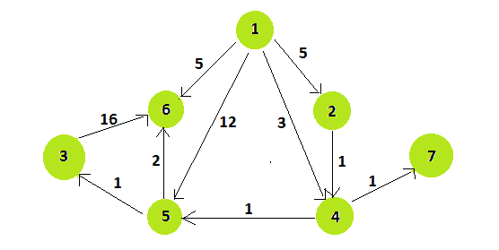

# 检查给定图表

中是否存在从 U 到 V 且单个权重较小的替代路径

> 原文： [https://www.geeksforgeeks.org/check-if-alternate-path-exists-from-u-to-v-with-smaller-individual-weight-in-a-given-graph/](https://www.geeksforgeeks.org/check-if-alternate-path-exists-from-u-to-v-with-smaller-individual-weight-in-a-given-graph/)

给定一个有向加权图，该图具有 **N 个**顶点和 **M 个**边缘以及一个边缘**（U，V）**。 任务是查找是否存在从`U`到`V`的替代路径，替代路径中边的单个权重小于直接路径的权重。 如果存在，则打印**是**，否则打印**否**。

**范例**

> 对于给定的有向图：
> 
> 
> **输入**：N = 7，M = 10，U = 3，V = 6。 对于给定的边{3，6}，权重=16。没有替代路径可以从 3 到达 6。因此答案是“否”。
> 
> **输入**：N = 7，M = 10，U = 1，V =6。
> **输出**：是
> **说明**：
> = >对于给定的边{1，6}，权重=5。
> = >从 1 = {1，5，6}到 6 的替代路径，各个权重为{12，2} 大于 5。因此无法考虑此路径。
> = >从 1 = {1、2、4、5、6}到 6 的替代路径，且单个权重{5、1、1、2}不小于 5。因此，该路径不能为 考虑过的。
> = >从 1 = {1，4，5，6}到 6 的替代路径，各个权重{3，1，2}小于 5。因此可以考虑该路径。
> = >因此，答案是肯定的

**方法**：

*   使用[深度优先搜索（DFS）遍历](https://www.geeksforgeeks.org/depth-first-search-or-dfs-for-a-graph/)遍历给定的[有向图](https://www.geeksforgeeks.org/graph-data-structure-and-algorithms/)和起始顶点`U`。
*   在 [DFS 遍历](https://www.geeksforgeeks.org/depth-first-search-or-dfs-for-a-graph/)期间，如果任何边缘的权重大于有向边缘，则不包括该路径。
*   如果到达顶点`V`，而遍历路径中每个边缘的权重小于有向边缘，则存在替代路径。
*   另外，在顶点`U`和顶点`V`之间没有其他路径。

下面是上述方法的实现：

## 爪哇

```

// Java program for above approach 

import java.util.*; 

// To ignore the unchecked warning 
@SuppressWarnings("unchecked") 

// GfG class 
public class GfG { 

    // Array to mark already 
    // visited vertices 
    static private boolean visited[]; 

    // Adjacency list representation 
    // of the graph 
    static private ArrayList<Edge> graph[]; 

    // GfG class constructor 
    public GfG(int size) 
    { 
        visited = new boolean[size]; 
        graph = new ArrayList[size]; 
    } 

    // Edge class 
    static class Edge { 
        int u; 
        int v; 
        int w; 

        // Edge constructor to 
        // initialize edge (u, v) with 
        // weight w 
        Edge(int u, int v, int w) 
        { 
            this.u = u; 
            this.v = v; 
            this.w = w; 
        } 
    } 

    // Helper method to 
    // initialize graph 
    static private void helperInitialize(int size) 
    { 
        for (int i = 0; i < size; i++) { 
            graph[i] = new ArrayList<Edge>(); 
        } 
    } 

    // Depth First Search to traverse 
    // all vertices with weight less 
    // than weight of the dfs root 
    static private void dfs(int S, int W) 
    { 

        // Marking the vertex visited 
        visited[S] = true; 

        // Traversing adjacent vertex 
        for (Edge uv : graph[S]) { 
            int ver = uv.v; 
            int w = uv.w; 
            if (!visited[ver] && w < W) 
                dfs(ver, W); 
        } 
    } 

    // Driver function 
    public static void main(String[] args) 
    { 

        // Number of vertices 
        int N = 7; 

        // Number of edges 
        int M = 10; 

        // Edge to be checked 
        int U_V[] = { 3, 6 }; 

        // Creating GfG object 
        GfG obj = new GfG(8); 

        // Initializing graph 
        helperInitialize(8); 

        // Creating edges 
        Edge e0 = new Edge(1, 2, 5); 
        Edge e1 = new Edge(1, 4, 3); 
        Edge e2 = new Edge(1, 5, 12); 
        Edge e3 = new Edge(1, 6, 5); 
        Edge e4 = new Edge(4, 5, 1); 
        Edge e5 = new Edge(5, 6, 2); 
        Edge e6 = new Edge(5, 3, 1); 
        Edge e7 = new Edge(3, 6, 16); 
        Edge e8 = new Edge(4, 7, 1); 
        Edge e9 = new Edge(2, 4, 1); 

        // Adding edges to the graph 
        graph[1].add(e0); 
        graph[1].add(e1); 
        graph[1].add(e2); 
        graph[1].add(e3); 
        graph[4].add(e4); 
        graph[5].add(e5); 
        graph[5].add(e6); 
        graph[3].add(e7); 
        graph[4].add(e8); 
        graph[2].add(e9); 

        // DFS traversal from 
        // vertex U 
        dfs(U_V[0], 16); 

        // If there is alternate 
        // path then print YES, 
        // else NO 
        if (visited[U_V[1]]) { 
            System.out.print("No"); 
        } 
        else { 
            System.out.print("Yes"); 
        } 
    } 
} 

```