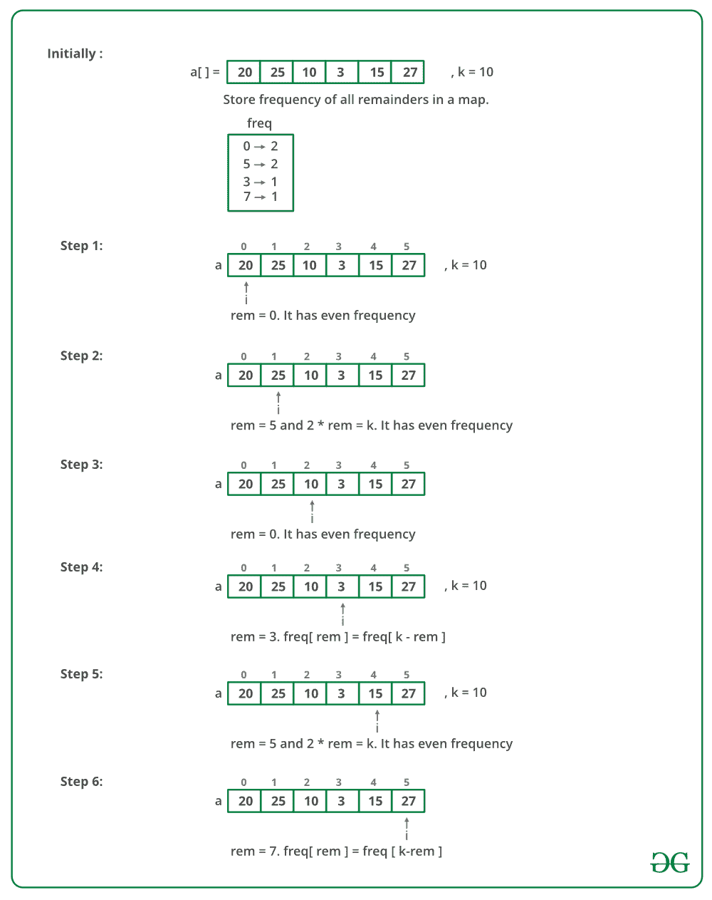

# 检查数组是否可以分成对，其和可被 k 整除

> 原文：[https://www.geeksforgeeks.org/check-if-an-array-can-be-divided-into-pairs-whose-sum-is-divisible-by-k/](https://www.geeksforgeeks.org/check-if-an-array-can-be-divided-into-pairs-whose-sum-is-divisible-by-k/)

给定一个整数数组和一个数字 k，编写一个函数，如果给定的数组可以分成几对，则每对之和可被 k 整除，则该函数返回 true。

**示例**：

> **输入**：arr [] = {9，7，5，3}，
> k = 6
> **输出**：True
> 我们可以将数组分为（9 ，3）和
> （7，5）。 这两个对的总和
> 是 6 的倍数。
> **输入**：arr [] = {92，75，65，48，45，35}，
> k = 10
> **输出**：是
> 我们可以将数组分为（92，48），（75，65）
> 和（45，35）。 所有这些对的总和是
> 的 10 的倍数。
> **输入**：arr [] = {91，74，66，48}，k = 10
> **输出[** ：错误

**简单解决方案**遍历每个元素 arr [i]。 查找是否还有另一个尚未访问的元素，其剩余为**（k-arr [i]％k）**。 如果没有这样的元素，则返回 false。 如果找到一对，则将两个元素都标记为已访问。

此解决方案的时间复杂度为 O（n <sup>2</sup> ，并且需要`O(n)`额外空间。

**有效解决方案**将使用哈希。

```
1) If length of given array is odd, return false. 
    An odd length array cannot be divided into pairs.
2) Traverse input array and count occurrences of 
    all reminders (use (arr[i] % k)+k)%k for handling the case of negative integers as well). 
      freq[((arr[i] % k)+k)%k]++
3) Traverse input array again. 
   a) Find the remainder of the current element.
   b) If remainder divides k into two halves, then
      there must be even occurrences of it as it 
      forms pair with itself only.
   c) If the remainder is 0, then there must be 
      even occurrences.
   c) Else, number of occurrences of current 
      the remainder must be equal to a number of 
      occurrences of "k - current remainder".

```

**有效方法**是使用散列（Java 中的 [unordered_map 在 C++](https://www.geeksforgeeks.org/unordered_map-in-stl-and-its-applications/) 和 [HashMap](http://www.geeksforgeeks.org/java-util-hashmap-in-java/) 中）。

下图是上述方法的模拟：



下面是上述方法的实现：

## C++

```cpp

// A C++ program to check if arr[0..n-1] can be divided
// in pairs such that every pair is divisible by k.
#include <bits/stdc++.h>
using namespace std;

// Returns true if arr[0..n-1] can be divided into pairs
// with sum divisible by k.
bool canPairs(int arr[], int n, int k)
{
    // An odd length array cannot be divided into pairs
    if (n & 1)
        return false;

    // Create a frequency array to count occurrences
    // of all remainders when divided by k.
    unordered_map<int, int> freq;

    // Count occurrences of all remainders
    for (int i = 0; i < n; i++)
        freq[((arr[i] % k) + k) % k]++;

    // Traverse input array and use freq[] to decide
    // if given array can be divided in pairs
    for (int i = 0; i < n; i++) 
    {
        // Remainder of current element
        int rem = ((arr[i] % k) + k) % k;

        // If remainder with current element divides
        // k into two halves.
        if (2 * rem == k)
        {
            // Then there must be even occurrences of
            // such remainder
            if (freq[rem] % 2 != 0)
                return false;
        }

        // If remainder is 0, then there must be two
        // elements with 0 remainder
        else if (rem == 0) 
        {
            if (freq[rem] & 1)
                return false;
        }

        // Else number of occurrences of remainder
        // must be equal to number of occurrences of
        // k - remainder
        else if (freq[rem] != freq[k - rem])
            return false;
    }
    return true;
}

// Driver code
int main()
{
    int arr[] = { 92, 75, 65, 48, 45, 35 };
    int k = 10;
    int n = sizeof(arr) / sizeof(arr[0]);

    // Function call
    canPairs(arr, n, k) ? cout << "True" : cout << "False";
    return 0;
}

```

## Java

```java

// JAVA program to check if arr[0..n-1] can be divided
// in pairs such that every pair is divisible by k.
import java.util.HashMap;
public class Divisiblepair 
{
    // Returns true if arr[0..n-1] can be divided into pairs
    // with sum divisible by k.
    static boolean canPairs(int ar[], int k)
    {
        // An odd length array cannot be divided into pairs
        if (ar.length % 2 == 1)
            return false;

        // Create a frequency array to count occurrences
        // of all remainders when divided by k.
        HashMap<Integer, Integer> hm = new HashMap<>();

        // Count occurrences of all remainders
        for (int i = 0; i < ar.length; i++) 
        {
            int rem = ((ar[i] % k) + k) % k;
            if (!hm.containsKey(rem)) {
                hm.put(rem, 0);
            }
            hm.put(rem, hm.get(rem) + 1);
        }

        // Traverse input array and use freq[] to decide
        // if given array can be divided in pairs
        for (int i = 0; i < ar.length; i++) 
        {
            // Remainder of current element
            int rem = ((ar[i] % k) + k) % k;

            // If remainder with current element divides
            // k into two halves.
            if (2 * rem == k) 
            {
                // Then there must be even occurrences of
                // such remainder
                if (hm.get(rem) % 2 == 1)
                    return false;
            }

            // If remainder is 0, then there must be two
            // elements with 0 remainder
            else if (rem == 0) 
            {
                // Then there must be even occurrences of
                // such remainder
                if (hm.get(rem) % 2 == 1)
                    return false;
            }

            // Else number of occurrences of remainder
            // must be equal to number of occurrences of
            // k - remainder
            else
            {
                if (hm.get(k - rem) != hm.get(rem))
                    return false;
            }
        }
        return true;
    }

    // Driver code
    public static void main(String[] args)
    {
        int arr[] = { 92, 75, 65, 48, 45, 35 };
        int k = 10;

        // Function call
        boolean ans = canPairs(arr, k);
        if (ans)
            System.out.println("True");
        else
            System.out.println("False");
    }
}

// This code is contributed by Rishabh Mahrsee

```

**Output**

```
True
```

**时间复杂度**：`O(n)`。

本文由 **Priyanka** 提供。 如果发现任何不正确的地方，或者想分享有关上述主题的更多信息，请写评论。

