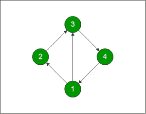

# 检查图的两个节点之间的给定路径是否表示最短路径

> 原文： [https://www.geeksforgeeks.org/check-if-given-path-between-two-nodes-of-a-graph-represents-a-shortest-paths/](https://www.geeksforgeeks.org/check-if-given-path-between-two-nodes-of-a-graph-represents-a-shortest-paths/)

给定一个未加权的有向图和由该图的两个节点之间的遍历序列组成的`Q`查询，任务是确定序列是否表示两个节点之间的最短路径之一。

**示例**：

```
Input: 1 2 3 4
Output: NO


Explanation:
The first and last node of the input sequence 
is 1 and 4 respectively. The shortest path 
between 1 and 4 is 1 -> 3 -> 4 hence, 
the output is NO for the 1st example.

Input: 1 3 4
Output: YES

```

**方法**：
这个想法是使用 **Floyd Warshall 算法**存储所有成对顶点的长度。 如果序列的起点和终点之间的最短路径的长度比序列的长度小一，则给定的序列表示节点之间的最短路径之一。

下面是上述方法的实现：

## C ++

```

// C++ program for  
// the above approach 
#include <bits/stdc++.h> 
using namespace std; 
#define INFINITE 10000 

// Function to store the  
// length of shortest path  
// between all pairs of nodes 
void shortestPathLength(int n, int graph[4][4], int dis[4][4]) 
{ 
  // Intialising dis matrix  
  // with current distance value   
  for (int i = 0; i < n; i++) { 
      for (int j = 0; j < n; j++) { 
          dis[i][j] = graph[i][j]; 
      } 
  } 

  // Floyd-Warshall Algorithm 
  for (int k = 0; k < n; k++) { 
    for (int i = 0; i < n; i++) { 
      for (int j = 0; j < n; j++) { 
          dis[i][j] = min(dis[i][j], dis[i][k] + dis[k][j]); 
      } 
    } 
  } 
} 

// A function that prints YES if the 
// given path is the shortest path 
// and prints NO if the given path 
// is not shortest 
void checkShortestPath(int length, int path[], int dis[4][4]) 
{ 
  // Check if the given path 
  // is shortest or not 
  // as discussed in above approach 
  if (dis[path[0] - 1][path[length - 1] - 1] == length - 1) { 
      cout << "YES" << endl; 
  } 
  else { 
      cout << "NO" << endl; 
  } 
} 

// Driver code 
int main() 
{ 
    // Adjacency matrix representing the graph 
    const int n = 4; 
    int graph[n][n] = { { 0, 1, 1, INFINITE }, 
                        { INFINITE, 0, 1, INFINITE }, 
                        { INFINITE, INFINITE, 0, 1 }, 
                        { 1, INFINITE, INFINITE, 0 } }; 
    // A matrix to store the length of shortest 
    int dis[n][n]; 

    // path between all pairs of vertices 
    shortestPathLength(n, graph, dis); 

    int path1[] = { 1, 2, 3, 4 }; 
    checkShortestPath(n, path1, dis); 

    int path2[] = { 1, 3, 4 }; 
    checkShortestPath(3, path2, dis); 

    return 0; 
} 

```