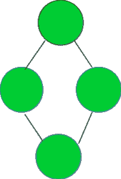

# 检查给定的图形是否表示环形拓扑

> 原文： [https://www.geeksforgeeks.org/check-if-the-given-graph-represents-a-ring-topology/](https://www.geeksforgeeks.org/check-if-the-given-graph-represents-a-ring-topology/)

给定图形 **G** ，任务是检查它是否表示环形拓扑。

环形拓扑是下图中显示的拓扑：


**示例：**

```
Input :  Graph =

Output : YES

Input : Graph = 

Output : NO

```

如果满足以下三个条件，则 V 顶点的图形表示环形拓扑：

1.  顶点数> = 3。
2.  所有顶点的度数应为 **2** 。
3.  边数=顶点数。

想法是遍历图并检查它是否满足以上三个条件。 如果是，则表示环形拓扑，否则不表示。

下面是上述方法的实现：

## C ++

```

// CPP program to check if the given graph 
// represents a Ring topology 

#include <bits/stdc++.h> 
using namespace std; 

// A utility function to add an edge in an 
// undirected graph. 
void addEdge(vector<int> adj[], int u, int v) 
{ 
    adj[u].push_back(v); 
    adj[v].push_back(u); 
} 

// A utility function to print the adjacency list 
// representation of graph 
void printGraph(vector<int> adj[], int V) 
{ 
    for (int v = 0; v < V; ++v) { 
        cout << "\n Adjacency list of vertex "
             << v << "\n head "; 
        for (auto x : adj[v]) 
            cout << "-> " << x; 
        printf("\n"); 
    } 
} 

/* Function to return true if the graph represented  
   by the adjacency list represents a Ring topology  
   else return false */
bool checkRingTopologyUtil(vector<int> adj[], int V, int E) 
{ 
    // Number of edges should be equal 
    // to Number of vertices 
    if (E != V) 
        return false; 

    // For a graph to represent a ring topology should have 
    // greater than 2 nodes 
    if (V <= 2) 
        return false; 

    int* vertexDegree = new int[V + 1]; 
    memset(vertexDegree, 0, sizeof vertexDegree); 

    // calculate the degree of each vertex 
    for (int i = 1; i <= V; i++) { 
        for (auto v : adj[i]) { 
            vertexDegree[v]++; 
        } 
    } 

    // countDegree2 stores the count of 
    // the vertices having degree 2 
    int countDegree2 = 0; 

    for (int i = 1; i <= V; i++) { 
        if (vertexDegree[i] == 2) { 
            countDegree2++; 
        } 
    } 

    // if all three necessary conditions as discussed, 
    // satisfy return true 
    if (countDegree2 == V) { 
        return true; 
    } 
    else { 
        return false; 
    } 
} 

// Function to check if the graph represents a Ring topology 
void checkRingTopology(vector<int> adj[], int V, int E) 
{ 
    bool isRing = checkRingTopologyUtil(adj, V, E); 
    if (isRing) { 
        cout << "YES" << endl; 
    } 
    else { 
        cout << "NO" << endl; 
    } 
} 

// Driver code 
int main() 
{ 
    // Graph 1 
    int V = 6, E = 6; 
    vector<int> adj1[V + 1]; 
    addEdge(adj1, 1, 2); 
    addEdge(adj1, 2, 3); 
    addEdge(adj1, 3, 4); 
    addEdge(adj1, 4, 5); 
    addEdge(adj1, 6, 1); 
    addEdge(adj1, 5, 6); 
    checkRingTopology(adj1, V, E); 

    // Graph 2 
    V = 5, E = 4; 
    vector<int> adj2[V + 1]; 
    addEdge(adj2, 1, 2); 
    addEdge(adj2, 1, 3); 
    addEdge(adj2, 3, 4); 
    addEdge(adj2, 4, 5); 
    checkRingTopology(adj2, V, E); 

    return 0; 
} 

```