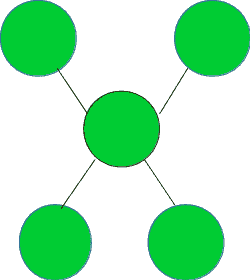

# 检查给定的图形是否表示星形拓扑

> 原文： [https://www.geeksforgeeks.org/check-if-the-given-graph-represents-a-star-topology/](https://www.geeksforgeeks.org/check-if-the-given-graph-represents-a-star-topology/)

给定图形`G`，任务是检查它是否表示星形拓扑。

下图显示了一种星形拓扑：



**示例**：

```
Input : Graph = 

Output : YES

Input : Graph =

Output : NO

```

如果满足以下三个条件，则`V`顶点的图表示星形拓扑：

1.  一个节点（也称为中心节点）的度数为`V – 1`。

2.  除中央节点外，所有节点的等级均为 1。

3.  边数等于顶点数减 1。

想法是遍历图并检查它是否满足以上三个条件。 如果是，则表示星形拓扑。

下面是上述方法的实现：

## CPP

```

// CPP program to check if the given graph 
// represents a Star Topology 
#include <bits/stdc++.h> 

using namespace std; 

// A utility function to add an edge in an 
// undirected graph. 
void addEdge(vector<int> adj[], int u, int v) 
{ 
    adj[u].push_back(v); 
    adj[v].push_back(u); 
} 

// A utility function to print the adjacency list 
// representation of graph 
void printGraph(vector<int> adj[], int V) 
{ 
    for (int v = 0; v < V; ++v) { 
        cout << "\n Adjacency list of vertex "
             << v << "\n head "; 
        for (auto x : adj[v]) 
            cout << "-> " << x; 
        printf("\n"); 
    } 
} 

/* Function to return true if the graph represented  
   by the adjacency list represents a Star topology  
   else return false */
bool checkStarTopologyUtil(vector<int> adj[], int V, int E) 
{ 

    // Number of edges should be equal 
    // to (Number of vertices - 1) 
    if (E != (V - 1)) 
        return false; 

    // a single node is termed as a star topology 
    // having only a central node 
    if (V == 1) 
        return true; 

    int* vertexDegree = new int[V + 1]; 
    memset(vertexDegree, 0, sizeof vertexDegree); 

    // calculate the degree of each vertex 
    for (int i = 1; i <= V; i++) { 
        for (auto v : adj[i]) { 
            vertexDegree[v]++; 
        } 
    } 

    // countCentralNodes strores the count of nodes  
    // with degree V - 1, which should be equal to 1 
    // in case of star topology 
    int countCentralNodes = 0, centralNode = 0; 

    for (int i = 1; i <= V; i++) { 
        if (vertexDegree[i] == (V - 1)) { 
            countCentralNodes++; 
            // Store the index of the central node 
            centralNode = i; 
        } 
    } 

    // there should be only one central node 
    // in the star topology 
    if (countCentralNodes != 1) 
        return false; 

    for (int i = 1; i <= V; i++) { 
        // except for the central node  
        // check if all other nodes have 
        // degree 1, if not return false 
        if (i == centralNode) 
            continue; 
        if (vertexDegree[i] != 1) { 
            return false; 
        } 
    } 

    // if all three necessary 
    // conditions as discussed, 
    // satisfy return true 
    return true; 
} 

// Function to check if the graph  
// represents a Star topology 
void checkStarTopology(vector<int> adj[], int V, int E) 
{ 
    bool isStar = checkStarTopologyUtil(adj, V, E); 
    if (isStar) { 
        cout << "YES" << endl; 
    } 
    else { 
        cout << "NO" << endl; 
    } 
} 

// Driver code 
int main() 
{ 
    // Graph 1 
    int V = 5, E = 4; 
    vector<int> adj1[V + 1]; 
    addEdge(adj1, 1, 2); 
    addEdge(adj1, 1, 3); 
    addEdge(adj1, 1, 4); 
    addEdge(adj1, 1, 5); 
    checkStarTopology(adj1, V, E); 

    // Graph 2 
    V = 5, E = 4; 
    vector<int> adj2[V + 1]; 
    addEdge(adj2, 1, 2); 
    addEdge(adj2, 1, 3); 
    addEdge(adj2, 3, 4); 
    addEdge(adj2, 4, 5); 
    checkStarTopology(adj2, V, E); 

    return 0; 
} 

```