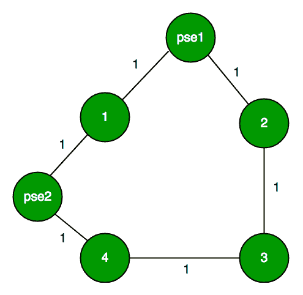

# 检查无向图中是否存在一个权重总和为奇数的循环

> 原文： [https://www.geeksforgeeks.org/check-if-there-is-a-cycle-with-odd-weight-sum-in-an-undirected-graph/](https://www.geeksforgeeks.org/check-if-there-is-a-cycle-with-odd-weight-sum-in-an-undirected-graph/)

给定一个加权且无向的图，我们需要查找该图中是否存在一个循环，以使该循环中所有边的权重之和变得奇数。

**示例：**

```
Input : Number of vertices, n = 4, 
        Number of edges, m = 4
        Weighted Edges = 
        1 2 12
        2 3 1
        4 3 1
        4 1 20
Output : No! There is no odd weight 
         cycle in the given graph

Input : Number of vertices, n = 5, 
        Number of edges, m = 3
        Weighted Edges = 
        1 2 1
        3 2 1
        3 1 1
Output : Yes! There is an odd weight 
         cycle in the given graph

```

该解决方案基于以下事实：“ [如果图没有奇长周期，则它必须是二分图，即它可以用两种颜色上色](https://www.geeksforgeeks.org/check-graphs-cycle-odd-length/)”

这个想法是将给定的问题转换为一个更简单的问题，在该问题中，我们只需要检查是否存在奇数周期。 要进行转换，我们执行以下操作

1.  将所有均匀重量边缘转换为单位重量的两个边缘。
2.  将所有奇数重量边转换为单位重量的单个边。

让我们为上面显示的图制作另一个图（在示例 1 中）



在此，边缘[1-2]被分成两部分，从而引入了[1-伪 1-2]伪节点。 我们这样做是为了使每个偶数加权边均被考虑两次，而具有奇数权重的边仅被计算一次。 当我们为周期着色时，这样做将对我们有进一步的帮助。 我们为所有边分配权重 1，然后使用 2 色法遍历整个图形。 现在，我们开始仅使用两种颜色为修改后的图形着色。 在节点数偶数的循环中，当我们仅使用两种颜色对其进行着色时，两个相邻边都没有相同的颜色。 虽然如果我们尝试为具有奇数个边的循环着色，则肯定会出现两个相邻边具有相同颜色的情况。 这是我们的选择！ 因此，如果我们只能使用两种颜色为修改后的图形完全着色，而没有两个相邻的边获得相同的颜色，则图形中必须没有循环，或者节点数相等的循环。 如果在仅用 2 种颜色给循环着色时发生任何冲突，则我们的图形中就有一个奇数循环。

## C ++

```

// C++ program to check if there is a cycle of  
// total odd weight 
#include <bits/stdc++.h> 
using namespace std; 

// This function returns true if the current subpart 
// of the forest is two colorable, else false. 
bool twoColorUtil(vector<int>G[], int src, int N,  
                                  int colorArr[]) { 

    // Assign first color to source 
    colorArr[src] = 1; 

    // Create a queue (FIFO) of vertex numbers and 
    // enqueue source vertex for BFS traversal 
    queue <int> q; 
    q.push(src); 

    // Run while there are vertices in queue  
    // (Similar to BFS) 
    while (!q.empty()){ 

        int u = q.front(); 
        q.pop(); 

        // Find all non-colored adjacent vertices 
        for (int v = 0; v < G[u].size(); ++v){ 

            // An edge from u to v exists and 
            // destination v is not colored 
            if (colorArr[G[u][v]] == -1){ 

                // Assign alternate color to this  
                // adjacent v of u 
                colorArr[G[u][v]] = 1 - colorArr[u]; 
                q.push(G[u][v]); 
            } 

            //  An edge from u to v exists and destination 
            // v is colored with same color as u 
            else if (colorArr[G[u][v]] == colorArr[u])            
                return false; 
        } 
    } 
    return true; 
} 

// This function returns true if graph G[V][V] is two 
// colorable, else false        
bool twoColor(vector<int>G[], int N){ 

    // Create a color array to store colors assigned  
    // to all veritces. Vertex number is used as index 
    // in this array. The value '-1' of  colorArr[i]  
    // is used to indicate that no color is assigned 
    // to vertex 'i'.  The value 1 is used to indicate  
    // first color is assigned and value 0 indicates  
    // second color is assigned. 
    int colorArr[N]; 
    for (int i = 1; i <= N; ++i) 
        colorArr[i] = -1; 

    // As we are dealing with graph, the input might 
    // come as a forest, thus start coloring from a  
    // node and if true is returned we'll know that 
    // we successfully colored the subpart of our  
    // forest and we start coloring again from a new  
    // uncolored node. This way we cover the entire forest. 
    for (int i = 1; i <= N; i++) 
        if (colorArr[i] == -1) 
           if (twoColorUtil(G, i, N, colorArr) == false) 
             return false; 

        return true; 
} 

// Returns false if an odd cycle is present else true 
// int info[][] is the information about our graph 
// int n is the number of nodes 
// int m is the number of informations given to us 
bool isOddSum(int info[][3],int n,int m){ 

    // Declaring adjacency list of a graph 
    // Here at max, we can encounter all the edges with  
    // even weight thus there will be 1 pseudo node 
    // for each edge 
    vector<int> G[2*n]; 

    int pseudo = n+1; 
    int pseudo_count = 0; 
    for (int i=0; i<m; i++){ 

        // For odd weight edges, we directly add it  
        // in our graph 
        if (info[i][2]%2 == 1){ 

            int u = info[i][0]; 
            int v = info[i][1]; 
            G[u].push_back(v); 
            G[v].push_back(u); 
        } 

        // For even weight edges, we break it 
        else{ 

            int u = info[i][0]; 
            int v = info[i][1]; 

            // Entering a pseudo node between u---v 
            G[u].push_back(pseudo); 
            G[pseudo].push_back(u); 
            G[v].push_back(pseudo); 
            G[pseudo].push_back(v); 

            // Keeping a record of number of pseudo nodes  
            // inserted 
            pseudo_count++; 

            // Making a new pseudo node for next time 
            pseudo++; 
        } 
    } 

    // We pass number graph G[][] and total number 
    // of node = actual number of nodes + number of 
    // pseudo nodes added. 
    return twoColor(G,n+pseudo_count); 
} 

// Driver function 
int main() { 

    // 'n' correspond to number of nodes in our  
    // graph while 'm' correspond to the number   
    // of information about this graph. 
    int n = 4, m = 3; 
    int info[4][3] = {{1, 2, 12}, 
                     {2, 3, 1}, 
                     {4, 3, 1}, 
                     {4, 1, 20}}; 

    // This function break the even weighted edges in 
    // two parts. Makes the adjacency representation  
    // of the graph and sends it for two coloring. 
    if (isOddSum(info, n, m) == true) 
        cout << "No\n"; 
    else
        cout << "Yes\n"; 

    return 0; 
} 

```

## 爪哇

```

// Java program to check if there is 
// a cycle of total odd weight 
import java.io.*; 
import java.util.*; 

class GFG  
{ 

// This function returns true if the current subpart 
// of the forest is two colorable, else false. 
static boolean twoColorUtil(Vector<Integer>[] G,  
                            int src, int N, 
                            int[] colorArr)  
{ 

    // Assign first color to source 
    colorArr[src] = 1; 

    // Create a queue (FIFO) of vertex numbers and 
    // enqueue source vertex for BFS traversal 
    Queue<Integer> q = new LinkedList<>(); 
    q.add(src); 

    // Run while there are vertices in queue 
    // (Similar to BFS) 
    while (!q.isEmpty())  
    { 
        int u = q.peek(); 
        q.poll(); 

        // Find all non-colored adjacent vertices 
        for (int v = 0; v < G[u].size(); ++v) 
        { 

            // An edge from u to v exists and 
            // destination v is not colored 
            if (colorArr[G[u].elementAt(v)] == -1)  
            { 

                // Assign alternate color to this 
                // adjacent v of u 
                colorArr[G[u].elementAt(v)] = 1 - colorArr[u]; 
                q.add(G[u].elementAt(v)); 
            } 

            // An edge from u to v exists and destination 
            // v is colored with same color as u 
            else if (colorArr[G[u].elementAt(v)] == colorArr[u]) 
                return false; 
        } 
    } 
    return true; 
} 

// This function returns true if  
// graph G[V][V] is two colorable, else false 
static boolean twoColor(Vector<Integer>[] G, int N)  
{ 

    // Create a color array to store colors assigned 
    // to all veritces. Vertex number is used as index 
    // in this array. The value '-1' of colorArr[i] 
    // is used to indicate that no color is assigned 
    // to vertex 'i'. The value 1 is used to indicate 
    // first color is assigned and value 0 indicates 
    // second color is assigned. 
    int[] colorArr = new int[N + 1]; 
    for (int i = 1; i <= N; ++i) 
        colorArr[i] = -1; 

    // As we are dealing with graph, the input might 
    // come as a forest, thus start coloring from a 
    // node and if true is returned we'll know that 
    // we successfully colored the subpart of our 
    // forest and we start coloring again from a new 
    // uncolored node. This way we cover the entire forest. 
    for (int i = 1; i <= N; i++) 
        if (colorArr[i] == -1) 
            if (twoColorUtil(G, i, N, colorArr) == false) 
                return false; 

    return true; 
} 

// Returns false if an odd cycle is present else true 
// int info[][] is the information about our graph 
// int n is the number of nodes 
// int m is the number of informations given to us 
static boolean isOddSum(int[][] info, int n, int m)  
{ 

    // Declaring adjacency list of a graph 
    // Here at max, we can encounter all the edges with 
    // even weight thus there will be 1 pseudo node 
    // for each edge 
    //@SuppressWarnings("unchecked") 
    Vector<Integer>[] G = new Vector[2 * n]; 

    for (int i = 0; i < 2 * n; i++) 
        G[i] = new Vector<>(); 

    int pseudo = n + 1; 
    int pseudo_count = 0; 
    for (int i = 0; i < m; i++) 
    { 

        // For odd weight edges, we directly add it 
        // in our graph 
        if (info[i][2] % 2 == 1)  
        { 
            int u = info[i][0]; 
            int v = info[i][1]; 
            G[u].add(v); 
            G[v].add(u); 
        } 

        // For even weight edges, we break it 
        else 
        { 
            int u = info[i][0]; 
            int v = info[i][1]; 

            // Entering a pseudo node between u---v 
            G[u].add(pseudo); 
            G[pseudo].add(u); 
            G[v].add(pseudo); 
            G[pseudo].add(v); 

            // Keeping a record of number of  
            // pseudo nodes inserted 
            pseudo_count++; 

            // Making a new pseudo node for next time 
            pseudo++; 
        } 
    } 

    // We pass number graph G[][] and total number 
    // of node = actual number of nodes + number of 
    // pseudo nodes added. 
    return twoColor(G, n + pseudo_count); 
} 

// Driver Code 
public static void main(String[] args) 
{ 
    // 'n' correspond to number of nodes in our 
    // graph while 'm' correspond to the number 
    // of information about this graph. 
    int n = 4, m = 3; 
    int[][] info = { { 1, 2, 12 }, { 2, 3, 1 }, 
                     { 4, 3, 1 }, { 4, 1, 20 } }; 

    // This function break the even weighted edges in 
    // two parts. Makes the adjacency representation 
    // of the graph and sends it for two coloring. 
    if (isOddSum(info, n, m) == true) 
        System.out.println("No"); 
    else
        System.out.println("Yes"); 
} 
} 

// This code is contributed by 
// sanjeev2552 

```

## Python3

```

# Python3 program to check if there  
# is a cycle of total odd weight  

# This function returns true if the current subpart  
# of the forest is two colorable, else false.  
def twoColorUtil(G, src, N, colorArr):   

    # Assign first color to source  
    colorArr[src] = 1 

    # Create a queue (FIFO) of vertex numbers and  
    # enqueue source vertex for BFS traversal  
    q = [src]  

    # Run while there are vertices in queue  
    # (Similar to BFS)  
    while len(q) > 0:  

        u = q.pop(0)  

        # Find all non-colored adjacent vertices  
        for v in range(0, len(G[u])):  

            # An edge from u to v exists and  
            # destination v is not colored  
            if colorArr[G[u][v]] == -1:  

                # Assign alternate color to this  
                # adjacent v of u  
                colorArr[G[u][v]] = 1 - colorArr[u]  
                q.append(G[u][v])  

            # An edge from u to v exists and destination  
            # v is colored with same color as u  
            elif colorArr[G[u][v]] == colorArr[u]:          
                return False 

    return True 

# This function returns true if graph  
# G[V][V] is two colorable, else false      
def twoColor(G, N):  

    # Create a color array to store colors assigned  
    # to all veritces. Vertex number is used as index  
    # in this array. The value '-1' of colorArr[i]  
    # is used to indicate that no color is assigned  
    # to vertex 'i'. The value 1 is used to indicate  
    # first color is assigned and value 0 indicates  
    # second color is assigned.  
    colorArr = [-1] * N 

    # As we are dealing with graph, the input might  
    # come as a forest, thus start coloring from a  
    # node and if true is returned we'll know that  
    # we successfully colored the subpart of our  
    # forest and we start coloring again from a new  
    # uncolored node. This way we cover the entire forest.  
    for i in range(N):  
        if colorArr[i] == -1:  
            if twoColorUtil(G, i, N, colorArr) == False:  
                return False 

            return True 

# Returns false if an odd cycle is present else true  
# int info[][] is the information about our graph  
# int n is the number of nodes  
# int m is the number of informations given to us  
def isOddSum(info, n, m):  

    # Declaring adjacency list of a graph  
    # Here at max, we can encounter all the  
    # edges with even weight thus there will  
    # be 1 pseudo node for each edge  
    G = [[] for i in range(2*n)]  

    pseudo, pseudo_count = n+1, 0 
    for i in range(0, m):  

        # For odd weight edges, we  
        # directly add it in our graph  
        if info[i][2] % 2 == 1:  

            u, v = info[i][0], info[i][1]  
            G[u].append(v)  
            G[v].append(u)  

        # For even weight edges, we break it  
        else:  
            u, v = info[i][0], info[i][1]  

            # Entering a pseudo node between u---v  
            G[u].append(pseudo)  
            G[pseudo].append(u)  
            G[v].append(pseudo)  
            G[pseudo].append(v)  

            # Keeping a record of number  
            # of pseudo nodes inserted  
            pseudo_count += 1

            # Making a new pseudo node for next time  
            pseudo += 1 

    # We pass number graph G[][] and total number  
    # of node = actual number of nodes + number of  
    # pseudo nodes added.  
    return twoColor(G, n+pseudo_count)  

# Driver function  
if __name__ == "__main__":   

    # 'n' correspond to number of nodes in our  
    # graph while 'm' correspond to the number  
    # of information about this graph.  
    n, m = 4, 3 
    info = [[1, 2, 12],  
            [2, 3, 1],  
            [4, 3, 1],  
            [4, 1, 20]]  

    # This function break the even weighted edges in  
    # two parts. Makes the adjacency representation  
    # of the graph and sends it for two coloring.  
    if isOddSum(info, n, m) == True:  
        print("No")  
    else: 
        print("Yes")  

# This code is contributed by Rituraj Jain 

```

## C＃

```

// C# program to check if there is 
// a cycle of total odd weight 
using System; 
using System.Collections.Generic; 

class GFG  
{ 

// This function returns true if the current subpart 
// of the forest is two colorable, else false. 
static bool twoColorUtil(List<int>[] G,  
                        int src, int N, 
                        int[] colorArr)  
{ 

    // Assign first color to source 
    colorArr[src] = 1; 

    // Create a queue (FIFO) of vertex numbers and 
    // enqueue source vertex for BFS traversal 
    List<int> q = new List<int>(); 
    q.Add(src); 

    // Run while there are vertices in queue 
    // (Similar to BFS) 
    while (q.Count != 0)  
    { 
        int u = q[0]; 
        q.RemoveAt(0); 

        // Find all non-colored adjacent vertices 
        for (int v = 0; v < G[u].Count; ++v) 
        { 

            // An edge from u to v exists and 
            // destination v is not colored 
            if (colorArr[G[u][v]] == -1)  
            { 

                // Assign alternate color to this 
                // adjacent v of u 
                colorArr[G[u][v]] = 1 - colorArr[u]; 
                q.Add(G[u][v]); 
            } 

            // An edge from u to v exists and destination 
            // v is colored with same color as u 
            else if (colorArr[G[u][v]] == colorArr[u]) 
                return false; 
        } 
    } 
    return true; 
} 

// This function returns true if  
// graph G[V,V] is two colorable, else false 
static bool twoColor(List<int>[] G, int N)  
{ 

    // Create a color array to store colors assigned 
    // to all veritces. Vertex number is used as index 
    // in this array. The value '-1' of colorArr[i] 
    // is used to indicate that no color is assigned 
    // to vertex 'i'. The value 1 is used to indicate 
    // first color is assigned and value 0 indicates 
    // second color is assigned. 
    int[] colorArr = new int[N + 1]; 
    for (int i = 1; i <= N; ++i) 
        colorArr[i] = -1; 

    // As we are dealing with graph, the input might 
    // come as a forest, thus start coloring from a 
    // node and if true is returned we'll know that 
    // we successfully colored the subpart of our 
    // forest and we start coloring again from a new 
    // uncolored node. This way we cover the entire forest. 
    for (int i = 1; i <= N; i++) 
        if (colorArr[i] == -1) 
            if (twoColorUtil(G, i, N, colorArr) == false) 
                return false; 

    return true; 
} 

// Returns false if an odd cycle is present else true 
// int info[,] is the information about our graph 
// int n is the number of nodes 
// int m is the number of informations given to us 
static bool isOddSum(int[,] info, int n, int m)  
{ 

    // Declaring adjacency list of a graph 
    // Here at max, we can encounter all the edges with 
    // even weight thus there will be 1 pseudo node 
    // for each edge 
    //@SuppressWarnings("unchecked") 
    List<int>[] G = new List<int>[2 * n]; 

    for (int i = 0; i < 2 * n; i++) 
        G[i] = new List<int>(); 

    int pseudo = n + 1; 
    int pseudo_count = 0; 
    for (int i = 0; i < m; i++) 
    { 

        // For odd weight edges, we directly add it 
        // in our graph 
        if (info[i, 2] % 2 == 1)  
        { 
            int u = info[i, 0]; 
            int v = info[i, 1]; 
            G[u].Add(v); 
            G[v].Add(u); 
        } 

        // For even weight edges, we break it 
        else
        { 
            int u = info[i, 0]; 
            int v = info[i, 1]; 

            // Entering a pseudo node between u---v 
            G[u].Add(pseudo); 
            G[pseudo].Add(u); 
            G[v].Add(pseudo); 
            G[pseudo].Add(v); 

            // Keeping a record of number of  
            // pseudo nodes inserted 
            pseudo_count++; 

            // Making a new pseudo node for next time 
            pseudo++; 
        } 
    } 

    // We pass number graph G[,] and total number 
    // of node = actual number of nodes + number of 
    // pseudo nodes added. 
    return twoColor(G, n + pseudo_count); 
} 

// Driver Code 
public static void Main(String[] args) 
{ 
    // 'n' correspond to number of nodes in our 
    // graph while 'm' correspond to the number 
    // of information about this graph. 
    int n = 4, m = 3; 
    int[,] info = { { 1, 2, 12 }, { 2, 3, 1 }, 
                    { 4, 3, 1 }, { 4, 1, 20 } }; 

    // This function break the even weighted edges in 
    // two parts. Makes the adjacency representation 
    // of the graph and sends it for two coloring. 
    if (isOddSum(info, n, m) == true) 
        Console.WriteLine("No"); 
    else
        Console.WriteLine("Yes"); 
} 
} 

// This code is contributed by PrinciRaj1992 

```

**输出：**

```
No

```

本文由 **Parth Trehan** 提供。 如果您喜欢 GeeksforGeeks 并希望做出贡献，则还可以使用 [tribution.geeksforgeeks.org](http://www.contribute.geeksforgeeks.org) 撰写文章，或将您的文章邮寄至 tribution@geeksforgeeks.org。 查看您的文章出现在 GeeksforGeeks 主页上，并帮助其他 Geeks。

如果发现任何不正确的地方，或者想分享有关上述主题的更多信息，请写评论。

