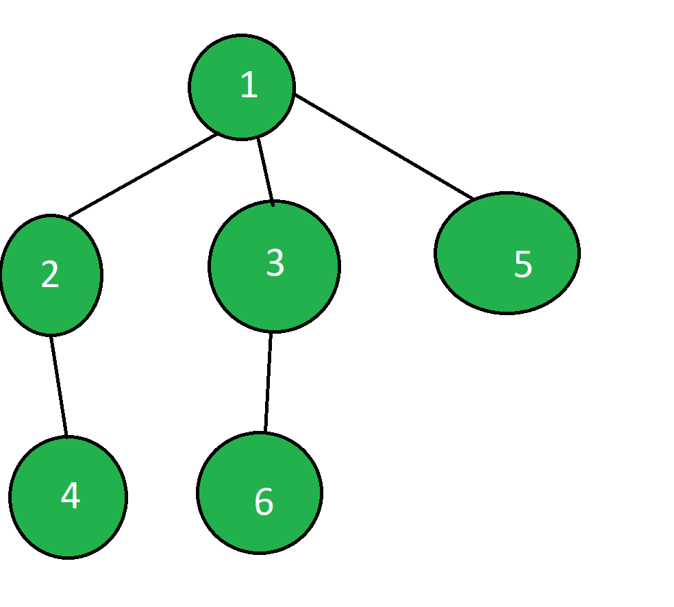

# 检查给定图

的顶点 X 是否位于顶点 Y 的子图中

> 原文： [https://www.geeksforgeeks.org/check-if-vertex-x-lies-in-subgraph-of-vertex-y-for-the-given-graph/](https://www.geeksforgeeks.org/check-if-vertex-x-lies-in-subgraph-of-vertex-y-for-the-given-graph/)

给定**无向图**以及两个**顶点 X 和 Y** ，我们的任务是检查顶点 X 是否位于顶点 Y 的子图中。
**示例**：[

> [](https://media.geeksforgeeks.org/wp-content/uploads/20200628152249/sub_graph.png)
> 
> **输入**：X = 2，Y = 3
> **输出**：否
> **说明**：
> 设置了顶点 Y = 3 的子图。 位于 Y 之下并且可以被 Y 到达的所有顶点的总和。这里 3 的子图包含{6}而不是 2。
> **输入**：X = 6，Y = 1
> **输出 **：是
> **说明**：
> 1 的子图包含{2、3、4、5、6}，所以 6 位于 1 的子图中。

**方法**：的想法是使用[深度优先搜索（DFS）](https://www.geeksforgeeks.org/depth-first-search-or-dfs-for-a-graph/)。 初始化中的两个数组*和*中的*初始化，以保持遍历顶点的开始时间和结束标记的时间，直到遍历顶点。 如果第二个顶点的开始时间小于第一个顶点的开始时间，并且第一个顶点的结束时间小于第二个顶点的结束时间，则返回 true，否则返回 false。
以下是上述方法的实现：* 

## C++

```cpp

// C++ implementation to check if vertex X 
// lies in subgraph of vertex Y 
// for the given graph 
#include <bits/stdc++.h> 
using namespace std; 
int cnt = 1; 

// Function ot perform dfs 
void dfs(vector<int> v[], int in[], 
        int out[], int visited[], int i) 
{ 
    // Mark visited of vertex i 
    visited[i] = 1; 

    // Update starting time 
    // of vertex i 
    in[i] = cnt; 

    // Increment the cnt 
    cnt++; 

    for (auto x : v[i]) { 
        // Check if not visited 
        // call dfs from x 
        if (!visited[x]) 
            dfs(v, in, out, visited, x); 
    } 

    // Update ending time 
    // of vertex i 
    out[i] = cnt; 

    // Increment the cnt 
    cnt++; 
} 

// Function to add edges in graph 
void addedge(vector<int> v[], int x, int y) 
{ 
    v[x].push_back(y); 
    v[y].push_back(x); 
} 

// Function to check if vertex X 
// lies in subgraph of vertex Y 
// for the given graph 
bool is_subtree(vector<int> v[], int n, 
                int m, int x, int y) 
{ 
    // Arrays for starting time, 
    // ending time and to check 
    // for visited respectively 
    int in[n + 1], out[n + 1], visited[n + 1]; 

    // Mark all vertices starting time, 
    // ending time and visited as zero 
    for (int i = 1; i <= n; i++) { 
        in[i] = 0; 
        out[i] = 0; 
        visited[i] = 0; 
    } 

    // Check if y comes before x 
    // and leaves after x then x lies 
    // in the subgraph of y 
    // call dfs from any vertex, 
    // here we have called from 1 
    dfs(v, in, out, visited, 1); 
    if (in[y] < in[x] && out[y] > out[x]) 
        return true; 

    else
        return false; 
} 

// Driver code 
int main() 
{ 
    // n number of vertices 
    // m number of edges 
    int n = 6, m = 5; 

    // Create a graph given 
    // in the above diagram 
    vector<int> v[n + 1]; 
    addedge(v, 1, 2); 
    addedge(v, 1, 3); 
    addedge(v, 2, 4); 
    addedge(v, 1, 5); 
    addedge(v, 3, 6); 

    int x = 6, y = 1; 
    if (is_subtree(v, n, m, x, y)) 
        cout << "Yes"; 
    else
        cout << "No"; 

    return 0; 
} 

```

## Java

```java

// Java implementation to check if vertex X 
// lies in subgraph of vertex Y 
// for the given graph 
import java.util.*;

class GFG{ 

static int cnt = 1; 

// Function ot perform dfs 
static void dfs(Vector<Integer> v[], int in[], 
                int out[], int visited[], int i) 
{ 

    // Mark visited of vertex i 
    visited[i] = 1; 

    // Update starting time 
    // of vertex i 
    in[i] = cnt; 

    // Increment the cnt 
    cnt++; 

    for(int x : v[i]) 
    {

        // Check if not visited 
        // call dfs from x 
        if (visited[x] == 0) 
            dfs(v, in, out, visited, x); 
    } 

    // Update ending time 
    // of vertex i 
    out[i] = cnt; 

    // Increment the cnt 
    cnt++; 
} 

// Function to add edges in graph 
static void addedge(Vector<Integer> v[], 
                    int x, int y) 
{ 
    v[x].add(y); 
    v[y].add(x); 
} 

// Function to check if vertex X 
// lies in subgraph of vertex Y 
// for the given graph 
static boolean is_subtree(Vector<Integer> v[],
                          int n, int m, int x,
                          int y) 
{ 

    // Arrays for starting time, 
    // ending time and to check 
    // for visited respectively 
    int []in = new int[n + 1];
    int []out = new int[n + 1];
    int []visited = new int[n + 1]; 

    // Mark all vertices starting time, 
    // ending time and visited as zero 
    for(int i = 1; i <= n; i++) 
    { 
        in[i] = 0; 
        out[i] = 0; 
        visited[i] = 0; 
    } 

    // Check if y comes before x 
    // and leaves after x then x lies 
    // in the subgraph of y 
    // call dfs from any vertex, 
    // here we have called from 1 
    dfs(v, in, out, visited, 1); 

    if (in[y] < in[x] && out[y] > out[x]) 
        return true; 
    else
        return false; 
} 

// Driver code 
public static void main(String[] args) 
{ 

    // n number of vertices 
    // m number of edges 
    int n = 6, m = 5; 

    // Create a graph given 
    // in the above diagram 
    @SuppressWarnings("unchecked")
    Vector<Integer> []v = new Vector[n + 1]; 
    for(int i = 0; i < v.length; i++)
        v[i] = new Vector<Integer>();

    addedge(v, 1, 2); 
    addedge(v, 1, 3); 
    addedge(v, 2, 4); 
    addedge(v, 1, 5); 
    addedge(v, 3, 6); 

    int x = 6, y = 1; 
    if (is_subtree(v, n, m, x, y)) 
        System.out.print("Yes"); 
    else
        System.out.print("No"); 
} 
} 

// This code is contributed by PrinciRaj1992

```

## Python3

```

# Python3 implementation to check if 
# vertex X lies in subgraph of 
# vertex Y for the given graph 
cnt = 1

# Function to perform dfs
def dfs(v, in_, out, visited, i):

    global cnt

    # Mark visited of vertex i
    visited[i] = 1

    # Update starting time 
    # of vertex i 
    in_[i] = cnt

    # Increment the cnt
    cnt += 1

    # Check if not visited 
    # call dfs from x 
    for x in v[i]:
        if not visited[x]:
            dfs(v, in_, out, visited, x)

    # Update ending time 
    # of vertex i 
    out[i] = cnt

    # Increment the cnt 
    cnt += 1

# Function to add edges in graph
def addedge(v, x, y):

    v[x].append(y)
    v[y].append(x)

# Function to check if vertex X 
# lies in subgraph of vertex Y 
# for the given graph
def is_subtree(v, n, m, x, y):

    # Arrays for starting time, 
    # ending time and to check 
    # for visited respectively 

    # Mark all vertices starting time, 
    # ending time and visited as zero
    in_ = [0] * (n + 1)
    out = [0] * (n + 1)
    visited = [0] * (n + 1)

    # Check if y comes before x 
    # and leaves after x then x lies 
    # in the subgraph of y 
    # call dfs from any vertex, 
    # here we have called from 1 
    dfs(v, in_, out, visited, 1)
    if in_[y] < in_[x] and out[y] > out[x]:
        return True
    else:
        return False

# Driver code

# n number of vertices 
# m number of edges 
n, m = 6, 5

# Create a graph given 
# in the above diagram 
v = []
for i in range(n + 1):
    v.append([])

addedge(v, 1, 2)
addedge(v, 1, 3)
addedge(v, 2, 4)
addedge(v, 1, 5)
addedge(v, 3, 6)

x, y = 6, 1

if is_subtree(v, n, m, x, y):
    print("Yes")
else:
    print("No")

# This code is contributed by Stuti Pathak

```

## C#

```cs

// C# implementation to check if vertex X 
// lies in subgraph of vertex Y 
// for the given graph 
using System;
using System.Collections.Generic;

class GFG{ 

static int cnt = 1; 

// Function ot perform dfs 
static void dfs(List<int> []v, int []In, 
                int []Out, int []visited, int i) 
{ 

    // Mark visited of vertex i 
    visited[i] = 1; 

    // Update starting time 
    // of vertex i 
    In[i] = cnt; 

    // Increment the cnt 
    cnt++; 

    foreach(int x in v[i]) 
    {

        // Check if not visited 
        // call dfs from x 
        if (visited[x] == 0) 
            dfs(v, In, Out, visited, x); 
    } 

    // Update ending time 
    // of vertex i 
    Out[i] = cnt; 

    // Increment the cnt 
    cnt++; 
} 

// Function to add edges in graph 
static void addedge(List<int> []v, 
                    int x, int y) 
{ 
    v[x].Add(y); 
    v[y].Add(x); 
} 

// Function to check if vertex X 
// lies in subgraph of vertex Y 
// for the given graph 
static bool is_subtree(List<int> []v,
                       int n, int m, 
                       int x, int y) 
{ 

    // Arrays for starting time, 
    // ending time and to check 
    // for visited respectively 
    int []In = new int[n + 1];
    int []Out = new int[n + 1];
    int []visited = new int[n + 1]; 

    // Mark all vertices starting time, 
    // ending time and visited as zero 
    for(int i = 1; i <= n; i++) 
    { 
        In[i] = 0; 
        Out[i] = 0; 
        visited[i] = 0; 
    } 

    // Check if y comes before x 
    // and leaves after x then x lies 
    // in the subgraph of y 
    // call dfs from any vertex, 
    // here we have called from 1 
    dfs(v, In, Out, visited, 1); 

    if (In[y] < In[x] && Out[y] > Out[x]) 
        return true; 
    else
        return false; 
} 

// Driver code 
public static void Main(String[] args) 
{ 

    // n number of vertices 
    // m number of edges 
    int n = 6, m = 5; 

    // Create a graph given 
    // in the above diagram 

    List<int> []v = new  List<int>[n + 1]; 
    for(int i = 0; i < v.Length; i++)
        v[i] = new List<int>();

    addedge(v, 1, 2); 
    addedge(v, 1, 3); 
    addedge(v, 2, 4); 
    addedge(v, 1, 5); 
    addedge(v, 3, 6); 

    int x = 6, y = 1; 
    if (is_subtree(v, n, m, x, y)) 
        Console.Write("Yes"); 
    else
        Console.Write("No"); 
} 
} 

// This code is contributed by Rohit_ranjan

```

**Output:** 

```
Yes

```

***时间复杂度**：O（V + E）*
***空间复杂度**：O（3 * N）*


* * *

* * *

如果您喜欢 GeeksforGeeks 并希望做出贡献，则还可以使用 [tribution.geeksforgeeks.org](https://contribute.geeksforgeeks.org/) 撰写文章，或将您的文章邮寄至 tribution@geeksforgeeks.org。 查看您的文章出现在 GeeksforGeeks 主页上，并帮助其他 Geeks。

如果您发现任何不正确的地方，请单击下面的“改进文章”按钮，以改进本文。