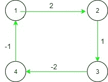
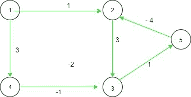

# 检查通过所有可能路径从任何节点到任何其他节点的成本是否相同

> 原文： [https://www.geeksforgeeks.org/check-whether-the-cost-of-going-from-any-node-to-any-other-node-via-all-possible-paths-is-same/](https://www.geeksforgeeks.org/check-whether-the-cost-of-going-from-any-node-to-any-other-node-via-all-possible-paths-is-same/)

给定有向图的[邻接表](https://www.geeksforgeeks.org/graph-and-its-representations/)表示形式，任务是检查通过所有可能的路径从任何顶点到任何其他顶点的成本是否相等。 如果存在从顶点`A`到顶点`B`的成本`c`，则从顶点`B`到顶点[`A`将是 **-c** 。

**示例**：

> **输入**：arr [] [] = {{0，2，0，1}，{-2，0，1，0}，{0，-1，0，-2}，{- 1，0，2，0}}
> **输出**：是
> **说明**：
> 
> 
> 在这里，对于所有可能的路径，从任何节点到任何其他节点的成本都是相等的。 例如，如果我们通过（1-> 2-> 3-> 4）从 1 到 4，其成本为（2 +1 +（-2）），即 1，然后通过（1-> 4），这是相反的 成本为 1 的边缘。类似地，所有其他路径的成本相同。
> 
> **输入**：arr [] [] = {{0，1，0，3，0}，{-1，0，3，0，4}，{0，-3，0，1， 1}，{-3、0，-1、0、0}，{0，-4，-1、0、0}}
> **输出**：否
> **说明 **：
> 
> 
> 对于以下两个从边 1 到边 4 的路径，（1-> 2-> 3-> 4），成本=（1 + 3 + 1）= 5 和（1-> 4），成本= 3。 是不同的，答案是否定的

**方法**：的想法是维护两个数组 **dis []** ，该数组维护行进路径的距离， **Visited []** 维护访问顶点的距离。 使用成对的 [2D 向量](https://www.geeksforgeeks.org/2d-vector-in-cpp-with-user-defined-size/)存储图形。 该对中的第一个值是目标节点，第二个值是与之关联的成本。 现在，在图形上运行 [DFS](http://www.geeksforgeeks.org/depth-first-traversal-for-a-graph/) 。 每个顶点都会出现以下两个条件：

1.  如果未访问下一个要到达的节点，则 **dis** 数组将使用值 dis [current_node] +从 2D 向量中找到的新边的成本（即，当前节点到要到达的下一个节点，以及 使用未访问的同一节点调用同一函数。
2.  如果访问了该节点，则将下一个要到达的节点的距离与到达下一个节点的边缘的 disc +成本进行比较。 如果它们相等，则将布尔变量标志更新为 true，并为下一个顶点继续循环。

下面是上述方法的实现：

## CPP

```

// C++ implementation of the above approach 
#include <bits/stdc++.h> 
using namespace std; 
vector<pair<int, int> > adj[100005]; 

// Initialize distance and visited array 
int vis[100005] = { 0 }, 
    dist[100005] = { 0 }, 
    flg; 

// Function to perform dfs and check 
// For a given vertex If the distance 
// for all the paths is equal or not 
void dfs(int curr) 
{ 
    vis[curr] = 1; 
    for (int i = 0; i < adj[curr].size(); i++) { 

        // Checking the next node to reach 
        // is visited or not 
        if (vis[adj[curr][i].first]) { 

            // Case 2: comparing the distance 
            if (dist[adj[curr][i].first] 
                != dist[curr] + adj[curr][i].second) 
                flg = 1; 
        } 
        else { 

            // Case 1: Adding the distance 
            // and updating the array 
            dist[adj[curr][i].first] = dist[curr] 
                                       + adj[curr][i].second; 

            // Calling the function again with the 
            // same node 
            dfs(adj[curr][i].first); 
        } 
    } 
} 

// Driver code 
int main() 
{ 
    int n = 4, m = 4; 
    flg = 0; 
    // Creating the graph as mentioned 
    // in example 1 
    adj[0].push_back({ 1, 2 }); 
    adj[1].push_back({ 0, -2 }); 
    adj[1].push_back({ 2, 1 }); 
    adj[2].push_back({ 1, -1 }); 
    adj[2].push_back({ 3, -2 }); 
    adj[3].push_back({ 2, 2 }); 
    adj[3].push_back({ 0, -1 }); 
    adj[0].push_back({ 3, 1 }); 
    for (int i = 0; i < n; i++) { 
        if (flg) 

            // If for any vertex, flg is true, 
            // then the distance is not equal 
            break; 

        if (!vis[i]) 

            // Calling the DFS function if 
            // the vertex is not visited 
            dfs(i); 
    } 
    if (flg) 
        cout << "No" << endl; 
    else
        cout << "Yes" << endl; 
    return 0; 
} 

```