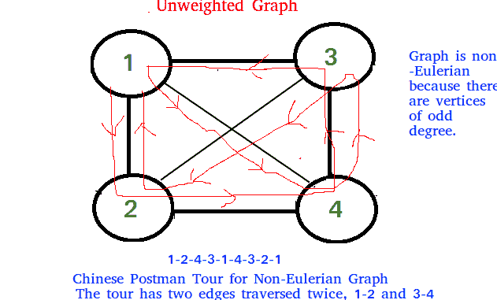
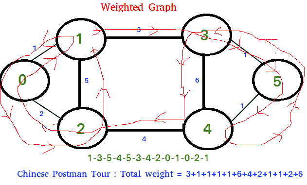
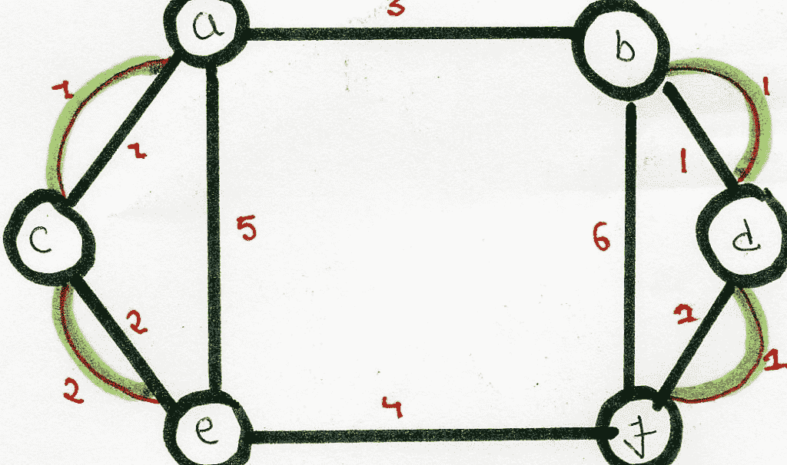

# 中国邮递员或路线检查 | 系列 1（简介）

> 原文： [https://www.geeksforgeeks.org/chinese-postman-route-inspection-set-1-introduction/](https://www.geeksforgeeks.org/chinese-postman-route-inspection-set-1-introduction/)

[中文邮递员问题](https://en.wikipedia.org/wiki/Route_inspection_problem)是[欧拉回路](https://www.geeksforgeeks.org/eulerian-path-and-circuit/)问题针对无向图的一种变体。 欧拉巡回赛是一条封闭的步道，一旦起点和终点位置相同，它就会覆盖每个边。 为连通图和无向图定义了中国邮递员问题。 问题在于找到最短路径或电路，该路径或电路至少访问一次图形的每个边。

**如果输入图包含欧拉电路，则问题的解决方案是欧拉电路**。

如果“ <u>所有顶点的偶数度为</u>”，则无向且连通的图具有欧拉循环。


无论是加权图还是不加权图，如果有，中国邮递员路线始终与欧拉环路相同。 在加权图中，Postman 巡回赛的最小可能权重是我们通过欧拉回路获得的所有边权重的总和。 我们无法缩短路线，因为我们必须至少一次访问所有边。

**如果输入图不包含欧拉电路**，

在这种情况下，任务将减少为以下内容。

1.  在未加权图中，要复制的最小边数，以便给定图转换为具有欧拉循环的图。



2.  在加权图中，要复制的最小边的总权重使给定图转换为具有欧拉循环的图。



```
Algorithm to find shortest closed path or optimal 
Chinese postman route in a weighted graph that may
not be Eulerian.
step 1 : If graph is Eulerian, return sum of all 
         edge weights.Else do following steps.
step 2 : We find all the vertices with odd degree 
step 3 : List all possible pairings of odd vertices  
         For n odd vertices total number of pairings 
         possible are, (n-1) * (n-3) * (n -5)... * 1
step 4 : For each set of pairings, find the shortest 
         path connecting them.
step 5 : Find the pairing with minimum shortest path 
         connecting pairs.
step 6 : Modify the graph by adding all the edges that  
         have been found in step 5.
step 7 : Weight of Chinese Postman Tour is sum of all 
         edges in the modified graph.
step 8 : Print Euler Circuit of the modified graph. 
         This Euler Circuit is Chinese Postman Tour.   

```

**插图**：

```
               3
        (a)-----------------(b)
     1 /  |                  |  \1
      /   |                  |   \
     (c)  | 5               6|   (d)
      \   |                  |   /
     2 \  |         4        |  /1
        (e)------------------(f)
As we see above graph does not contain Eulerian circuit
because is has odd degree vertices [a, b, e, f]
they all are odd degree vertices . 

First we make all possible pairs of odd degree vertices
[ae, bf], [ab, ef], [af, eb] 
so pairs with min sum of weight are [ae, bf] :
ae = (ac + ce = 3 ),  bf = ( bd + df = 2 ) 
Total : 5

We add edges ac, ce, bd and df to the original graph and
create a modified graph.

```



```
Optimal chinese postman route is of length : 5 + 23 = 
28 [ 23 = sum  of all edges of modified graph ]

Chinese Postman Route :  
a - b - d - f - d - b - f - e - c - a - c - e - a 
This route is Euler Circuit of the modified graph. 

```

**参考**：

[https://en.wikipedia.org/wiki/Route_inspection_problem](https://en.wikipedia.org/wiki/Route_inspection_problem)

[http://www.suffolkmaths.co.uk/pages/ 数学％20Projects / Projects / Topology％20and％20Graph％20Theory / Chinese％20Postman％20Problem.pdf](http://www.suffolkmaths.co.uk/pages/Maths%20Projects/Projects/Topology%20and%20Graph%20Theory/Chinese%20Postman%20Problem.pdf)

本文由 [**Nishant Singh**](https://practice.geeksforgeeks.org/user-profile.php?user=_code) 提供。 如果您喜欢 GeeksforGeeks 并希望做出贡献，则还可以使用 [tribution.geeksforgeeks.org](http://www.contribute.geeksforgeeks.org) 撰写文章，或将您的文章邮寄至 tribution@geeksforgeeks.org。 查看您的文章出现在 GeeksforGeeks 主页上，并帮助其他 Geeks。

如果发现任何不正确的地方，或者想分享有关上述主题的更多信息，请写评论。

