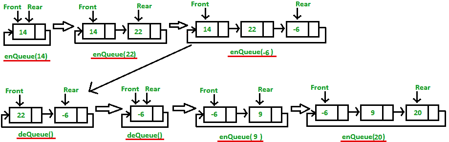

# 循环队列 | 系列 2（循环链表实现）

> 原文：[https://www.geeksforgeeks.org/circular-queue-set-2-circular-linked-list-implementation/](https://www.geeksforgeeks.org/circular-queue-set-2-circular-linked-list-implementation/)

先决条件 – [循环单链表](https://www.geeksforgeeks.org/circular-singly-linked-list-insertion/)

我们已经在系列 1 中讨论了基础知识以及如何使用数组实现循环队列。

[系列 1（简介和数组实现）](https://www.geeksforgeeks.org/circular-queue-set-1-introduction-array-implementation/)

在这篇文章中，讨论了使用循环单链表的另一种循环队列实现方法。

循环队列上的操作：

*   `Front`：从队列中获取第一个项目。

*   `Rear`：从队列中获取最后一个项目。

*   `enQueue(value)`：此功能用于将元素插入循环队列。 在循环队列中，新元素始终插入后方位置。

    **步骤**：

    3.  动态创建一个新节点并将值插入其中。

    4.  检查`front == NULL`，如果为`true`，则`front = Rear =`新创建的节点

    5.  如果为`false`，则`Rear =`新创建的节点，后节点始终包含前节点的地址。

*  `deQueue()`：此函数用于从循环队列中删除元素。 在队列中，元素始终从最前面删除。

    **步骤**：

    3.  检查队列是否为空是否意味着`front == NULL`。

    4.  如果为空，则显示队列为空。 如果队列不为空，则执行步骤 3

    5.  检查`front == rear`是否为真，然后设置`front = Rear = NULL`，否则将前列向前移动到队列中，更新`front`在后节点中的地址并返回元素。



下面是上述方法的实现：

## C++

```cpp

// C++ program for insertion and 
// deletion in Circular Queue 
#include <bits/stdc++.h> 
using namespace std; 

// Structure of a Node 
struct Node { 
    int data; 
    struct Node* link; 
}; 

struct Queue { 
    struct Node *front, *rear; 
}; 

// Function to create Circular queue 
void enQueue(Queue* q, int value) 
{ 
    struct Node* temp = new Node; 
    temp->data = value; 
    if (q->front == NULL) 
        q->front = temp; 
    else
        q->rear->link = temp; 

    q->rear = temp; 
    q->rear->link = q->front; 
} 

// Function to delete element from Circular Queue 
int deQueue(Queue* q) 
{ 
    if (q->front == NULL) { 
        printf("Queue is empty"); 
        return INT_MIN; 
    } 

    // If this is the last node to be deleted 
    int value; // Value to be dequeued 
    if (q->front == q->rear) { 
        value = q->front->data; 
        free(q->front); 
        q->front = NULL; 
        q->rear = NULL; 
    } 
    else // There are more than one nodes 
    { 
        struct Node* temp = q->front; 
        value = temp->data; 
        q->front = q->front->link; 
        q->rear->link = q->front; 
        free(temp); 
    } 

    return value; 
} 

// Function displaying the elements of Circular Queue 
void displayQueue(struct Queue* q) 
{ 
    struct Node* temp = q->front; 
    printf("\nElements in Circular Queue are: "); 
    while (temp->link != q->front) { 
        printf("%d ", temp->data); 
        temp = temp->link; 
    } 
    printf("%d", temp->data); 
} 

/* Driver of the program */
int main() 
{ 
    // Create a queue and initialize front and rear 
    Queue* q = new Queue; 
    q->front = q->rear = NULL; 

    // Inserting elements in Circular Queue 
    enQueue(q, 14); 
    enQueue(q, 22); 
    enQueue(q, 6); 

    // Display elements present in Circular Queue 
    displayQueue(q); 

    // Deleting elements from Circular Queue 
    printf("\nDeleted value = %d", deQueue(q)); 
    printf("\nDeleted value = %d", deQueue(q)); 

    // Remaining elements in Circular Queue 
    displayQueue(q); 

    enQueue(q, 9); 
    enQueue(q, 20); 
    displayQueue(q); 

    return 0; 
} 

```

## Java

```java

// Java program for insertion and 
// deletion in Circular Queue 
import java.util.*; 

class Solution { 

    // Structure of a Node 
    static class Node { 
        int data; 
        Node link; 
    } 

    static class Queue { 
        Node front, rear; 
    } 

    // Function to create Circular queue 
    static void enQueue(Queue q, int value) 
    { 
        Node temp = new Node(); 
        temp.data = value; 
        if (q.front == null) 
            q.front = temp; 
        else
            q.rear.link = temp; 

        q.rear = temp; 
        q.rear.link = q.front; 
    } 

    // Function to delete element from Circular Queue 
    static int deQueue(Queue q) 
    { 
        if (q.front == null) { 
            System.out.printf("Queue is empty"); 
            return Integer.MIN_VALUE; 
        } 

        // If this is the last node to be deleted 
        int value; // Value to be dequeued 
        if (q.front == q.rear) { 
            value = q.front.data; 
            q.front = null; 
            q.rear = null; 
        } 
        else // There are more than one nodes 
        { 
            Node temp = q.front; 
            value = temp.data; 
            q.front = q.front.link; 
            q.rear.link = q.front; 
        } 

        return value; 
    } 

    // Function displaying the elements of Circular Queue 
    static void displayQueue(Queue q) 
    { 
        Node temp = q.front; 
        System.out.printf("\nElements in Circular Queue are: "); 
        while (temp.link != q.front) { 
            System.out.printf("%d ", temp.data); 
            temp = temp.link; 
        } 
        System.out.printf("%d", temp.data); 
    } 

    /* Driver of the program */
    public static void main(String args[]) 
    { 
        // Create a queue and initialize front and rear 
        Queue q = new Queue(); 
        q.front = q.rear = null; 

        // Inserting elements in Circular Queue 
        enQueue(q, 14); 
        enQueue(q, 22); 
        enQueue(q, 6); 

        // Display elements present in Circular Queue 
        displayQueue(q); 

        // Deleting elements from Circular Queue 
        System.out.printf("\nDeleted value = %d", deQueue(q)); 
        System.out.printf("\nDeleted value = %d", deQueue(q)); 

        // Remaining elements in Circular Queue 
        displayQueue(q); 

        enQueue(q, 9); 
        enQueue(q, 20); 
        displayQueue(q); 
    } 
} 

// This code is contributed 
// by Arnab Kundu 

```

## Python3

```py

# Python3 program for insertion and  
# deletion in Circular Queue  

# Structure of a Node  
class Node: 
    def __init__(self): 
        self.data = None
        self.link = None

class Queue: 
    def __init__(self): 
        front = None
        rear = None

# Function to create Circular queue  
def enQueue(q, value): 
    temp = Node()  
    temp.data = value  
    if (q.front == None):  
        q.front = temp  
    else: 
        q.rear.link = temp  

    q.rear = temp  
    q.rear.link = q.front 

# Function to delete element from  
# Circular Queue  
def deQueue(q): 
    if (q.front == None): 
        print("Queue is empty")  
        return -999999999999

    # If this is the last node to be deleted  
    value = None # Value to be dequeued  
    if (q.front == q.rear): 
        value = q.front.data 
        q.front = None
        q.rear = None
    else: # There are more than one nodes  
        temp = q.front  
        value = temp.data  
        q.front = q.front.link  
        q.rear.link = q.front 

    return value  

# Function displaying the elements  
# of Circular Queue  
def displayQueue(q): 
    temp = q.front  
    print("Elements in Circular Queue are: ",  
                                   end = " ")  
    while (temp.link != q.front): 
        print(temp.data, end = " ")  
        temp = temp.link 
    print(temp.data) 

# Driver Code 
if __name__ == '__main__': 

    # Create a queue and initialize 
    # front and rear  
    q = Queue()  
    q.front = q.rear = None

    # Inserting elements in Circular Queue  
    enQueue(q, 14)  
    enQueue(q, 22)  
    enQueue(q, 6)  

    # Display elements present in  
    # Circular Queue  
    displayQueue(q)  

    # Deleting elements from Circular Queue  
    print("Deleted value = ", deQueue(q))  
    print("Deleted value = ", deQueue(q))  

    # Remaining elements in Circular Queue  
    displayQueue(q)  

    enQueue(q, 9)  
    enQueue(q, 20)  
    displayQueue(q) 

# This code is contributed by PranchalK 

```

## C#

```cs

// C# program for insertion and 
// deletion in Circular Queue 
using System; 
using System.Collections.Generic; 

public class GFG { 

    // Structure of a Node 
    public class Node { 
        public int data; 
        public Node link; 
    } 

    public class LinkedList { 
        public Node front, rear; 
    } 

    // Function to create Circular queue 
    public static void enQueue(LinkedList q, 
                               int value) 
    { 
        Node temp = new Node(); 
        temp.data = value; 
        if (q.front == null) { 
            q.front = temp; 
        } 
        else { 
            q.rear.link = temp; 
        } 

        q.rear = temp; 
        q.rear.link = q.front; 
    } 

    // Function to delete element from 
    // Circular Queue 
    public static int deQueue(LinkedList q) 
    { 
        if (q.front == null) { 
            Console.Write("Queue is empty"); 
            return int.MinValue; 
        } 

        // If this is the last node to be deleted 
        int value; // Value to be dequeued 
        if (q.front == q.rear) { 
            value = q.front.data; 
            q.front = null; 
            q.rear = null; 
        } 
        else // There are more than one nodes 
        { 
            Node temp = q.front; 
            value = temp.data; 
            q.front = q.front.link; 
            q.rear.link = q.front; 
        } 

        return value; 
    } 

    // Function displaying the elements 
    // of Circular Queue 
    public static void displayQueue(LinkedList q) 
    { 
        Node temp = q.front; 
        Console.Write("\nElements in Circular Queue are: "); 
        while (temp.link != q.front) { 
            Console.Write("{0:D} ", temp.data); 
            temp = temp.link; 
        } 
        Console.Write("{0:D}", temp.data); 
    } 

    // Driver Code 
    public static void Main(string[] args) 
    { 
        // Create a queue and initialize 
        // front and rear 
        LinkedList q = new LinkedList(); 
        q.front = q.rear = null; 

        // Inserting elements in Circular Queue 
        enQueue(q, 14); 
        enQueue(q, 22); 
        enQueue(q, 6); 

        // Display elements present in 
        // Circular Queue 
        displayQueue(q); 

        // Deleting elements from Circular Queue 
        Console.Write("\nDeleted value = {0:D}", 
                      deQueue(q)); 
        Console.Write("\nDeleted value = {0:D}", 
                      deQueue(q)); 

        // Remaining elements in Circular Queue 
        displayQueue(q); 

        enQueue(q, 9); 
        enQueue(q, 20); 
        displayQueue(q); 
    } 
} 

// This code is contributed by Shrikant13 

```

**Output:**

```
Elements in Circular Queue are: 14 22 6
Deleted value = 14
Deleted value = 22
Elements in Circular Queue are: 6
Elements in Circular Queue are: 6 9 20

```

**时间复杂度**：`enQueue()`，`deQueue()`操作的时间复杂度为`O(1)`，因为任何操作中都没有循环。

**注意**：在执行链表的情况下，无需循环即可轻松实现队列。 但是，在数组实现的情况下，我们需要循环队列以节省空间。

本文由 **Akash Gupta** 提供。 如果您喜欢 GeeksforGeeks 并希望做出贡献，则还可以使用 [tribution.geeksforgeeks.org](http://contribute.geeksforgeeks.org) 撰写文章，或将您的文章邮寄至 tribution@geeksforgeeks.org。 查看您的文章出现在 GeeksforGeeks 主页上，并帮助其他 Geeks。

如果发现任何不正确的地方，或者您想分享有关上述主题的更多信息，请发表评论。

