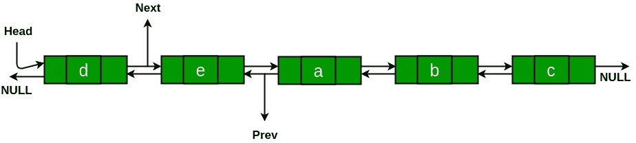

# 将双向链表顺时针旋转 N 个位置

给定双链表和整数 **N** ，任务是将链表顺时针旋转 **N** 个节点。

**示例：**

> **输入：** N = 2
> 
> **输出：**
> 

**方法：**要旋转双向链接列表，请首先检查给定的 N 是否大于列表的长度。 如果 N 大于列表的大小，则通过对列表的长度取模，得出它在链接列表大小的范围内。 之后，从列表的长度中减去 N 的值。 现在，问题减少到双向链接列表的逆时针旋转 N 个位置。

*   更改最后一个节点的下一个以指向 Head 节点。
*   更改“头”节点的上一个以指向最后一个节点。
*   将 Head_ref 的值更改为第 N 个节点的下一个。
*   将第 N 个节点的 next 的值更改为 NULL。
*   最后，使 Head 节点的上一个指向 NULL。

下面是上述方法的实现：

## C++

```cpp

// C++ program to rotate a Doubly linked 
// list clock wise by N times 
#include <bits/stdc++.h> 
using namespace std; 

/* Link list node */
struct Node { 
    char data; 
    struct Node* prev; 
    struct Node* next; 
}; 

// Utility function to find the size of 
// Doubly Linked List 
int size(struct Node* head_ref) 
{ 
    struct Node* curr = head_ref; 
    int sz = 0; 
    while (curr != NULL) { 
        curr = curr->next; 
        sz++; 
    } 
    return sz; 
} 

/* Function to print linked list */
void printList(struct Node* node) 
{ 
    while (node->next != NULL) { 
        cout << node->data << " "
             << "<=>"
             << " "; 
        node = node->next; 
    } 
    cout << node->data; 
} 

// Function to insert a node at the 
// beginning of the Doubly Linked List 
void push(struct Node** head_ref, int new_data) 
{ 
    struct Node* new_node = new Node; 
    new_node->data = new_data; 
    new_node->prev = NULL; 
    new_node->next = (*head_ref); 
    if ((*head_ref) != NULL) 
        (*head_ref)->prev = new_node; 
    *head_ref = new_node; 
} 

// Function to rotate a doubly linked 
// list clockwise and update the head 
void rotate(struct Node** head_ref, int N, int sz) 
{ 

    /* If N is greater than the size of Doubly 
    Linked List, we have to deduce it in the range  
    of Doubly linked list size by taking modulo with the  
    length of the list.*/
    N = N % sz; 

    /* We will update N by subtracting it's value length of  
    the list. After this the question will reduce to 
    counter clockwise rotation of linked list to N places*/
    N = sz - N; 

    if (N == 0) 
        return; 

    struct Node* current = *head_ref; 

    // current will either point to Nth 
    // or NULL after this loop. Current 
    // will point to node 'b' in the 
    // above example 
    int count = 1; 
    while (count < N && current != NULL) { 
        current = current->next; 
        count++; 
    } 

    // If current is NULL, N is greater 
    // than or equal to count of nodes 
    // in linked list 
    // Don't change the list in this case 
    if (current == NULL) 
        return; 

    // current points to Nth node. Store 
    // it in a variable. NthNode points to 
    // node 'b' in the above example 
    struct Node* NthNode = current; 

    // current will point to last node 
    // after this loop current will point 
    // to node 'e' in the above example 
    while (current->next != NULL) 
        current = current->next; 

    // Change next of last node to previous 
    // head. Next of 'e' is now changed to 
    // node 'a' 
    current->next = *head_ref; 

    // Change prev of Head node to current 
    // Prev of 'a' is now changed to node 'e' 
    (*head_ref)->prev = current; 

    // Change head to (N+1)th node 
    // head is now changed to node 'c' 
    *head_ref = NthNode->next; 

    // Change prev of New Head node to NULL 
    // Because Prev of Head Node in Doubly 
    // linked list is NULL 
    (*head_ref)->prev = NULL; 

    // Change next of Nth node to NULL 
    // next of 'b' is now NULL 
    NthNode->next = NULL; 
} 

// Driver code 
int main(void) 
{ 
    /* Start with the empty list */
    struct Node* head = NULL; 

    /* Create the doubly linked  
    list a<->b<->c<->d<->e */
    push(&head, 'e'); 
    push(&head, 'd'); 
    push(&head, 'c'); 
    push(&head, 'b'); 
    push(&head, 'a'); 

    int N = 2; 

    // Length of the list 
    int sz = size(head); 

    cout << "Given Doubly linked list \n"; 
    printList(head); 
    rotate(&head, N, sz); 

    cout << "\nRotated Linked list clockwise \n"; 
    printList(head); 

    return 0; 
} 

```

## Java

```java

// Java program to rotate a Doubly linked 
// list clock wise by N times 
class GFG 
{ 

/* Link list node */
static class Node  
{ 
    char data; 
    Node prev; 
    Node next; 
}; 

// Utility function to find the size of 
// Doubly Linked List 
static int size(Node head_ref) 
{ 
    Node curr = head_ref; 
    int sz = 0; 
    while (curr != null) 
    { 
        curr = curr.next; 
        sz++; 
    } 
    return sz; 
} 

/* Function to print linked list */
static void printList(Node node) 
{ 
    while (node.next != null)  
    { 
        System.out.print( 
        node.data + " " + "<=>" + " "); 
        node = node.next; 
    } 
    System.out.print(node.data); 
} 

// Function to insert a node at the 
// beginning of the Doubly Linked List 
static Node push(Node head_ref, 
                 char new_data) 
{ 
    Node new_node = new Node(); 
    new_node.data = new_data; 
    new_node.prev = null; 
    new_node.next = head_ref; 
    if (head_ref != null) 
        head_ref.prev = new_node; 
    head_ref = new_node; 
    return head_ref; 
} 

// Function to rotate a doubly linked 
// list clockwise and update the head 
static Node rotate(Node head_ref,  
                   int N, int sz) 
{ 

    /* If N is greater than the size of  
    Doubly Linked List, we have to deduce it 
    in the range of Doubly linked list size  
    by taking modulo with the length of the list.*/
    N = N % sz; 

    /* We will update N by subtracting  
    it's value length of the list.  
    After this the question will  
    reduce to counter clockwise rotation  
    of linked list to N places*/
    N = sz - N; 

    if (N == 0) 
        return null; 

    Node current = head_ref; 

    // current will either point to Nth 
    // or null after this loop. Current 
    // will point to node 'b' in the 
    // above example 
    int count = 1; 
    while (count < N && current != null)  
    { 
        current = current.next; 
        count++; 
    } 

    // If current is null, N is greater 
    // than or equal to count of nodes 
    // in linked list 
    // Don't change the list in this case 
    if (current == null) 
        return null; 

    // current points to Nth node. Store 
    // it in a variable. NthNode points to 
    // node 'b' in the above example 
    Node NthNode = current; 

    // current will point to last node 
    // after this loop current will point 
    // to node 'e' in the above example 
    while (current.next != null) 
        current = current.next; 

    // Change next of last node to previous 
    // head. Next of 'e' is now changed to 
    // node 'a' 
    current.next = head_ref; 

    // Change prev of Head node to current 
    // Prev of 'a' is now changed to node 'e' 
    head_ref.prev = current; 

    // Change head to (N+1)th node 
    // head is now changed to node 'c' 
    head_ref = NthNode.next; 

    // Change prev of New Head node to null 
    // Because Prev of Head Node in Doubly 
    // linked list is null 
    head_ref.prev = null; 

    // Change next of Nth node to null 
    // next of 'b' is now null 
    NthNode.next = null; 
    return head_ref; 
} 

// Driver code 
public static void main(String []args)  
{ 
    /* Start with the empty list */
    Node head = null; 

    /* Create the doubly linked  
    list a<->b<->c<->d<->e */
    head = push(head, 'e'); 
    head = push(head, 'd'); 
    head = push(head, 'c'); 
    head = push(head, 'b'); 
    head = push(head, 'a'); 

    int N = 2; 

    // Length of the list 
    int sz = size(head); 

    System.out.println("Given Doubly linked list "); 
    printList(head); 
    head = rotate(head, N, sz); 

    System.out.println("\nRotated Linked list clockwise "); 
    printList(head); 
} 
} 

// This code is contributed by 29AjayKumar 

```

## Python3

```py

# Node of a doubly linked list  
class Node:  
    def __init__(self, next = None,  
                    prev = None, data = None):  
        self.next = next # reference to next node in DLL  
        self.prev = prev # reference to previous node in DLL  
        self.data = data  

# Function to insert a node at the 
# beginning of the Doubly Linked List 
def push(head, new_data):  

    new_node = Node(data = new_data)  

    new_node.next = head  
    new_node.prev = None

    if head is not None:  
        head.prev = new_node  

    head = new_node  
    return head  

# Utility function to find the size of 
# Doubly Linked List 
def size(head): 
    node = head 
    sz = 0
    while(node is not None): 
        sz+= 1
        node = node.next
    return sz 

# Function to print linked list 
def printList(head):  

    node = head  

    print("Given linked list")  
    while(node is not None):  
        print(node.data, end = " "),  
        last = node  
        node = node.next

# Function to rotate a doubly linked 
# list clockwise and update the head 
def rotate(start, N):  
    if N == 0 :  
        return

    # Let us understand the below code  
    # for example N = 2 and  
    # list = a <-> b <-> c <-> d <-> e.  
    current = start  

    # current will either point to Nth  
    # or None after this loop. Current  
    # will point to node 'b' in the  
    # above example  
    count = 1
    while count < N and current != None :  
        current = current.next
        count += 1

    # If current is None, N is greater  
    # than or equal to count of nodes  
    # in linked list. Don't change the  
    # list in this case  
    if current == None :  
        return

    # current points to Nth node. Store  
    # it in a variable. NthNode points to  
    # node 'b' in the above example  
    NthNode = current  

    # current will point to last node  
    # after this loop current will point  
    # to node 'e' in the above example  
    while current.next != None :  
        current = current.next

    # Change next of last node to previous  
    # head. Next of 'e' is now changed to  
    # node 'a'  
    current.next = start  

    # Change prev of Head node to current  
    # Prev of 'a' is now changed to node 'e'  
    start.prev = current  

    # Change head to (N + 1)th node  
    # head is now changed to node 'c'  
    start = NthNode.next

    # Change prev of New Head node to None  
    # Because Prev of Head Node in Doubly  
    # linked list is None  
    start.prev = None

    # change next of Nth node to None  
    # next of 'b' is now None  
    NthNode.next = None

    return start  

# Driver Code  
if __name__ == "__main__":  
    head = None

    head = push(head, 'e')  
    head = push(head, 'd')  
    head = push(head, 'c')  
    head = push(head, 'b')  
    head = push(head, 'a')  

    printList(head)  
    print("\n")  

    N = 2

    # Length of the list 
    sz = size(head) 

    # If N is greater than the size of Doubly 
    # Linked List, we have to deduce it in the range  
    # of Doubly linked list size by taking modulo with the  
    # length of the list. 
    N = N % sz; 

    # We will update N by subtracting it's value length of  
    # the list. After this the question will reduce to 
    # counter-clockwise rotation of linked list to N places 
    N = sz-N; 

    head = rotate(head, N)  

    printList(head)  

```

## C#

```cs

// C# program to rotate a Doubly linked 
// list clock wise by N times 
using System; 

class GFG 
{ 

/* Link list node */
public class Node  
{ 
    public char data; 
    public Node prev; 
    public Node next; 
}; 

// Utility function to find the size of 
// Doubly Linked List 
static int size(Node head_ref) 
{ 
    Node curr = head_ref; 
    int sz = 0; 
    while (curr != null) 
    { 
        curr = curr.next; 
        sz++; 
    } 
    return sz; 
} 

/* Function to print linked list */
static void printList(Node node) 
{ 
    while (node.next != null)  
    { 
        Console.Write( 
        node.data + " " + "<=>" + " "); 
        node = node.next; 
    } 
    Console.Write(node.data); 
} 

// Function to insert a node at the 
// beginning of the Doubly Linked List 
static Node push(Node head_ref, 
                 char new_data) 
{ 
    Node new_node = new Node(); 
    new_node.data = new_data; 
    new_node.prev = null; 
    new_node.next = head_ref; 
    if (head_ref != null) 
        head_ref.prev = new_node; 
    head_ref = new_node; 
    return head_ref; 
} 

// Function to rotate a doubly linked 
// list clockwise and update the head 
static Node rotate(Node head_ref,  
                   int N, int sz) 
{ 

    /* If N is greater than the size of  
    Doubly Linked List, we have to deduce it 
    in the range of Doubly linked list size  
    by taking modulo with the length of the list.*/
    N = N % sz; 

    /* We will update N by subtracting  
    it's value length of the list.  
    After this the question will  
    reduce to counter clockwise rotation  
    of linked list to N places*/
    N = sz - N; 

    if (N == 0) 
        return null; 

    Node current = head_ref; 

    // current will either point to Nth 
    // or null after this loop. Current 
    // will point to node 'b' in the 
    // above example 
    int count = 1; 
    while (count < N && current != null)  
    { 
        current = current.next; 
        count++; 
    } 

    // If current is null, N is greater 
    // than or equal to count of nodes 
    // in linked list 
    // Don't change the list in this case 
    if (current == null) 
        return null; 

    // current points to Nth node. Store 
    // it in a variable. NthNode points to 
    // node 'b' in the above example 
    Node NthNode = current; 

    // current will point to last node 
    // after this loop current will point 
    // to node 'e' in the above example 
    while (current.next != null) 
        current = current.next; 

    // Change next of last node to previous 
    // head. Next of 'e' is now changed to 
    // node 'a' 
    current.next = head_ref; 

    // Change prev of Head node to current 
    // Prev of 'a' is now changed to node 'e' 
    head_ref.prev = current; 

    // Change head to (N+1)th node 
    // head is now changed to node 'c' 
    head_ref = NthNode.next; 

    // Change prev of New Head node to null 
    // Because Prev of Head Node in Doubly 
    // linked list is null 
    head_ref.prev = null; 

    // Change next of Nth node to null 
    // next of 'b' is now null 
    NthNode.next = null; 
    return head_ref; 
} 

// Driver code 
public static void Main(String []args)  
{ 
    /* Start with the empty list */
    Node head = null; 

    /* Create the doubly linked  
    list a<->b<->c<->d<->e */
    head = push(head, 'e'); 
    head = push(head, 'd'); 
    head = push(head, 'c'); 
    head = push(head, 'b'); 
    head = push(head, 'a'); 

    int N = 2; 

    // Length of the list 
    int sz = size(head); 

    Console.WriteLine("Given Doubly linked list "); 
    printList(head); 
    head = rotate(head, N, sz); 

    Console.WriteLine("\nRotated Linked list clockwise "); 
    printList(head); 
} 
} 

// This code is contributed by Rajput-Ji 

```

**Output:**

```
Given Doubly linked list 
a <=> b <=> c <=> d <=> e
Rotated Linked list clockwise 
d <=> e <=> a <=> b <=> c

```c

**时间复杂度：** O（n），其中 n 是链接列表中的节点数。


* * *

* * *

如果您喜欢 GeeksforGeeks 并希望做出贡献，则还可以使用 [tribution.geeksforgeeks.org](https://contribute.geeksforgeeks.org/) 撰写文章，或将您的文章邮寄至 tribution@geeksforgeeks.org。 查看您的文章出现在 GeeksforGeeks 主页上，并帮助其他 Geeks。

如果您发现任何不正确的地方，请单击下面的“改进文章”按钮，以改进本文。