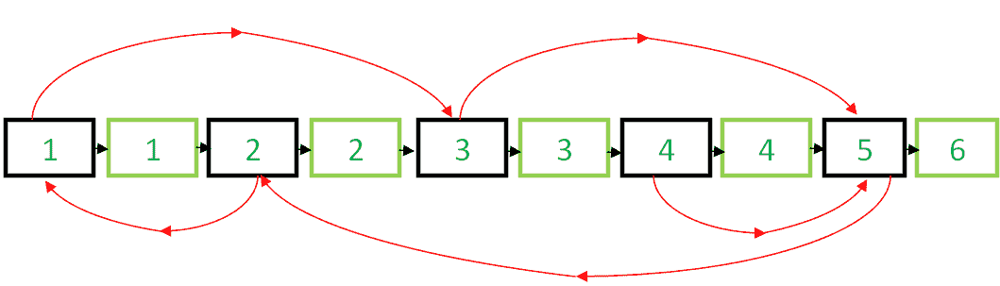
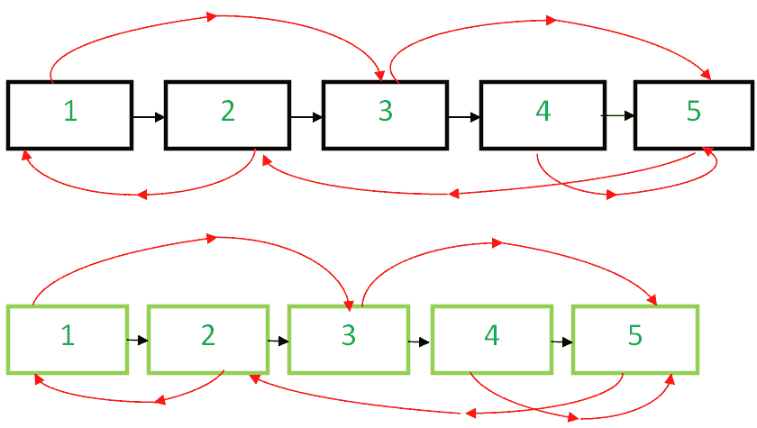

# 使用O（1）空间中的下一个指针和随机指针克隆链接列表

给定一个链表，每个节点中都有两个指针。 第一个指针指向列表的下一个节点，但是，另一个指针是随机的，可以指向列表的任何节点。 编写一个在O（1）空间中克隆给定列表的程序，即没有任何额外空间。
**范例：**

```
Input : Head of the below-linked list

Output :
A new linked list identical to the original list.

```

在先前的文章 [Set-1](https://www.geeksforgeeks.org/a-linked-list-with-next-and-arbit-pointer/) 和 [Set-2](https://www.geeksforgeeks.org/clone-linked-list-next-arbit-pointer-set-2/) 中，讨论了各种方法，并且O（n）空间复杂度实现也可用。

在本文中，我们将实现一种算法，该算法不需要Set-1中讨论的额外空间。

下面是算法：

*   创建节点1的副本并将其插入原始链接列表中的节点1和节点2之间，创建2的副本并将其插入2和3之间。以这种方式继续，在第N个节点之后添加N的副本



*   Now copy the random link in this fashion

    ```
     original->next->random= original->random->next;  /*TRAVERSE 
    TWO NODES*/

    ```

    这是有效的，因为original-> next只是原始副本，而Original-> random-> next只是随机副本。


*   现在，以这种方式在单个循环中还原原始链表和复制链表。

    ```
    original->next = original->next->next;
         copy->next = copy->next->next;
    ```

*   确保original-> next为NULL并返回克隆列表


下面是实现。

## C ++

*filter_none*

*编辑*
*关闭*

*play_arrow*

*链接*
*亮度_4*
*代码*

| `// C++ program to clone a linked list with next``// and arbit pointers in O(n) time``#include <bits/stdc++.h>``using` `namespace` `std;` [`// Structure of linked list Node``struct` `Node``{` `int` `data;` `Node *next,*random;` `Node(` `int` `x)` `{` `data = x;` `next = random = NULL;` `}``};``// Utility function to print the list.``void` `print(Node *start)``{` `Node *ptr = start;` `while` `(ptr)` `{` `cout <<` `"Data = "` `<< ptr->data <<` `", Random  = "`​​ `<< ptr->random->data << endl;` `ptr = ptr->next;` `}``}``// This function clones a given linked list``// in O(1) space``Node* clone(Node *start)``{` `Node* curr = start, *temp;` `// insert additional node after` `// every node of original list` `while` `(curr)` `{` `temp = curr->next;` `// Inserting node` `curr->next =` `new` `Node(curr->data);` `curr->next->next = temp;` `curr = temp;` `}` `curr = start;` `// adjust the random pointers of the` `// newly added nodes` `while` `(curr)`[  `{` `if` `(curr->next)` `curr->next->random = curr->random ? ` `curr->random->next : curr->random;` HTG336] `// move to the next newly added node by` `// skipping an original node` `curr = curr->next?curr->next->next:curr->next;` `}` `Node* original = start, *copy = start->next;` `// save the start of copied linked list` `temp = copy;` ] `// now separate the original list and copied list` `while` `(original && copy)` `{` `original->next =` `original->next? original->next->next : original->next;` `copy->next = copy->next?copy->next->next:copy->next;` `original = original->next;` `copy = copy->next;` `}` `return` `temp;``}``// Driver code``int` `main()``{` `Node* start =` `new` `Node(1);` `start->next =` `new` `Node(2);` `start->next->next =` `new` `Node(3);` `start->next->next->next =` `new` `Node(4);` `start->next->next->next->next =` `new` `Node(5);` `// 1's random points to 3` `start->random = start->next->next;` `// 2's random points to 1` `start->next->random = start;` `// 3's and 4's random points to 5` `start->next->next->random =` `start->next->next->next->next;` `start->next->next->next->random =` `start->next->next->next->next;`[H TG425]  `// 5's random points to 2` `start->next->next->next->next->random =` `start->next;` `cout <<` `"Original list : \n"` `;` `print(start);` `cout <<` `"\nCloned list : \n"` `;` `Node *cloned_list = clone(start);` `print(cloned_list);` [ `return` `0;``}` |

*chevron_right**filter_none*