# 图论中的

# 聚类系数

> 原文： [https://www.geeksforgeeks.org/clustering-coefficient-graph-theory/](https://www.geeksforgeeks.org/clustering-coefficient-graph-theory/)

在图论中，聚类系数是图形中节点趋于聚在一起的程度的度量。 有证据表明，在大多数现实世界的网络中，特别是在社交网络中，节点倾向于创建紧密联系的群体，其特征是相对较高的联系密度。 这种可能性往往大于在两个节点之间随机建立平局的平均概率（Holland 和 Leinhardt，1971； Watts 和 Strogatz，1998）。

该度量有两个版本：全局和局部。 全局版本旨在总体上指示网络中的群集，而本地版本则指示单个节点的嵌入性。

***全局聚类系数***

全局聚类系数基于节点的三元组。 一个三元组由三个连接的节点组成。 因此，三角形包含三个封闭的三胞胎，一个在每个节点上居中（n.b.这意味着三角形中的三个三胞胎来自节点的重叠选择）。 全局聚类系数是封闭的三元组（或 3 个三角形）在三元组总数（开放和封闭的总数）中的数量。 Luce 和 Perry（1949）进行了首次测量。 该措施可以指示整个网络（全局）中的群集，并且可以应用于无向和有向网络。

***局部聚类系数***

图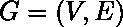正式由一组顶点 V 和它们之间的一组边 E 组成。 边缘将顶点与顶点连接起来。

顶点的邻域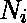定义为其直接相连的邻居，如下所示：

。

我们将定义为顶点附近的顶点数量。

然后，顶点的局部聚类系数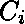由其邻域内顶点之间的链接比例除以它们之间可能存在的链接数量得出。 对于有向图，与不同，因此，对于每个邻域，在邻域内的各个顶点之间可能存在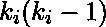链接（是顶点的邻居数） ）。 因此，有向图的局部聚类系数为[2]

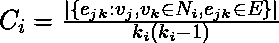。
无向图具有和相同的属性。 因此，如果顶点具有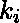邻居，则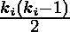边缘可能会存在于邻域内的各个顶点之间。 因此，无向图的局部聚类系数可以定义为

。
令为无向图 G 的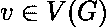上的三角形数。即，是具有 3 条边和 3 个顶点的 G 子图的数目，其中之一为 v。 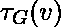是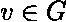上的三元组数。 也就是说，是具有 2 个边缘和 3 个顶点的子图的数量（不必诱导），其中一个是 v，并且 v 入射到两个边缘。 然后我们也可以将聚类系数定义为
lue
。
很容易证明前面两个定义是相同的，因为

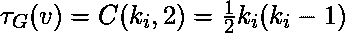。
如果连接到的每个邻居也都连接到邻居中的每个其他顶点，则这些度量为 1；如果没有连接到的顶点连接到与相连的任何其他顶点，则这些度量为 0。 。


无向图上的示例局部聚类系数。 绿色节点的局部聚类系数被计算为其邻居之间的连接比例。

这是在图中实现上述聚类系数的代码。 它是 networkx 库的一部分，可以使用它直接访问。

```

def average_clustering(G, trials=1000): 
    """Estimates the average clustering coefficient of G. 

    The local clustering of each node in `G` is the  
    fraction of triangles that actually exist over  
    all possible triangles in its neighborhood. 
    The average clustering coefficient of a graph  
    `G` is the mean of local clusterings. 

    This function finds an approximate average  
    clustering coefficient for G by repeating `n`  
    times (defined in `trials`) the following 
    experiment: choose a node at random, choose  
    two of its neighbors at random, and check if 
    they are connected. The approximate coefficient  
    is the fraction of triangles found over the  
    number of trials [1]_. 

    Parameters 
    ---------- 
    G : NetworkX graph 

    trials : integer 
        Number of trials to perform (default 1000). 

    Returns 
    ------- 
    c : float 
        Approximated average clustering coefficient. 

    """
    n = len(G) 
    triangles = 0
    nodes = G.nodes() 
    for i in [int(random.random() * n) for i in range(trials)]: 
        nbrs = list(G[nodes[i]]) 
        if len(nbrs) < 2: 
            continue
        u, v = random.sample(nbrs, 2) 
        if u in G[v]: 
            triangles += 1
    return triangles / float(trials) 

```

注意：上面的代码对非定向网络有效，而对定向网络无效。
以下代码已在 IDLE（Windows 的 Python IDE）上运行。 在运行此代码之前，您需要下载 networkx 库。 花括号内的部分代表输出。 它几乎与 Ipython（适用于 Ububtu 用户）相似。

```

>>> import networkx as nx 
>>> G=nx.erdos_renyi_graph(10,0.4) 
>>> cc=nx.average_clustering(G) 
>>> cc 
#Output of Global CC 
0.08333333333333333 
>>> c=nx.clustering(G) 
>>> c  
# Output of local CC 
{0: 0.0, 1: 0.3333333333333333, 2: 0.0, 3: 0.0, 4: 0.0, 5: 0.0, 6: 0.0, 
 7: 0.3333333333333333, 8: 0.0, 9: 0.16666666666666666}  

```

以上两个值为我们提供了网络的全局聚类系数以及网络的局部聚类系数。

在本系列的下一篇文章中，我们将讨论针对任何给定网络的另一种集中度度量。

***参考文献***

*   [https://en.wikipedia.org/wiki/Clustering_coefficient](https://en.wikipedia.org/wiki/Clustering_coefficient)*   [http://networkx.readthedocs.io/en/networkx-1.10/index.html](http://networkx.readthedocs.io/en/networkx-1.10/index.html)

.

本文由 **[Jayant Bisht](https://in.linkedin.com/in/jayant-bisht-978085114)** 提供。 如果您喜欢 GeeksforGeeks 并希望做出贡献，则还可以使用 [tribution.geeksforgeeks.org](http://www.contribute.geeksforgeeks.org) 撰写文章，或将您的文章邮寄至 tribution@geeksforgeeks.org。 查看您的文章出现在 GeeksforGeeks 主页上，并帮助其他 Geeks。

如果发现任何不正确的地方，或者想分享有关上述主题的更多信息，请写评论。

