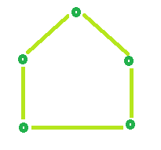
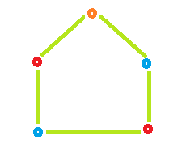

# 为循环图着色

> 原文： [https://www.geeksforgeeks.org/coloring-a-cycle-graph/](https://www.geeksforgeeks.org/coloring-a-cycle-graph/)

**循环：-**循环是一条边和顶点的路径，其中顶点可以从其自身到达。 换句话说，这是一次封闭式步行。

**偶数周期：-**其中存在偶数个顶点的数被称为偶数周期。

**奇数循环：-**其中存在奇数个顶点的奇数循环被称为。

给定循环图中的顶点数。 任务是确定为图形着色所需的颜色数，以使没有两个相邻的顶点具有相同的颜色。

**方法**：

> 如果没有。 顶点的数量是偶数，然后是偶数周期，并且要给这样的图形着色，我们需要 2 种颜色。
> 如果否。 的顶点数是奇数，那么它是奇数周期，并且要给这种图着色，我们需要 3 种颜色。

**示例**：

```
Input : vertices = 3
Output : No. of colors require is: 3

Input : verices = 4
Output : No. of colors require is: 2

```

**示例 1：偶数周期**：顶点数= 4


所需颜色= 2


**示例 2：奇周期**：顶点数= 5



所需颜色= 3



## C++

```cpp

// CPP program to find number of colors 
// required to color a cycle graph 
#include <bits/stdc++.h> 
using namespace std; 

// Function that calculates Color 
// require to color a graph. 
int Color(int vertices) 
{ 
    int result = 0; 

    // Check if number of vertices 
    // is odd or even. 
    // If number of vertices is even 
    // then color require is 2 otherwise 3 
    if (vertices % 2 == 0) 
        result = 2; 
    else
        result = 3; 

    return result; 
} 

// Driver code 
int main() 
{ 
    int vertices = 3; 
    cout << "No. of colors require is: " << Color(vertices); 
    return 0; 
} 

```

## Java

```java

// Java program to find number of colors 
// required to color a cycle graph 
import java.io.*;  

class GFG {  

    // Function that calculates Color  
    // require to color a graph.   
    static int Color(int vertices)  
    {  
        int result = 0;  

        // Check if number of vertices  
        // is odd or even.  
        // If number of vertices is even  
        // then color require is 2 otherwise 3  
        if (vertices % 2 == 0)  
            result = 2;  
        else
            result = 3;  

        return result;  
    }   

    // Driver program to test above function  
    public static void main (String[] args)  
    {  
        int vertices = 3;  

        System.out.println("No. of colors require is: " + Color(vertices)); 

    }  
}  

// this code is contributed by Naman_Garg 

```

## Python

```py

# Naive Python3 Program to  
# find the number of colors 
# required to color a cycle graph   

# Function to find Color required. 
def Color(vertices):   

    result = 0 

    # Check if number of vertices  
    # is odd or even.  
    # If number of vertices is even  
    # then color require is 2 otherwise 3  
    if (vertices % 2 == 0): 
        result = 2
    else: 
        result = 3 

    return result 

# Driver Code  
if __name__=='__main__': 
    vertices = 3
    print ("No. of colors require is:",Color(vertices)) 

# this code is contributed by Naman_Garg 

```

## C#

```cs

// C# program to find number of colors 
// required to color a cycle graph 
using System;  

class GFG 
{  

// Function that calculates Color  
// require to color a graph.  
static int Color(int vertices)  
{  
    int result = 0;  

    // Check if number of vertices  
    // is odd or even.  
    // If number of vertices is even  
    // then color require is 2 otherwise 3  
    if (vertices % 2 == 0)  
        result = 2;  
    else
        result = 3;  

    return result;  
}  

// Driver Code 
public static void Main ()  
{  
    int vertices = 3;  

    Console.WriteLine("No. of colors required is: " +  
                                   Color(vertices)); 
}  
}  

// This code is contributed by anuj_67 

```

## 的 PHP

```

<?php 
// PHP program to find number of colors 
// required to color a cycle graph 

// Function that calculates Color 
// require to color a graph. 
function Color($vertices) 
{ 
    $result = 0; 

    // Check if number of vertices 
    // is odd or even. 
    // If number of vertices is even 
    // then color require is 2 otherwise 3 
    if ($vertices % 2 == 0) 
        $result = 2; 
    else
        $result = 3; 

    return $result; 
} 

// Driver code 
$vertices = 3; 
echo "No. of colors required is: " , 
                  Color($vertices); 

// This code is contributed  
// by anuj_67 
?> 

```

**Output:**

```
No. of colors require is: 3

```


* * *

* * *

如果您喜欢 GeeksforGeeks 并希望做出贡献，则还可以使用 [tribution.geeksforgeeks.org](https://contribute.geeksforgeeks.org/) 撰写文章，或将您的文章邮寄至 tribution@geeksforgeeks.org。 查看您的文章出现在 GeeksforGeeks 主页上，并帮助其他 Geeks。

如果您发现任何不正确的地方，请单击下面的“改进文章”按钮，以改进本文。