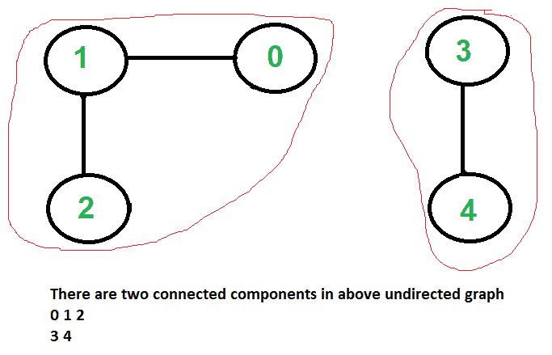

# 无向图中的连接的组件

> 原文： [https://www.geeksforgeeks.org/connected-components-in-an-undirected-graph/](https://www.geeksforgeeks.org/connected-components-in-an-undirected-graph/)

给定一个无向图，一行一行地打印所有连接的组件。 例如，考虑下图。



**我们强烈建议您最小化您的浏览器，然后自己尝试。**
我们在以下文章中讨论了用于在有向图中找到强连接的组件的算法。
[Kosaraju 的算法，用于牢固连接组件](https://www.geeksforgeeks.org/strongly-connected-components/)。
[塔里安（Tarjan）查找强连接的组件的算法](https://www.geeksforgeeks.org/tarjan-algorithm-find-strongly-connected-components/)
为无向图找到连接的组件是一件容易的事。 我们只需要从每个未访问的顶点开始执行 BFS 或 DFS，就可以获得所有紧密连接的组件。 以下是基于 DFS 的步骤。

```
1) Initialize all vertices as not visited.
2) Do following for every vertex 'v'.
       (a) If 'v' is not visited before, call DFSUtil(v)
       (b) Print new line character

DFSUtil(v)
1) Mark 'v' as visited.
2) Print 'v'
3) Do following for every adjacent 'u' of 'v'.
     If 'u' is not visited, then recursively call DFSUtil(u)

```

下面是上述算法的实现。

## C++

```cpp

// C++ program to print connected components in
// an undirected graph
#include <iostream>
#include <list>
using namespace std;

// Graph class represents a undirected graph
// using adjacency list representation
class Graph {
    int V; // No. of vertices

    // Pointer to an array containing adjacency lists
    list<int>* adj;

    // A function used by DFS
    void DFSUtil(int v, bool visited[]);

public:
    Graph(int V); // Constructor
    ~Graph();
    void addEdge(int v, int w);
    void connectedComponents();
};

// Method to print connected components in an
// undirected graph
void Graph::connectedComponents()
{
    // Mark all the vertices as not visited
    bool* visited = new bool[V];
    for (int v = 0; v < V; v++)
        visited[v] = false;

    for (int v = 0; v < V; v++) {
        if (visited[v] == false) {
            // print all reachable vertices
            // from v
            DFSUtil(v, visited);

            cout << "\n";
        }
    }
    delete[] visited;
}

void Graph::DFSUtil(int v, bool visited[])
{
    // Mark the current node as visited and print it
    visited[v] = true;
    cout << v << " ";

    // Recur for all the vertices
    // adjacent to this vertex
    list<int>::iterator i;
    for (i = adj[v].begin(); i != adj[v].end(); ++i)
        if (!visited[*i])
            DFSUtil(*i, visited);
}

Graph::Graph(int V)
{
    this->V = V;
    adj = new list<int>[V];
}

Graph::~Graph() { delete[] adj; }

// method to add an undirected edge
void Graph::addEdge(int v, int w)
{
    adj[v].push_back(w);
    adj[w].push_back(v);
}

// Driver code
int main()
{
    // Create a graph given in the above diagram
    Graph g(5); // 5 vertices numbered from 0 to 4
    g.addEdge(1, 0);
    g.addEdge(2, 3);
    g.addEdge(3, 4);

    cout << "Following are connected components \n";
    g.connectedComponents();

    return 0;
}

```

## Java

```java

// Java program to print connected components in
// an undirected graph
import java.util.ArrayList;
class Graph
{
    // A user define class to represent a graph.
    // A graph is an array of adjacency lists.
    // Size of array will be V (number of vertices
    // in graph)
    int V;
    ArrayList<ArrayList<Integer> > adjListArray;

    // constructor
    Graph(int V)
    {
        this.V = V;
        // define the size of array as
        // number of vertices
        adjListArray = new ArrayList<>();

        // Create a new list for each vertex
        // such that adjacent nodes can be stored

        for (int i = 0; i < V; i++) {
            adjListArray.add(i, new ArrayList<>());
        }
    }

    // Adds an edge to an undirected graph
    void addEdge(int src, int dest)
    {
        // Add an edge from src to dest.
        adjListArray.get(src).add(dest);

        // Since graph is undirected, add an edge from dest
        // to src also
        adjListArray.get(dest).add(src);
    }

    void DFSUtil(int v, boolean[] visited)
    {
        // Mark the current node as visited and print it
        visited[v] = true;
        System.out.print(v + " ");
        // Recur for all the vertices
        // adjacent to this vertex
        for (int x : adjListArray.get(v)) {
            if (!visited[x])
                DFSUtil(x, visited);
        }
    }
    void connectedComponents()
    {
        // Mark all the vertices as not visited
        boolean[] visited = new boolean[V];
        for (int v = 0; v < V; ++v) {
            if (!visited[v]) {
                // print all reachable vertices
                // from v
                DFSUtil(v, visited);
                System.out.println();
            }
        }
    }

    // Driver code
    public static void main(String[] args)
    {
        // Create a graph given in the above diagram
        Graph g = new Graph(
            5); // 5 vertices numbered from 0 to 4

        g.addEdge(1, 0);
        g.addEdge(2, 3);
        g.addEdge(3, 4);
        System.out.println(
            "Following are connected components");
        g.connectedComponents();
    }
}

```

## Python

```py

# Python program to print connected
# components in an undirected graph

class Graph:

    # init function to declare class variables
    def __init__(self, V):
        self.V = V
        self.adj = [[] for i in range(V)]

    def DFSUtil(self, temp, v, visited):

        # Mark the current vertex as visited
        visited[v] = True

        # Store the vertex to list
        temp.append(v)

        # Repeat for all vertices adjacent
        # to this vertex v
        for i in self.adj[v]:
            if visited[i] == False:

                # Update the list
                temp = self.DFSUtil(temp, i, visited)
        return temp

    # method to add an undirected edge
    def addEdge(self, v, w):
        self.adj[v].append(w)
        self.adj[w].append(v)

    # Method to retrieve connected components
    # in an undirected graph
    def connectedComponents(self):
        visited = []
        cc = []
        for i in range(self.V):
            visited.append(False)
        for v in range(self.V):
            if visited[v] == False:
                temp = []
                cc.append(self.DFSUtil(temp, v, visited))
        return cc

# Driver Code
if __name__ == "__main__":

    # Create a graph given in the above diagram
    # 5 vertices numbered from 0 to 4
    g = Graph(5)
    g.addEdge(1, 0)
    g.addEdge(2, 3)
    g.addEdge(3, 4)
    cc = g.connectedComponents()
    print("Following are connected components")
    print(cc)

# This code is contributed by Abhishek Valsan

```

## C#

```cs

// C++ program to print connected components in
// an undirected graph
#include <iostream>
#include <list>
using namespace std;

// Graph class represents a undirected graph
// using adjacency list representation
class Graph
{
    int V; // No. of vertices

    // Pointer to an array containing adjacency lists
    list<int>* adj;

    // A function used by DFS
    void DFSUtil(int v, bool visited[]);

    public : Graph(int V); // Constructor
    ~Graph();
    void addEdge(int v, int w);
    void connectedComponents();
};

// Method to print connected components in an
// undirected graph
void Graph::connectedComponents()
{
    // Mark all the vertices as not visited
    bool* visited = new bool[V];
    for (int v = 0; v < V; v++)
        visited[v] = false;

    for (int v = 0; v < V; v++) {
        if (visited[v] == false) {
            // print all reachable vertices
            // from v
            DFSUtil(v, visited);

            cout << "\n";
        }
    }
    delete[] visited;
}

void Graph::DFSUtil(int v, bool visited[])
{
    // Mark the current node as visited and print it
    visited[v] = true;
    cout << v << " ";

    // Recur for all the vertices
    // adjacent to this vertex
    list<int>::iterator i;
    for (i = adj[v].begin(); i != adj[v].end(); ++i)
        if (!visited[*i])
            DFSUtil(*i, visited);
}

Graph::Graph(int V)
{
    this -> V = V;
    adj = new list<int>[ V ];
}

Graph::~Graph() { delete[] adj; }

// method to add an undirected edge
void Graph::addEdge(int v, int w)
{
    adj[v].push_back(w);
    adj[w].push_back(v);
}

// Driver code
int main()
{
    // Create a graph given in the above diagram
    Graph g(5); // 5 vertices numbered from 0 to 4
    g.addEdge(1, 0);
    g.addEdge(2, 3);
    g.addEdge(3, 4);

    cout << "Following are connected components \n";
    g.connectedComponents();

    return 0;
}

```

**输出**：

```
0 1
2 3 4

```

上述解决方案的时间复杂度为 O（V + E），因为它对给定的图形执行简单的 DFS。
如果发现任何不正确的内容，或者想共享有关上述主题的更多信息，请发表评论

