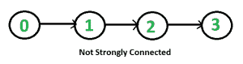

# 检查图形是否牢固连接| 设置 1（使用 DFS 的 Kosaraju）

> 原文： [https://www.geeksforgeeks.org/connectivity-in-a-directed-graph/](https://www.geeksforgeeks.org/connectivity-in-a-directed-graph/)

给定一个有向图，请找出该图是否牢固连接。 如果在任意两对顶点之间存在路径，则有向图是牢固连接的。 例如，以下是一个强连接图。

[](https://media.geeksforgeeks.org/wp-content/cdn-uploads/connectivity3.png)

**对于无向图**来说很容易，我们可以从任何顶点开始进行 BFS 和 DFS。 如果 BFS 或 DFS 访问所有顶点，则将连接给定的无向图。 这种方法不适用于有向图。 例如，考虑下图，它们之间没有牢固连接。 如果从顶点 0 开始 DFS（或 BFS），则可以到达所有顶点，但是如果从任何其他顶点开始，则不能到达所有顶点。

[](https://media.geeksforgeeks.org/wp-content/cdn-uploads/connectivity1.png)

**有向图该怎么办？**

一个简单的想法是使用全对最短路径算法，例如 **[Floyd Warshall](https://www.geeksforgeeks.org/dynamic-programming-set-16-floyd-warshall-algorithm/) 或找到图的[传递闭包](https://www.geeksforgeeks.org/transitive-closure-of-a-graph/)** 。 该方法的时间复杂度为 O（v <sup>3</sup> ）。

我们也可以**从每个顶点开始 [DFS](https://www.geeksforgeeks.org/depth-first-traversal-for-a-graph/) V 倍**。 如果有任何 DFS 不能访问所有顶点，则图没有牢固连接。 该算法花费 O（V *（V + E））时间，这与密集图的传递闭合相同。

更好的主意可以是 **[强连接组件（SCC）](https://www.geeksforgeeks.org/strongly-connected-components/)算法**。 我们可以找到 O（V + E）时间中的所有 SCC。 如果 SCC 的数量为 1，则表示图形连接牢固。 因为找到所有 SCC，所以 SCC 的算法会做额外的工作。

以下是 **Kosaraju 基于 DFS 的简单算法，该算法执行图形的两个 DFS 遍历**：
**1）**将所有顶点初始化为未访问。

**2）**从任意顶点 v 开始进行图的 DFS 遍历。如果 DFS 遍历没有访问所有顶点，则返回 false。

**3）**反转所有圆弧（或找到图形的转置或反转）

**4）**将所有顶点标记为未在反向图中显示。

**5）**从相同的顶点 v 开始进行反向图的 DFS 遍历（与步骤 2 相同）。 如果 DFS 遍历不能访问所有顶点，则返回 false。 否则返回 true。

这个想法是，如果可以从顶点 v 到达每个节点，并且每个节点都可以到达 v，则图是牢固连接的。 在步骤 2 中，我们检查是否所有顶点都可以从 v 到达。在步骤 4 中，我们检查所有顶点是否都可以到达 v（在反向图中，如果所有顶点都可以从 v 到达，则所有顶点都可以在原始图中到达 v。）

以下是上述算法的实现。

## C ++

```

// C++ program to check if a given directed graph is strongly  
// connected or not 
#include <iostream> 
#include <list> 
#include <stack> 
using namespace std; 

class Graph 
{ 
    int V;    // No. of vertices 
    list<int> *adj;    // An array of adjacency lists 

    // A recursive function to print DFS starting from v 
    void DFSUtil(int v, bool visited[]); 
public: 
    // Constructor and Destructor 
    Graph(int V) { this->V = V;  adj = new list<int>[V];} 
    ~Graph() { delete [] adj; } 

    // Method to add an edge 
    void addEdge(int v, int w); 

    // The main function that returns true if the graph is strongly 
    // connected, otherwise false 
    bool isSC(); 

    // Function that returns reverse (or transpose) of this graph 
    Graph getTranspose(); 
}; 

// A recursive function to print DFS starting from v 
void Graph::DFSUtil(int v, bool visited[]) 
{ 
    // Mark the current node as visited and print it 
    visited[v] = true; 

    // Recur for all the vertices adjacent to this vertex 
    list<int>::iterator i; 
    for (i = adj[v].begin(); i != adj[v].end(); ++i) 
        if (!visited[*i]) 
            DFSUtil(*i, visited); 
} 

// Function that returns reverse (or transpose) of this graph 
Graph Graph::getTranspose() 
{ 
    Graph g(V); 
    for (int v = 0; v < V; v++) 
    { 
        // Recur for all the vertices adjacent to this vertex 
        list<int>::iterator i; 
        for(i = adj[v].begin(); i != adj[v].end(); ++i) 
        { 
            g.adj[*i].push_back(v); 
        } 
    } 
    return g; 
} 

void Graph::addEdge(int v, int w) 
{ 
    adj[v].push_back(w); // Add w to v’s list. 
} 

// The main function that returns true if graph is strongly connected 
bool Graph::isSC() 
{ 
    // St1p 1: Mark all the vertices as not visited (For first DFS) 
    bool visited[V]; 
    for (int i = 0; i < V; i++) 
        visited[i] = false; 

    // Step 2: Do DFS traversal starting from first vertex. 
    DFSUtil(0, visited); 

     // If DFS traversal doesn’t visit all vertices, then return false. 
    for (int i = 0; i < V; i++) 
        if (visited[i] == false) 
             return false; 

    // Step 3: Create a reversed graph 
    Graph gr = getTranspose(); 

    // Step 4: Mark all the vertices as not visited (For second DFS) 
    for(int i = 0; i < V; i++) 
        visited[i] = false; 

    // Step 5: Do DFS for reversed graph starting from first vertex. 
    // Staring Vertex must be same starting point of first DFS 
    gr.DFSUtil(0, visited); 

    // If all vertices are not visited in second DFS, then 
    // return false 
    for (int i = 0; i < V; i++) 
        if (visited[i] == false) 
             return false; 

    return true; 
} 

// Driver program to test above functions 
int main() 
{ 
    // Create graphs given in the above diagrams 
    Graph g1(5); 
    g1.addEdge(0, 1); 
    g1.addEdge(1, 2); 
    g1.addEdge(2, 3); 
    g1.addEdge(3, 0); 
    g1.addEdge(2, 4); 
    g1.addEdge(4, 2); 
    g1.isSC()? cout << "Yes\n" : cout << "No\n"; 

    Graph g2(4); 
    g2.addEdge(0, 1); 
    g2.addEdge(1, 2); 
    g2.addEdge(2, 3); 
    g2.isSC()? cout << "Yes\n" : cout << "No\n"; 

    return 0; 
} 

```

## 爪哇

```

// Java program to check if a given directed graph is strongly 
// connected or not 
import java.io.*; 
import java.util.*; 
import java.util.LinkedList; 

// This class represents a directed graph using adjacency 
// list representation 
class Graph 
{ 
    private int V;   // No. of vertices 
    private LinkedList<Integer> adj[]; //Adjacency List 

    //Constructor 
    Graph(int v) 
    { 
        V = v; 
        adj = new LinkedList[v]; 
        for (int i=0; i<v; ++i) 
            adj[i] = new LinkedList(); 
    } 

    //Function to add an edge into the graph 
    void addEdge(int v,int w) {  adj[v].add(w); } 

    // A recursive function to print DFS starting from v 
    void DFSUtil(int v,Boolean visited[]) 
    { 
        // Mark the current node as visited and print it 
        visited[v] = true; 

        int n; 

        // Recur for all the vertices adjacent to this vertex 
        Iterator<Integer> i = adj[v].iterator(); 
        while (i.hasNext()) 
        { 
            n = i.next(); 
            if (!visited[n]) 
                DFSUtil(n,visited); 
        } 
    } 

    // Function that returns transpose of this graph 
    Graph getTranspose() 
    { 
        Graph g = new Graph(V); 
        for (int v = 0; v < V; v++) 
        { 
            // Recur for all the vertices adjacent to this vertex 
            Iterator<Integer> i = adj[v].listIterator(); 
            while (i.hasNext()) 
                g.adj[i.next()].add(v); 
        } 
        return g; 
    } 

    // The main function that returns true if graph is strongly 
    // connected 
    Boolean isSC() 
    { 
        // Step 1: Mark all the vertices as not visited 
        // (For first DFS) 
        Boolean visited[] = new Boolean[V]; 
        for (int i = 0; i < V; i++) 
            visited[i] = false; 

        // Step 2: Do DFS traversal starting from first vertex. 
        DFSUtil(0, visited); 

        // If DFS traversal doesn't visit all vertices, then 
        // return false. 
        for (int i = 0; i < V; i++) 
            if (visited[i] == false) 
                return false; 

        // Step 3: Create a reversed graph 
        Graph gr = getTranspose(); 

        // Step 4: Mark all the vertices as not visited (For 
        // second DFS) 
        for (int i = 0; i < V; i++) 
            visited[i] = false; 

        // Step 5: Do DFS for reversed graph starting from 
        // first vertex. Staring Vertex must be same starting 
        // point of first DFS 
        gr.DFSUtil(0, visited); 

        // If all vertices are not visited in second DFS, then 
        // return false 
        for (int i = 0; i < V; i++) 
            if (visited[i] == false) 
                return false; 

        return true; 
    } 

    public static void main(String args[]) 
    { 
        // Create graphs given in the above diagrams 
        Graph g1 = new Graph(5); 
        g1.addEdge(0, 1); 
        g1.addEdge(1, 2); 
        g1.addEdge(2, 3); 
        g1.addEdge(3, 0); 
        g1.addEdge(2, 4); 
        g1.addEdge(4, 2); 
        if (g1.isSC()) 
            System.out.println("Yes"); 
        else
            System.out.println("No"); 

        Graph g2 = new Graph(4); 
        g2.addEdge(0, 1); 
        g2.addEdge(1, 2); 
        g2.addEdge(2, 3); 
        if (g2.isSC()) 
            System.out.println("Yes"); 
        else
            System.out.println("No"); 
    } 
} 
// This code is contributed by Aakash Hasija 

```

## 蟒蛇

```

# Python program to check if a given directed graph is strongly  
# connected or not 

from collections import defaultdict 

#This class represents a directed graph using adjacency list representation 
class Graph: 

    def __init__(self,vertices): 
        self.V= vertices #No. of vertices 
        self.graph = defaultdict(list) # default dictionary to store graph 

    # function to add an edge to graph 
    def addEdge(self,u,v): 
        self.graph[u].append(v) 

    #A function used by isSC() to perform DFS 
    def DFSUtil(self,v,visited): 

        # Mark the current node as visited  
        visited[v]= True

        #Recur for all the vertices adjacent to this vertex 
        for i in self.graph[v]: 
            if visited[i]==False: 
                self.DFSUtil(i,visited) 

    # Function that returns reverse (or transpose) of this graph 
    def getTranspose(self): 

        g = Graph(self.V) 

        # Recur for all the vertices adjacent to this vertex 
        for i in self.graph: 
            for j in self.graph[i]: 
                g.addEdge(j,i) 

        return g 

    # The main function that returns true if graph is strongly connected 
    def isSC(self): 

        # Step 1: Mark all the vertices as not visited (For first DFS) 
        visited =[False]*(self.V) 

        # Step 2: Do DFS traversal starting from first vertex. 
        self.DFSUtil(0,visited) 

        # If DFS traversal doesnt visit all vertices, then return false 
        if any(i == False for i in visited): 
            return False

        # Step 3: Create a reversed graph 
        gr = self.getTranspose() 

        # Step 4: Mark all the vertices as not visited (For second DFS) 
        visited =[False]*(self.V) 

        # Step 5: Do DFS for reversed graph starting from first vertex. 
        # Staring Vertex must be same starting point of first DFS 
        gr.DFSUtil(0,visited) 

        # If all vertices are not visited in second DFS, then 
        # return false 
        if any(i == False for i in visited): 
            return False

        return True

# Create a graph given in the above diagram 
g1 = Graph(5) 
g1.addEdge(0, 1) 
g1.addEdge(1, 2) 
g1.addEdge(2, 3) 
g1.addEdge(3, 0) 
g1.addEdge(2, 4) 
g1.addEdge(4, 2) 
print "Yes" if g1.isSC() else "No"

g2 = Graph(4) 
g2.addEdge(0, 1) 
g2.addEdge(1, 2) 
g2.addEdge(2, 3) 
print "Yes" if g2.isSC() else "No"

#This code is contributed by Neelam Yadav 

```

Output:

```
Yes
No
```

**时间复杂度：**上述实现的时间复杂度与[深度优先搜索](https://www.geeksforgeeks.org/depth-first-traversal-for-a-graph/)相同，如果该图是使用邻接列表表示形式表示的，则为 O（V + E）。

**我们可以进一步改善吗？**
上述方法需要两次遍历图。 我们可以使用 [Tarjan 的算法来查找图是否是强连通的，并使用](https://www.geeksforgeeks.org/tarjan-algorithm-find-strongly-connected-components/) [Tarjan 算法查找强连通的分量](https://www.geeksforgeeks.org/tarjan-algorithm-find-strongly-connected-components/)。

**练习：**
在上述算法中可以使用 BFS 代替 DFS 吗？ 参见[此](https://www.geeksforgeeks.org/check-given-directed-graph-strongly-connected-set-2-kosaraju-using-bfs/)。

**参考：**
[http://www.ieor.berkeley.edu/~hochbaum/files/ieor266-2012.pdf](http://www.ieor.berkeley.edu/~hochbaum/files/ieor266-2012.pdf)

如果发现任何不正确的地方，或者想分享有关上述主题的更多信息，请发表评论。

