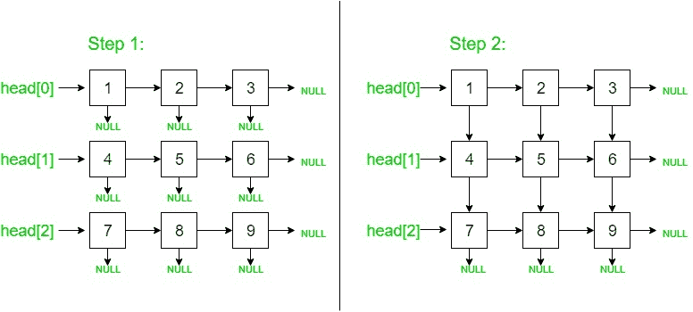

# 从 2D 矩阵构造一个链表（迭代方法）

给定一个矩阵，任务是构造一个链表列表矩阵，其中每个节点都连接到其右下节点。

**示例**：

```
Input: [1 2 3
         4 5 6
         7 8 9]

Output:
1 -> 2 -> 3 -> NULL
|    |    |
v    v    v
4 -> 5 -> 6 -> NULL
|    |    |
v    v    v
7 -> 8 -> 9 -> NULL
|    |    |
v    v    v
NULL NULL NULL

```

[帖子](https://www.geeksforgeeks.org/construct-linked-list-2d-matrix/)中已经讨论了针对此问题的递归解决方案。 下面是该问题的迭代方法：

*   这个想法是创建 m 个链表（m =行数），其每个节点都存储其右节点。 每个 m 个链接列表的头指针都存储在节点数组中。

*   然后，遍历 m 个列表，对于第（i + 1）个第<sup>个</sup>列表，将第 i 个<sup>第</sup>个列表的每个节点的向下指针设置为其（i + 1 ）<sup>列表。</sup>



下面是上述方法的实现：

## C++

```cpp

// C++ program to construct a linked 
// list from 2D matrix | Iterative Approach 
#include <bits/stdc++.h> 
using namespace std; 

// struct node of linked list 
struct node { 
    int data; 
    node *right, *down; 
}; 

// utility function to create a new node with given data 
node* newNode(int d) 
{ 
    node* temp = new node; 
    temp->data = d; 
    temp->right = temp->down = NULL; 
    return temp; 
} 

// utility function to print the linked list pointed to by head pointer 
void display(node* head) 
{ 
    node *rp, *dp = head; 

    // loop until the down pointer is not NULL 
    while (dp) { 
        rp = dp; 

        // loop until the right pointer is not NULL 
        while (rp) { 
            cout << rp->data << " "; 
            rp = rp->right; 
        } 
        cout << endl; 
        dp = dp->down; 
    } 
} 

// function which constructs the linked list 
// from the given matrix of size m * n 
// and returns the head pointer of the linked list 
node* constructLinkedMatrix(int mat[][3], int m, int n) 
{ 
    // stores the head of the linked list 
    node* mainhead = NULL; 

    // stores the head of linked lists of each row 
    node* head[m]; 
    node *righttemp, *newptr; 

    // Firstly, we create m linked lists 
    // by setting all the right nodes of every row 
    for (int i = 0; i < m; i++) { 

        // initially set the head of ith row as NULL 
        head[i] = NULL; 
        for (int j = 0; j < n; j++) { 
            newptr = newNode(mat[i][j]); 

            // stores the mat[0][0] node as 
            // the mainhead of the linked list 
            if (!mainhead) 
                mainhead = newptr; 

            if (!head[i]) 
                head[i] = newptr; 
            else
                righttemp->right = newptr; 

            righttemp = newptr; 
        } 
    } 

    // Then, for every ith and (i+1)th list, 
    // we set the down pointers of 
    // every node of ith list 
    // with its corresponding 
    // node of (i+1)th list 
    for (int i = 0; i < m - 1; i++) { 

        node *temp1 = head[i], *temp2 = head[i + 1]; 

        while (temp1 && temp2) { 

            temp1->down = temp2; 
            temp1 = temp1->right; 
            temp2 = temp2->right; 
        } 
    } 

    // return the mainhead pointer of the linked list 
    return mainhead; 
} 

// Driver program to test the above function 
int main() 
{ 
    int m, n; // m = rows and n = columns 
    m = 3, n = 3; 
    // 2D matrix 
    int mat[][3] = { { 1, 2, 3 }, 
                     { 4, 5, 6 }, 
                     { 7, 8, 9 } }; 

    node* head = constructLinkedMatrix(mat, m, n); 
    display(head); 

    return 0; 
} 

```

## Java

```java

// Java implementation for above approach 

// Construct a Linked List from 2-D Matrix 
class LinkedMatrix  
{ 
    class Node 
    { 
        int data; 
        Node right, down; 

        // Default Constructor 
        Node() 
        { 
            this.right = null; 
            this.down = null; 
        } 

        Node(int d) 
        { 
            this.data = d; 
            this.right = null; 
            this.down = null; 
        } 
    } 

    /*  
    A function to construct a Linked List  
    from the given matrix of size m * n 
    and returns the head pointer of the linked list 
    */
    Node constructLinkedMatrix(int[][] arr, 
                               int m, int n) 
    { 

        // stores the head of the linked list 
        Node mainHead = null; 

        // stores the head of linked lists  
        // of each row 
        Node[] head = new Node[m]; 
        Node rightTemp = new Node(), newptr; 

        // Firstly, we create m linked lists 
        // by setting all the right nodes of every row 
        for(int i = 0; i < m; i++) 
        { 

            // initially set the head of  
            // ith row as NULL 
            head[i] = null; 

            for(int j = 0; j < n; j++) 
            { 
                newptr = new Node(arr[i][j]); 

                // stores the mat[0][0] node as 
                // the mainhead of the linked list 
                if(mainHead == null) 
                    mainHead = newptr; 
                if(head[i] == null) 
                    head[i] = newptr; 
                else
                    rightTemp.right = newptr; 

                rightTemp = newptr; 
            } 
        } 

        // Then, for every ith and (i+1)th list, 
        // we set the down pointers of 
        // every node of ith list 
        // with its corresponding 
        // node of (i+1)th list 
        for(int i = 0; i < m - 1; i++) 
        { 
            Node temp1 = head[i], temp2 = head[i + 1]; 

            while(temp1 != null && temp2 != null) 
            { 
                temp1.down = temp2; 
                temp1 = temp1.right; 
                temp2 = temp2.right; 
            } 
        } 

        // return the mainhead pointer  
        // of the linked list 
        return mainHead; 
    } 

    // utility function to print the  
    // linked list pointed to by head pointer 
    void display(Node head) 
    { 
        Node rp, dp = head; 

        // loop until the down pointer  
        // is not NULL 
        while(dp != null) 
        { 
            rp = dp; 

            // loop until the right pointer 
            // is not NULL 
            while(rp != null) 
            { 
                System.out.print(rp.data + " "); 
                rp = rp.right; 
            } 
            System.out.println(); 
            dp = dp.down; 
        } 
    } 

    // Driver Code 
    public static void main(String[] args) 
    { 
        LinkedMatrix Obj = new LinkedMatrix(); 
        int m = 3, n = 3; // m = rows and n = columns 

        // 2-D Matrix 
        int[][] arr = {{ 1, 2, 3 },  
                       { 4, 5, 6 }, 
                       { 7, 8, 9 }}; 

        Node head = Obj.constructLinkedMatrix(arr, m, n); 
        Obj.display(head); 
    } 
} 

// This code is contributed by Rhythem 

```

## C#

```cs

// C# implementation for above approach 
using System; 

// Construct a Linked List from 2-D Matrix 
class GFG  
{ 
    class Node 
    { 
        public int data; 
        public Node right, down; 

        // Default Constructor 
        public Node() 
        { 
            this.right = null; 
            this.down = null; 
        } 

        public Node(int d) 
        { 
            this.data = d; 
            this.right = null; 
            this.down = null; 
        } 
    } 

    /*  
    A function to construct a Linked List  
    from the given matrix of size m * n 
    and returns the head pointer of the linked list 
    */
    Node constructLinkedMatrix(int[,] arr, 
                               int m, int n) 
    { 

        // stores the head of the linked list 
        Node mainHead = null; 

        // stores the head of linked lists  
        // of each row 
        Node[] head = new Node[m]; 
        Node rightTemp = new Node(), newptr; 

        // Firstly, we create m linked lists 
        // by setting all the right nodes of every row 
        for(int i = 0; i < m; i++) 
        { 

            // initially set the head of  
            // ith row as NULL 
            head[i] = null; 

            for(int j = 0; j < n; j++) 
            { 
                newptr = new Node(arr[i, j]); 

                // stores the mat[0][0] node as 
                // the mainhead of the linked list 
                if(mainHead == null) 
                    mainHead = newptr; 
                if(head[i] == null) 
                    head[i] = newptr; 
                else
                    rightTemp.right = newptr; 

                rightTemp = newptr; 
            } 
        } 

        // Then, for every ith and (i+1)th list, 
        // we set the down pointers of 
        // every node of ith list 
        // with its corresponding 
        // node of (i+1)th list 
        for(int i = 0; i < m - 1; i++) 
        { 
            Node temp1 = head[i], 
                 temp2 = head[i + 1]; 

            while(temp1 != null && temp2 != null) 
            { 
                temp1.down = temp2; 
                temp1 = temp1.right; 
                temp2 = temp2.right; 
            } 
        } 

        // return the mainhead pointer  
        // of the linked list 
        return mainHead; 
    } 

    // utility function to print the  
    // linked list pointed to by head pointer 
    void display(Node head) 
    { 
        Node rp, dp = head; 

        // loop until the down pointer  
        // is not NULL 
        while(dp != null) 
        { 
            rp = dp; 

            // loop until the right pointer 
            // is not NULL 
            while(rp != null) 
            { 
                Console.Write(rp.data + " "); 
                rp = rp.right; 
            } 
            Console.WriteLine(); 
            dp = dp.down; 
        } 
    } 

    // Driver Code 
    public static void Main(String[] args) 
    { 
        GFG Obj = new GFG(); 
        int m = 3, n = 3; // m = rows and n = columns 

        // 2-D Matrix 
        int[,] arr = {{ 1, 2, 3 },  
                      { 4, 5, 6 }, 
                      { 7, 8, 9 }}; 

        Node head = Obj.constructLinkedMatrix(arr, m, n); 
        Obj.display(head); 
    } 
} 

// This code is contributed by PrinciRaj1992 

```

**Output:**

```
1 2 3 
4 5 6 
7 8 9

```

**时间复杂度**：O（M * N）


* * *

* * *

如果您喜欢 GeeksforGeeks 并希望做出贡献，则还可以使用 [tribution.geeksforgeeks.org](https://contribute.geeksforgeeks.org/) 撰写文章，或将您的文章邮寄至 tribution@geeksforgeeks.org。 查看您的文章出现在 GeeksforGeeks 主页上，并帮助其他 Geeks。

如果您发现任何不正确的地方，请单击下面的“改进文章”按钮，以改进本文。