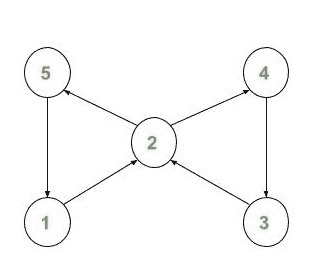

# 将无向图转换为有向欧拉电路

> 原文： [https://www.geeksforgeeks.org/conversion-of-an-undirected-graph-to-a-directed-euler-circuit/](https://www.geeksforgeeks.org/conversion-of-an-undirected-graph-to-a-directed-euler-circuit/)

给定具有`V`个节点（例如，从 1 到 V 编号）和`E`边的无向图，任务是检查该图是否为[欧拉图](https://www.geeksforgeeks.org/eulerian-path-and-circuit/)或 如果不是，则将其转换为定向欧拉电路。

> **有向欧拉电路**是有向图，这样，如果您开始从任何节点遍历该图并精确地穿过每个边，那么您将最终到达起始节点。

**注意**：在遍历欧拉电路时，每个边沿均精确遍历一次。 如果需要，可以多次遍历一个节点，但是不能多次遍历一条边。

**示例**：

> **输入**：
> [](https://media.geeksforgeeks.org/wp-content/uploads/20200504214719/in3.jpg) 
> **输出**：
> 1 2
> 2 5
> 5 1
> 2 4
> 4 3
> 3 2
> **说明**：
> 给定无向图的有向欧拉电路将为：
> [](https://media.geeksforgeeks.org/wp-content/uploads/20200504214717/out7.jpg)

**方法**：

1.  First, we need to make sure the [given Undirected Graph is Eulerian or not](https://www.geeksforgeeks.org/eulerian-path-and-circuit/). If the undirected graph is not Eulerian we cannot convert it to a Directed Eulerian Graph.
    *   要检查它，我们只需要计算每个节点的度数即可。 如果所有节点的**度**为**甚至**且不等于 0，则该图为欧拉式。
2.  We will be using [Depth First Search Traversal](https://www.geeksforgeeks.org/depth-first-search-or-dfs-for-a-graph/) to assign the directions.
    *   在遍历时，我们将设置从父对象到子对象的边的方向。 我们将维护一个地图，以确保仅对边进行一次遍历。

下面是上述算法的实现：

```

// C++ program to Convert an 
// Undirected Graph to a 
// Directed Euler Circuit 

#include <bits/stdc++.h> 
using namespace std; 

vector<int> g[100]; 

// Array to store degree 
// of nodes. 
int deg[100] = { 0 }; 

// Map to keep a track of 
// visited edges 
map<pair<int, int>, int> m1; 

// Vector to store the edge 
// pairs 
vector<pair<int, int> > v; 

// Function to add Edge 
void addEdge(int u, int v) 
{ 
    deg[u]++; 
    deg[v]++; 
    g[u].push_back(v); 
    g[v].push_back(u); 
} 

// Function to check if graph 
// is Eulerian or not 
bool CheckEulerian(int n) 
{ 
    int check = 0; 
    for (int i = 1; i <= n; i++) { 
        // Checking if odd degree 
        // or zero degree nodes 
        // are present 
        if (deg[i] % 2 || deg[i] == 0) { 
            check = 1; 
            break; 
        } 
    } 

    // If any degree is odd or 
    // any vertex has degree 0 
    if (check) { 
        return false; 
    } 
    return true; 
} 
// DFS Function to assign the direction 
void DirectedEuler(int node, 
                   vector<int> g[]) 
{ 
    for (auto i = g[node].begin(); 
         i != g[node].end(); i++) { 
        // Checking if edge is already 
        // visited 
        if (m1[make_pair(node, *i)] 
            || m1[make_pair(*i, node)]) 
            continue; 

        m1[make_pair(node, *i)]++; 

        // Storing the edge 
        v.push_back(make_pair(node, *i)); 
        DirectedEuler(*i, g); 
    } 
} 

// Function prints the convert 
// Directed graph 
void ConvertDirectedEuler(int n, 
                          int e) 
{ 
    if (!CheckEulerian(n)) { 
        cout << "NOT POSSIBLE"
             << endl; 
        return; 
    } 

    DirectedEuler(1, g); 

    // Printing directed edges 
    for (auto i = v.begin(); 
         i != v.end(); i++) { 
        cout << (*i).first 
             << " "
             << (*i).second 
             << endl; 
    } 
} 
// Driver code 
int main() 
{ 
    int N = 5; 
    int E = 6; 
    addEdge(1, 2); 
    addEdge(1, 5); 
    addEdge(5, 2); 
    addEdge(2, 4); 
    addEdge(2, 3); 
    addEdge(4, 3); 

    ConvertDirectedEuler(N, E); 
} 

```

**Output:**

```
1 2
2 5
5 1
2 4
4 3
3 2

```

***时间复杂度**：O（（V + E）* log（E））
**空间复杂度**：O（max（V，E））*


* * *

* * *

如果您喜欢 GeeksforGeeks 并希望做出贡献，则还可以使用 [tribution.geeksforgeeks.org](https://contribute.geeksforgeeks.org/) 撰写文章，或将您的文章邮寄至 tribution@geeksforgeeks.org。 查看您的文章出现在 GeeksforGeeks 主页上，并帮助其他 Geeks。

如果您发现任何不正确的地方，请单击下面的“改进文章”按钮，以改进本文。