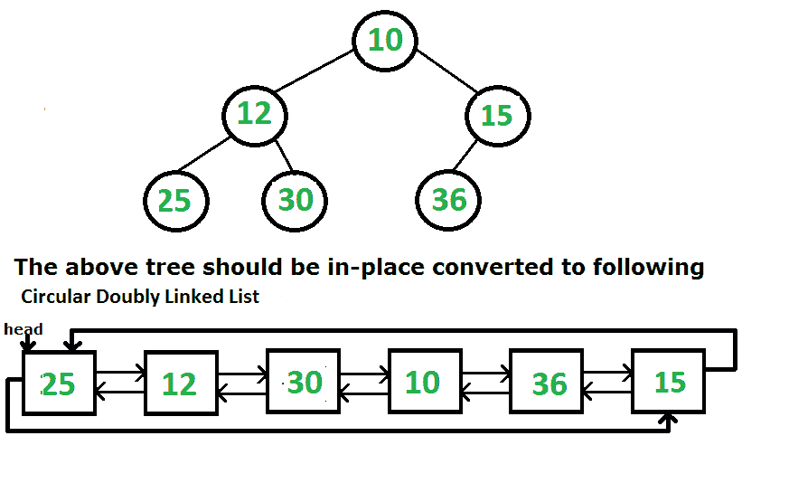

# 将二叉树转换为圆形双链表

给定二叉树，将其转换为循环双链表（就地）。

*   节点中的左指针和右指针将分别用作转换后的循环链表中的上一个指针和下一个指针。
*   List中节点的顺序必须与给定二叉树的顺序相同。
*   有序遍历的第一个节点必须是循环列表的头节点。

**示例：**
[](https://media.geeksforgeeks.org/wp-content/cdn-uploads/tree-to-list.png)

可以使用以下步骤描述该想法。
1）编写一个通用函数，该函数将两个给定的循环双链表连接起来（此函数在下面说明）。
2）现在遍历给定的树
….a）将左子树递归转换为循环DLL。 让转换后的列表为leftList。
….a）将右子树递归转换为循环DLL。 让转换后的列表为rightList。
….c）制作树根的圆形链表，使树的左右两边指向其自身。
….d）将leftList与单个根节点的列表连接在一起。
….e）将步骤（d）中生成的列表与rightList连接起来。

请注意，以上代码以Postorder方式遍历树。 我们也可以有序地遍历。 我们可以先连接左子树和根，然后递归右子树，然后将结果与左根连接。

**如何串联两个循环DLL？**

*   获取左侧列表的最后一个节点。 检索最后一个节点是O（1）操作，因为头部的prev指针指向列表的最后一个节点。
*   将其与右侧列表的第一个节点连接
*   获取第二个列表的最后一个节点
*   将其与列表的开头连接。

以下是上述想法的实现。

## C ++

```

// C++ Program to convert a Binary Tree 
// to a Circular Doubly Linked List 
#include<iostream> 
using namespace std; 

// To represents a node of a Binary Tree 
struct Node 
{ 
    struct Node *left, *right; 
    int data; 
}; 

// A function that appends rightList at the end 
// of leftList. 
Node *concatenate(Node *leftList, Node *rightList) 
{ 
    // If either of the list is empty 
    // then return the other list 
    if (leftList == NULL) 
        return rightList; 
    if (rightList == NULL) 
        return leftList; 

    // Store the last Node of left List 
    Node *leftLast = leftList->left; 

    // Store the last Node of right List 
    Node *rightLast = rightList->left; 

    // Connect the last node of Left List 
    // with the first Node of the right List 
    leftLast->right = rightList; 
    rightList->left = leftLast; 

    // Left of first node points to 
    // the last node in the list 
    leftList->left = rightLast; 

    // Right of last node refers to the first 
    // node of the List 
    rightLast->right = leftList; 

    return leftList; 
} 

// Function converts a tree to a circular Linked List 
// and then returns the head of the Linked List 
Node *bTreeToCList(Node *root) 
{ 
    if (root == NULL) 
        return NULL; 

    // Recursively convert left and right subtrees 
    Node *left = bTreeToCList(root->left); 
    Node *right = bTreeToCList(root->right); 

    // Make a circular linked list of single node 
    // (or root). To do so, make the right and 
    // left pointers of this node point to itself 
    root->left = root->right = root; 

    // Step 1 (concatenate the left list with the list  
    //         with single node, i.e., current node) 
    // Step 2 (concatenate the returned list with the 
    //         right List) 
    return concatenate(concatenate(left, root), right); 
} 

// Display Circular Link List 
void displayCList(Node *head) 
{ 
    cout << "Circular Linked List is :\n"; 
    Node *itr = head; 
    do
    { 
        cout << itr->data <<" "; 
        itr = itr->right; 
    } while (head!=itr); 
    cout << "\n"; 
} 

// Create a new Node and return its address 
Node *newNode(int data) 
{ 
    Node *temp = new Node(); 
    temp->data = data; 
    temp->left = temp->right = NULL; 
    return temp; 
} 

// Driver Program to test above function 
int main() 
{ 
    Node *root = newNode(10); 
    root->left = newNode(12); 
    root->right = newNode(15); 
    root->left->left = newNode(25); 
    root->left->right = newNode(30); 
    root->right->left = newNode(36); 

    Node *head = bTreeToCList(root); 
    displayCList(head); 

    return 0; 
} 

```

## 爪哇

```

// Java Program to convert a Binary Tree to a 
// Circular Doubly Linked List 

// Node class represents a Node of a Tree 
class Node 
{ 
    int val; 
    Node left,right; 

    public Node(int val) 
    { 
        this.val = val; 
        left = right = null; 
    } 
} 

// A class to represent a tree 
class Tree 
{ 
    Node root; 
    public Tree() 
    { 
        root = null; 
    } 

    // concatenate both the lists and returns the head 
    // of the List 
    public Node concatenate(Node leftList,Node rightList) 
    { 
        // If either of the list is empty, then 
        // return the other list 
        if (leftList == null) 
            return rightList; 
        if (rightList == null) 
            return leftList; 

        // Store the last Node of left List 
        Node leftLast = leftList.left; 

        // Store the last Node of right List 
        Node rightLast = rightList.left; 

        // Connect the last node of Left List 
        // with the first Node of the right List 
        leftLast.right = rightList; 
        rightList.left = leftLast; 

        // left of first node refers to 
        // the last node in the list 
        leftList.left = rightLast; 

        // Right of last node refers to the first 
        // node of the List 
        rightLast.right = leftList; 

        // Return the Head of the List 
        return leftList; 
    } 

    // Method converts a tree to a circular 
    // Link List and then returns the head 
    // of the Link List 
    public Node bTreeToCList(Node root) 
    { 
        if (root == null) 
            return null; 

        // Recursively convert left and right subtrees 
        Node left = bTreeToCList(root.left); 
        Node right = bTreeToCList(root.right); 

        // Make a circular linked list of single node 
        // (or root). To do so, make the right and 
        // left pointers of this node point to itself 
        root.left = root.right = root; 

        // Step 1 (concatenate the left list with the list  
        //         with single node, i.e., current node) 
        // Step 2 (concatenate the returned list with the 
        //         right List) 
        return concatenate(concatenate(left, root), right); 
    } 

    // Display Circular Link List 
    public void display(Node head) 
    { 
        System.out.println("Circular Linked List is :"); 
        Node itr = head; 
        do
        { 
            System.out.print(itr.val+ " " ); 
            itr = itr.right; 
        } 
        while (itr != head); 
        System.out.println(); 
    } 
} 

// Driver Code 
class Main 
{ 
    public static void main(String args[]) 
    { 
        // Build the tree 
        Tree tree = new Tree(); 
        tree.root = new Node(10); 
        tree.root.left = new Node(12); 
        tree.root.right = new Node(15); 
        tree.root.left.left = new Node(25); 
        tree.root.left.right = new Node(30); 
        tree.root.right.left = new Node(36); 

        // head refers to the head of the Link List 
        Node head = tree.bTreeToCList(tree.root); 

        // Display the Circular LinkedList 
        tree.display(head); 
    } 
} 

```

## Python3

```

# Python3 Program to convert a Binary  
# Tree to a Circular Doubly Linked List  

class newNode: 
    def __init__(self, data): 
        self.data = data 
        self.left = self.right = None

# A function that appends rightList  
# at the end of leftList.  
def concatenate(leftList, rightList): 

    # If either of the list is empty  
    # then return the other list  
    if (leftList == None): 
        return rightList  
    if (rightList == None):  
        return leftList  

    # Store the last Node of left List  
    leftLast = leftList.left  

    # Store the last Node of right List  
    rightLast = rightList.left  

    # Connect the last node of Left List  
    # with the first Node of the right List  
    leftLast.right = rightList  
    rightList.left = leftLast  

    # Left of first node points to  
    # the last node in the list  
    leftList.left = rightLast  

    # Right of last node refers to  
    # the first node of the List  
    rightLast.right = leftList  

    return leftList 

# Function converts a tree to a circular  
# Linked List and then returns the head  
# of the Linked List  
def bTreeToCList(root): 
    if (root == None):  
        return None

    # Recursively convert left and  
    # right subtrees  
    left = bTreeToCList(root.left)  
    right = bTreeToCList(root.right)  

    # Make a circular linked list of single  
    # node (or root). To do so, make the  
    # right and left pointers of this node 
    # point to itself  
    root.left = root.right = root  

    # Step 1 (concatenate the left list  
    #          with the list with single  
    #         node, i.e., current node)  
    # Step 2 (concatenate the returned list 
    #          with the right List)  
    return concatenate(concatenate(left,  
                            root), right) 

# Display Circular Link List  
def displayCList(head): 
    print("Circular Linked List is :")  
    itr = head 
    first = 1
    while (head != itr or first): 
        print(itr.data, end = " ")  
        itr = itr.right 
        first = 0
    print() 

# Driver Code 
if __name__ == '__main__': 
    root = newNode(10)  
    root.left = newNode(12)  
    root.right = newNode(15)  
    root.left.left = newNode(25)  
    root.left.right = newNode(30)  
    root.right.left = newNode(36)  

    head = bTreeToCList(root)  
    displayCList(head)  

# This code is contributed by PranchalK 

```

## C＃

```

// C# Program to convert a Binary Tree  
// to a Circular Doubly Linked List  
using System; 

// Node class represents a Node of a Tree  
public class Node 
{ 
    public int val; 
    public Node left, right; 

    public Node(int val) 
    { 
        this.val = val; 
        left = right = null; 
    } 
} 

// A class to represent a tree  
public class Tree 
{ 
    internal Node root; 
    public Tree() 
    { 
        root = null; 
    } 

    // concatenate both the lists  
    // and returns the head of the List  
    public virtual Node concatenate(Node leftList,  
                                    Node rightList) 
    { 
        // If either of the list is empty,  
        // then return the other list  
        if (leftList == null) 
        { 
            return rightList; 
        } 
        if (rightList == null) 
        { 
            return leftList; 
        } 

        // Store the last Node of left List  
        Node leftLast = leftList.left; 

        // Store the last Node of right List  
        Node rightLast = rightList.left; 

        // Connect the last node of Left List  
        // with the first Node of the right List  
        leftLast.right = rightList; 
        rightList.left = leftLast; 

        // left of first node refers to  
        // the last node in the list  
        leftList.left = rightLast; 

        // Right of last node refers to  
        // the first node of the List  
        rightLast.right = leftList; 

        // Return the Head of the List  
        return leftList; 
    } 

    // Method converts a tree to a circular  
    // Link List and then returns the head  
    // of the Link List  
    public virtual Node bTreeToCList(Node root) 
    { 
        if (root == null) 
        { 
            return null; 
        } 

        // Recursively convert left  
        // and right subtrees  
        Node left = bTreeToCList(root.left); 
        Node right = bTreeToCList(root.right); 

        // Make a circular linked list of single  
        // node (or root). To do so, make the  
        // right and left pointers of this node  
        // point to itself  
        root.left = root.right = root; 

        // Step 1 (concatenate the left list with 
        //          the list with single node, 
        //        i.e., current node)  
        // Step 2 (concatenate the returned list  
        //           with the right List)  
        return concatenate(concatenate(left, root), right); 
    } 

    // Display Circular Link List  
    public virtual void display(Node head) 
    { 
        Console.WriteLine("Circular Linked List is :"); 
        Node itr = head; 
        do
        { 
            Console.Write(itr.val + " "); 
            itr = itr.right; 
        } while (itr != head); 
        Console.WriteLine(); 
    } 
} 

// Driver Code  
public class GFG 
{ 
    public static void Main(string[] args) 
    { 
        // Build the tree  
        Tree tree = new Tree(); 
        tree.root = new Node(10); 
        tree.root.left = new Node(12); 
        tree.root.right = new Node(15); 
        tree.root.left.left = new Node(25); 
        tree.root.left.right = new Node(30); 
        tree.root.right.left = new Node(36); 

        // head refers to the head of the Link List  
        Node head = tree.bTreeToCList(tree.root); 

        // Display the Circular LinkedList  
        tree.display(head); 
    } 
} 

// This code is contributed by Shrikant13 

```

**Output:**

```
Circular Linked List is :
25 12 30 10 36 15

```

本文由 **Chirag Agarwal** 提供。 如果您喜欢GeeksforGeeks并希望做出贡献，则还可以使用 [tribution.geeksforgeeks.org](http://www.contribute.geeksforgeeks.org) 撰写文章，或将您的文章邮寄至tribution@geeksforgeeks.org。 查看您的文章出现在GeeksforGeeks主页上，并帮助其他Geeks。

如果发现任何不正确的地方，或者您想分享有关上述主题的更多信息，请发表评论。

注意读者！ 现在不要停止学习。 通过 [**DSA自学课程**](https://practice.geeksforgeeks.org/courses/dsa-self-paced?utm_source=geeksforgeeks&utm_medium=article&utm_campaign=gfg_article_dsa_content_bottom) 以对学生方便的价格掌握所有重要的DSA概念，并为行业做好准备。