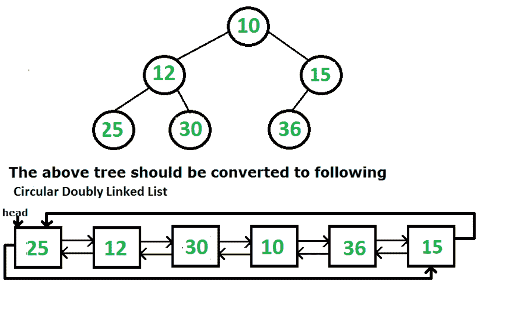

# 将给定的二叉树转换为循环双链表 | 系列 2

给定二叉树，将其转换为循环双链表。

*   节点中的左指针和右指针将分别用作转换后的循环链表中的上一个指针和下一个指针。

*   List 中节点的顺序必须与给定二叉树的顺序相同。

*   有序遍历的第一个节点必须是循环列表的头节点。

**示例**：



在[先前的文章中讨论了针对此问题的就地解决方案。](https://www.geeksforgeeks.org/convert-a-binary-tree-to-a-circular-doubly-link-list/)

在这篇文章中，讨论了一个更简单的解决方案，但使用了额外的`O(n)`空间。

在这种方法中，首先，我们将对给定的二叉树进行有序遍历，并将此遍历存储在向量中，并将其与树一起传递给函数。 现在，从向量的元素生成一个循环的双向链表。

要从向量生成一个循环的双向链表，请将向量的第一个元素作为链表的头部，并创建一个当前指针，该指针现在指向头部。 现在，从第二个元素开始遍历数组，然后执行以下操作。

1.  创建一个指向当前指针的临时指针。

2.  使用向量的当前元素创建一个新节点。

3.  在当前位置正确指向该新节点。

4.  使当前指针等于当前的右指针。

5.  现在，最后使当前对象的左指针指向第一步中创建的临时指针。

对所有元素执行此操作，并在完成遍历后，使 current 的向右（current 现在指向向量的最后一个元素）指向列表的开头，并使 head 的左侧指向当前指针。 最后，返回头部。

下面是上述方法的实现：

## C++

```cpp

// A C++ program for conversion 
// of Binary Tree to CDLL 

#include <bits/stdc++.h> 
using namespace std; 

// A binary tree node has data, 
// and left and right pointers 
struct Node { 
    int data; 
    struct Node* left; 
    struct Node* right; 

    Node(int x) 
    { 
        data = x; 
        left = right = NULL; 
    } 
}; 

// Function to perform In-Order traversal of the 
// tree and store the nodes in a vector 
void inorder(Node* root, vector<int>& v) 
{ 
    if (!root) 
        return; 

    /* first recur on left child */
    inorder(root->left, v); 

    /* append the data of node in vector */
    v.push_back(root->data); 

    /* now recur on right child */
    inorder(root->right, v); 
} 

// Function to convert Binary Tree to Circular 
// Doubly Linked list using the vector which stores 
// In-Order traversal of the Binary Tree 
Node* bTreeToCList(Node* root) 
{ 
    // Base cases 
    if (root == NULL) 
        return NULL; 

    // Vector to be used for storing the nodes 
    // of tree in In-order form 
    vector<int> v; 

    // Calling the In-Order traversal function 
    inorder(root, v); 

    // Create the head of the linked list pointing 
    // to the root of the tree 
    Node* head_ref = new Node(v[0]); 

    // Create a current pointer to be used in traversal 
    Node* curr = head_ref; 

    // Traversing the nodes of the tree starting 
    // from the second elements 
    for (int i = 1; i < v.size(); i++) { 

        // Create a temporary pointer 
        // pointing to current 
        Node* temp = curr; 

        // Current's right points to the current 
        // node in traversal 
        curr->right = new Node(v[i]); 

        // Current points to its right 
        curr = curr->right; 

        // Current's left points to temp 
        curr->left = temp; 
    } 

    // Current's right points to head of the list 
    curr->right = head_ref; 

    // Head's left points to current 
    head_ref->left = curr; 

    // Return head of the list 
    return head_ref; 
} 

// Display Circular Link List 
void displayCList(Node* head) 
{ 
    cout << "Circular Doubly Linked List is :\n"; 

    Node* itr = head; 
    do { 
        cout << itr->data << " "; 
        itr = itr->right; 
    } while (head != itr); 

    cout << "\n"; 
} 

// Driver Code 
int main() 
{ 
    Node* root = new Node(10); 
    root->left = new Node(12); 
    root->right = new Node(15); 
    root->left->left = new Node(25); 
    root->left->right = new Node(30); 
    root->right->left = new Node(36); 

    Node* head = bTreeToCList(root); 
    displayCList(head); 

    return 0; 
} 

```

## Java

```java

// Java program for conversion 
// of Binary Tree to CDLL 
import java.util.*; 
class GFG  
{ 

// A binary tree node has data, 
// and left and right pointers 
static class Node 
{   
    int data; 
    Node left; 
    Node right; 

    Node(int x) 
    { 
        data = x; 
        left = right = null; 
    } 
}; 

// Function to perform In-Order traversal of the 
// tree and store the nodes in a vector 
static void inorder(Node root, Vector<Integer> v) 
{ 
    if (root == null) 
        return; 

    /* first recur on left child */
    inorder(root.left, v); 

    /* append the data of node in vector */
    v.add(root.data); 

    /* now recur on right child */
    inorder(root.right, v); 
} 

// Function to convert Binary Tree to Circular 
// Doubly Linked list using the vector which stores 
// In-Order traversal of the Binary Tree 
static Node bTreeToCList(Node root) 
{ 
    // Base cases 
    if (root == null) 
        return null; 

    // Vector to be used for storing the nodes 
    // of tree in In-order form 
    Vector<Integer> v = new Vector<>(); 

    // Calling the In-Order traversal function 
    inorder(root, v); 

    // Create the head of the linked list pointing 
    // to the root of the tree 
    Node head_ref = new Node(v.get(0)); 

    // Create a current pointer to be used in traversal 
    Node curr = head_ref; 

    // Traversing the nodes of the tree starting 
    // from the second elements 
    for (int i = 1; i < v.size(); i++)  
    { 

        // Create a temporary pointer 
        // pointing to current 
        Node temp = curr; 

        // Current's right points to the current 
        // node in traversal 
        curr.right = new Node(v.get(i)); 

        // Current points to its right 
        curr = curr.right; 

        // Current's left points to temp 
        curr.left = temp; 
    } 

    // Current's right points to head of the list 
    curr.right = head_ref; 

    // Head's left points to current 
    head_ref.left = curr; 

    // Return head of the list 
    return head_ref; 
} 

// Display Circular Link List 
static void displayCList(Node head) 
{ 
    System.out.println("Circular Doubly Linked List is :"); 

    Node itr = head; 
    do 
    { 
        System.out.print(itr.data + " "); 
        itr = itr.right; 
    } while (head != itr); 

    System.out.println(); 
} 

// Driver Code 
public static void main(String[] args) 
{ 
    Node root = new Node(10); 
    root.left = new Node(12); 
    root.right = new Node(15); 
    root.left.left = new Node(25); 
    root.left.right = new Node(30); 
    root.right.left = new Node(36); 

    Node head = bTreeToCList(root); 
    displayCList(head); 
} 
} 

// This code is contributed by Rajput-Ji 

```

## Python

```py

# Python program for conversion 
# of Binary Tree to CDLL 

# A binary tree node has data, 
# and left and right pointers 
class Node:  
    def __init__(self, data):  
        self.data = data  
        self.left = self.right = None

v = [] 

# Function to perform In-Order traversal of the 
# tree and store the nodes in a vector 
def inorder(root): 
    global v 

    if (root == None): 
        return

    # first recur on left child  
    inorder(root.left) 

    # append the data of node in vector  
    v.append(root.data) 

    # now recur on right child  
    inorder(root.right) 

# Function to convert Binary Tree to Circular 
# Doubly Linked list using the vector which stores 
# In-Order traversal of the Binary Tree 
def bTreeToCList(root): 

    global v 

    # Base cases 
    if (root == None): 
        return None

    # Vector to be used for storing the nodes 
    # of tree in In-order form 
    v = [] 

    # Calling the In-Order traversal function 
    inorder(root) 

    # Create the head of the linked list pointing 
    # to the root of the tree 
    head_ref = Node(v[0]) 

    # Create a current pointer to be used in traversal 
    curr = head_ref 

    i = 1

    # Traversing the nodes of the tree starting 
    # from the second elements 
    while ( i < len(v)) : 

        # Create a temporary pointer 
        # pointing to current 
        temp = curr 

        # Current's right points to the current 
        # node in traversal 
        curr.right = Node(v[i]) 

        # Current points to its right 
        curr = curr.right 

        # Current's left points to temp 
        curr.left = temp 
        i = i + 1

    # Current's right points to head of the list 
    curr.right = head_ref 

    # Head's left points to current 
    head_ref.left = curr 

    # Return head of the list 
    return head_ref 

# Display Circular Link List 
def displayCList(head): 

    print("Circular Doubly Linked List is :", end = "") 

    itr = head 
    while(True): 
        print(itr.data, end = " ") 
        itr = itr.right 
        if(head == itr): 
            break

    print() 

# Driver Code 
root = Node(10) 
root.left = Node(12) 
root.right = Node(15) 
root.left.left = Node(25) 
root.left.right = Node(30) 
root.right.left = Node(36) 

head = bTreeToCList(root) 
displayCList(head) 

# This code is contributed by Arnab Kundu 

```

## C#

```cs

// C# program for conversion 
// of Binary Tree to CDLL 
using System; 
using System.Collections.Generic; 

class GFG  
{ 

// A binary tree node has data, 
// and left and right pointers 
public class Node 
{  
    public int data; 
    public Node left; 
    public Node right; 

    public Node(int x) 
    { 
        data = x; 
        left = right = null; 
    } 
}; 

// Function to perform In-Order traversal of the 
// tree and store the nodes in a vector 
static void inorder(Node root, List<int> v) 
{ 
    if (root == null) 
        return; 

    /* first recur on left child */
    inorder(root.left, v); 

    /* append the data of node in vector */
    v.Add(root.data); 

    /* now recur on right child */
    inorder(root.right, v); 
} 

// Function to convert Binary Tree to Circular 
// Doubly Linked list using the vector which stores 
// In-Order traversal of the Binary Tree 
static Node bTreeToCList(Node root) 
{ 
    // Base cases 
    if (root == null) 
        return null; 

    // Vector to be used for storing the nodes 
    // of tree in In-order form 
    List<int> v = new List<int>(); 

    // Calling the In-Order traversal function 
    inorder(root, v); 

    // Create the head of the linked list  
    // pointing to the root of the tree 
    Node head_ref = new Node(v[0]); 

    // Create a current pointer  
    // to be used in traversal 
    Node curr = head_ref; 

    // Traversing the nodes of the tree starting 
    // from the second elements 
    for (int i = 1; i < v.Count; i++)  
    { 

        // Create a temporary pointer 
        // pointing to current 
        Node temp = curr; 

        // Current's right points to the current 
        // node in traversal 
        curr.right = new Node(v[i]); 

        // Current points to its right 
        curr = curr.right; 

        // Current's left points to temp 
        curr.left = temp; 
    } 

    // Current's right points to head of the list 
    curr.right = head_ref; 

    // Head's left points to current 
    head_ref.left = curr; 

    // Return head of the list 
    return head_ref; 
} 

// Display Circular Link List 
static void displayCList(Node head) 
{ 
    Console.WriteLine("Circular Doubly " + 
                      "Linked List is :"); 

    Node itr = head; 
    do
    { 
        Console.Write(itr.data + " "); 
        itr = itr.right; 
    } while (head != itr); 

    Console.WriteLine(); 
} 

// Driver Code 
public static void Main(String[] args) 
{ 
    Node root = new Node(10); 
    root.left = new Node(12); 
    root.right = new Node(15); 
    root.left.left = new Node(25); 
    root.left.right = new Node(30); 
    root.right.left = new Node(36); 

    Node head = bTreeToCList(root); 
    displayCList(head); 
} 
} 

// This code is contributed by 29AjayKumar 

```

**Output:**

```
Circular Doubly Linked List is :
25 12 30 10 36 15

```

**时间复杂度**：`O(n)`，其中 N 是二叉树中的节点数。

**辅助空间**：`O(n)`


* * *

* * *

如果您喜欢 GeeksforGeeks 并希望做出贡献，则还可以使用 [tribution.geeksforgeeks.org](https://contribute.geeksforgeeks.org/) 撰写文章，或将您的文章邮寄至 tribution@geeksforgeeks.org。 查看您的文章出现在 GeeksforGeeks 主页上，并帮助其他 Geeks。

如果您发现任何不正确的地方，请单击下面的“改进文章”按钮，以改进本文。