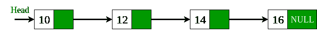

# 将单链接列表转换为循环链接列表

给定一个单链表，我们必须将其转换为循环链表。 例如，我们给了一个包含四个节点的单链表，我们想将此单链表转换为循环链表。


上面的单链接列表被转换为循环链接列表。


**方法：**想法是遍历单链列表并检查该节点是否为最后一个节点。 如果该节点是最后一个节点，即指向NULL，则使其指向起始节点，即头节点。 下面是此方法的实现。

## C++

```cpp

// Program for converting singly linked list 
// into circular linked list. 
#include <bits/stdc++.h> 

/* Linked list node */
struct Node { 
    int data; 
    struct Node* next; 
}; 

// Function that convert singly linked list 
// into circular linked list. 
struct Node* circular(struct Node* head) 
{ 
    // declare a node variable start and  
    // assign head node into start node. 
    struct Node* start = head; 

    // check that while head->next not equal 
    // to NULL then head points to next node. 
    while (head->next != NULL) 
        head = head->next; 

    // if head->next points to NULL then  
    // start assign to the head->next node. 
    head->next = start; 
    return start; 
} 

void push(struct Node** head, int data) 
{ 
    // Allocate dynamic memory for newNode. 
    struct Node* newNode = (struct Node*)malloc
                          (sizeof(struct Node)); 

    // Assign the data into newNode. 
    newNode->data = data; 

    // newNode->next assign the address of  
    // head node. 
    newNode->next = (*head); 

    // newNode become the headNode. 
    (*head) = newNode; 
} 

// Function that display the elements of 
// circular linked list. 
void displayList(struct Node* node) 
{ 
    struct Node* start = node; 

    while (node->next != start) { 
        printf("%d ", node->data); 
        node = node->next; 
    } 

    // Display the last node of circular  
    // linked list. 
    printf("%d ", node->data); 
} 

// Driver program to test the functions 
int main() 
{ 
    // Start with empty list 
    struct Node* head = NULL; 

    // Using push() function to construct 
    // singly linked list 
    // 17->22->13->14->15 
    push(&head, 15); 
    push(&head, 14); 
    push(&head, 13); 
    push(&head, 22); 
    push(&head, 17); 

    // Call the circular_list function that  
    // convert singly linked list to circular 
    // linked list. 
    circular(head); 

    printf("Display list: \n"); 
    displayList(head); 

    return 0; 
} 

```

## Java

```java

// Program for converting  
// singly linked list into 
// circular linked list. 
class GFG 
{ 

/*Linked list node */
static class Node  
{ 
    int data; 
    Node next; 
}; 

// Function that convert  
// singly linked list into 
// circular linked list. 
static Node circular(Node head) 
{ 
    // declare a node variable  
    // start and assign head  
    // node into start node. 
    Node start = head; 

    // check that while head.next 
    // not equal to null then head  
    // points to next node. 
    while (head.next != null) 
        head = head.next; 

    // if head.next points to null  
    // then start assign to the  
    // head.next node. 
    head.next = start; 
    return start; 
} 

static Node push(Node head, int data) 
{ 
    // Allocate dynamic memory  
    // for newNode. 
    Node newNode = new Node(); 

    // Assign the data into newNode. 
    newNode.data = data; 

    // newNode.next assign the  
    // address of head node. 
    newNode.next = (head); 

    // newNode become the headNode. 
    (head) = newNode; 

    return head; 
} 

// Function that display the elements  
// of circular linked list. 
static void displayList( Node node) 
{ 
    Node start = node; 

    while (node.next != start) 
    { 
        System.out.print(" "+ node.data); 
        node = node.next; 
    } 

    // Display the last node of   
    // circular linked list. 
    System.out.print(" " + node.data); 
} 

// Driver Code 
public static void main(String args[]) 
{ 
    // Start with empty list 
    Node head = null; 

    // Using push() function to  
    // convert singly linked list 
    // 17.22.13.14.15 
    head = push(head, 15); 
    head = push(head, 14); 
    head = push(head, 13); 
    head = push(head, 22); 
    head = push(head, 17); 

    // Call the circular_list function  
    // that converst singly linked  
    // list to circular linked list. 
    circular(head); 

    System.out.print("Display list: \n"); 
    displayList(head); 
} 
} 

// This code is contributed  
// by Arnab Kundu 

```

## Python3

```py

# Python3 program for converting  
# singly linked list into  
# circular linked list.  
import sys 

# Linked list node  
class Node: 
    def __init__(self,data): 
        self.data = data 
        self.next = None

def push(head, data): 
    if not head: 
        return Node(data) 

    # Allocate dynamic memory  
    # for newNode.  
    # Assign the data into newNode.  
    newNode = Node(data) 

    # newNode.next assign the  
    # address of head node.  
    newNode.next = head 

    # newNode become the headNode.  
    head = newNode 
    return head 

# Function that convert  
# singly linked list into  
# circular linked list.  
def circular(head): 

    # declare a node variable  
    # start and assign head  
    # node into start node.  
    start = head 

    # check that while head.next  
    # not equal to null then head  
    # points to next node.  
    while(head.next is not None): 
        head = head.next

    # if head.next points to null  
    # then start assign to the  
    # head.next node.      
    head.next = start 
    return start 

# Function that display the elements  
# of circular linked list.  
def displayList(node): 
    start = node 
    while(node.next is not start): 
        print("{} ".format(node.data),end="") 
        node=node.next

    # Display the last node of  
    # circular linked list.  
    print("{} ".format(node.data),end="") 

# Driver Code 
if __name__=='__main__': 

    # Start with empty list  
    head=None

    # Using push() function to  
    # convert singly linked list  
    # 17.22.13.14.15  
    head=push(head,15) 
    head=push(head,14) 
    head=push(head,13) 
    head=push(head,22) 
    head=push(head,17) 

    # Call the circular_list function  
    # that converst singly linked  
    # list to circular linked list.  
    circular(head) 
    print("Display List:") 
    displayList(head) 

# This Code is Contributed By Vikash Kumar 37 

```

## C#

```cs

// C# Program for converting  
// singly linked list into  
// circular linked list.  
using System; 

class GFG  
{  

    /*Linked list node */
    public class Node  
    {  
        public int data;  
        public Node next;  
    };  

    // Function that convert  
    // singly linked list into  
    // circular linked list.  
    static Node circular(Node head)  
    {  
        // declare a node variable  
        // start and assign head  
        // node into start node.  
        Node start = head;  

        // check that while head.next  
        // not equal to null then head  
        // points to next node.  
        while (head.next != null)  
            head = head.next;  

        // if head.next points to null  
        // then start assign to the  
        // head.next node.  
        head.next = start;  
        return start;  
    }  

    static Node push(Node head, int data)  
    {  
        // Allocate dynamic memory  
        // for newNode.  
        Node newNode = new Node();  

        // Assign the data into newNode.  
        newNode.data = data;  

        // newNode.next assign the  
        // address of head node.  
        newNode.next = (head);  

        // newNode become the headNode.  
        (head) = newNode;  

        return head;  
    }  

    // Function that display the elements  
    // of circular linked list.  
    static void displayList( Node node)  
    {  
        Node start = node;  

        while (node.next != start)  
        {  
            Console.Write(" " + node.data);  
            node = node.next;  
        }  

        // Display the last node of  
        // circular linked list.  
        Console.Write(" " + node.data);  
    }  

    // Driver Code  
    public static void Main(String []args)  
    {  
        // Start with empty list  
        Node head = null;  

        // Using push() function to  
        // convert singly linked list  
        // 17.22.13.14.15  
        head = push(head, 15);  
        head = push(head, 14);  
        head = push(head, 13);  
        head = push(head, 22);  
        head = push(head, 17);  

        // Call the circular_list function  
        // that converst singly linked  
        // list to circular linked list.  
        circular(head);  

        Console.Write("Display list: \n");  
        displayList(head);  
    }  
}  

// This code is contributed 29AjayKumar 

```

**Output:**

```
Display list:
17 22 13 14 15

```

本文由 **Dharmendra kumar** 提供。 如果您喜欢GeeksforGeeks并希望做出贡献，则还可以使用 [tribution.geeksforgeeks.org](http://www.contribute.geeksforgeeks.org) 撰写文章，或将您的文章邮寄至tribution@geeksforgeeks.org。 查看您的文章出现在GeeksforGeeks主页上，并帮助其他Geeks。

如果发现任何不正确的地方，或者您想分享有关上述主题的更多信息，请发表评论。

