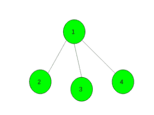
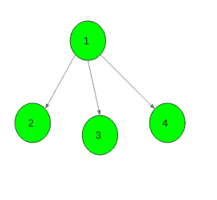

# 将无向图转换为有向图，以使路径长度不超过 1

> 原文： [https://www.geeksforgeeks.org/convert-the-undirected-graph-into-directed-graph-such-that-there-is-no-path-of-length-greater-than-1/](https://www.geeksforgeeks.org/convert-the-undirected-graph-into-directed-graph-such-that-there-is-no-path-of-length-greater-than-1/)

给定具有`N`个顶点和`M`边且没有自环或多个边的无向图。 任务是将给定的无向图转换为有向图，以使路径的长度不超过 1。如果可以制作这样的图，则在 **M 中打印两个以空格分隔的整数 u 和 v [** 线，其中 u，v 分别表示源顶点和目标顶点。 如果不可能，则打印-1。

**示例**：

> **输入**：
> 
> **输出**：
> 1 2
> 1 3
> 1 4
> 
> 
> **输入**：
> 
> **输出**：-1
> 对于给定的图形，不可能获得有向图
> ，使得存在 长度不超过 1 的路径

**方法**：假设图形包含奇数长度的循环。 这意味着此循环的某些两个连续边将以相同的方式定向，并将形成长度为 2 的路径。 那么答案是-1。

并且如果该图不包含奇数长度的循环。 然后是[二分](https://www.geeksforgeeks.org/bipartite-graph/)。 我们给它上色，看看我们得到了什么。 我们在左侧有一些顶点，在右侧有一些顶点，并且所有边缘都连接来自不同部分的顶点。 调整所有边缘的方向，使其从左侧到右侧。

下面是上述方法的实现：

## C ++

```

// C++ implementation of the approach 
#include <bits/stdc++.h> 
using namespace std; 
#define N 100005 

// To store the graph 
vector<int> gr[N]; 

// To store colour of each vertex 
int colour[N]; 

// To store edges 
vector<pair<int, int> > edges; 

// To check graph is bipartite or not 
bool bip; 

// Function to add edges 
void add_edge(int x, int y) 
{ 
    gr[x].push_back(y); 
    gr[y].push_back(x); 
    edges.push_back(make_pair(x, y)); 
} 

// Function to check given graph 
// is bipartite or not 
void dfs(int x, int col) 
{ 
    // colour the vertex x 
    colour[x] = col; 

    // For all it's child vertices 
    for (auto i : gr[x]) { 
        // If still not visited 
        if (colour[i] == -1) 
            dfs(i, col ^ 1); 

        // If visited and having 
        // same colour as parent 
        else if (colour[i] == col) 
            bip = false; 
    } 
} 

// Function to convert the undirected 
// graph into the directed graph such that 
// there is no path of length greater than 1 
void Directed_Graph(int n, int m) 
{ 

    // Initially each vertex has no colour 
    memset(colour, -1, sizeof colour); 

    // Suppose bipartite is possible 
    bip = true; 

    // Call bipartite function 
    dfs(1, 1); 

    // If bipartite is not possible 
    if (!bip) { 
        cout << -1; 
        return; 
    } 

    // If bipartite is possible 
    for (int i = 0; i < m; i++) { 

        // Make an edge from vertex having 
        // colour 1 to colour 0 
        if (colour[edges[i].first] == 0) 
            swap(edges[i].first, edges[i].second); 

        cout << edges[i].first << " "
             << edges[i].second << endl; 
    } 
} 

// Driver code 
int main() 
{ 
    int n = 4, m = 3; 

    // Add edges 
    add_edge(1, 2); 
    add_edge(1, 3); 
    add_edge(1, 4); 

    // Function call 
    Directed_Graph(n, m); 

    return 0; 
} 

```

## 爪哇

```

// Java implementation of the approach 
import java.util.*; 

class GFG 
{ 
static class pair 
{  
    int first, second;  
    public pair(int first, int second)  
    {  
        this.first = first;  
        this.second = second;  
    }  
}  

static int N = 100005; 

// To store the graph 
static Vector<Integer> []gr = new Vector[N]; 

// To store colour of each vertex 
static int []colour = new int[N]; 

// To store edges 
static Vector<pair> edges = new Vector<>(); 

// To check graph is bipartite or not 
static boolean bip; 

// Function to add edges 
static void add_edge(int x, int y) 
{ 
    gr[x].add(y); 
    gr[y].add(x); 
    edges.add(new pair(x, y)); 
} 

// Function to check given graph 
// is bipartite or not 
static void dfs(int x, int col) 
{ 
    // colour the vertex x 
    colour[x] = col; 

    // For all it's child vertices 
    for (Integer i : gr[x]) 
    { 
        // If still not visited 
        if (colour[i] == -1) 
            dfs(i, col ^ 1); 

        // If visited and having 
        // same colour as parent 
        else if (colour[i] == col) 
            bip = false; 
    } 
} 

// Function to convert the undirected 
// graph into the directed graph such that 
// there is no path of length greater than 1 
static void Directed_Graph(int n, int m) 
{ 

    // Initially each vertex has no colour 
    for (int i = 0; i < N; i++) 
        colour[i] = -1; 

    // Suppose bipartite is possible 
    bip = true; 

    // Call bipartite function 
    dfs(1, 1); 

    // If bipartite is not possible 
    if (!bip)  
    { 
        System.out.print(-1); 
        return; 
    } 

    // If bipartite is possible 
    for (int i = 0; i < m; i++)  
    { 

        // Make an edge from vertex having 
        // colour 1 to colour 0 
        if (colour[edges.get(i).first] == 0) 
        { 
            Collections.swap(edges, edges.get(i).first,  
                                    edges.get(i).second); 
        } 

        System.out.println(edges.get(i).first + " " +  
                           edges.get(i).second); 
    } 
} 

// Driver code 
public static void main(String[] args) 
{ 
    int n = 4, m = 3; 
    for (int i = 0; i < N; i++) 
        gr[i] = new Vector<>(); 

    // Add edges 
    add_edge(1, 2); 
    add_edge(1, 3); 
    add_edge(1, 4); 

    // Function call 
    Directed_Graph(n, m); 
} 
} 

// This code is contributed by PrinciRaj1992 

```

## Python3

```

# Python3 implementation of the approach 

N = 100005

# To store the graph 
gr = [[] for i in range(N)] 

# To store colour of each vertex 
colour = [-1] * N 

# To store edges 
edges = [] 

# To check graph is bipartite or not 
bip = True

# Function to add edges 
def add_edge(x, y): 

    gr[x].append(y) 
    gr[y].append(x) 
    edges.append((x, y)) 

# Function to check given graph 
# is bipartite or not 
def dfs(x, col): 

    # colour the vertex x 
    colour[x] = col 
    global bip 

    # For all it's child vertices 
    for i in gr[x]:  
        # If still not visited 
        if colour[i] == -1: 
            dfs(i, col ^ 1) 

        # If visited and having 
        # same colour as parent 
        elif colour[i] == col: 
            bip = False

# Function to convert the undirected 
# graph into the directed graph such that 
# there is no path of length greater than 1 
def Directed_Graph(n, m): 

    # Call bipartite function 
    dfs(1, 1) 

    # If bipartite is not possible 
    if not bip: 
        print(-1) 
        return

    # If bipartite is possible 
    for i in range(0, m):  

        # Make an edge from vertex 
        # having colour 1 to colour 0 
        if colour[edges[i][0]] == 0: 
            edges[i][0], edges[i][1] = edges[i][1], edges[i][0] 

        print(edges[i][0], edges[i][1]) 

# Driver code 
if __name__ == "__main__": 

    n, m = 4, 3

    # Add edges 
    add_edge(1, 2) 
    add_edge(1, 3) 
    add_edge(1, 4) 

    # Function call 
    Directed_Graph(n, m) 

# This code is contributed by Rituraj Jain 

```

## C＃

```

// C# implementation of the approach 
using System; 
using System.Collections.Generic; 

class GFG 
{ 

class pair 
{  
    public int first, second;  
    public pair(int first, int second)  
    {  
        this.first = first;  
        this.second = second;  
    }  
}  

static int N = 100005; 

// To store the graph 
static List<int> []gr = new List<int>[N]; 

// To store colour of each vertex 
static int []colour = new int[N]; 

// To store edges 
static List<pair> edges = new List<pair>(); 

// To check graph is bipartite or not 
static Boolean bip; 

// Function to add edges 
static void add_edge(int x, int y) 
{ 
    gr[x].Add(y); 
    gr[y].Add(x); 
    edges.Add(new pair(x, y)); 
} 

// Function to check given graph 
// is bipartite or not 
static void dfs(int x, int col) 
{ 
    // colour the vertex x 
    colour[x] = col; 

    // For all it's child vertices 
    foreach (int i in gr[x]) 
    { 
        // If still not visited 
        if (colour[i] == -1) 
            dfs(i, col ^ 1); 

        // If visited and having 
        // same colour as parent 
        else if (colour[i] == col) 
            bip = false; 
    } 
} 

// Function to convert the undirected 
// graph into the directed graph such that 
// there is no path of length greater than 1 
static void Directed_Graph(int n, int m) 
{ 

    // Initially each vertex has no colour 
    for (int i = 0; i < N; i++) 
        colour[i] = -1; 

    // Suppose bipartite is possible 
    bip = true; 

    // Call bipartite function 
    dfs(1, 1); 

    // If bipartite is not possible 
    if (!bip)  
    { 
        Console.Write(-1); 
        return; 
    } 

    // If bipartite is possible 
    for (int i = 0; i < m; i++)  
    { 

        // Make an edge from vertex having 
        // colour 1 to colour 0 
        if (colour[edges[i].first] == 0) 
        { 
            var v = edges[i].first; 
            edges[i].first = edges[i].second; 
            edges[i].second = v; 
        } 

        Console.WriteLine(edges[i].first + " " +  
                          edges[i].second); 
    } 
} 

// Driver code 
public static void Main(String[] args) 
{ 
    int n = 4, m = 3; 
    for (int i = 0; i < N; i++) 
        gr[i] = new List<int>(); 

    // Add edges 
    add_edge(1, 2); 
    add_edge(1, 3); 
    add_edge(1, 4); 

    // Function call 
    Directed_Graph(n, m); 
} 
} 

// This code is contributed by Rajput-Ji 

```

**Output:**

```
1 2
1 3
1 4

```

[](https://practice.geeksforgeeks.org/courses/competitive-programming-live?utm_source=geeksforgeeks&utm_medium=article&utm_campaign=gfg_article_cp)

* * *

* * *

如果您喜欢 GeeksforGeeks 并希望做出贡献，则还可以使用 [tribution.geeksforgeeks.org](https://contribute.geeksforgeeks.org/) 撰写文章，或将您的文章邮寄至 tribution@geeksforgeeks.org。 查看您的文章出现在 GeeksforGeeks 主页上，并帮助其他 Geeks。

如果您发现任何不正确的地方，请单击下面的“改进文章”按钮，以改进本文。