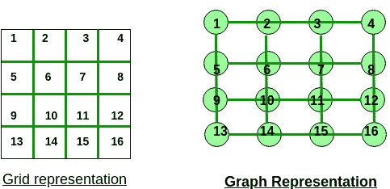

# 绘制成本 n * m 网格

> 原文： [https://www.geeksforgeeks.org/cost-of-painting-n-m-grid/](https://www.geeksforgeeks.org/cost-of-painting-n-m-grid/)

给定两个整数`n`和`m`，它们是网格的尺寸。 任务是找到按单元绘制网格单元的成本，其中绘制单元的成本等于相邻单元的绘制单元数。 如果尚未绘制任何单元格，则可以随时对其进行绘制，从而将绘制网格的成本降至最低。

**示例**：

> **输入**：n = 1，m = 1
> **输出**：0
> 可以免费绘制没有相邻单元的单个单元
> 
> **输入**：n = 1，m = 2
> **输出**：1
> 第一个单元将免费绘制，但第二个单元的绘制成本为 1 有一个相邻的单元格被绘制

一个简单的**解决方案**是生成使用 **n * m** 个单元格即 **n * m 绘制网格的所有可能方式！** 计算其中每个的成本。
**时间复杂度**：O（n * m！）

**高效方法**：了解此图中的着色过程，而不是网格。 因此，单元格的颜色等于图形顶点的颜色。 绘制单元所获得的成本等于该单元的有色邻居的数量。 这意味着获得的成本将是当前像元与相邻彩色像元之间的边数。

要点是要注意的是，在所有单元格着色结束后，将标记图形的所有边缘。

一个有趣的事实是，图形的边缘仅被标记了一次。 这是因为边缘连接两个单元。 当两个单元都被绘制时，我们标记该单元。 我们不允许一次绘制一个单元格以上，这样可以确保每个单元格仅标记一次。

因此，无论您对单元进行着色的顺序如何，标记边缘的数量均保持不变，因此成本将相同。

对于给定的网格，边的数量为 **n *（m – 1）+ m *（n – 1）**。 这是因为每一行都由 **m – 1** 边缘组成，而每一列都由 **n – 1** 边缘组成。

下面是上述方法的实现：

## C ++

```

// C++ implementation of the approach 
#include <bits/stdc++.h> 
using namespace std; 

// Function to return the minimum cost 
int getMinCost(int n, int m) 
{ 
    int cost = (n - 1) * m + (m - 1) * n; 
    return cost; 
} 

// Driver code 
int main() 
{ 
    int n = 4, m = 5; 
    cout << getMinCost(n, m); 

    return 0; 
} 

```