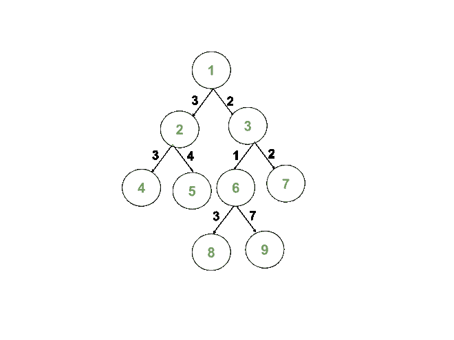

# 计数从根到其路径中所有边的所有边的按位 XOR 等于 K 的节点

> 原文： [https://www.geeksforgeeks.org/count-nodes-having-bitwise-xor-of-all-edges-in-their-path-from-the-root-equal-to-k/](https://www.geeksforgeeks.org/count-nodes-having-bitwise-xor-of-all-edges-in-their-path-from-the-root-equal-to-k/)

给定[二叉树](https://www.geeksforgeeks.org/binary-tree-data-structure/)，它由`N`个节点和两个整数`R`和`K`组成。 树的每个边都有一个与之关联的正整数，形式为 **{u，v，w}** ，其中边**（u，v）**的权重为`w`。 任务是计算从根`R`到`S`的路径中所有边的 [S 的所有边的`S`节点数 到`K`。](https://www.geeksforgeeks.org/bitwise-operators-in-c-cpp/)

**示例**：

> **输入**：R = 1，K = 0，N = 7，Edges [] [] = {{1,2,3}，{1，3，1}，{2，4，3} ，{2、5、4}，{3、6、1}，{3、7、2}}
> **输出**：2
> **说明**：[HTG8 给定二叉树的表示形式：
> 
> 
> 
> 接下来的一对节点在连接它们的路径中具有边的按位 XOR，即 K = 0：
> 对 1：（1，4）=（3 ^ 3）= 0
> 对 2：（1，6）= （1 ^ 1）= 0
> 
> **输入**：R = 1，K = 0，N = 9，Edges [] [] = {{1,2,3}，{1，3，2}，{2，4，3} ，{2，5，4}，{3，6，1}，{3，7，2}，{6，8，3}，{6，9，7}}
> **输出**：3
> **解释**：
> 给定二叉树的表示如下：
> 
> 
> 
> 接下来的一对节点在连接它们的路径中具有边的按位 XOR：K = 0：
> 对 1：（1，4）=（3 ^ 3）= 0
> 对 2：（1，8）= （2 ^ 1 ^ 3）= 0
> 对 3：（1，7）=（2 ^ 2）= 0

**方法**：可以使用[深度优先搜索](https://www.geeksforgeeks.org/depth-first-search-or-dfs-for-a-graph/)方法解决该问题。 请按照以下步骤解决问题：

1.  用`0`初始化变量**和**和 **xor** ，以存储对数和当前边的 [xor](http://www.geeksforgeeks.org/calculate-xor-1-n/) 。
2.  [使用](https://www.geeksforgeeks.org/tree-traversals-inorder-preorder-and-postorder/)[深度优先搜索](https://www.geeksforgeeks.org/depth-first-search-or-dfs-for-a-graph/)从给定的根顶点`R`遍历给定的树。
3.  对于每个节点`u`，请访问其相邻节点。
4.  对于每个边 **{u，v}** ，如果 **xor** 等于`K`，则将**和**递增`1`。 否则，对于当前边沿 **{u，v，w}** ，将 **xor** 更新为 **xor =（xor ^ w）**，其中^是按位的 [XOR](https://www.geeksforgeeks.org/bitwise-operators-in-c-cpp/) 。
5.  遍历后，将存储在计数器**和**中的值打印为对数。

下面是上述方法的实现：

## C++

```cpp

// C++ program for the above approach
#include <bits/stdc++.h>
using namespace std;

// Initialize the adjacency list
// to represent the tree
vector<pair<int, int> > adj[100005];

// Marks visited / unvisited vertices
int visited[100005] = { 0 };

// Stores the required count of nodes
int ans = 0;

// DFS to visit each vertex
void dfs(int node, int xorr, int k)
{
    // Mark the current node
    // as visited
    visited[node] = 1;

    // Update the counter xor is K
    if (node != 1 && xorr == k)
        ans++;

    // Visit adjacent nodes
    for (auto x : adj[node]) {

        if (!visited[x.first]) {

            // Calculate Bitwise XOR of
            // edges in the path
            int xorr1 = xorr ^ x.second;

            // Recursive call to dfs function
            dfs(x.first, xorr1, k);
        }
    }
}

// Function to construct the tree and
// print required count of nodes
void countNodes(int N, int K, int R,
                vector<vector<int> > edges)
{

    // Add edges
    for (int i = 0; i < N - 1; i++) {
        int u = edges[i][0], v = edges[i][1],
            w = edges[i][2];
        adj[u].push_back({ v, w });
        adj[v].push_back({ u, w });
    }

    dfs(R, 0, K);

    // Print answer
    cout << ans << "\n";
}

// Driver Code
int main()
{
    // Given K and R
    int K = 0, R = 1;

    // Given edges
    vector<vector<int> > edges
        = { { 1, 2, 3 }, { 1, 3, 1 }, 
            { 2, 4, 3 }, { 2, 5, 4 }, 
            { 3, 6, 1 }, { 3, 7, 2 } };

    // Number of vertices
    int N = edges.size();

    // Function call
    countNodes(N, K, R, edges);

    return 0;
}

```

## Java

```java

// Java program for the 
// above approach
import java.util.*;
class GFG{

static class pair
{ 
  int first, second; 
  public pair(int first, 
              int second)  
  { 
    this.first = first; 
    this.second = second; 
  }    
} 

// Initialize the adjacency list
// to represent the tree
static Vector<pair> []adj = 
       new Vector[100005];

// Marks visited / unvisited
// vertices
static int visited[] = 
       new int[100005];

// Stores the required 
// count of nodes
static int ans = 0;

// DFS to visit each 
// vertex
static void dfs(int node, 
                int xorr, 
                int k)
{
  // Mark the current node
  // as visited
  visited[node] = 1;

  // Update the counter 
  // xor is K
  if (node != 1 && 
      xorr == k)
    ans++;

  // Visit adjacent nodes
  for (pair x : adj[node]) 
  {
    if (visited[x.first] != 1) 
    {
      // Calculate Bitwise XOR of
      // edges in the path
      int xorr1 = xorr ^ x.second;

      // Recursive call to dfs
      // function
      dfs(x.first, xorr1, k);
    }
  }
}

// Function to conthe tree and
// print required count of nodes
static void countNodes(int N, int K,
                       int R, int[][] edges)
{
  // Add edges
  for (int i = 0; i < N - 1; i++)
  {
    int u = edges[i][0], 
        v = edges[i][1],
    w = edges[i][2];
    adj[u].add(new pair(v, w ));
    adj[v].add(new pair(u, w ));
  }

  dfs(R, 0, K);

  // Print answer
  System.out.print(ans + "\n");
}

// Driver Code
public static void main(String[] args)
{
  // Given K and R
  int K = 0, R = 1;

  for (int i = 0; i < adj.length; i++)
    adj[i] = new Vector<pair>();
  // Given edges
  int[][] edges = {{1, 2, 3}, 
                   {1, 3, 1},  
                   {2, 4, 3}, 
                   {2, 5, 4}, 
                   {3, 6, 1}, 
                   {3, 7, 2}};

  // Number of vertices
  int N = edges.length;

  // Function call
  countNodes(N, K, R, edges);
}
}

// This code is contributed by 29AjayKumar

```

## Python

```py

# Python3 program for the above approach

# Initialize the adjacency list
# to represent the tree
adj = [[] for i in range(100005)]

# Marks visited / unvisited vertices
visited = [0] * 100005

# Stores the required count of nodes
ans = 0

# DFS to visit each vertex
def dfs(node, xorr, k):

    global ans

    # Mark the current node
    # as visited
    visited[node] = 1

    # Update the counter xor is K
    if (node != 1 and xorr == k):
        ans += 1

    # Visit adjacent nodes
    for x in adj[node]:
        if (not visited[x[0]]):

            # Calculate Bitwise XOR of
            # edges in the path
            xorr1 = xorr ^ x[1]

            # Recursive call to dfs function
            dfs(x[0], xorr1, k)

# Function to construct the tree and
# prrequired count of nodes
def countNodes(N, K, R, edges):

    # Add edges
    for i in range(N - 1):
        u = edges[i][0]
        v = edges[i][1]
        w = edges[i][2]

        adj[u].append([v, w])
        adj[v].append([u, w])

    dfs(R, 0, K)

    # Print answer
    print(ans)

# Driver Code
if __name__ == '__main__':

    # Given K and R
    K = 0
    R = 1

    # Given edges
    edges = [ [ 1, 2, 3 ],[ 1, 3, 1 ],
              [ 2, 4, 3 ],[ 2, 5, 4 ],
              [ 3, 6, 1 ],[ 3, 7, 2 ] ]

    # Number of vertices
    N = len(edges)

    # Function call
    countNodes(N, K, R, edges)

# This code is contributed by mohit kumar 29

```

## C#

```cs

// C# program for the 
// above approach
using System;
using System.Collections.Generic;
class GFG{

public class pair
{ 
  public int first, 
             second; 
  public pair(int first, 
              int second)  
  { 
    this.first = first; 
    this.second = second; 
  }    
} 

// Initialize the adjacency list
// to represent the tree
static List<pair> []adj = 
       new List<pair>[100005];

// Marks visited / unvisited
// vertices
static int []visited = 
       new int[100005];

// Stores the required 
// count of nodes
static int ans = 0;

// DFS to visit each 
// vertex
static void dfs(int node, 
                int xorr, 
                int k)
{
  // Mark the current node
  // as visited
  visited[node] = 1;

  // Update the counter 
  // xor is K
  if (node != 1 && 
      xorr == k)
    ans++;

  // Visit adjacent nodes
  foreach (pair x in adj[node]) 
  {
    if (visited[x.first] != 1) 
    {
      // Calculate Bitwise XOR of
      // edges in the path
      int xorr1 = xorr ^ x.second;

      // Recursive call to dfs
      // function
      dfs(x.first, xorr1, k);
    }
  }
}

// Function to conthe tree and
// print required count of nodes
static void countNodes(int N, int K,
                       int R, int[,] edges)
{
  // Add edges
  for (int i = 0; i < N - 1; i++)
  {
    int u = edges[i,0];
     int   v = edges[i,1],
    w = edges[i,2];
    adj[u].Add(new pair(v, w ));
    adj[v].Add(new pair(u, w ));
  }

  dfs(R, 0, K);

  // Print answer
  Console.Write(ans + "\n");
}

// Driver Code
public static void Main(String[] args)
{
  // Given K and R
  int K = 0, R = 1;

  for (int i = 0; i < adj.Length; i++)
    adj[i] = new List<pair>();

  // Given edges
  int[,] edges = {{1, 2, 3}, 
                   {1, 3, 1},  
                   {2, 4, 3}, 
                   {2, 5, 4}, 
                   {3, 6, 1}, 
                   {3, 7, 2}};

  // Number of vertices
  int N = edges.GetLength(0);

  // Function call
  countNodes(N, K, R, edges);
}
}

// This code is contributed by 29AjayKumar

```

**Output:** 

```
2

```

***时间复杂度**：O（N），其中`N`是节点数。*
***辅助空间**：O（N）*


* * *

* * *

如果您喜欢 GeeksforGeeks 并希望做出贡献，则还可以使用 [tribution.geeksforgeeks.org](https://contribute.geeksforgeeks.org/) 撰写文章，或将您的文章邮寄至 tribution@geeksforgeeks.org。 查看您的文章出现在 GeeksforGeeks 主页上，并帮助其他 Geeks。

如果您发现任何不正确的地方，请单击下面的“改进文章”按钮，以改进本文。