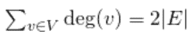

# 计数无向图

中的边数

> 原文： [https://www.geeksforgeeks.org/count-number-edges-undirected-graph/](https://www.geeksforgeeks.org/count-number-edges-undirected-graph/)

给定一个邻接表表示无向图。 编写一个函数以计算无向图中的边数。

预期时间复杂度：`O(V)`

**示例**：

```
Input : Adjacency list representation of
        below graph.  
Output : 9


```

想法基于握手引理。 [握手引理](https://www.geeksforgeeks.org/handshaking-lemma-and-interesting-tree-properties/)与无向图有关。 在每个有限的无向图中，奇数度的顶点数总是偶数。 握手引理是度和公式的结果（有时也称为握手引理）

```
     
```

因此，我们遍历所有顶点，计算其邻接列表的大小之和，最后返回 sum / 2。 下面的想法

的实现

## C++

```cpp

// C++ program to count number of edge in 
// undirected graph 
#include<bits/stdc++.h> 
using namespace std; 

// Adjacency list representation of graph 
class Graph 
{ 
    int V ; 
    list < int > *adj; 
public : 
    Graph( int V ) 
    { 
        this->V = V ; 
        adj = new list<int>[V]; 
    } 
    void addEdge ( int u, int v ) ; 
    int countEdges () ; 
}; 

// add edge to graph 
void Graph :: addEdge ( int u, int v ) 
{ 
    adj[u].push_back(v); 
    adj[v].push_back(u); 
} 

// Returns count of edge in undirected graph 
int Graph :: countEdges() 
{ 
    int sum = 0; 

    //traverse all vertex 
    for (int i = 0 ; i < V ; i++) 

        // add all edge that are linked to the 
        // current vertex 
        sum += adj[i].size(); 

    // The count of edge is always even because in 
    // undirected graph every edge is connected 
    // twice between two vertices 
    return sum/2; 
} 

// driver program to check above function 
int main() 
{ 
    int V = 9 ; 
    Graph g(V); 

    // making above uhown graph 
    g.addEdge(0, 1 ); 
    g.addEdge(0, 7 ); 
    g.addEdge(1, 2 ); 
    g.addEdge(1, 7 ); 
    g.addEdge(2, 3 ); 
    g.addEdge(2, 8 ); 
    g.addEdge(2, 5 ); 
    g.addEdge(3, 4 ); 
    g.addEdge(3, 5 ); 
    g.addEdge(4, 5 ); 
    g.addEdge(5, 6 ); 
    g.addEdge(6, 7 ); 
    g.addEdge(6, 8 ); 
    g.addEdge(7, 8 ); 

    cout << g.countEdges() << endl; 

    return 0; 
} 

```