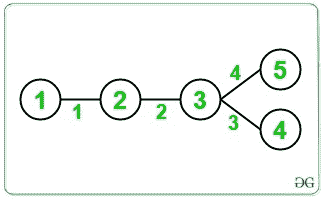

# 计算每个边缘在给定树的所有可能路径中出现的次数

> 原文：[https://www.geeksforgeeks.org/count-number-of-times-each-edge-appears-in-all-possible-paths-of-a-given-tree/](https://www.geeksforgeeks.org/count-number-of-times-each-edge-appears-in-all-possible-paths-of-a-given-tree/)

给定一个 [**无向连通图**](https://www.geeksforgeeks.org/connected-components-in-an-undirected-graph/) ，形式为 [**树**](https://www.geeksforgeeks.org/binary-tree-data-structure/) ，该树由 **N 个**节点和**组成（ N – 1）**边，每个边的任务是计算它在树中所有可能路径上出现的次数。

**示例**：

> **输入**：
> 
> [](https://media.geeksforgeeks.org/wp-content/cdn-uploads/20200824053939/Example1Graph.jpg)
> 
> **输出**：3 4 3
> **说明**：），（2、3），（2、4），（3、4）}。
> 边缘 1 出现在路径{（1、2），（1、3），（1、4）}中。 因此，边缘的频率为 3\.
> 边缘 2 出现在路径{（1、3），（1、4），（2、3），（2、4）}中。 因此，边缘的频率为 4。
> 边缘 3 出现在路径{（1、4），（2、4），（3、4）}中。 因此，边沿的频率为 3。
> **输入**：
> 
> [](https://media.geeksforgeeks.org/wp-content/cdn-uploads/20200824054414/Example2Graph.jpg)
> 
> **输出**：4 6 4 4
> **说明**：
> 边缘 1 出现在路径{（1、2），（1、3），（1、4）中 ，（1，5）}。 因此，边缘的频率为 4。
> 边缘 2 出现在路径{（1、3），（1、4），（1、5），（2、3），（2、4），（ 2、5）}。 因此，边缘的频率为 6
> 边缘 3 出现在路径{（1、4），（2、4），（3、4），（4、5）}中。 因此，边缘的频率为 4。
> 边缘 4 出现在路径{（1、5），（2、5），（3、5），（4、5）}中。 因此，边缘的频率为 4

**天真的方法**：最简单的方法是从给定图的每个节点生成所有可能的路径，并通过 [HashMap](http://www.geeksforgeeks.org/java-util-hashmap-in-java/) 存储在这些路径中出现的边数。 最后，打印每个边的频率。

**时间复杂度**：O（N <sup>2</sup> ）

**辅助空间**：`O(n)`

**有效方法**：为了优化上述方法，需要进行以下观察：

> [](https://media.geeksforgeeks.org/wp-content/cdn-uploads/20200824055300/ApproachGraph.jpg)
> 
> **绿色边缘**将出现在**的所有路径**中，这些路径将左侧子树的任何顶点连接到右侧子树的任何顶点。
> 因此，发生边缘的路径数=两个子树中节点数的乘积= 5 * 3 = 15。

请按照以下步骤解决问题：

*   将树根在任意随机顶点处，例如 1。

*   在根目录下执行 [DFS](https://www.geeksforgeeks.org/depth-first-search-or-dfs-for-a-graph/) 。 使用 DFS 计算连接到边缘的子树大小。

*   连接到子树的每个边的频率为**（子树大小）*（N –子树大小）**。

*   将上面为每个节点计算的值存储在 [HashMap](http://www.geeksforgeeks.org/java-util-hashmap-in-java/) 中。 最后，完成树的遍历后，遍历 **HashMap** 以打印结果。

下面是上述方法的实现：

## C++

```cpp

// C++ Program to implement
// the above approach
#include <bits/stdc++.h>
using namespace std;

// Number of nodes
int N;

// Structure of a Node
struct Node {
    int node;
    int edgeLabel;
};

// Adjacency List to
// represent the Tree
vector<Node> adj[100005];

// Stores the frequencies
// of every edge
vector<int> freq;

// Function to perform DFS
int dfs(int u = 1, int p = 1)
{
    // Add the current node to
    // size of subtree rooted at u
    int sz = 1;

    // Iterate over its childern
    for (auto a : adj[u]) {

        // Check if child is not parent
        if (a.node != p) {

            // Get the subtree size
            // for the child
            int val = dfs(a.node, u);

            // Set the frequency
            // of the current edge
            freq[a.edgeLabel]
                = val * (N - val);

            // Add the subtree size
            // to itself
            sz += val;
        }
    }

    // Return the subtree size
    return sz;
}

// Function to add edge between nodes
void addEdge(int u, int v, int label)
{
    adj[u].push_back({ v, label });
    adj[v].push_back({ u, label });
}

// Function to print the frequencies
// of each edge in all possible paths
void printFrequencies()
{

    // Stores the frequency
    // of all the edges
    freq = vector<int>(N);

    // Perform DFS
    dfs();

    for (int i = 1; i < N; i++) {
        cout << freq[i] << " ";
    }
}

// Driver Code
int main()
{
    N = 4;
    addEdge(1, 2, 1);
    addEdge(2, 3, 2);
    addEdge(3, 4, 3);

    printFrequencies();

    return 0;
}

```

## Java

```java

// Java Program to implement
// the above approach
import java.util.*;
class GFG{

// Number of nodes
static int N;

// Structure of a Node
static class Node 
{
    int node;
    int edgeLabel;
    public Node(int node, int edgeLabel) 
    {
        super();
        this.node = node;
        this.edgeLabel = edgeLabel;
    }
};

// Adjacency List to
// represent the Tree
static Vector<Node> []adj = new Vector[100005];

// Stores the frequencies
// of every edge
static int []freq;

// Function to perform DFS
static int dfs(int u , int p)
{  
    // Add the current node to
    // size of subtree rooted at u
    int sz = 1;

    // Iterate over its childern
    for (Node a : adj[u]) 
    {
        // Check if child is not parent
        if (a.node != p) 
        {
            // Get the subtree size
            // for the child
            int val = dfs(a.node, u);

            // Set the frequency
            // of the current edge
            freq[a.edgeLabel] = val * (N - val);

            // Add the subtree size
            // to itself
            sz += val;
        }
    }

    // Return the subtree size
    return sz;
}

// Function to add edge between nodes
static void addEdge(int u, int v, int label)
{
    adj[u].add(new Node( v, label ));
    adj[v].add(new Node( u, label));
}

// Function to print the frequencies
// of each edge in all possible paths
static void printFrequencies()
{

    // Stores the frequency
    // of all the edges
    freq = new int[N];

    // Perform DFS
    dfs(1, 1);

    for (int i = 1; i < N; i++) 
    {
        System.out.print(freq[i] + " ");
    }
}

// Driver Code
public static void main(String[] args)
{
    N = 4;
    for (int i = 0; i < adj.length; i++)
        adj[i] = new Vector<Node>();
    addEdge(1, 2, 1);
    addEdge(2, 3, 2);
    addEdge(3, 4, 3);

    printFrequencies();
}
}

// This code is contributed by shikhasingrajput

```

## Python3

```py

# Python3 program to implement
# the above approach

# Number of nodes
N = 4

# Structure of a Node
class Node:

    def __init__(self, v, label):

        self.node = v
        self.edgeLabel = label

# Adjacency list to 
# represent the Tree
adj = []
for i in range(100005):
    adj.append([])

# Stores the frequencies 
# of each edge
freq = [0] * N

# Function to perform DFS
def dfs(u = 1, p = 1):

    global N

    # Add the current node to 
    # size of subtree rooted at u
    sz = 1

    # Iterate over its childern
    for a in adj[u]:

        # Check if child is not parent
        if a.node != p:

            # Get the subtree size 
            # for the child 
            val = dfs(a.node, u)

            # Set the frequency 
            # of the current edge 
            freq[a.edgeLabel] = val * (N - val)

            # Add the subtree size 
            # to itself
            sz += val

    # Return the subtree size 
    return sz

# Function to add edge between nodes
def addEdge(u, v, label):

    adj[u].append(Node(v, label))
    adj[v].append(Node(u, label))

# Function to print the frequencies 
# of each edge in all possible paths 
def printFrequencies():

    # Stores the frequency 
    # of all the edges
    global N

    # Perform DFS
    dfs()

    for i in range(1, N):
        print(freq[i], end = " ")

# Driver code
N = 4
addEdge(1, 2, 1)
addEdge(2, 3, 2)
addEdge(3, 4, 3)

printFrequencies()

# This code is contributed by Stuti Pathak

```

## C#

```cs

// C# Program to implement
// the above approach
using System;
using System.Collections.Generic;
class GFG{

// Number of nodes
static int N;

// Structure of a Node
public class Node 
{
  public int node;
  public int edgeLabel;
  public Node(int node, 
              int edgeLabel) 
  {
    this.node = node;
    this.edgeLabel = edgeLabel;
  }
};

// Adjacency List to
// represent the Tree
static List<Node> []adj = 
       new List<Node>[100005];

// Stores the frequencies
// of every edge
static int []freq;

// Function to perform DFS
static int dfs(int u, int p)
{  
    // Add the current node to
    // size of subtree rooted at u
    int sz = 1;

    // Iterate over its childern
    foreach (Node a in adj[u]) 
    {
        // Check if child is not parent
        if (a.node != p) 
        {
            // Get the subtree size
            // for the child
            int val = dfs(a.node, u);

            // Set the frequency
            // of the current edge
            freq[a.edgeLabel] = val * (N - val);

            // Add the subtree size
            // to itself
            sz += val;
        }
    }

    // Return the subtree size
    return sz;
}

// Function to add edge between nodes
static void addEdge(int u, int v, 
                    int label)
{
  adj[u].Add(new Node(v, label));
  adj[v].Add(new Node(u, label));
}

// Function to print the frequencies
// of each edge in all possible paths
static void printFrequencies()
{
  // Stores the frequency
  // of all the edges
  freq = new int[N];

  // Perform DFS
  dfs(1, 1);

  for (int i = 1; i < N; i++) 
  {
    Console.Write(freq[i] + " ");
  }
}

// Driver Code
public static void Main(String[] args)
{
  N = 4;
  for (int i = 0; i < adj.Length; i++)
    adj[i] = new List<Node>();
  addEdge(1, 2, 1);
  addEdge(2, 3, 2);
  addEdge(3, 4, 3);
  printFrequencies();
}
}

// This code is contributed by gauravrajput1

```

**Output:** 

```
3 4 3

```

**时间复杂度**：`O(n)`

**辅助空间**：`O(n)`


* * *

* * *


