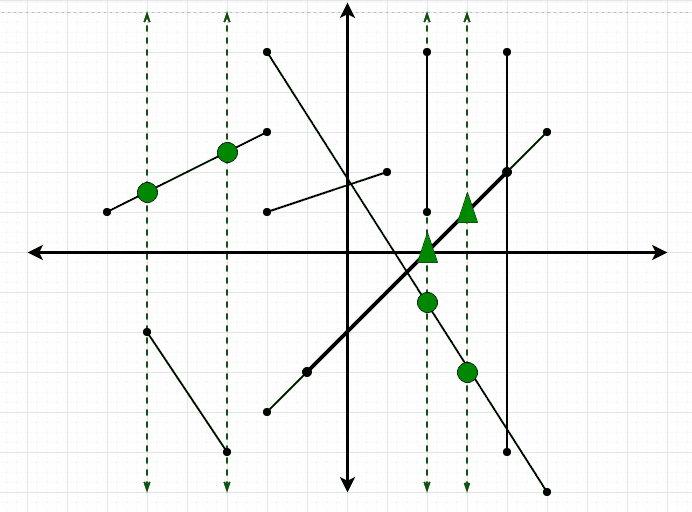

# XY 平面中 M 条线段与 N 条垂直线的交点计数

给定 **N** 垂直线（平行于 Y 轴）的 **x** 坐标和 **M** 线段从（x1，y1）延伸到（x2，y2）的坐标， 任务是找到线段与垂直线相交的总数。
**范例：**

> **输入：** N = 2，M = 1，行[] = {-1，1}，分段[] [4] = {0，1，2，1}。
> **输出 ：** 1
> **说明：**
> 只有一个交叉点（1，1）
> 
> 
> 
> **输入：** N = 4，M = 8，行[] = {-5，-3，2，3}，segment [] [4] = {{-2，5，5，-6 }，{-5，-2，-3，-5}，{-2、3，-6、1}，{-1，-3、4、2}，{2、5、2、1}， {4，5，4，-5}，{-2，-4，5，3}，{1，2，-2，1}}；
> **输出：** 8
> **说明：**
> 共有 8 个交集。
> 虚线是垂直线。
> 绿色圆圈表示单个相交点，
> 绿色三角形表示两条线段
> 在该点处与同一垂直线相交。
> 
> 

**天真的方法：**
最简单的方法是，对于每个查询，检查垂直线是否落在两点的 ***x 坐标*** 之间。 因此，每个段将具有 O（N）个计算复杂度。
***时间复杂度：** O（N * M）*
**方法 2：**这个想法是使用[前缀总和](https://www.geeksforgeeks.org/prefix-sum-array-implementation-applications-competitive-programming/)来 有效地解决这个问题。 请按照以下步骤解决问题：

*   我们可以进行的第一个观察是 **y 坐标**无关紧要。 此外，我们可以观察到仅触摸垂直线并不算作交集。
*   首先，计算到现在为止垂直线出现次数的前缀数组，然后仅减去直到 **x2-1** 出现的次数（我们不考虑 x2，因为它仅表示为 touch 而不是 从出现次数到 **x1** 为止。 因此，对于每个段，计算复杂度降低为 *O（1）*。

下面是上述方法的实现。

## C++

```cpp

// C++ implementation for the 
// above approach. 
#include <bits/stdc++.h> 
using namespace std; 

// Function to create prefix sum array 
void createPrefixArray(int n, int arr[], 
                       int prefSize, 
                       int pref[]) 
{ 
    // Initialize the prefix array 
    // to remove garbage values 
    for (int i = 0; i < prefSize; i++) { 
        pref[i] = 0; 
    } 

    // Marking the occurences of 
    // vertical lines 
    for (int i = 0; i < n; i++) { 
        // x is the value after 
        // Index mapping 
        int x = arr[i] + 1000000; 
        pref[x]++; 
    } 

    // Creating the prefix array 
    for (int i = 1; i < prefSize; i++) { 
        pref[i] += pref[i - 1]; 
    } 
} 

// Function returns the count of 
// total intersection 
int pointsOfIntersection(int m, 
                         int segments[][4], 
                         int size, 
                         int pref[]) 
{ 

    // ans is the number of points of 
    // intersection of the line segments 
    // with the vertical lines 
    int ans = 0; 

    for (int i = 0; i < m; i++) { 
        int x1 = segments[i][0]; 
        int x2 = segments[i][2]; 

        // Index mapping 
        x1 = x1 + 1000000; 
        x2 = x2 + 1000000; 

        // We don't consider a vertical 
        // line segment because even if 
        // it falls on a verticale line 
        // then it just touches it and 
        // not intersects. 
        if (x1 != x2) { 
            // We have assumed that x1 
            // will be left and x2 right 
            // but if not then we just 
            // swap them 
            if (x1 > x2) { 
                swap(x1, x2); 
            } 

            int Occ_Till_Right = pref[x2 - 1]; 
            int Occ_Till_Left = pref[x1]; 

            ans = ans + (Occ_Till_Right 
                         - Occ_Till_Left); 
        } 
    } 
    return ans; 
} 

int main() 
{ 

    // N is the number of vertical lines 
    // M is the number of line segments 
    int N = 4; 
    int M = 8; 

    int size = 2000000 + 2; 
    int pref[size]; 

    int lines[N] = { -5, -3, 2, 3 }; 

    // Format : x1, y1, x2, y1 
    int segments[M][4] = { { -2, 5, 5, -6 }, 
                           { -5, -2, -3, -5 }, 
                           { -2, 3, -6, 1 }, 
                           { -1, -3, 4, 2 }, 
                           { 2, 5, 2, 1 }, 
                           { 4, 5, 4, -5 }, 
                           { -2, -4, 5, 3 }, 
                           { 1, 2, -2, 1 } }; 

    // First create the prefix array 
    createPrefixArray(N, lines, size, pref); 

    // Print the total number of intersections 
    cout << pointsOfIntersection(M, segments, 
                                 size, pref) 
         << endl; 

    return 0; 
} 

```

## Java

```java

// Java implementation for the 
// above approach. 
import java.util.*; 

class GFG{ 

// Function to create prefix sum array 
static void createPrefixArray(int n, int arr[], 
                              int prefSize, 
                              int pref[]) 
{ 

    // Initialize the prefix array 
    // to remove garbage values 
    for(int i = 0; i < prefSize; i++) 
    { 
        pref[i] = 0; 
    } 

    // Marking the occurences of 
    // vertical lines 
    for(int i = 0; i < n; i++) 
    { 

        // x is the value after 
        // Index mapping 
        int x = arr[i] + 1000000; 
        pref[x]++; 
    } 

    // Creating the prefix array 
    for(int i = 1; i < prefSize; i++)  
    { 
        pref[i] += pref[i - 1]; 
    } 
} 

// Function returns the count of 
// total intersection 
static int pointsOfIntersection(int m, 
                                int segments[][], 
                                int size, 
                                int pref[]) 
{ 

    // ans is the number of points of 
    // intersection of the line segments 
    // with the vertical lines 
    int ans = 0; 

    for(int i = 0; i < m; i++) 
    { 
        int x1 = segments[i][0]; 
        int x2 = segments[i][2]; 

        // Index mapping 
        x1 = x1 + 1000000; 
        x2 = x2 + 1000000; 

        // We don't consider a vertical 
        // line segment because even if 
        // it falls on a verticale line 
        // then it just touches it and 
        // not intersects. 
        if (x1 != x2)  
        { 

            // We have assumed that x1 
            // will be left and x2 right 
            // but if not then we just 
            // swap them 
            if (x1 > x2) 
            { 
                int temp = x1; 
                x1 = x2; 
                x2 = temp; 
            } 

            int Occ_Till_Right = pref[x2 - 1]; 
            int Occ_Till_Left = pref[x1]; 

            ans = ans + (Occ_Till_Right - 
                         Occ_Till_Left); 
        } 
    } 
    return ans; 
} 

// Driver code 
public static void main(String[] args) 
{ 

    // N is the number of vertical lines 
    // M is the number of line segments 
    int N = 4; 
    int M = 8; 

    int size = 2000000 + 2; 
    int []pref = new int[size]; 

    int lines[] = { -5, -3, 2, 3 }; 

    // Format : x1, y1, x2, y1 
    int segments[][] = { { -2, 5, 5, -6 }, 
                         { -5, -2, -3, -5 }, 
                         { -2, 3, -6, 1 }, 
                         { -1, -3, 4, 2 }, 
                         { 2, 5, 2, 1 }, 
                         { 4, 5, 4, -5 }, 
                         { -2, -4, 5, 3 }, 
                         { 1, 2, -2, 1 } }; 

    // First create the prefix array 
    createPrefixArray(N, lines, size, pref); 

    // Print the total number of intersections 
    System.out.print(pointsOfIntersection(M, segments, 
                                  size, pref) + "\n"); 
} 
} 

// This code is contributed by Amit Katiyar  

```

## Python3

```py

# Python3 implementation for the  
# above approach 

# Function to create prefix sum array 
def createPrefixArray(n, arr, prefSize, pref): 

    # Initialize the prefix array  
    # to remove garbage values 
    for i in range(prefSize): 
        pref[i] = 0

    # Marking the occurances 
    # of vertical lines 
    for i in range(n): 
        x = arr[i] + 1000000
        pref[x] += 1

    # Creating the prefix array 
    for i in range(1, prefSize): 
        pref[i] += pref[i - 1] 

# Function that returns the count  
# of total intersection 
def pointOfIntersection(m, segments, size, pref): 

    # ans is the number of points of  
    # intersection of the line segments 
    # with the vertical lines 
    ans = 0

    for i in range(m): 
        x1 = segments[i][0] 
        x2 = segments[i][2] 

        # Index mapping 
        x1 = x1 + 1000000
        x2 = x2 + 1000000

        # we don't consider a vertical   
        # line segment because even if 
        # it falls on a vertical line 
        # then it just touches it and 
        # not intersects. 
        if (x1 != x2): 

            # We have assumed that x1  
            # will be left and x2 right 
            # but if not then just swap 
            if (x1 > x2): 
                x1, x2 = x2, x1 

            Occ_Till_Right = pref[x2 - 1] 
            Occ_Till_Left = pref[x1] 

            ans += (Occ_Till_Right - Occ_Till_Left) 

    return ans 

# Driver code 

# Number of vertical lines 
N = 4 

# Number of line segments 
M = 8 

size = 2000000 + 2
pref = [0] * size  
lines = [ -5, -3, 2, 3 ] 

# Format : x1, y1, x2, y2 
segments = [ [ -2, 5, 5, -6 ], 
             [ -5, -2, -3, -5 ], 
             [ -2, 3, -6, 1 ], 
             [ -1, -3, 4, 2 ], 
             [ 2, 5, 2, 1 ], 
             [ 4, 5, 4, -5 ], 
             [ -2, -4, 5, 3 ], 
             [ 1, 2, -2, 1 ] ] 

# First create the prefix array 
createPrefixArray(N, lines, size, pref) 

# Print the total number of intersections 
print(pointOfIntersection(M, segments, size, pref)) 

# This code is contributed by himanshu77 

```

## C#

```cs

// C# implementation for the 
// above approach. 
using System; 

class GFG{ 

// Function to create prefix sum array 
static void createPrefixArray(int n, int []arr, 
                              int prefSize, 
                              int []pref) 
{ 

    // Initialize the prefix array 
    // to remove garbage values 
    for(int i = 0; i < prefSize; i++) 
    { 
        pref[i] = 0; 
    } 

    // Marking the occurences of 
    // vertical lines 
    for(int i = 0; i < n; i++) 
    { 

        // x is the value after 
        // Index mapping 
        int x = arr[i] + 1000000; 
        pref[x]++; 
    } 

    // Creating the prefix array 
    for(int i = 1; i < prefSize; i++)  
    { 
        pref[i] += pref[i - 1]; 
    } 
} 

// Function returns the count of 
// total intersection 
static int pointsOfIntersection(int m, 
                                int [,]segments, 
                                int size, 
                                int []pref) 
{ 

    // ans is the number of points of 
    // intersection of the line segments 
    // with the vertical lines 
    int ans = 0; 

    for(int i = 0; i < m; i++) 
    { 
        int x1 = segments[i, 0]; 
        int x2 = segments[i, 2]; 

        // Index mapping 
        x1 = x1 + 1000000; 
        x2 = x2 + 1000000; 

        // We don't consider a vertical 
        // line segment because even if 
        // it falls on a verticale line 
        // then it just touches it and 
        // not intersects. 
        if (x1 != x2)  
        { 

            // We have assumed that x1 
            // will be left and x2 right 
            // but if not then we just 
            // swap them 
            if (x1 > x2) 
            { 
                int temp = x1; 
                x1 = x2; 
                x2 = temp; 
            } 

            int Occ_Till_Right = pref[x2 - 1]; 
            int Occ_Till_Left = pref[x1]; 

            ans = ans + (Occ_Till_Right - 
                         Occ_Till_Left); 
        } 
    } 
    return ans; 
} 

// Driver code 
public static void Main(String[] args) 
{ 

    // N is the number of vertical lines 
    // M is the number of line segments 
    int N = 4; 
    int M = 8; 

    int size = 2000000 + 2; 
    int []pref = new int[size]; 

    int []lines = { -5, -3, 2, 3 }; 

    // Format : x1, y1, x2, y1 
    int [,]segments = { { -2, 5, 5, -6 }, 
                        { -5, -2, -3, -5 }, 
                        { -2, 3, -6, 1 }, 
                        { -1, -3, 4, 2 }, 
                        { 2, 5, 2, 1 }, 
                        { 4, 5, 4, -5 }, 
                        { -2, -4, 5, 3 }, 
                        { 1, 2, -2, 1 } }; 

    // First create the prefix array 
    createPrefixArray(N, lines, size, pref); 

    // Print the total number of intersections 
    Console.Write(pointsOfIntersection(M, segments, 
                                size, pref) + "\n"); 
} 
} 

// This code is contributed by Amit Katiyar  

```

**Output:** 

```
8

```

**方法 3：**为了优化上述方法，我们可以使用 [Map Data 结构](https://www.geeksforgeeks.org/map-associative-containers-the-c-standard-template-library-stl/)采用节省空间的方法。 请按照以下步骤解决问题：

*   我们可以制作一个地图来存储到目前为止的出现次数，与第一种方法的不同之处在于，我们仅插入具有垂直线的坐标。
*   当我们要搜索从 x1 到 x2 的交点数时，我们可以从地图的 upper_bound（x2-1）中减去 lower_bound（x1 + 1）。

下面是上述方法的实现。

## C++

```cpp

// C++ implementation for the 
// above approach. 
#include <bits/stdc++.h> 
using namespace std; 

// Function to create map that stores 
// the number of occurences of the 
// vertical lines till now. 
map<int, int> createMap(int n, 
                        int arr[]) 
{ 
    map<int, int> mp; 

    sort(arr, arr + n); 
    for (int i = 0; i < n; i++) { 
        mp.insert({ arr[i], i + 1 }); 
    } 
    return mp; 
} 

// Function returns the count of 
// total intersections 
int pointsOfIntersection(int m, 
                         int segments[][4], 
                         int n, 
                         map<int, int> pref) 
{ 
    // ans stores the number 
    // of intersections 
    int ans = 0; 

    // Loop over all the segments 
    for (int i = 0; i < m; i++) { 
        int x1 = segments[i][0]; 
        int x2 = segments[i][2]; 
        if (x1 == x2) { 
            continue; 
        } 

        // For convenience we make x1 as 
        // x co-ordinate of left point 
        // and x2 as x co-ordinate of 
        // right point. 
        if (x1 > x2) { 
            swap(x1, x2); 
        } 

        auto it1 = *pref.lower_bound(x1 + 1); 
        auto it2 = *pref.upper_bound(x2 - 1); 

        int intersections = 0; 

        // If x co-ordinate of the left point 
        // is after the last vertical line 
        // then we dont add anything. 
        if (pref.lower_bound(x1 + 1) 
            == pref.end()) { 
            intersections = 0; 
        } 
        // If there is no occurence of any 
        // vertical line after (x2-1) 
        // then we can mark the 
        // number of intersections as 
        // n - occurrences till x1 
        // because the total occurrences 
        // are n and all of them 
        // will fall before x2\. 
        else if (pref.upper_bound(x2 - 1) 
                 == pref.end()) { 
            intersections 
                = n - it1.second + 1; 
        } 
        else { 
            intersections 
                = it2.second 
                  - it1.second; 
        } 
        ans += intersections; 
    } 
    return ans; 
} 

// Driver code 
int main() 
{ 
    // N is the number of vertical lines 
    // M is the number of line segments 
    int N = 4; 
    int M = 8; 

    int lines[N] = { -5, -3, 2, 3 }; 

    // Format : x1, y1, x2, y1 
    int segments[M][4] 
        = { { -2, 5, 5, -6 }, 
            { -5, -2, -3, -5 }, 
            { -2, 3, -6, 1 }, 
            { -1, -3, 4, 2 }, 
            { 2, 5, 2, 1 }, 
            { 4, 5, 4, -5 }, 
            { -2, -4, 5, 3 }, 
            { 1, 2, -2, 1 } }; 

    map<int, int> pref = createMap(N, lines); 

    cout << pointsOfIntersection( 
                M, 
                segments, 
                N, pref) 
         << endl; 
    return 0; 
} 

```

**Output:** 

```
8

```

[](https://practice.geeksforgeeks.org/courses/competitive-programming-live?utm_source=geeksforgeeks&utm_medium=article&utm_campaign=gfg_article_cp)

* * *

* * *


