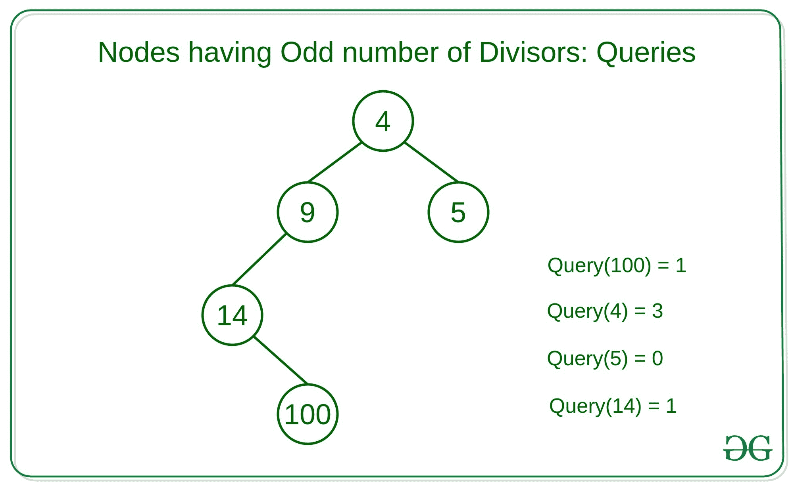

# 对于 Q 查询，给定子树中具有奇数除数的节点数

给定 [N 元树](https://www.geeksforgeeks.org/generic-treesn-array-trees/)和 **Q** 查询，其中每个查询包含 N 元树的一个节点，任务是计算除数为奇数的节点数 在子树中进行 Q 查询。

**示例：**

> **输入：**
> 
> [](https://media.geeksforgeeks.org/wp-content/uploads/20200520193134/some.jpg)
> 
> **输出：** 1 3 0 1
> 
> **解释：**，
> **查询 1：**在以节点 100 为根的子树中，只有一个节点 100，它有 9 个除数{1、2、4、5、10 ，20、25、50、100}。 因此，只有一个节点具有奇数个除数。
> **查询 2：**在以节点 4 为根的子树中，有 5 个节点，其中 3 个节点具有奇数个除数。 即{4，9，100}
> **查询 3：**在以节点 5 为根的子树中，只有一个节点 5，它有两个除数。 因此，零个节点的除数为奇数。

**天真的方法：**一个简单的解决方案是遍历每个查询的子树并找到具有奇数个除数的节点数。

**有效方法：**这个想法是为每个子树预先计算奇数个除数的计数，并将该计数存储在[哈希映射](https://www.geeksforgeeks.org/hashing-data-structure/)中。 为了预先计算除数为奇数的节点数，我们可以使用[深度优先搜索遍历](https://www.geeksforgeeks.org/depth-first-search-or-dfs-for-a-graph/)。 最后，要检查当前节点的除数是否为奇数，我们可以使用以下事实：每个理想平方数均具有除数为奇数。

下面是上述方法的实现：

## C ++

```

// C++ implementation to count the
// number of nodes havving odd
// number of divisors for each query

#include <bits/stdc++.h>
using namespace std;

#define N 100001

// Adjacency list
// for tree.
vector<int> adj[N];

// Array for values and
// answer at ith node.
int a[N], ans[N];

// Function to check whether N
// has odd divisors or not
bool hasOddNumberOfDivisors(int n)
{
    if ((double)sqrt(n) == (int)sqrt(n))
        return true;
    return false;
}

// DFS function to pre-compute
// the answers
int dfs(int node, int parent)
{
    // Initialize the count
    int count = 0;
    for (auto i = adj[node].begin(); i != adj[node].end();
         ++i) {
        if (*i != parent) {

            // Repeat for every child
            count += dfs(*i, node);
        }
    }

    // Increase the count if current node
    // has odd number of divisors
    if (hasOddNumberOfDivisors(a[node]))
        ++count;

    ans[node] = count;
    return count;
}

// Driver Code
int main()
{

    int n = 5, i;
    vector<int> q = { 4, 1, 5, 3 };

    // Adjacency List
    adj[1].push_back(2);
    adj[2].push_back(1);
    adj[2].push_back(3);
    adj[3].push_back(2);
    adj[3].push_back(4);
    adj[4].push_back(3);
    adj[1].push_back(5);
    adj[5].push_back(1);

    a[1] = 4;
    a[2] = 9;
    a[3] = 14;
    a[4] = 100;
    a[5] = 5;

    // Function call
    dfs(1, -1);

    for (int i = 0; i < q.size(); i++) {
        cout << ans[q[i]] << " ";
    }
    return 0;
}

```

## 爪哇

```

// Java implementation to 
// count the number of nodes 
// havving odd number of 
// divisors for each query
import java.util.*;
class GFG{

static final int N = 100001;

// Adjacency list
// for tree.
static Vector<Integer> []adj = 
              new Vector[N];

// Array for values and
// answer at ith node.
static int []a = new int[N];
static int []ans = new int[N];

// Function to check whether N
// has odd divisors or not
static boolean hasOddNumberOfDivisors(int n)
{
  if ((double)Math.sqrt(n) == 
      (int)Math.sqrt(n))
    return true;
  return false;
}

// DFS function to 
// pre-compute the answers
static int dfs(int node, 
               int parent)
{
  // Initialize the count
  int count = 0;
  for (int i : adj[node]) 
  {
    if (i != parent) 
    {
      // Repeat for every child
      count += dfs(i, node);
    }
  }

  // Increase the count if 
  // current node has odd 
  // number of divisors
  if (hasOddNumberOfDivisors(a[node]))
    ++count;

  ans[node] = count;
  return count;
}

// Driver Code
public static void main(String[] args)
{
  int n = 5;
  int[] q = {4, 1, 5, 3};

  for (int i = 0; i < adj.length; i++)
    adj[i] = new Vector<Integer>();

  // Adjacency List
  adj[1].add(2);
  adj[2].add(1);
  adj[2].add(3);
  adj[3].add(2);
  adj[3].add(4);
  adj[4].add(3);
  adj[1].add(5);
  adj[5].add(1);

  a[1] = 4;
  a[2] = 9;
  a[3] = 14;
  a[4] = 100;
  a[5] = 5;

  // Function call
  dfs(1, -1);

  for (int i = 0; i < q.length; i++) 
  {
    System.out.print(ans[q[i]] + " ");
  }
}
}

// This code is contributed by Rajput-Ji

```

**Output**

```
1 3 0 1 

```

[](https://practice.geeksforgeeks.org/courses/competitive-programming-live?utm_source=geeksforgeeks&utm_medium=article&utm_campaign=gfg_article_cp)

* * *

* * *

如果您喜欢 GeeksforGeeks 并希望做出贡献，则还可以使用 [tribution.geeksforgeeks.org](https://contribute.geeksforgeeks.org/) 撰写文章，或将您的文章邮寄至 tribution@geeksforgeeks.org。 查看您的文章出现在 GeeksforGeeks 主页上，并帮助其他 Geeks。

如果您发现任何不正确的地方，请单击下面的“改进文章”按钮，以改进本文。