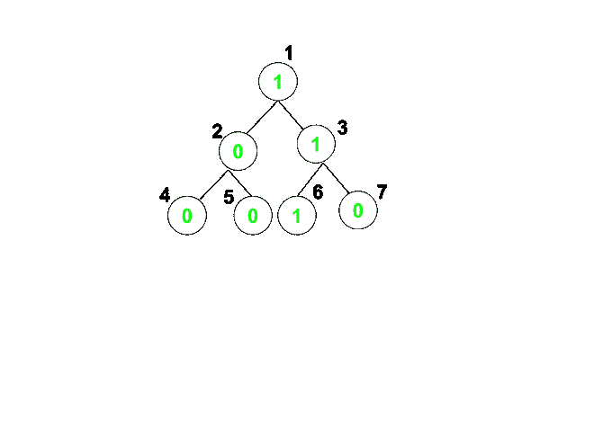

# 由最多 M 个连续的节点组成的具有值 K 的根到叶路径的计数

> 原文： [https://www.geeksforgeeks.org/count-of-root-to-leaf-paths-consisting-of-at-most-m-consecutive-nodes-having-value-k/](https://www.geeksforgeeks.org/count-of-root-to-leaf-paths-consisting-of-at-most-m-consecutive-nodes-having-value-k/)

以 [**二叉树**](https://www.geeksforgeeks.org/binary-tree-data-structure/) 的形式给出 [**无环无向图**](https://www.geeksforgeeks.org/detect-cycle-undirected-graph/) ，其根在顶点`1`和值 在每个由数组 **arr []** 表示的顶点 **[1，N]** 上，任务是找到根到叶路径的数量，这些路径最多包含 m 个连续节点，其值[`K`。

**示例**：

> **输入**：arr [] = {1，0，1，0，0，1，0}，K = 1，M = 2
> 
> 
> 
> **输出**：3
> **说明**：
> 路径 1：1-> 2-> 4 包含最多 1 个连续的 K。
> 路径 2-1：- > 2-> 5 包含最多 1 个连续的 K
> 路径 3：1-> 3-> 6 包含最多 3 个连续的 K。
> 路径 4：1-> 3-> 7 最多包含 2 个连续 K。
> 由于 M 的给定值为 2，因此有 3 条路径包含最多 2 个连续 K。
> **输入**：arr [] = {2， 1，3，2，1，2，1，4，4，3，5，2}，K = 2，M = 2
> 
> ```
>             2
>          /     \
>         1       3
>       /   \    /  \
>      2     1  2    1
>    /  \   / \
>   4    3 5   2
> 
> ```
> 
> **输出**：3

**方法**：
可以使用 [**深度优先搜索**](https://www.geeksforgeeks.org/depth-first-search-or-dfs-for-a-graph/) 方法解决问题：

*   深度优先搜索可用于从根顶点遍历所有路径。
*   每当当前节点的值是`K`时，就增加**计数**。
*   否则，将**计数**设置为`0`。
*   如果**计数**超过`M`，则返回。
*   否则，遍历其相邻节点并重复上述步骤。
*   最后，打印获得的**计数**的值。

下面是上述方法的实现：

## C++

```cpp

// C++ Program to implement

// the above approach

#include <bits/stdc++.h>

using namespace std;

// Initialize the adjacency

// list and visited array

vector<int> adj[100005];

int visited[100005] = { 0 };

int ans = 0;

// Function to find the number of root to

// leaf paths that contain atmost m

// consecutive nodes with value k

void dfs(int node, int count, int m,

         int arr[], int k)

{

    // Mark the current node

    // as visited

    visited[node] = 1;

    // If value at current node is k

    if (arr[node - 1] == k) {

        // Increment counter

        count++;

    }

    else {

        count = 0;

    }

    // If count is greater than m

    // return from that path

    if (count > m) {

        return;

    }

    // Path is allowed if size of present node

    // becomes 0 i.e it has no child root and

    // no more than m consecutive 1's

    if (adj[node].size() == 1 && node != 1) {

        ans++;

    }

    for (auto x : adj[node]) {

        if (!visited[x]) {

            dfs(x, count, m, arr, k);

        }

    }

}

// Driver Code

int main()

{

    int arr[] = { 2, 1, 3, 2, 1, 2, 1 };

    int N = 7, K = 2, M = 2;

    // Desigining the tree

    adj[1].push_back(2);

    adj[2].push_back(1);

    adj[1].push_back(3);

    adj[3].push_back(1);

    adj[2].push_back(4);

    adj[4].push_back(2);

    adj[2].push_back(5);

    adj[5].push_back(2);

    adj[3].push_back(6);

    adj[6].push_back(3);

    adj[3].push_back(7);

    adj[7].push_back(3);

    // Counter counts no.

    // of consecutive nodes

    int counter = 0;

    dfs(1, counter, M, arr, K);

    cout << ans << "\n";

    return 0;

}

```

## Java

```java

// Java program to implement

// the above approach

import java.util.*;

class GFG{

// Initialize the adjacency

// list and visited array

@SuppressWarnings("unchecked")

static Vector<Integer> []adj = new Vector[100005];

static int []visited = new int[100005];

static int ans = 0;

// Function to find the number of root to

// leaf paths that contain atmost m

// consecutive nodes with value k

static void dfs(int node, int count, int m,

                int arr[], int k)

{

    // Mark the current node

    // as visited

    visited[node] = 1;

    // If value at current node is k

    if (arr[node - 1] == k)

    {

        // Increment counter

        count++;

    }

    else

    {

        count = 0;

    }

    // If count is greater than m

    // return from that path

    if (count > m)

    {

        return;

    }

    // Path is allowed if size of present node

    // becomes 0 i.e it has no child root and

    // no more than m consecutive 1's

    if (adj[node].size() == 1 && node != 1) 

    {

        ans++;

    }

    for(int x : adj[node])

    {

        if (visited[x] == 0)

        {

            dfs(x, count, m, arr, k);

        }

    }

}

// Driver Code

public static void main(String[] args)

{

    int arr[] = { 2, 1, 3, 2, 1, 2, 1 };

    int N = 7, K = 2, M = 2;

    for(int i = 0; i < adj.length; i++)

        adj[i] = new Vector<Integer>();

    // Desigining the tree

    adj[1].add(2);

    adj[2].add(1);

    adj[1].add(3);

    adj[3].add(1);

    adj[2].add(4);

    adj[4].add(2);

    adj[2].add(5);

    adj[5].add(2);

    adj[3].add(6);

    adj[6].add(3);

    adj[3].add(7);

    adj[7].add(3);

    // Counter counts no.

    // of consecutive nodes

    int counter = 0;

    dfs(1, counter, M, arr, K);

    System.out.print(ans + "\n");

}

}

// This code is contributed by 29AjayKumar

```

## Python

```py

# Python3 Program to implement

# the above approach

# Initialize the adjacency

# list and visited array

adj = [[] for i in range(100005)]

visited = [ 0 for i in range(100005)]

ans = 0;

# Function to find the number of root to

# leaf paths that contain atmost m

# consecutive nodes with value k

def dfs(node, count, m, arr, k):

    global ans

    # Mark the current node

    # as visited

    visited[node] = 1;

    # If value at current 

    # node is k

    if (arr[node - 1] == k):

        # Increment counter

        count += 1;

    else:

        count = 0;    

    # If count is greater than m

    # return from that path

    if (count > m):

        return;    

    # Path is allowed if size 

    # of present node becomes 0 

    # i.e it has no child root and

    # no more than m consecutive 1's

    if (len(adj[node]) == 1 and node != 1):

        ans += 1

    for x in adj[node]:        

        if (not visited[x]):

            dfs(x, count, m, arr, k);

# Driver code

if __name__ == "__main__":

    arr = [2, 1, 3, 2, 1, 2, 1]

    N = 7

    K = 2

    M = 2

    # Desigining the tree

    adj[1].append(2);

    adj[2].append(1);

    adj[1].append(3);

    adj[3].append(1);

    adj[2].append(4);

    adj[4].append(2);

    adj[2].append(5);

    adj[5].append(2);

    adj[3].append(6);

    adj[6].append(3);

    adj[3].append(7);

    adj[7].append(3);

    # Counter counts no.

    # of consecutive nodes

    counter = 0;

    dfs(1, counter, M, arr, K);    

    print(ans)        

# This code is contributed by rutvik_56

```

## C#

```cs

// C# program to implement

// the above approach

using System;

using System.Collections.Generic;

class GFG{

// Initialize the adjacency

// list and visited array

static List<int> []adj = new List<int>[100005];

static int []visited = new int[100005];

static int ans = 0;

// Function to find the number of root to

// leaf paths that contain atmost m

// consecutive nodes with value k

static void dfs(int node, int count, int m,

                int []arr, int k)

{

    // Mark the current node

    // as visited

    visited[node] = 1;

    // If value at current node is k

    if (arr[node - 1] == k)

    {

        // Increment counter

        count++;

    }

    else

    {

        count = 0;

    }

    // If count is greater than m

    // return from that path

    if (count > m)

    {

        return;

    }

    // Path is allowed if size of present node

    // becomes 0 i.e it has no child root and

    // no more than m consecutive 1's

    if (adj[node].Count == 1 && node != 1) 

    {

        ans++;

    }

    foreach(int x in adj[node])

    {

        if (visited[x] == 0)

        {

            dfs(x, count, m, arr, k);

        }

    }

}

// Driver Code

public static void Main(String[] args)

{

    int []arr = { 2, 1, 3, 2, 1, 2, 1 };

    int K = 2, M = 2;

    for(int i = 0; i < adj.Length; i++)

        adj[i] = new List<int>();

    // Desigining the tree

    adj[1].Add(2);

    adj[2].Add(1);

    adj[1].Add(3);

    adj[3].Add(1);

    adj[2].Add(4);

    adj[4].Add(2);

    adj[2].Add(5);

    adj[5].Add(2);

    adj[3].Add(6);

    adj[6].Add(3);

    adj[3].Add(7);

    adj[7].Add(3);

    // Counter counts no.

    // of consecutive nodes

    int counter = 0;

    dfs(1, counter, M, arr, K);

    Console.Write(ans + "\n");

}

}

// This code is contributed by Amit Katiyar

```

**Output:** 

```

4

```

***时间复杂度**：O（V + E）*

***辅助空间**：O（V）*


* * *

* * *

如果您喜欢 GeeksforGeeks 并希望做出贡献，则还可以使用 [tribution.geeksforgeeks.org](https://contribute.geeksforgeeks.org/) 撰写文章，或将您的文章邮寄至 tribution@geeksforgeeks.org。 查看您的文章出现在 GeeksforGeeks 主页上，并帮助其他 Geeks。

如果您发现任何不正确的地方，请单击下面的“改进文章”按钮，以改进本文。