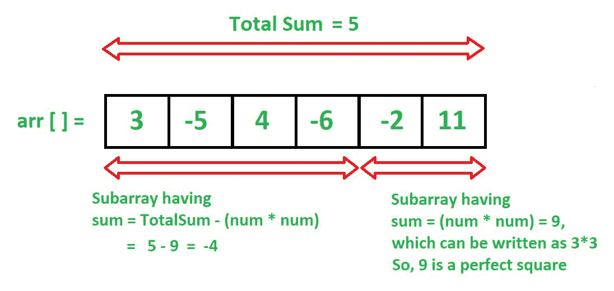

# 和为完全平方的子数组的数量

> 原文：[https://www.geeksforgeeks.org/count-of-subarrays-whose-sum-is-a-perfect-square/](https://www.geeksforgeeks.org/count-of-subarrays-whose-sum-is-a-perfect-square/)

给定具有正负元素的数组`arr[]`，任务是对所有和为完全平方的子数组进行计数。

**示例**：

> **输入**：`arr[] = {2, 3, -5, 6, -7, 4}`
>
> **输出**：5
>
> **说明**：
>
> 子数组`{2, 3, -5}, {-5, 6}, {3, -5, 6 }, {3, -5, 6, -7, 4}, {4}`的和分别为 0、1、4、1 和 4，它们具有完美的平方和。
>
> **输入**：`arr [] = {3，-6，4，-2，7}`
>
> **输出**：3
>
> **说明**：`{3, -6, 4}, {4}, {4, -2, 7}`是具有完美平方和的子数组。

**朴素的方法**：

一个简单的解决方案是生成所有可能的子数组。 遍历时，请跟踪子数组总和。 记录所有和为完全平方的子数组。

**高效解决方案**：想法是使用[前缀和数组](https://www.geeksforgeeks.org/prefix-sum-array-implementation-applications-competitive-programming/)解决给定的问题。



*   创建一个`prefixSum`数组并存储其前缀和。

*   遍历`prefixSum`数组并确定其最小值，即`prefixMin`。

*   现在，创建一个无序映射，该遍历可用于存储当前`prefixSum`的频率，同时遍历`prefixSum`数组。

*   用值 1 初始化映射的第 0 个键索引，因为 0 是一个完美的正方形。

*   用嵌套循环遍历`prefixSum`数组。

*   对于每个`prefixSum`元素，嵌套循环将查找`mapKey = (prefixSum[i] – j * j)`（如果在映射索引中可用）。

*   如果`prefixSum[i] – j * j`在映射中已经可用，我们将使用`prefixSum[i] – j * j`的索引值更新计数器。

*   这个想法是用所有平方`j * j`检查当前`prefixSum`值，直到差达到`prefixMin`为止。

*   现在，随着外循环的每次迭代，将映射的**当前前缀和**的索引加 1。

*   基本概念是我们继续从`prefixSum[i] – j * j`中搜索，因为如果一部分是数组，则是`prefixSum[i] – j * j` ，则数组的另一部分将是`j * j`，即一个完美的平方和。

*   出于此目的，您可以在上图中看到`totalSum`实际上是`prefixSum`。

下面是上述方法的实现：

## C++

```cpp

// C++ code for the above approach.
#include <bits/stdc++.h>
using namespace std;

#define lli long long int

// Function to find count of subarrays
// whose sum is a perfect square.
lli countSubarrays(int arr[],
                   int n)
{
    // to search for index with
    // (current prefix sum - j*j)
    unordered_map<int, int> mp;

    // storing the prefix sum
    int prefixSum[n];

    // used to track the minimum
    // value in prefixSum
    int prefixMin = 0;

    prefixSum[0] = arr[0];
    prefixMin = min(prefixMin,
                    prefixSum[0]);

    // Calculating the prefixSum
    // and tracking the prefixMin
    for (int i = 1; i < n; i++) {

        prefixSum[i] = prefixSum[i - 1]
                       + arr[i];

        // below statement is used if
        // array contains
        // negative numbers
        prefixMin = min(prefixMin,
                        prefixSum[i]);
    }

    // counts the no of subarrays
    // with perfect square sum
    lli countSubs = 0;

    // as 0 is a perfect square,
    // so we initialize 0th
    // index-key with value 1
    mp[0] = 1;

    // Here we count the perfect
    // square subarray sum by
    // searching if there is a
    // prefix with
    // sum = (current prefixSum - (sq*sq))
    for (int i = 0; i < n; i++) {
        for (int j = 0;
             prefixSum[i] - j * j >= prefixMin;
             j++) {

            if (mp.find(prefixSum[i] - j * j)
                != mp.end())

                // increasing our subarray count
                countSubs += mp[prefixSum[i]
                                - j * j];
        }

        // increasing the current prefixSum
        // index value in map by 1 to count
        // the other perfect squares while
        // traversing further
        mp[prefixSum[i]]++;
    }

    return countSubs;
}

// Driver code
int main()
{
    int arr[] = { 2, 3, -5,
                  6, -7, 4 };
    int n = sizeof(arr) / sizeof(arr[0]);

    lli ans = countSubarrays(arr, n);

    // printing the result
    cout << ans;

    return 0;
}

```

## Java

```java

// Java code for 
// the above approach.
import java.util.*;
class GFG{

// Function to find count of 
// subarrays whose sum is 
// a perfect square.
static long countSubarrays(int arr[], 
                           int n)
{
  // To search for index with
  // (current prefix sum - j*j)
  HashMap<Integer,
          Integer> mp = new HashMap<Integer,
                                    Integer>();

  // Storing the prefix sum
  int []prefixSum = new int[n];

  // Used to track the minimum
  // value in prefixSum
  int prefixMin = 0;

  prefixSum[0] = arr[0];
  prefixMin = Math.min(prefixMin,
                       prefixSum[0]);

  // Calculating the prefixSum
  // and tracking the prefixMin
  for (int i = 1; i < n; i++) 
  {
    prefixSum[i] = prefixSum[i - 1] + arr[i];

    // Below statement is used if
    // array contains
    // negative numbers
    prefixMin = Math.min(prefixMin,
                         prefixSum[i]);
  }

  // Counts the no of subarrays
  // with perfect square sum
  long countSubs = 0;

  // As 0 is a perfect square,
  // so we initialize 0th
  // index-key with value 1
  mp.put(0, 1);

  // Here we count the perfect
  // square subarray sum by
  // searching if there is a
  // prefix with
  // sum = (current prefixSum - (sq*sq))
  for (int i = 0; i < n; i++) 
  {
    for (int j = 0; 
             prefixSum[i] - j * 
             j >= prefixMin; j++) 
    {
      if (mp.containsKey(prefixSum[i] - j * j))

        // Increasing our subarray count
        countSubs += mp.get(prefixSum[i] - 
                            j * j);
    }

    // Increasing the current prefixSum
    // index value in map by 1 to count
    // the other perfect squares while
    // traversing further
    if(mp.containsKey(prefixSum[i]))
    {
      mp.put(prefixSum[i], 
      mp.get(prefixSum[i]) + 1);
    }
    else
    {
      mp.put(prefixSum[i], 1);
    }
  }

  return countSubs;
}

// Driver code
public static void main(String[] args)
{
  int arr[] = {2, 3, -5,
               6, -7, 4};
  int n = arr.length;
  long ans = countSubarrays(arr, n);

  // Printing the result
  System.out.print(ans);
}
}

// This code is contributed by Princi Singh

```

## Python3

```py

# Python3 code for the above approach.
from collections import defaultdict

# Function to find count of subarrays 
# whose sum is a perfect square.
def countSubarrays(arr, n):

    # To search for index with 
    # (current prefix sum - j*j)
    mp = defaultdict(lambda:0)

    # Storing the prefix sum
    prefixSum = [0] * n

    # Used to track the minimum 
    # value in prefixSum
    prefixMin = 0

    prefixSum[0] = arr[0]
    prefixMin = min(prefixMin, prefixSum[0])

    # Calculating the prefixSum 
    # and tracking the prefixMin
    for i in range(1, n):
        prefixSum[i] = prefixSum[i - 1] + arr[i]

        # Below statement is used if 
        # array contains negative numbers 
        prefixMin = min(prefixMin, prefixSum[i])

    # Counts the no of subarrays 
    # with perfect square sum
    countSubs = 0

    # As 0 is a perfect square, 
    # so we initialize 0th 
    # index-key with value 1 
    mp[0] = 1

    # Here we count the perfect 
    # square subarray sum by 
    # searching if there is a 
    # prefix with 
    # sum = (current prefixSum - (sq*sq))
    for i in range(n):
        j = 0

        while prefixSum[i] - j * j >= prefixMin:
            if prefixSum[i] - j * j in mp:

                # Increasing our subarray count
                countSubs += mp[prefixSum[i] - j * j]
            j += 1

        # Increasing the current prefixSum 
        # index value in map by 1 to count 
        # the other perfect squares while 
        # traversing further 
        mp[prefixSum[i]] += 1

    return countSubs

# Driver code
arr = [ 2, 3, -5, 6, -7, 4 ]
n = len(arr)
ans = countSubarrays(arr, n)

# Printing the result
print(ans)

# This code is contributed by Shivam Singh

```

**输出**： 

```
5

```

**时间复杂度**：`O(N * sqrt(K))`。

**辅助空间**：`O(n)`。


* * *

* * *


