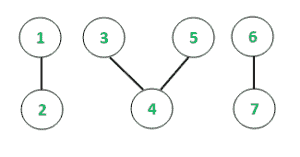
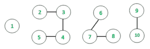

# 使用 STL

的无向图的连接组件的唯一长度计数

给定一个无向图，任务是查找每个连接组件的大小并打印连接组件的唯一大小的数量


如上所述，与连接的组件关联的计数（连接的组件的大小）为 2、3 和 2。现在，组件的**唯一**计数为 2 和 3。因此，预期结果 是**计数= 2**
**示例**：

```
Input: N = 7

```



```
Output: 1 2 Count = 2
        3 4 5 Count = 3
        6 7 Count = 2
        Unique Counts of connected components: 2

Input: N = 10

```



```
Output: 1 Count = 1
        2 3 4 5 Count = 4
        6 7 8 Count = 3
        9 10 Count = 2
        Unique Counts of connected components: 4

```

**先决条件**：[深度优先搜索](https://www.geeksforgeeks.org/depth-first-search-or-dfs-for-a-graph/)
**方法**：
基本思想是利用深度优先搜索遍历方法来跟踪连接的对象 无向图中的组件。 STL 容器[集](http://www.geeksforgeeks.org/set-in-cpp-stl/)用于存储所有此类组件的唯一计数，因为已知集合具有以排序方式存储唯一元素的属性。 最后，提取 Set 的大小将为我们提供必要的结果。 分步实现如下：

1.  初始化一个哈希容器（Set），以存储所连接组件的唯一计数。
2.  递归调用深度优先搜索遍历。
3.  对于访问的每个顶点，将计数存储在设置的容器中。
4.  Set 的最终大小是必需的结果。

下面是上述方法的实现：

## C++

```cpp

// C++ program to find unique count of
// connected components
#include <bits/stdc++.h>
using namespace std;

// Function to add edge in the garph
void add_edge(int u, int v, vector<int> graph[])
{
    graph[u].push_back(v);
    graph[v].push_back(u);
}

// Function to traverse the undirected graph
// using DFS algorithm and keep a track of
// individual lengths of connected chains
void depthFirst(int v, vector<int> graph[],
                vector<bool>& visited, int& ans)
{
    // Marking the visited vertex as true
    visited[v] = true;
    cout << v << " ";

    // Incrementing the count of
    // connected chain length
    ans++;

    for (auto i : graph[v]) {
        if (visited[i] == false) {
            // Recursive call to the DFS algorithm
            depthFirst(i, graph, visited, ans);
        }
    }
}

// Function to initialize the graph
// and display the result
void UniqueConnectedComponent(int n,
                              vector<int> graph[])
{

    // Initializing boolean visited array
    // to mark visited vertices
    vector<bool> visited(n + 1, false);

    // Initializing a Set container
    unordered_set<int> result;

    // Following loop invokes DFS algorithm
    for (int i = 1; i <= n; i++) {
        if (visited[i] == false) {
            // ans variable stores the
            // individual counts
            int ans = 0;

            // DFS algorithm
            depthFirst(i, graph, visited, ans);

            // Inserting the counts of connected
            // components in set
            result.insert(ans);
            cout << "Count = " << ans << "\n";
        }
    }

    cout << "Unique Counts of "
         << "connected components: ";

    // The size of the Set container
    // gives the desired result
    cout << result.size() << "\n";
}

// Driver code
int main()
{
    // Number of nodes
    int n = 7;

    // Create graph
    vector<int> graph[n + 1];

    // Constructing the undirected graph
    add_edge(1, 2, graph);
    add_edge(3, 4, graph);
    add_edge(3, 5, graph);
    add_edge(6, 7, graph);

    // Function call
    UniqueConnectedComponent(n, graph);

    return 0;
}

```

## Java

```java

// Java program to find 
// unique count of 
// connected components
import java.util.*;
class GFG{

// Function to add edge in the garph
static void add_edge(int u, int v, 
                     Vector<Integer> graph[])
{
  graph[u].add(v);
  graph[v].add(u);
}

// Function to traverse the undirected graph
// using DFS algorithm and keep a track of
// individual lengths of connected chains
static int depthFirst(int v, 
                      Vector<Integer> graph[],
                      Vector<Boolean> visited, 
                      int ans)
{
  // Marking the visited vertex as true
  visited.add(v, true);
  System.out.print(v + " ");

  // Incrementing the count of
  // connected chain length
  ans++;

  for (int i : graph[v]) 
  {
    if (visited.get(i) == false) 
    {
      // Recursive call to the DFS algorithm
      ans = depthFirst(i, graph, visited, ans);
    }
  }
  return ans;
}

// Function to initialize the graph
// and display the result
static void UniqueConnectedComponent(int n,
                                     Vector<Integer> graph[])
{
  // Initializing boolean visited array
  // to mark visited vertices
  Vector<Boolean> visited = new Vector<>();
  for(int i = 0; i < n + 1; i++)
    visited.add(false);

  // Initializing a Set container
  HashSet<Integer> result = new HashSet<>();

  // Following loop invokes DFS algorithm
  for (int i = 1; i <= n; i++) 
  {
    if (visited.get(i) == false) 
    {
      // ans variable stores the
      // individual counts
      int ans = 0;

      // DFS algorithm
      ans = depthFirst(i, graph, visited, ans);

      // Inserting the counts of connected
      // components in set
      result.add(ans);
      System.out.print("Count = " +  
                        ans + "\n");
    }
  }
  System.out.print("Unique Counts of " + 
                   "connected components: ");

  // The size of the Set container
  // gives the desired result
  System.out.print(result.size() + "\n");
}

// Driver code
public static void main(String[] args)
{
  // Number of nodes
  int n = 7;

  // Create graph
  Vector<Integer> []graph = new Vector[n + 1];
  for (int i = 0; i < graph.length; i++)
    graph[i] = new Vector<Integer>();

  // Constructing the undirected graph
  add_edge(1, 2, graph);
  add_edge(3, 4, graph);
  add_edge(3, 5, graph);
  add_edge(6, 7, graph);

  // Function call
  UniqueConnectedComponent(n, graph);
}
}

// This code is contributed by Princi Singh

```

## Python3

```py

# Python3 program to find unique count of
# connected components
graph = [[] for i in range(100 + 1)]
visited = [False] * (100 + 1)
ans = 0

# Function to add edge in the garph
def add_edge(u, v):

    graph[u].append(v)
    graph[v].append(u)

# Function to traverse the undirected graph
# using DFS algorithm and keep a track of
# individual lengths of connected chains
def depthFirst(v):

    global ans

    # Marking the visited vertex as true
    visited[v] = True
    print(v, end = " ")
    #print(ans,end="-")

    # Incrementing the count of
    # connected chain length
    ans += 1

    for i in graph[v]:
        if (visited[i] == False):

            # Recursive call to the 
            # DFS algorithm
            depthFirst(i)

# Function to initialize the graph
# and display the result
def UniqueConnectedComponent(n):

    global ans

    # Initializing boolean visited array
    # to mark visited vertices

    # Initializing a Set container
    result = {}

    # Following loop invokes DFS algorithm
    for i in range(1, n + 1):
        if (visited[i] == False):

            # ans variable stores the
            # individual counts
            # ans = 0

            # DFS algorithm
            depthFirst(i)

            # Inserting the counts of connected
            # components in set
            result[ans] = 1
            print("Count = ", ans)
            ans = 0

    print("Unique Counts of connected "
          "components: ", end = "")

    # The size of the Set container
    # gives the desired result
    print(len(result))

# Driver code
if __name__ == '__main__':

    # Number of nodes
    n = 7

    # Create graph

    # Constructing the undirected graph
    add_edge(1, 2)
    add_edge(3, 4)
    add_edge(3, 5)
    add_edge(6, 7)

    # Function call
    UniqueConnectedComponent(n)

# This code is contributed by mohit kumar 29

```

## C#

```cs

// C# program to find 
// unique count of 
// connected components
using System;
using System.Collections.Generic;
class GFG{

// Function to add edge in the garph
static void add_edge(int u, int v, 
                     List<int> []graph)
{
  graph[u].Add(v);
  graph[v].Add(u);
}

// Function to traverse the undirected graph
// using DFS algorithm and keep a track of
// individual lengths of connected chains
static int depthFirst(int v, 
                      List<int> []graph,
                      List<Boolean> visited, 
                      int ans)
{
  // Marking the visited 
  // vertex as true
  visited.Insert(v, true);
  Console.Write(v + " ");

  // Incrementing the count of
  // connected chain length
  ans++;

  foreach (int i in graph[v]) 
  {
    if (visited[i] == false) 
    {
      // Recursive call to 
      // the DFS algorithm
      ans = depthFirst(i, graph, 
                       visited, ans);
    }
  }
  return ans;
}

// Function to initialize the graph
// and display the result
static void UniqueConnectedComponent(int n,
                                     List<int> []graph)
{
  // Initializing bool visited array
  // to mark visited vertices
  List<Boolean> visited = new List<Boolean>();
  for(int i = 0; i < n + 1; i++)
    visited.Add(false);

  // Initializing a Set container
  HashSet<int> result = new HashSet<int>();

  // Following loop invokes DFS algorithm
  for (int i = 1; i <= n; i++) 
  {
    if (visited[i] == false) 
    {
      // ans variable stores the
      // individual counts
      int ans = 0;

      // DFS algorithm
      ans = depthFirst(i, graph, visited, ans);

      // Inserting the counts of connected
      // components in set
      result.Add(ans);
      Console.Write("Count = " +  
                     ans + "\n");
    }
  }
  Console.Write("Unique Counts of " + 
                "connected components: ");

  // The size of the Set container
  // gives the desired result
  Console.Write(result.Count + "\n");
}

// Driver code
public static void Main(String[] args)
{
  // Number of nodes
  int n = 7;

  // Create graph
  List<int> []graph = new List<int>[n + 1];
  for (int i = 0; i < graph.Length; i++)
    graph[i] = new List<int>();

  // Constructing the undirected graph
  add_edge(1, 2, graph);
  add_edge(3, 4, graph);
  add_edge(3, 5, graph);
  add_edge(6, 7, graph);

  // Function call
  UniqueConnectedComponent(n, graph);
}
}

// This code is contributed by shikhasingrajput

```

**Output:** 

```
1 2 Count = 2
3 4 5 Count = 3
6 7 Count = 2
Unique Counts of connected components: 2

```

**时间复杂度**：
从上述实现中可以明显看出，使用深度优先搜索算法遍历了图形。 使用 Set 容器存储单个计数，其中插入操作花费 O（1）时间。 总体复杂度仅基于 DFS 算法递归运行所花费的时间。 因此，程序的时间复杂度为 **O（E + V）**，其中 E 是边的数量，V 是图形的顶点数量。
**辅助空间**：*O（N）*

[](https://practice.geeksforgeeks.org/courses/competitive-programming-live?utm_source=geeksforgeeks&utm_medium=article&utm_campaign=gfg_article_cp)

* * *

* * *


