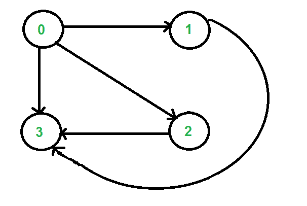

# 计算从源到目的地的所有可能的走行，且边恰好有 k 个

> 原文： [https://www.geeksforgeeks.org/count-possible-paths-source-destination-exactly-k-edges/](https://www.geeksforgeeks.org/count-possible-paths-source-destination-exactly-k-edges/)

给定一个有向图，并在其中包含两个顶点“ u”和“ v”，计算从“ u”到“ v”的所有可能的走行，且走行上恰好有 k 条边。

该图以[邻接矩阵表示形式](https://www.geeksforgeeks.org/graph-and-its-representations/)给出，其中 graph [i] [j]的值为 1 表示从顶点 i 到顶点 j 有一条边，值 0 表示从 i 到边无边 到 j。

例如，考虑下图。 假设源‘u’是顶点 0，目标’v’是顶点 3，k 是 2。输出应该是 2，因为从 0 到 3 有两个步长，正好有 2 个边。 步行为{0，2，3}和{0，1，3}



**<u>简单方法</u>** ：创建一个递归函数，该函数采用当前顶点，目标顶点和顶点数。 调用递归函数，将当前顶点的所有相邻顶点的 k 值设为 k-1。 当 k 的值为 0 时，请检查当前顶点是否为目标。 如果目的地，则将输出答案增加 1。

以下是此简单解决方案的实现

## C++

```cpp

// C++ program to count walks from u to
// v with exactly k edges
#include <iostream>
using namespace std;

// Number of vertices in the graph
#define V 4

// A naive recursive function to count
// walks from u to v with k edges
int countwalks(int graph[][V], int u, int v, int k)
{
    // Base cases
    if (k == 0 && u == v)
        return 1;
    if (k == 1 && graph[u][v])
        return 1;
    if (k <= 0)
        return 0;

    // Initialize result
    int count = 0;

    // Go to all adjacents of u and recur
    for (int i = 0; i < V; i++)
        if (graph[u][i] == 1) // Check if is adjacent of u
            count += countwalks(graph, i, v, k - 1);

    return count;
}

// driver program to test above function
int main()
{
    /* Let us create the graph shown in above diagram*/
    int graph[V][V] = { { 0, 1, 1, 1 },
                        { 0, 0, 0, 1 },
                        { 0, 0, 0, 1 },
                        { 0, 0, 0, 0 } };
    int u = 0, v = 3, k = 2;
    cout << countwalks(graph, u, v, k);
    return 0;
}

```

## Java

```java

// Java program to count walks from u to v with exactly k edges
import java.util.*;
import java.lang.*;
import java.io.*;

class KPaths {
    static final int V = 4; // Number of vertices

    // A naive recursive function to count walks from u
    // to v with k edges
    int countwalks(int graph[][], int u, int v, int k)
    {
        // Base cases
        if (k == 0 && u == v)
            return 1;
        if (k == 1 && graph[u][v] == 1)
            return 1;
        if (k <= 0)
            return 0;

        // Initialize result
        int count = 0;

        // Go to all adjacents of u and recur
        for (int i = 0; i < V; i++)
            if (graph[u][i] == 1) // Check if is adjacent of u
                count += countwalks(graph, i, v, k - 1);

        return count;
    }

    // Driver method
    public static void main(String[] args) throws java.lang.Exception
    {
        /* Let us create the graph shown in above diagram*/
        int graph[][] = new int[][] { { 0, 1, 1, 1 },
                                      { 0, 0, 0, 1 },
                                      { 0, 0, 0, 1 },
                                      { 0, 0, 0, 0 } };
        int u = 0, v = 3, k = 2;
        KPaths p = new KPaths();
        System.out.println(p.countwalks(graph, u, v, k));
    }
} // Contributed by Aakash Hasija

```

## Python

```py

# Python3 program to count walks from
# u to v with exactly k edges

# Number of vertices in the graph
V = 4

# A naive recursive function to count
# walks from u to v with k edges
def countwalks(graph, u, v, k):

    # Base cases
    if (k == 0 and u == v):
        return 1
    if (k == 1 and graph[u][v]):
        return 1
    if (k <= 0):
        return 0

    # Initialize result
    count = 0

    # Go to all adjacents of u and recur
    for i in range(0, V):

        # Check if is adjacent of u
        if (graph[u][i] == 1): 
            count += countwalks(graph, i, v, k-1)

    return count

# Driver Code

# Let us create the graph shown in above diagram
graph = [[0, 1, 1, 1, ],
         [0, 0, 0, 1, ],
         [0, 0, 0, 1, ],
         [0, 0, 0, 0] ]

u = 0; v = 3; k = 2
print(countwalks(graph, u, v, k))

# This code is contributed by Smitha Dinesh Semwal.

```

## C#

```cs

// C# program to count walks from u to
// v with exactly k edges
using System;

class GFG {

    // Number of vertices
    static int V = 4;

    // A naive recursive function to
    // count walks from u to v with
    // k edges
    static int countwalks(int[, ] graph, int u,
                          int v, int k)
    {

        // Base cases
        if (k == 0 && u == v)
            return 1;
        if (k == 1 && graph[u, v] == 1)
            return 1;
        if (k <= 0)
            return 0;

        // Initialize result
        int count = 0;

        // Go to all adjacents of u and recur
        for (int i = 0; i < V; i++)

            // Check if is adjacent of u
            if (graph[u, i] == 1)
                count += countwalks(graph, i, v, k - 1);

        return count;
    }

    // Driver method
    public static void Main()
    {

        /* Let us create the graph shown 
        in above diagram*/
        int[, ] graph = new int[, ] { { 0, 1, 1, 1 },
                                      { 0, 0, 0, 1 },
                                      { 0, 0, 0, 1 },
                                      { 0, 0, 0, 0 } };

        int u = 0, v = 3, k = 2;

        Console.Write(
            countwalks(graph, u, v, k));
    }
}

// This code is contributed by nitin mittal.

```

## 的 PHP

```

<?php
// PHP program to count walks from u
// to v with exactly k edges

// Number of vertices in the graph
$V = 4;

// A naive recursive function to count
// walks from u to v with k edges
function countwalks( $graph, $u, $v, $k)
{
    global $V;

    // Base cases
    if ($k == 0 and $u == $v) 
        return 1;
    if ($k == 1 and $graph[$u][$v])
        return 1;
    if ($k <= 0)         
        return 0;

    // Initialize result
    $count = 0;

    // Go to all adjacents of u and recur
    for ( $i = 0; $i < $V; $i++)

        // Check if is adjacent of u
        if ($graph[$u][$i] == 1) 
            $count += countwalks($graph, $i, 
                                $v, $k - 1);

    return $count;
}

    // Driver Code
    /* Let us create the graph 
       shown in above diagram*/
    $graph = array(array(0, 1, 1, 1),
                   array(0, 0, 0, 1),
                   array(0, 0, 0, 1),
                   array(0, 0, 0, 0));
    $u = 0; $v = 3; $k = 2;
    echo countwalks($graph, $u, $v, $k);

// This code is contributed by anuj_67.
?>

```

**输出**：

```
2

```

**复杂度分析**：

*   **时间复杂度**：O（V <sup>k</sup> ）。

    上述函数的最坏情况下的时间复杂度是 O（V <sup>k</sup> ），其中 V 是给定图中顶点的数量。 我们可以通过绘制递归树来简单地分析时间复杂度。 最坏的情况发生在完整的图形上。 在最坏的情况下，递归树的每个内部节点将恰好具有 n 个子节点。

*   **辅助空间**：`O(V)`。

    要存储堆栈空间，需要访问数组`O(V)`空间。

**<u>有效方法：</u>** 可以使用 [**动态编程**](https://www.geeksforgeeks.org/dynamic-programming-set-1/) 优化解决方案。 这个想法是建立一个 3D 表，其中第一维是源，第二维是目标，第三维是从源到目标的边数，其值是走数。 像其他[动态编程问题](https://www.geeksforgeeks.org/tag/dynamic-programming/)一样，以自下而上的方式填充 3D 表。

## C++

```cpp

// C++ program to count walks from
// u to v with exactly k edges
#include <iostream>
using namespace std;

// Number of vertices in the graph
#define V 4

// A Dynamic programming based function to count walks from u
// to v with k edges
int countwalks(int graph[][V], int u, int v, int k)
{
    // Table to be filled up using DP.
    // The value count[i][j][e] will
    // store count of possible walks from
    // i to j with exactly k edges
    int count[V][V][k + 1];

    // Loop for number of edges from 0 to k
    for (int e = 0; e <= k; e++) {
        for (int i = 0; i < V; i++) // for source
        {
            for (int j = 0; j < V; j++) // for destination
            {
                // initialize value
                count[i][j][e] = 0;

                // from base cases
                if (e == 0 && i == j)
                    count[i][j][e] = 1;
                if (e == 1 && graph[i][j])
                    count[i][j][e] = 1;

                // go to adjacent only when the
                // number of edges is more than 1
                if (e > 1) {
                    for (int a = 0; a < V; a++) // adjacent of source i
                        if (graph[i][a])
                            count[i][j][e] += count[a][j][e - 1];
                }
            }
        }
    }
    return count[u][v][k];
}

// driver program to test above function
int main()
{
    /* Let us create the graph shown in above diagram*/
    int graph[V][V] = { { 0, 1, 1, 1 },
                        { 0, 0, 0, 1 },
                        { 0, 0, 0, 1 },
                        { 0, 0, 0, 0 } };
    int u = 0, v = 3, k = 2;
    cout << countwalks(graph, u, v, k);
    return 0;
}

```

## Java

```java

// Java program to count walks from
// u to v with exactly k edges
import java.util.*;
import java.lang.*;
import java.io.*;

class KPaths {
    static final int V = 4; // Number of vertices

    // A Dynamic programming based function to count walks from u
    // to v with k edges
    int countwalks(int graph[][], int u, int v, int k)
    {
        // Table to be filled up using DP. The value count[i][j][e]
        // will/ store count of possible walks from i to j with
        // exactly k edges
        int count[][][] = new int[V][V][k + 1];

        // Loop for number of edges from 0 to k
        for (int e = 0; e <= k; e++) {
            for (int i = 0; i < V; i++) // for source
            {
                for (int j = 0; j < V; j++) // for destination
                {
                    // initialize value
                    count[i][j][e] = 0;

                    // from base cases
                    if (e == 0 && i == j)
                        count[i][j][e] = 1;
                    if (e == 1 && graph[i][j] != 0)
                        count[i][j][e] = 1;

                    // go to adjacent only when number of edges
                    // is more than 1
                    if (e > 1) {
                        for (int a = 0; a < V; a++) // adjacent of i
                            if (graph[i][a] != 0)
                                count[i][j][e] += count[a][j][e - 1];
                    }
                }
            }
        }
        return count[u][v][k];
    }

    // Driver method
    public static void main(String[] args) throws java.lang.Exception
    {
        /* Let us create the graph shown in above diagram*/
        int graph[][] = new int[][] { { 0, 1, 1, 1 },
                                      { 0, 0, 0, 1 },
                                      { 0, 0, 0, 1 },
                                      { 0, 0, 0, 0 } };
        int u = 0, v = 3, k = 2;
        KPaths p = new KPaths();
        System.out.println(p.countwalks(graph, u, v, k));
    }
} // Contributed by Aakash Hasija

```

## Python

```py

# Python3 program to count walks from
# u to v with exactly k edges

# Number of vertices
V = 4

# A Dynamic programming based function 
# to count walks from u to v with k edges
def countwalks(graph, u, v, k):

    # Table to be filled up using DP. 
    # The value count[i][j][e] will/ 
    # store count of possible walks 
    # from i to j with exactly k edges
    count =  [[[0 for k in range(k + 1)]
                  for i in range(V)]
                  for j in range(V)]

    # Loop for number of edges from 0 to k
    for e in range(0, k + 1):
        for i in range(V):

            # For source
            for j in range(V):

                # For destination

                # Initialize value
                count[i][j][e] = 0

            # From base cases
            if (e == 0 and i == j):
                count[i][j][e] = 1
            if (e == 1 and graph[i][j] != 0):
                count[i][j][e] = 1

            # Go to adjacent only when number 
            # of edges is more than 1
            if (e > 1):

                for a in range(V):

                    # Adjacent of i
                    if (graph[i][a] != 0):
                        count[i][j][e] += count[a][j][e - 1]

    return count[u][v][k]

# Driver code
if __name__ == '__main__':

    # Let us create the graph shown 
    # in above diagram 
    graph = [ [ 0, 1, 1, 1 ], 
              [ 0, 0, 0, 1 ],
              [ 0, 0, 0, 1 ],
              [ 0, 0, 0, 0 ] ]

    u = 0
    v = 3
    k = 2

    print(countwalks(graph, u, v, k))

# This code is contributed by Rajput-Ji

```

## C#

```cs

// C# program to count walks from u to v
// with exactly k edges
using System;

class GFG {
    static int V = 4; // Number of vertices

    // A Dynamic programming based function
    // to count walks from u to v with k edges
    static int countwalks(int[, ] graph, int u,
                          int v, int k)
    {
        // Table to be filled up using DP. The
        // value count[i][j][e] will/ store
        // count of possible walks from i to
        // j with exactly k edges
        int[,, ] count = new int[V, V, k + 1];

        // Loop for number of edges from 0 to k
        for (int e = 0; e <= k; e++) {

            // for source
            for (int i = 0; i < V; i++) {

                // for destination
                for (int j = 0; j < V; j++) {
                    // initialize value
                    count[i, j, e] = 0;

                    // from base cases
                    if (e == 0 && i == j)
                        count[i, j, e] = 1;
                    if (e == 1 && graph[i, j] != 0)
                        count[i, j, e] = 1;

                    // go to adjacent only when
                    // number of edges
                    // is more than 1
                    if (e > 1) {
                        // adjacent of i
                        for (int a = 0; a < V; a++)
                            if (graph[i, a] != 0)
                                count[i, j, e] += count[a, j, e - 1];
                    }
                }
            }
        }

        return count[u, v, k];
    }

    // Driver method
    public static void Main()
    {
        /* Let us create the graph shown in 
        above diagram*/
        int[, ] graph = { { 0, 1, 1, 1 },
                          { 0, 0, 0, 1 },
                          { 0, 0, 0, 1 },
                          { 0, 0, 0, 0 } };
        int u = 0, v = 3, k = 2;

        Console.WriteLine(
            countwalks(graph, u, v, k));
    }
}

// This is Code Contributed by anuj_67.

```

**输出**：

```
2

```

**复杂度分析**：

*   **时间复杂度**：O（V <sup>3</sup> ）。

    需要三个嵌套循环来填充 DP 表，因此时间复杂度为 O（V <sup>3 / sup >）。</sup>

*   **辅助空间**：O（V <sup>3</sup> ）。

    要存储 DP 表，需要 O（V <sup>3</sup> ）空间。

我们也可以使用 [**分而治之**](https://www.geeksforgeeks.org/divide-and-conquer-set-1-find-closest-pair-of-points/) 在 O（V <sup>3</sup> Logk）时间内解决上述问题。 从 u 到 v 的长度为 k 的步数是（graph [V] [V]） <sup>k</sup> 中的第[u] [v]个条目。 我们可以通过使用[分治法来计算 O [Logk）乘积来计算功率](https://www.geeksforgeeks.org/write-a-c-program-to-calculate-powxn/)。 两个大小为 V x V 的矩阵相乘需要 O（V [HT [G10] 3] ）时间。

如果发现任何不正确的内容，或者想分享有关上述主题的更多信息，请发表评论。

