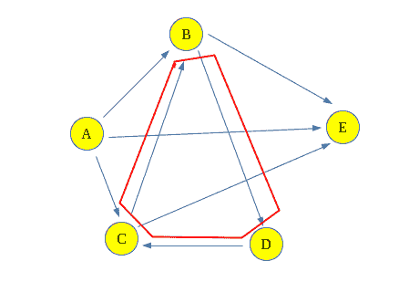

# 计算两个顶点之间的所有可能路径

> 原文： [https://www.geeksforgeeks.org/count-possible-paths-two-vertices/](https://www.geeksforgeeks.org/count-possible-paths-two-vertices/)

计算在有向图中两个顶点之间存在的路径或路径的总数。 这些路径不包含循环，原因很简单，一个循环包含无限数量的路径，因此会造成问题。

**示例**：

```
For the following Graph:

Input: Count paths between A and E
Output : Total paths between A and E are 4
Explanation: The 4 paths between A and E are:
                      A -> E
                      A -> B -> E
                      A -> C -> E
                      A -> B -> D -> C -> E 

Input : Count paths between A and C
Output : Total paths between A and C are 2
Explanation: The 2 paths between A and C are:
                      A -> C
                      A -> B -> D -> C

```

**方法**：
可以使用[回溯](https://www.geeksforgeeks.org/backtracking-algorithms/)解决问题，即走一条路径并开始在其上行走，检查是否将我们引向目标顶点，然后计算路径并 回溯走另一条路。 如果路径未通向目标顶点，则放弃该路径。
这种图形遍历称为回溯。

**上图的回溯可以显示如下**：
红色顶点是源顶点，浅蓝色顶点是目标顶点，其余是中间路径或废弃路径。


这在**源（A）**和**目标（E）**顶点之间提供了四个路径。

**为什么此解决方案不适用于包含循环的图形？**
与此相关的问题是，如果现在在 C 和 B 之间再增加一个边，它将形成一个循环**（B-> D-> C-> B ）**。 因此，在循环的每个循环之后，长度路径将增加，这将被视为不同的路径，并且由于循环，将有无限多的路径。


**算法**：

1.  创建一个采用图节点索引和目标索引的递归函数。 保留全局或静态变量计数以存储计数。
2.  如果当前节点是目的地，则增加计数。
3.  否则，对于所有相邻节点，即从当前节点可访问的节点，调用具有相邻节点和目的地索引的递归函数。
4.  打印计数。

**实施**：

## C++

```cpp

// C++ program to count all paths from a 
// source to a destination. 
#include <bits/stdc++.h> 

using namespace std; 

// A directed graph using adjacency list 
// representation 
class Graph { 

    // No. of vertices in graph 
    int V; 
    list<int>* adj; 

    // A recursive function 
    // used by countPaths() 
    void countPathsUtil(int, int, int&); 

public: 
    // Constructor 
    Graph(int V); 
    void addEdge(int u, int v); 
    int countPaths(int s, int d); 
}; 

Graph::Graph(int V) 
{ 
    this->V = V; 
    adj = new list<int>[V]; 
} 

void Graph::addEdge(int u, int v) 
{ 

    // Add v to u’s list. 
    adj[u].push_back(v); 
} 

// Returns count of paths from 's' to 'd' 
int Graph::countPaths(int s, int d) 
{ 

    // Call the recursive helper 
    // function to print all paths 
    int pathCount = 0; 
    countPathsUtil(s, d, pathCount); 
    return pathCount; 
} 

// A recursive function to print all paths 
// from 'u' to 'd'. visited[] keeps track of 
// vertices in current path. path[] stores 
// actual vertices and path_index is 
// current index in path[] 
void Graph::countPathsUtil(int u, int d, 
                           int& pathCount) 
{ 
    // If current vertex is same as destination, 
    // then increment count 
    if (u == d) 
        pathCount++; 

    // If current vertex is not destination 
    else { 
        // Recur for all the vertices adjacent to 
        // current vertex 
        list<int>::iterator i; 
        for (i = adj[u].begin(); i != adj[u].end(); ++i) 
            countPathsUtil(*i, d, pathCount); 
    } 
} 

// Driver Code 
int main() 
{ 

    // Create a graph given in the above diagram 
    Graph g(5); 
    g.addEdge(0, 1); 
    g.addEdge(0, 2); 
    g.addEdge(0, 3); 
    g.addEdge(1, 3); 
    g.addEdge(2, 3); 
    g.addEdge(1, 4); 
    g.addEdge(2, 4); 

    int s = 0, d = 3; 
    cout << g.countPaths(s, d); 

    return 0; 
} 

```