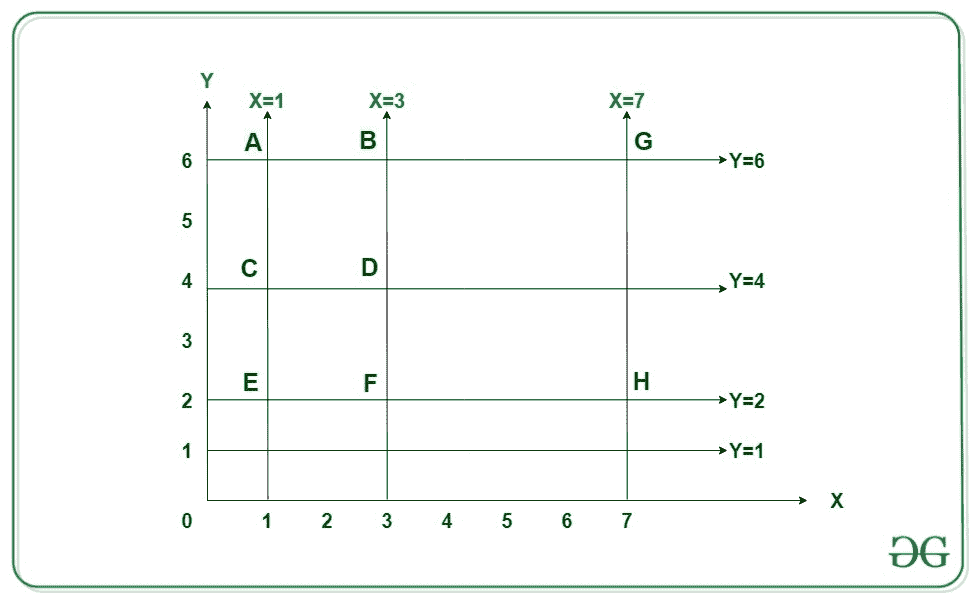

# 分别可以从平行于 X 和 Y 轴的 M 和 N 直线计算平方数

给定两个[数组](https://www.geeksforgeeks.org/introduction-to-arrays/) **X []** 和 **Y []** ，它们由 **N** 和 **M** 整数组成，使得存在 平行于 **y 轴**的 **N 条**线和平行于 **x 轴**的 **M** 条线。 任务是找到在坐标平面上由这些线形成的正方形总数。

> 阵列 **X []** 中的每个整数（例如 **a** ）表示具有等式 **x = a** 的线，平行于 **y 轴**。
> 数组 **Y []** 中的每个整数（例如 **b** ）表示平行于 **x 轴[等式 **y = b** 的线。** 。

**示例：**

> **输入：** N = 3，M = 4，X [] = {1，3，7}，Y [] = {2，4，6，1}。
> **输出：** 3
> **说明：**
> 3 线平行于 y 轴，x = 1，x = 3，x =7。
> 4 线平行于 y 轴。 y = 2，y = 4，y = 6，y =1。
> 
> 
> 
> 从上面的图像中，可以看出以下三个可能的正方形：
> 1）正方形 **CDEF** （x = 1，x = 3，y = 2，y = 4），边= 2 个单位。
> 2）正方形 **ABDC** （x = 1，x = 3，y = 4，y = 6），侧面= 2 个单位。
> 3）正方形 **BGHF** （x = 3，x = 7，y = 2，y = 6），侧面= 4 个单位。
> 
> **输入：** N = 5，M = 4，X [] = {1，9，2，3，7}，Y [] = {1,2,4，6}
> **输出：** 8

**方法：**请按照以下步骤解决问题：

*   在 **X []** 数组中找到所有对之间的距离，并将计数存储在[映射](http://www.geeksforgeeks.org/map-associative-containers-the-c-standard-template-library-stl/)中，例如 **M1** 。
*   在 **Y []** 数组中找到所有对之间的距离，并将计数存储在 Map **M2** 中。
*   如果在 **M2** 中存在 **M1** 对的距离，则可以通过使用这两个对来形成正方形。
*   因此，可以通过将 **M1** 以及 **M2** 中存储的所有距离计数相加来计算平方总数。
*   完成上述步骤后，打印平方总数。

下面是上述方法的实现：

## C ++

```

// C++ program for the above approach

#include <bits/stdc++.h>
using namespace std;

// Function to count all the possible
// squares with given lines parallel
// to both the X and Y axis
int numberOfSquares(int X[], int Y[],
                    int N, int M)
{
    // Stores the count of all possible
    // distances in X[] & Y[] respectively
    unordered_map<int, int> m1, m2;
    int i, j, ans = 0;

    // Find distance between all
    // pairs in the array X[]
    for (i = 0; i < N; i++) {
        for (j = i + 1; j < N; j++) {

            int dist = abs(X[i] - X[j]);

            // Add the count to m1
            m1[dist]++;
        }
    }

    // Find distance between all
    // pairs in the array Y[]
    for (i = 0; i < M; i++) {
        for (j = i + 1; j < M; j++) {

            int dist = abs(Y[i] - Y[j]);

            // Add the count to m2
            m2[dist]++;
        }
    }

    // Find sum of m1[i] * m2[i]
    // for same distance
    for (auto i = m1.begin();
         i != m1.end(); i++) {

        // Find current count in m2
        if (m2.find(i->first)
            != m2.end()) {

            // Add to the total count
            ans += (i->second
                    * m2[i->first]);
        }
    }

    // Return the final count
    return ans;
}

// Driver Code
int main()
{
    // Given lines
    int X[] = { 1, 3, 7 };
    int Y[] = { 2, 4, 6, 1 };

    int N = sizeof(X) / sizeof(X[0]);

    int M = sizeof(Y) / sizeof(Y[0]);

    // Function Call
    cout << numberOfSquares(X, Y, N, M);

    return 0;
}

```

## 爪哇

```

// Java program for the above approach
import java.io.*;
import java.util.*;

class GFG{

// Function to count all the possible
// squares with given lines parallel
// to both the X and Y axis
static int numberOfSquares(int[] X, int[] Y, int N,
                           int M)
{

    // Stores the count of all possible
    // distances in X[] & Y[] respectively
    HashMap<Integer, 
            Integer> m1 = new HashMap<Integer, 
                                      Integer>();
    HashMap<Integer, 
            Integer> m2 = new HashMap<Integer, 
                                      Integer>();

    int i, j, ans = 0;

    // Find distance between all
    // pairs in the array X[]
    for(i = 0; i < N; i++) 
    {
        for(j = i + 1; j < N; j++)
        {
            int dist = Math.abs(X[i] - X[j]);

            // Add the count to m1
            m1.put(dist, m1.getOrDefault(dist, 0) + 1);
        }
    }

    // Find distance between all
    // pairs in the array Y[]
    for(i = 0; i < M; i++) 
    {
        for(j = i + 1; j < M; j++) 
        {
            int dist = Math.abs(Y[i] - Y[j]);

            // Add the count to m2
            m2.put(dist, m2.getOrDefault(dist, 0) + 1);
        }
    }

    // Find sum of m1[i] * m2[i]
    // for same distance
    for(Map.Entry<Integer, 
                  Integer> entry : m1.entrySet())
    {

        // Find current count in m2
        if (m2.containsKey(entry.getKey()))
        {

            // Add to the total count
            ans += (entry.getValue() * 
             m2.get(entry.getKey()));
        }
    }

    // Return the final count
    return ans;
}

// Driver Code
public static void main(String[] args)
{

    // Given lines
    int X[] = { 1, 3, 7 };
    int Y[] = { 2, 4, 6, 1 };

    int N = X.length;

    int M = Y.length;

    // Function call
    System.out.println(numberOfSquares(X, Y, N, M));
}
}

// This code is contributed by akhilsaini

```

## Python3

```

# Python3 program for the above approach

# Function to count all the possible
# squares with given lines parallel
# to both the X and Y axis
def numberOfSquares(X, Y, N, M):

    # Stores the count of all possible
    # distances in X[] & Y[] respectively
    m1 = {}
    m2 = {}
    ans = 0

    # Find distance between all
    # pairs in the array X[]
    for i in range(0, N):
        for j in range(i + 1, N):
            dist = abs(X[i] - X[j])

            # Add the count to m1
            if dist in m1:
                m1[dist] = m1[dist] + 1
            else:
                m1[dist] = 1

    # Find distance between all
    # pairs in the array Y[]
    for i in range(0, M):
        for j in range(i + 1, M):
            dist = abs(Y[i] - Y[j])

            # Add the count to m2
            if dist in m2:
                m2[dist] = m2[dist] + 1
            else:
                m2[dist] = 1

    # Find sum of m1[i] * m2[i]
    # for same distance
    for key in m1:

        # Find current count in m2
        if key in m2:

            # Add to the total count
            ans = ans + (m1[key] * m2[key])

    # Return the final count
    return ans

# Driver Code
if __name__ == "__main__":

    # Given lines
    X = [ 1, 3, 7 ]
    Y = [ 2, 4, 6, 1 ]

    N = len(X)

    M = len(Y)

    # Function call
    print(numberOfSquares(X, Y, N, M))

# This code is contributed by akhilsaini

```

## C＃

```

// C# program for the above approach
using System;
using System.Collections.Generic;

class GFG{

// Function to count all the possible
// squares with given lines parallel
// to both the X and Y axis
static int numberOfSquares(int[] X, int[] Y, int N,
                           int M)
{

    // Stores the count of all possible
    // distances in X[] & Y[] respectively
    Dictionary<int, 
               int> m1 = new Dictionary<int,
                                        int>();
      Dictionary<int, 
                 int> m2 = new Dictionary<int,
                                          int>();

    int i, j, ans = 0;

    // Find distance between all
    // pairs in the array X[]
    for(i = 0; i < N; i++)
    {
        for(j = i + 1; j < N; j++) 
        {
            int dist = Math.Abs(X[i] - X[j]);

            // Add the count to m1
              if (m1.ContainsKey(dist))
                m1[dist]++;
              else
                m1.Add(dist, 1);
        }
    }

    // Find distance between all
    // pairs in the array Y[]
    for(i = 0; i < M; i++) 
    {
        for(j = i + 1; j < M; j++) 
        {
            int dist = Math.Abs(Y[i] - Y[j]);

            // Add the count to m2
            if (m2.ContainsKey(dist))
                m2[dist]++;
              else
                m2.Add(dist, 1);
        }
    }

    // Find sum of m1[i] * m2[i]
    // for same distance
    foreach(KeyValuePair<int, int> entry in m1)
    {

        // Find current count in m2
        if (m2.ContainsKey(entry.Key))
        {

            // Add to the total count
            ans += (entry.Value * 
                 m2[entry.Key]);
        }
    }

    // Return the final count
    return ans;
}

// Driver Code
public static void Main()
{

    // Given lines
    int[] X = { 1, 3, 7 };
    int[] Y = { 2, 4, 6, 1 };

    int N = X.Length;

    int M = Y.Length;

    // Function call
    Console.WriteLine(numberOfSquares(X, Y, N, M));
}
}

// This code is contributed by akhilsaini

```

**Output:** 

```
3

```

***时间复杂度：** O（N <sup>2</sup> ）*
***辅助空间：** O（N）*

注意读者！ 现在不要停止学习。 通过 [**DSA 自学课程**](https://practice.geeksforgeeks.org/courses/dsa-self-paced?utm_source=geeksforgeeks&utm_medium=article&utm_campaign=gfg_article_dsa_content_bottom) 以对学生方便的价格掌握所有重要的 DSA 概念，并为行业做好准备。

* * *

* * *

如果您喜欢 GeeksforGeeks 并希望做出贡献，则还可以使用 [tribution.geeksforgeeks.org](https://contribute.geeksforgeeks.org/) 撰写文章，或将您的文章邮寄至 tribution@geeksforgeeks.org。 查看您的文章出现在 GeeksforGeeks 主页上，并帮助其他 Geeks。

如果您发现任何不正确的地方，请单击下面的“改进文章”按钮，以改进本文。