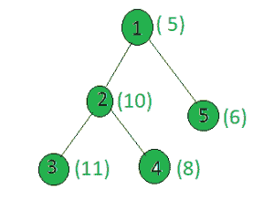

# 计算给定树中权重为偶校验的节点

> 原文： [https://www.geeksforgeeks.org/count-the-nodes-in-the-given-tree-whose-weight-is-even-parity/](https://www.geeksforgeeks.org/count-the-nodes-in-the-given-tree-whose-weight-is-even-parity/)

给定一棵树和所有节点的权重，任务是计算权重为偶校验的节点数，即它们中的设置位数是否为偶数。

**示例**：

> **输入**：
> 
> **输出**：3
> 
> | 重量 | 二进制表示 | 平价 |
> | --- | --- | --- |
> | 5 | 0101 | 甚至 |
> | 10 | 1010 | 甚至 |
> | 11 | 1011 | 奇 |
> | 8 | 1000 | 奇 |
> | 6 | 0110 | 甚至 |

**方法**：在树上执行 [dfs](http://www.geeksforgeeks.org/depth-first-traversal-for-a-graph/) ，对于每个节点，检查其权重是否均等。 如果是，则增加计数。

下面是上述方法的实现：

## C++

```cpp

// C++ implementation of the approach 
#include <bits/stdc++.h> 
using namespace std; 

int ans = 0; 

vector<int> graph[100]; 
vector<int> weight(100); 

// Function that returns true if count 
// of set bits in x is even 
bool isEvenParity(int x) 
{ 
    // parity will store the 
    // count of set bits 
    int parity = 0; 
    while (x != 0) { 
        x = x & (x - 1); 
        parity++; 
    } 

    if (parity % 2 == 0) 
        return true; 
    else
        return false; 
} 

// Function to perform dfs 
void dfs(int node, int parent) 
{ 
    // If weight of the current 
    // node has even parity 
    if (isEvenParity(weight[node])) 
        ans += 1; 

    for (int to : graph[node]) { 
        if (to == parent) 
            continue; 
        dfs(to, node); 
    } 
} 

// Driver code 
int main() 
{ 
    // Weights of the node 
    weight[1] = 5; 
    weight[2] = 10; 
    weight[3] = 11; 
    weight[4] = 8; 
    weight[5] = 6; 

    // Edges of the tree 
    graph[1].push_back(2); 
    graph[2].push_back(3); 
    graph[2].push_back(4); 
    graph[1].push_back(5); 

    dfs(1, 1); 

    cout << ans; 

    return 0; 
} 

```

## Java

```java

// Java implementation of the approach  
import java.util.*; 

class GFG 
{ 

static int ans = 0;  

static Vector<Vector<Integer>> graph = new Vector<Vector<Integer>>();  
static Vector<Integer> weight = new Vector<Integer>();  

// Function that returns true if count  
// of set bits in x is even  
static boolean isEvenParity(int x)  
{  
    // parity will store the  
    // count of set bits  
    int parity = 0;  
    while (x != 0)  
    {  
        x = x & (x - 1);  
        parity++;  
    }  

    if (parity % 2 == 0)  
        return true;  
    else
        return false;  
}  

// Function to perform dfs  
static void dfs(int node, int parent)  
{  
    // If weight of the current  
    // node has even parity  
    if (isEvenParity(weight.get(node) )) 
        ans += 1;  

    for (int i = 0; i < graph.get(node).size(); i++)  
    {  
        if (graph.get(node).get(i) == parent)  
            continue;  
        dfs(graph.get(node).get(i) , node);  
    }  
}  

// Driver code  
public static void main(String args[]) 
{  
    // Weights of the node  
    weight.add( 0);  
    weight.add( 5);  
    weight.add( 10);;  
    weight.add( 11);;  
    weight.add( 8);  
    weight.add( 6);  

    for(int i=0;i<100;i++) 
    graph.add(new Vector<Integer>()); 

    // Edges of the tree  
    graph.get(1).add(2);  
    graph.get(2).add(3);  
    graph.get(2).add(4);  
    graph.get(1).add(5);  

    dfs(1, 1);  

    System.out.println( ans );  

} 
} 

// This code is contributed by Arnab Kundu 

```

## Python3

```

# Python3 implementation of the approach 
ans = 0

graph = [[] for i in range(100)] 
weight = [0]*100

# Function that returns True if count 
# of set bits in x is even 
def isEvenParity(x): 

    # parity will store the 
    # count of set bits 
    parity = 0
    while (x != 0): 
        x = x & (x - 1) 
        parity += 1

    if (parity % 2 == 0): 
        return True
    else: 
        return False

# Function to perform dfs 
def dfs(node, parent): 
    global ans 

    # If weight of the current 
    # node has even parity 
    if (isEvenParity(weight[node])): 
        ans += 1

    for to in graph[node]: 
        if (to == parent): 
            continue
        dfs(to, node) 

# Driver code 

# Weights of the node 
weight[1] = 5
weight[2] = 10
weight[3] = 11
weight[4] = 8
weight[5] = 6

# Edges of the tree 
graph[1].append(2) 
graph[2].append(3) 
graph[2].append(4) 
graph[1].append(5) 

dfs(1, 1) 
print(ans) 

# This code is contributed by SHUBHAMSINGH10 

```

## C#

```cs

// C# implementation of the approach  
using System; 
using System.Collections.Generic; 

class GFG 
{ 

static int ans = 0;  

static List<List<int>> graph = new List<List<int>>(); 
static List<int> weight = new List<int>(); 

// Function that returns true if count  
// of set bits in x is even  
static bool isEvenParity(int x)  
{  
    // parity will store the  
    // count of set bits  
    int parity = 0;  
    while (x != 0)  
    {  
        x = x & (x - 1);  
        parity++;  
    }  

    if (parity % 2 == 0)  
        return true;  
    else
        return false;  
}  

// Function to perform dfs  
static void dfs(int node, int parent)  
{  
    // If weight of the current  
    // node has even parity  
    if (isEvenParity(weight[node])) 
        ans += 1;  

    for (int i = 0; i < graph[node].Count; i++)  
    {  
        if (graph[node][i] == parent)  
            continue;  
        dfs(graph[node][i] , node);  
    }  
}  

// Driver code  
static void Main() 
{  
    // Weights of the node  
    weight.Add(0);  
    weight.Add(5);  
    weight.Add(10); 
    weight.Add(11); 
    weight.Add(8);  
    weight.Add(6);  

    for(int i = 0; i < 100; i++) 
    graph.Add(new List<int>()); 

    // Edges of the tree  
    graph[1].Add(2);  
    graph[2].Add(3);  
    graph[2].Add(4);  
    graph[1].Add(5);  

    dfs(1, 1);  

    Console.WriteLine( ans );  
} 
} 

// This code is contributed by mits 

```

**Output:**

```
3

```

**<u>复杂度分析：</u>**

*   **时间复杂度**：O（N）。
    在 DFS 中，树的每个节点都处理一次，因此，由于 DFS 导致的复杂度对于树中的 N 个节点为 O（N）。 因此，时间复杂度为 O（N）。
*   **辅助空间**：O（1）。
    不需要任何额外的空间，因此空间复杂度是恒定的。


* * *

* * *

如果您喜欢 GeeksforGeeks 并希望做出贡献，则还可以使用 [tribution.geeksforgeeks.org](https://contribute.geeksforgeeks.org/) 撰写文章，或将您的文章邮寄至 tribution@geeksforgeeks.org。 查看您的文章出现在 GeeksforGeeks 主页上，并帮助其他 Geeks。

如果您发现任何不正确的地方，请单击下面的“改进文章”按钮，以改进本文。