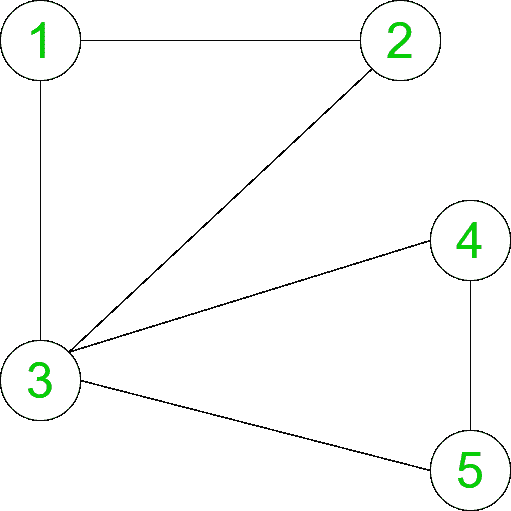

# 计算无向图

中的主要集团数量

> 原文： [https://www.geeksforgeeks.org/count-the-number-of-prime-cliques-in-an-undirected-graph/](https://www.geeksforgeeks.org/count-the-number-of-prime-cliques-in-an-undirected-graph/)

给定一个具有 **N 个**节点和 **E** 边缘的图，任务是计算其大小为给定图中节点的质数或质数的团数。

> **集团**是给定图的完整子图。

**示例：**

> **输入：** N = 5，边缘[] = {{1，2}，{2，3}，{3，1}，{4，3}，{4，5}，{5， 3}}
> [](https://media.geeksforgeeks.org/wp-content/uploads/20200511165345/Count-the-number-of-Prime-Cliques-in-an-undirected-graph.png) 
> **输出：** 8
> **说明：**
> 在给定的无向图中，1- > 2- > 3 和 3- > 4- > 5 是两个完整的子图，两个子图均为素数 3。
> 此外，1-2、2- > 3、3- > 1、4- > 3、4- > 5 和 5- > 3 是大小为 2 的完整子图。
> 因此，有 8 个主要集团。

**方法：**为了解决上述问题，主要思想是使用[递归](https://www.geeksforgeeks.org/recursion/)。 找到其度大于或等于（K-1）的所有顶点，并检查 K 个顶点的哪个子集形成一个集团。 将另一条边添加到当前列表时，将检查是否通过添加该边来确定列表是否仍然是集团。 可以按照以下步骤计算结果：

*   要检查集团大小是否为素数，我们的想法是使用[橡皮擦筛网](https://www.geeksforgeeks.org/sieve-of-eratosthenes/)。 创建一个筛子，这将有助于我们确定在 **O（1）时间**中尺寸是否为质数。
*   用三个参数组成一个递归函数：起始节点，当前节点集的长度和素数数组（以检查素数）。
*   起始索引类似于不能将少于该索引的节点添加到当前集中。 因此，循环从该索引运行到 n。
*   在将节点添加到当前集合后发现**，该节点集仍然是集团。 如果是，则添加该节点，然后检查当前集团的大小，如果为素数，则将答案增加 1，然后使用新添加的节点的参数索引+ 1，当前集合的长度+ 1 调用递归函数。 和素数数组。**
*   将添加顶点，直到列表不形成集团为止。 最后，打印出包含主要集团数量的答案。

**下面是上述方法的实现：**

## C ++

```

// C++ implementation to Count the number 
// of Prime Cliques in an undirected graph 

#include <bits/stdc++.h> 
using namespace std; 

const int MAX = 100; 

// Stores the vertices 
int store[MAX], n; 

// Graph 
int graph[MAX][MAX]; 

// Degree of the vertices 
int d[MAX]; 

// To store the count of prime cliques 
int ans; 

// Function to create 
// Sieve to check primes 
void SieveOfEratosthenes( 
    bool prime[], int p_size) 
{ 
    // false here indicates 
    // that it is not prime 
    prime[0] = false; 
    prime[1] = false; 

    for (int p = 2; p * p <= p_size; p++) { 

        // Condition if prime[p] 
        // is not changed, 
        // then it is a prime 
        if (prime[p]) { 

            // Update all multiples of p, 
            // set them to non-prime 
            for (int i = p * 2; i <= p_size; i += p) 
                prime[i] = false; 
        } 
    } 
} 

// Function to check 
// if the given set of 
// vertices in store array 
// is a clique or not 
bool is_clique(int b) 
{ 

    // Run a loop for all set of edges 
    for (int i = 1; i < b; i++) { 
        for (int j = i + 1; j < b; j++) 

            // If any edge is missing 
            if (graph[store[i]][store[j]] == 0) 
                return false; 
    } 
    return true; 
} 

// Function to find the count of 
// all the cliques having prime size 
void primeCliques(int i, int l, 
                  bool prime[]) 
{ 
    // Check if any vertices from i+1 
    // can be inserted 
    for (int j = i + 1; j <= n; j++) { 

        // Add the vertex to store 
        store[l] = j; 

        // If the graph is not 
        // a clique of size k then 
        // it cannot be a clique 
        // by adding another edge 
        if (is_clique(l + 1)) { 

            // increase the count of 
            // prime cliques if the size 
            // of current clique is prime 
            if (prime[l]) 
                ans++; 

            // Check if another edge 
            // can be added 
            primeCliques(j, l + 1, prime); 
        } 
    } 
} 

// Driver code 
int main() 
{ 
    int edges[][2] = { { 1, 2 }, 
                       { 2, 3 }, 
                       { 3, 1 }, 
                       { 4, 3 }, 
                       { 4, 5 }, 
                       { 5, 3 } }; 

    int size = sizeof(edges) 
               / sizeof(edges[0]); 
    n = 5; 

    bool prime[n + 1]; 
    memset(prime, true, sizeof(prime)); 

    SieveOfEratosthenes(prime, n + 1); 

    for (int i = 0; i < size; i++) { 
        graph[edges[i][0]][edges[i][1]] = 1; 
        graph[edges[i][1]][edges[i][0]] = 1; 
        d[edges[i][0]]++; 
        d[edges[i][1]]++; 
    } 

    ans = 0; 
    primeCliques(0, 1, prime); 

    cout << ans << "\n"; 

    return 0; 
} 

```