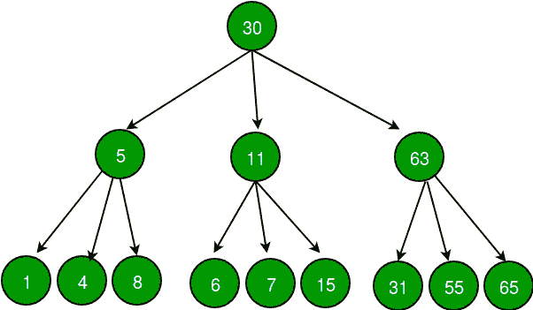

# 从三叉树创建一个双向链表

> 原文：[https://www.geeksforgeeks.org/create-doubly-linked-list-ternary-ree/](https://www.geeksforgeeks.org/create-doubly-linked-list-ternary-ree/)

给定三元树，从中创建一个双向链表。 三叉树类似于二叉树，但是没有两个节点，而是具有三个节点，即左，中，右。

双链列表应包含以下属性–

1.  三叉树的左指针应充当双向链表的上一个指针。

2.  三叉树的中间指针不应指向任何东西。

3.  三叉树的右指针应充当双向链表的下一个指针。

4.  三叉树的每个节点都在其子树之前插入到双向链表中，对于任何节点，将首先插入其左子节点，然后插入中子节点和右子节点（如果有）。

对于上面的示例，为下面的树形成的链表应该为 NULL 5 1 4 8 11 6 7 15 63 31 55 65-> NULL->->->->->->->->->-> ->->



**我们强烈建议您最小化浏览器，然后自己尝试。**

这个想法是以类似于二进制二叉树遍历遍历的预整理方式遍历树。 在这里，当我们访问一个节点时，我们将使用尾指针将其最终插入到双向链表中。 我们用来维护所需的插入顺序。 然后，我们以该顺序递归调用左孩子，中间孩子和右孩子。

以下是此想法的实现。

## C++

```cpp

// C++ program to create a doubly linked list out 
// of given a ternary tree. 
#include <bits/stdc++.h> 
using namespace std; 

/* A ternary tree */
struct Node 
{ 
    int data; 
    struct Node *left, *middle, *right; 
}; 

/* Helper function that allocates a new node with the 
   given data and assign NULL to left, middle and right 
   pointers.*/
Node* newNode(int data) 
{ 
    Node* node = new Node; 
    node->data = data; 
    node->left = node->middle = node->right = NULL; 
    return node; 
} 

/* Utility function that constructs doubly linked list 
by inserting current node at the end of the doubly 
linked list by using a tail pointer */
void push(Node** tail_ref, Node* node) 
{ 
    // initilize tail pointer 
    if (*tail_ref == NULL) 
    { 
        *tail_ref = node; 

        // set left, middle and right child to point 
        // to NULL 
        node->left = node->middle = node->right = NULL; 

        return; 
    } 

    // insert node in the end using tail pointer 
    (*tail_ref)->right = node; 

    // set prev of node 
    node->left = (*tail_ref); 

    // set middle and right child to point to NULL 
    node->right = node->middle = NULL; 

    // now tail pointer will point to inserted node 
    (*tail_ref) = node; 
} 

/* Create a doubly linked list out of given a ternary tree. 
by traversing the tree in preoder fashion. */
Node* TernaryTreeToList(Node* root, Node** head_ref) 
{ 
    // Base case 
    if (root == NULL) 
        return NULL; 

    //create a static tail pointer 
    static Node* tail = NULL; 

    // store left, middle and right nodes 
    // for future calls. 
    Node* left = root->left; 
    Node* middle = root->middle; 
    Node* right = root->right; 

    // set head of the doubly linked list 
    // head will be root of the ternary tree 
    if (*head_ref == NULL) 
        *head_ref = root; 

    // push current node in the end of DLL 
    push(&tail, root); 

    //recurse for left, middle and right child 
    TernaryTreeToList(left, head_ref); 
    TernaryTreeToList(middle, head_ref); 
    TernaryTreeToList(right, head_ref); 
} 

// Utility function for printing double linked list. 
void printList(Node* head) 
{ 
    printf("Created Double Linked list is:\n"); 
    while (head) 
    { 
        printf("%d ", head->data); 
        head = head->right; 
    } 
} 

// Driver program to test above functions 
int main() 
{ 
    // Construting ternary tree as shown in above figure 
    Node* root = newNode(30); 

    root->left = newNode(5); 
    root->middle = newNode(11); 
    root->right = newNode(63); 

    root->left->left = newNode(1); 
    root->left->middle = newNode(4); 
    root->left->right = newNode(8); 

    root->middle->left = newNode(6); 
    root->middle->middle = newNode(7); 
    root->middle->right = newNode(15); 

    root->right->left = newNode(31); 
    root->right->middle = newNode(55); 
    root->right->right = newNode(65); 

    Node* head = NULL; 

    TernaryTreeToList(root, &head); 

    printList(head); 

    return 0; 
} 

```

## Java

```java

//Java program to create a doubly linked list  
// from a given ternary tree. 

//Custom node class. 
class newNode 
{ 
    int data; 
    newNode left,middle,right; 
    public newNode(int data) 
    { 
        this.data = data; 
        left = middle = right = null; 
    } 
} 

class GFG { 

    //tail of the linked list. 
    static newNode tail;  

    //function to push the node to the tail. 
    public static void push(newNode node) 
    { 
        //to put the node at the end of 
        // the already existing tail. 
        tail.right = node;                  

        //to point to the previous node. 
        node.left = tail;          

        // middle pointer should point to  
        // nothing so null. initiate right 
        // pointer to null. 
        node.middle = node.right = null;  

        //update the tail position. 
        tail = node;              
    } 

    /* Create a doubly linked list out of given a ternary tree. 
    by traversing the tree in preoder fashion. */
    public static void ternaryTree(newNode node,newNode head) 
    { 
        if(node == null) 
            return;                      
        newNode left = node.left; 
        newNode middle = node.middle; 
        newNode right = node.right; 
        if(tail != node) 

            // already root is in the tail so dont push  
            // the node when it was root.In the first  
            // case both node and tail have root in them. 
            push(node);              

        // First the left child is to be taken. 
        // Then middle and then right child. 
        ternaryTree(left,head);          
        ternaryTree(middle,head); 
        ternaryTree(right,head); 
    } 

    //function to initiate the list process. 
    public static newNode startTree(newNode root) 
    { 
        //Initiate the head and tail with root. 
        newNode head = root; 
        tail = root; 
        ternaryTree(root,head); 

        //since the head,root are passed  
        // with reference the changes in  
        // root will be reflected in head. 
        return head;          
    } 

    // Utility function for printing double linked list. 
    public static void printList(newNode head)  
    { 
        System.out.print("Created Double Linked list is:\n"); 
        while(head != null) 
        { 
            System.out.print(head.data + " "); 
            head = head.right; 
        } 
    } 

    // Driver program to test above functions 
    public static void main(String args[]) 
    { 

        // Construting ternary tree as shown 
        // in above figure 
        newNode root = new newNode(30); 
        root.left = new newNode(5); 
        root.middle = new newNode(11); 
        root.right = new newNode(63); 
        root.left.left = new newNode(1); 
        root.left.middle = new newNode(4); 
        root.left.right = new newNode(8); 
        root.middle.left = new newNode(6); 
        root.middle.middle = new newNode(7); 
        root.middle.right = new newNode(15); 
        root.right.left = new newNode(31); 
        root.right.middle = new newNode(55); 
        root.right.right = new newNode(65); 

        // The function which initiates the list  
        // process returns the head. 
        newNode head = startTree(root);          
        printList(head); 
    } 
} 

// This code is contributed by M.V.S.Surya Teja. 

```

## C#

```cs

// C# program to create a doubly linked  
// list from a given ternary tree.  
using System; 

// Custom node class.  
public class newNode 
{ 
    public int data; 
    public newNode left, middle, right; 
    public newNode(int data) 
    { 
        this.data = data; 
        left = middle = right = null; 
    } 
} 

class GFG 
{ 

// tail of the linked list.  
public static newNode tail; 

// function to push the node to the tail.  
public static void push(newNode node) 
{ 
    // to put the node at the end of  
    // the already existing tail.  
    tail.right = node; 

    // to point to the previous node.  
    node.left = tail; 

    // middle pointer should point to  
    // nothing so null. initiate right  
    // pointer to null.  
    node.middle = node.right = null; 

    // update the tail position.  
    tail = node; 
} 

/* Create a doubly linked list out  
of given a ternary tree. by traversing 
the tree in preoder fashion. */
public static void ternaryTree(newNode node,  
                               newNode head) 
{ 
    if (node == null) 
    { 
        return; 
    } 
    newNode left = node.left; 
    newNode middle = node.middle; 
    newNode right = node.right; 
    if (tail != node) 
    { 

        // already root is in the tail so dont push  
        // the node when it was root.In the first  
        // case both node and tail have root in them.  
        push(node); 
    } 

    // First the left child is to be taken.  
    // Then middle and then right child.  
    ternaryTree(left, head); 
    ternaryTree(middle, head); 
    ternaryTree(right, head); 
} 

// function to initiate the list process.  
public static newNode startTree(newNode root) 
{ 
    // Initiate the head and tail with root.  
    newNode head = root; 
    tail = root; 
    ternaryTree(root,head); 

    // since the head,root are passed  
    // with reference the changes in  
    // root will be reflected in head.  
    return head; 
} 

// Utility function for printing  
// double linked list.  
public static void printList(newNode head) 
{ 
    Console.Write("Created Double Linked list is:\n"); 
    while (head != null) 
    { 
        Console.Write(head.data + " "); 
        head = head.right; 
    } 
} 

// Driver Code 
public static void Main(string[] args) 
{ 

    // Construting ternary tree as shown  
    // in above figure  
    newNode root = new newNode(30); 
    root.left = new newNode(5); 
    root.middle = new newNode(11); 
    root.right = new newNode(63); 
    root.left.left = new newNode(1); 
    root.left.middle = new newNode(4); 
    root.left.right = new newNode(8); 
    root.middle.left = new newNode(6); 
    root.middle.middle = new newNode(7); 
    root.middle.right = new newNode(15); 
    root.right.left = new newNode(31); 
    root.right.middle = new newNode(55); 
    root.right.right = new newNode(65); 

    // The function which initiates the list  
    // process returns the head.  
    newNode head = startTree(root); 
    printList(head); 
} 
} 

// This code is contributed by Shrikant13 

```

**Output:**

```
Created Double Linked list is:
30 5 1 4 8 11 6 7 15 63 31 55 65 

```

本文由 **Aditya Goel** 提供。 如果您喜欢 GeeksforGeeks 并希望做出贡献，那么您也可以写一篇文章，然后将您的文章邮寄到 contribution@geeksforgeeks.org。 查看您的文章出现在 GeeksforGeeks 主页上，并帮助其他 Geeks。

如果发现任何不正确的地方，或者您想分享有关上述主题的更多信息，请发表评论

