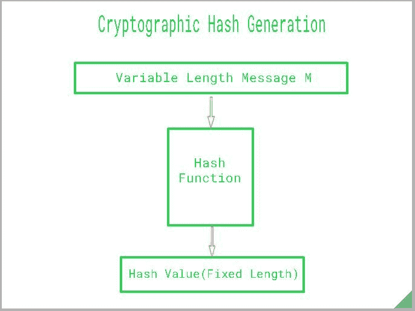
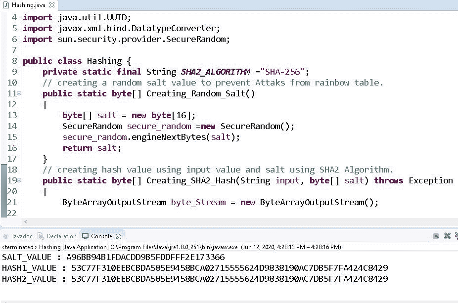

# Java 中的加密哈希函数

> 原文：[https://www.geeksforgeeks.org/cryptographic-hash-function-in-java/](https://www.geeksforgeeks.org/cryptographic-hash-function-in-java/)

**加密哈希**是[哈希函数](https://www.geeksforgeeks.org/what-are-hash-functions-and-how-to-choose-a-good-hash-function/)，它接受随机大小的输入并产生固定大小的输出。 它很容易计算，但是要检索原始数据却很困难。 用唯一的输入来复制相同的哈希值是很困难的，并且是一种单向函数，因此无法进行还原。 散列也以不同的名称而闻名，例如摘要，[消息摘要](https://www.geeksforgeeks.org/messagedigest-getinstance-method-in-java-with-examples/)，[校验和](https://www.geeksforgeeks.org/implementing-checksum-using-java/)等。



### 密码学哈希函数的属性

理想的加密哈希函数具有以下主要属性：

1.  **确定性**：这意味着相同的消息始终导致相同的哈希。

2.  **快速**：快速计算任何给定消息的哈希值。

3.  **雪崩效果**：这意味着消息中的每个细微变化都会导致哈希值出现较大变化。

4.  **单向特性**：您无法反转加密散列函数来获取数据。

5.  **防冲突性**：找到两个产生相同哈希值的不同消息是不可行的。

### 破解哈希

我们经常听到“破解哈希”一词，有两种方法可以做到：

*   寻找一种算法来生成两个哈希之间的冲突。 算法越先进，破解散列就越困难。

*   另一种方法是找到一种算法，以识别将产生给定哈希的唯一且不同的输入。 它类似于碰撞，但不是碰撞，而是着重于使用算法查找输入。

*   从密码学角度来看，我们今天仍在使用的一些常见哈希值是 MD5（消息摘要算法）和 SHA-1（安全哈希算法 1）。 请记住，从技术上讲，它们是散列，并且永远不会出于安全目的使用。

### 如何创建加密哈希

*   使用`SecureRandom`类创建随机盐值，`SecureRandom`类生成强随机值。 `engineNextBytes(byte[] bytes)`方法用于生成用户指定数量的随机字节。

*   使用`ByteArrayOutputStream`类将两组字节转换为一组字节，然后将其创建为`ByteArray`。

*   创建一个传递`SHA2_ALGORITHM`的`messageDigest`实例，该实例返回给定输入值的哈希值。

*   `UUID`用于生成随机数，该随机数将转换为字符串并作为输入传递。

*   可以使用`DatatypeConverter`将返回的对象转换为十六进制二进制格式。

## Java

```java

// Java program to demonstrate 
// how to create a Hash 

package java_cryptography; 

import java.io.ByteArrayOutputStream; 
import java.security.MessageDigest; 
import java.util.UUID; 
import javax.xml.bind.DatatypeConverter; 
import sun.security.provider.SecureRandom; 

public class Hashing { 

    // Initializing the final string variable 
    private static final String SHA2_ALGORITHM 
        = "SHA-256"; 

    // Creating a random salt value to prevent 
    // attacks from the Rainbow table. 
    public static byte[] Creating_Random_Salt() 
    { 
        byte[] salt = new byte[16]; 
        SecureRandom secure_random 
            = new SecureRandom(); 
        secure_random.engineNextBytes(salt); 
        return salt; 
    } 

    // Creating hash value using input value 
    // and salt using the SHA2 Algorithm. 
    public static byte[] Creating_SHA2_Hash( 
        String input, byte[] salt) throws Exception 
    { 
        ByteArrayOutputStream byte_Stream 
            = new ByteArrayOutputStream(); 

        byte_Stream.write(salt); 
        byte_Stream.write(input.getBytes()); 
        byte[] valueToHash 
            = byte_Stream.toByteArray(); 
        MessageDigest messageDigest 
            = MessageDigest 
                  .getInstance(SHA2_ALGORITHM); 
        return messageDigest 
            .digest(valueToHash); 
    } 

    public static void main(String args[]) 
        throws Exception 
    { 

        // Calling the function Creating_Random_Salt() 
        // to generate a random salt value 
        byte[] salt = Creating_Random_Salt(); 
        System.out.println( 
            "SALT_VALUE: "
            + DatatypeConverter.printHexBinary(salt)); 
        String valueToHash 
            = UUID.randomUUID().toString(); 

        // Generating first hash with the salt 
        byte[] hash1 
            = Creating_SHA2_Hash(valueToHash, salt); 

        // Generating second hash with exact salt 
        // to check if we get the same hash. 
        byte[] hash2 
            = Creating_SHA2_Hash(valueToHash, salt); 

        // Print first and the second hash value 
        System.out.println( 
            "HASH1_VALUE: "
            + DatatypeConverter 
                  .printHexBinary(hash1)); 
        System.out.println( 
            "HASH2_VALUE: "
            + DatatypeConverter 
                  .printHexBinary(hash2)); 
    } 
} 

```

**注意**：盐是添加到输入数据（密码）中的随机值，以防御诸如彩虹表之类的预先计算的哈希攻击。

**输出**：

```
SALT_VALUE: A96BB94B1FDACDD9B5FDDFFF2E173366
HASH1_VALUE: 53C77F310EEBCBDA585E9458BCA02715555624D9838190AC7DB5F7FA424C8429
HASH2_VALUE: 53C77F310EEBCBDA585E9458BC87B89853B8FA7365
```



### 如何创建加密哈希密码

正如我们已经看到如何立即生成哈希一样，让我们​​使用`Bcrypt`来哈希密码。 不要将散列的散列算法用于散列密码。 `Bcrypt`是基于 [Blowfish](https://www.geeksforgeeks.org/blowfish-algorithm-with-examples/) 加密算法的密码哈希功能。

**方法**：

*   将密码传递给`Bcrypt`类中的`hashpw`函数，该函数也可以自行生成盐并返回字符串。

*   使用`checkpw()`函数验证密码哈希和密码是否真正匹配。 它返回一个布尔值。

**代码**：

## Java

```java

// Java program to demonstrate 
// how to hash a password 

package java_cryptography; 

import java.util.Scanner; 
import org.springframework 
    .security 
    .crypto 
    .bcrypt 
    .BCrypt; 

public class Hashing { 

    // Creating a private instance 
    // of Scanner class 
    private static Scanner sc; 

    // BCrypt is a password Hashing 
    // Function based on Blowfish 
    // Algorithm. 
    public static String Password_Hash( 
        String password) 
    { 
        return BCrypt.hashpw( 
            password, BCrypt.gensalt()); 
    } 

    // Verifying password with the 
    // hashed password. 
    public static boolean Verify_Password( 
        String password, 
        String hashed_password) 
    { 
        return BCrypt.checkpw( 
            password, hashed_password); 
    } 

    public static void main( 
        String args[]) throws Exception 
    { 

        // Scanner class instance connected 
        // to the Input Stream(System.in) 
        sc = new Scanner(System.in); 

        System.out.println( 
            "Enter the password: "); 

        // Scanner class instance 
        // reading the user input 
        String p = sc.nextLine(); 

        // Generate hashed password 
        String passwordHash 
            = Password_Hash(p); 

        // Print Hashed Password 
        System.out.println( 
            "Hashed-password: "
            + passwordHash); 

        // Printing the result of verification 
        // of hashed password 
        // with original password 
        System.out.println( 
            "Verification: "
            + Verify_Password( 
                  p, passwordHash)); 
    } 
} 

```

**输出**：

> **输入**：`GEEKS FOR GEEKS`
> 
> **输出**：`$2a$10$u6MFjykfR76nHGfhYYzjjOOe1I3EY.YxpQY4vKRHpKRCqz7w69RTa`


### 哈希使用

*   数字签名。

*   数字指纹。

*   记录敏感数据。

*   保存密码。


* * *

* * *


