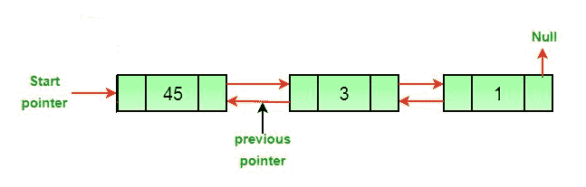
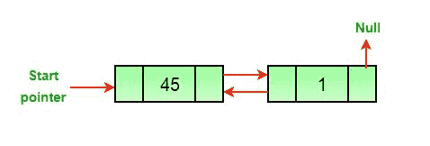
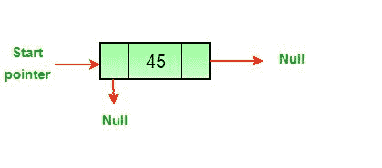
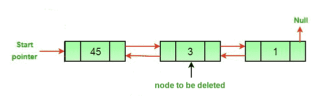

# 删除双链表

> 原文：[https://www.geeksforgeeks.org/delete-a-node-in-a-doubly-linked-list/](https://www.geeksforgeeks.org/delete-a-node-in-a-doubly-linked-list/)

中的节点

**先决条件**：[双链表集 1 | 简介和插入](http://quiz.geeksforgeeks.org/doubly-linked-list/)

编写函数以删除双向链表中的给定节点。

**原始双向链表**


**方法**：删除双向链表中的节点可以分为三个主要类别：

*   **删除头节点后。**



*   **删除中间节点后。**



*   **删除最后一个节点后。**



**如果要删除的节点的指针和头指针是已知的，则可以分两步处理所有上述三种情况。**

1.  如果要删除的节点是头节点，则使下一个节点为头节点。

2.  如果删除了节点，请连接已删除节点的下一个和上一个节点。



**算法**

*   令要删除的节点为 *del* 。

*   如果要删除的节点是头节点，则将头指针更改为下一个当前头。

```
if *headnode* == *del* then
      *headnode* =  *del*.nextNode

```

*   如果 *del* 之前存在 *del* 之前，则在 *del* 之前设置*。*

```
if *del*.nextNode != *none* 
      *del*.nextNode.previousNode = *del*.previousNode 
```

*   如果 *del* 旁边存在 *prev* ，则在 *del* 旁边。

```
if *del*.previousNode != *none* 
      *del*.previousNode.nextNode = *del*.next

```

## C++

```cpp

// C++ program to delete a node from
// Doubly Linked List
#include <bits/stdc++.h>
using namespace std;

/* a node of the doubly linked list */
class Node 
{ 
    public:
    int data; 
    Node* next; 
    Node* prev; 
}; 

/* Function to delete a node in a Doubly Linked List. 
head_ref --> pointer to head node pointer. 
del --> pointer to node to be deleted. */
void deleteNode(Node** head_ref, Node* del) 
{ 
    /* base case */
    if (*head_ref == NULL || del == NULL) 
        return; 

    /* If node to be deleted is head node */
    if (*head_ref == del) 
        *head_ref = del->next; 

    /* Change next only if node to be 
    deleted is NOT the last node */
    if (del->next != NULL) 
        del->next->prev = del->prev; 

    /* Change prev only if node to be 
    deleted is NOT the first node */
    if (del->prev != NULL) 
        del->prev->next = del->next; 

    /* Finally, free the memory occupied by del*/
    free(del); 
    return; 
} 

/* UTILITY FUNCTIONS */
/* Function to insert a node at the
beginning of the Doubly Linked List */
void push(Node** head_ref, int new_data) 
{ 
    /* allocate node */
    Node* new_node = new Node();

    /* put in the data */
    new_node->data = new_data; 

    /* since we are adding at the beginning, 
    prev is always NULL */
    new_node->prev = NULL; 

    /* link the old list off the new node */
    new_node->next = (*head_ref); 

    /* change prev of head node to new node */
    if ((*head_ref) != NULL) 
        (*head_ref)->prev = new_node; 

    /* move the head to point to the new node */
    (*head_ref) = new_node; 
} 

/* Function to print nodes in a given doubly linked list 
This function is same as printList() of singly linked list */
void printList(Node* node) 
{ 
    while (node != NULL) 
    { 
        cout << node->data << " "; 
        node = node->next; 
    } 
} 

/* Driver code*/
int main() 
{ 
    /* Start with the empty list */
    Node* head = NULL; 

    /* Let us create the doubly linked list 10<->8<->4<->2 */
    push(&head, 2); 
    push(&head, 4); 
    push(&head, 8); 
    push(&head, 10); 

    cout << "Original Linked list "; 
    printList(head); 

    /* delete nodes from the doubly linked list */
    deleteNode(&head, head); /*delete first node*/
    deleteNode(&head, head->next); /*delete middle node*/
    deleteNode(&head, head->next); /*delete last node*/

    /* Modified linked list will be NULL<-8->NULL */
    cout << "\nModified Linked list "; 
    printList(head); 

    return 0;
} 

// This code is contributed by rathbhupendra

```

## C

```c

#include <stdio.h>
#include <stdlib.h>

/* a node of the doubly linked list */
struct Node {
    int data;
    struct Node* next;
    struct Node* prev;
};

/* Function to delete a node in a Doubly Linked List.
   head_ref --> pointer to head node pointer.
   del  -->  pointer to node to be deleted. */
void deleteNode(struct Node** head_ref, struct Node* del)
{
    /* base case */
    if (*head_ref == NULL || del == NULL)
        return;

    /* If node to be deleted is head node */
    if (*head_ref == del)
        *head_ref = del->next;

    /* Change next only if node to be deleted is NOT the last node */
    if (del->next != NULL)
        del->next->prev = del->prev;

    /* Change prev only if node to be deleted is NOT the first node */
    if (del->prev != NULL)
        del->prev->next = del->next;

    /* Finally, free the memory occupied by del*/
    free(del);
    return;
}

/* UTILITY FUNCTIONS */
/* Function to insert a node at the beginning of the Doubly Linked List */
void push(struct Node** head_ref, int new_data)
{
    /* allocate node */
    struct Node* new_node = (struct Node*)malloc(sizeof(struct Node));

    /* put in the data  */
    new_node->data = new_data;

    /* since we are adding at the beginning,
    prev is always NULL */
    new_node->prev = NULL;

    /* link the old list off the new node */
    new_node->next = (*head_ref);

    /* change prev of head node to new node */
    if ((*head_ref) != NULL)
        (*head_ref)->prev = new_node;

    /* move the head to point to the new node */
    (*head_ref) = new_node;
}

/* Function to print nodes in a given doubly linked list
   This function is same as printList() of singly linked list */
void printList(struct Node* node)
{
    while (node != NULL) {
        printf("%d ", node->data);
        node = node->next;
    }
}

/* Driver program to test above functions*/
int main()
{
    /* Start with the empty list */
    struct Node* head = NULL;

    /* Let us create the doubly linked list 10<->8<->4<->2 */
    push(&head, 2);
    push(&head, 4);
    push(&head, 8);
    push(&head, 10);

    printf("\n Original Linked list ");
    printList(head);

    /* delete nodes from the doubly linked list */
    deleteNode(&head, head); /*delete first node*/
    deleteNode(&head, head->next); /*delete middle node*/
    deleteNode(&head, head->next); /*delete last node*/

    /* Modified linked list will be NULL<-8->NULL */
    printf("\n Modified Linked list ");
    printList(head);

    getchar();
}

```

## Java

```java

// Java program to delete a node from
// Doubly Linked List

// Class for Doubly Linked List
public class DLL {
    Node head; // head of list

    /* Doubly Linked list Node*/
    class Node {
        int data;
        Node prev;
        Node next;

        // Constructor to create a new node
        // next and prev is by default initialized
        // as null
        Node(int d) { data = d; }
    }

    // Adding a node at the front of the list
    public void push(int new_data)
    {
        // 1\. allocate node
        // 2\. put in the data
        Node new_Node = new Node(new_data);

        // 3\. Make next of new node as head
        // and previous as NULL
        new_Node.next = head;
        new_Node.prev = null;

        // 4\. change prev of head node to new node
        if (head != null)
            head.prev = new_Node;

        // 5\. move the head to point to the new node
        head = new_Node;
    }

    // This function prints contents of linked list
    // starting from the given node
    public void printlist(Node node)
    {
        Node last = null;

        while (node != null) {
            System.out.print(node.data + " ");
            last = node;
            node = node.next;
        }

        System.out.println();
    }

    // Function to delete a node in a Doubly Linked List.
    // head_ref --> pointer to head node pointer.
    // del --> data of node to be deleted.
    void deleteNode(Node del)
    {

        // Base case
        if (head == null || del == null) {
            return;
        }

        // If node to be deleted is head node
        if (head == del) {
            head = del.next;
        }

        // Change next only if node to be deleted
        // is NOT the last node
        if (del.next != null) {
            del.next.prev = del.prev;
        }

        // Change prev only if node to be deleted
        // is NOT the first node
        if (del.prev != null) {
            del.prev.next = del.next;
        }

        // Finally, free the memory occupied by del
        return;
    }

    // Driver Code
    public static void main(String[] args)
    {
        // Start with the empty list
        DLL dll = new DLL();

        // Insert 2\. So linked list becomes 2->NULL
        dll.push(2);

        // Insert 4\. So linked list becomes 4->2->NULL
        dll.push(4);

        // Insert 8\. So linked list becomes 8->4->2->NULL
        dll.push(8);

        // Insert 10\. So linked list becomes 10->8->4->2->NULL
        dll.push(10);

        System.out.print("Created DLL is: ");
        dll.printlist(dll.head);

        // Deleting first node
        dll.deleteNode(dll.head);

        // List after deleting first node
        // 8->4->2
        System.out.print("\nList after deleting first node: ");
        dll.printlist(dll.head);

        // Deleting middle node from 8->4->2
        dll.deleteNode(dll.head.next);

        System.out.print("\nList after Deleting middle node: ");
        dll.printlist(dll.head);
    }
}

```

## Python

```py

# Program to delete a node in a doubly-linked list

# for Garbage collection
import gc

# A node of the doublly linked list
class Node:

    # Constructor to create a new node
    def __init__(self, data):
        self.data = data 
        self.next = None
        self.prev = None

class DoublyLinkedList:
     # Constructor for empty Doubly Linked List
    def __init__(self):
        self.head = None

   # Function to delete a node in a Doubly Linked List.
   # head_ref --> pointer to head node pointer.
   # dele --> pointer to node to be deleted

    def deleteNode(self, dele):

        # Base Case
        if self.head is None or dele is None:
            return

        # If node to be deleted is head node
        if self.head == dele:
            self.head = dele.next

        # Change next only if node to be deleted is NOT
        # the last node
        if dele.next is not None:
            dele.next.prev = dele.prev

        # Change prev only if node to be deleted is NOT 
        # the first node
        if dele.prev is not None:
            dele.prev.next = dele.next
        # Finally, free the memory occupied by dele
        # Call python garbage collector
        gc.collect()

    # Given a reference to the head of a list and an
    # integer, inserts a new node on the front of list
    def push(self, new_data):

        # 1\. Allocates node
        # 2\. Put the data in it
        new_node = Node(new_data)

        # 3\. Make next of new node as head and
        # previous as None (already None)
        new_node.next = self.head

        # 4\. change prev of head node to new_node
        if self.head is not None:
            self.head.prev = new_node

        # 5\. move the head to point to the new node
        self.head = new_node

    def printList(self, node):
        while(node is not None):
            print node.data,
            node = node.next

# Driver program to test the above functions

# Start with empty list
dll = DoublyLinkedList()

# Let us create the doubly linked list 10<->8<->4<->2
dll.push(2);
dll.push(4);
dll.push(8);
dll.push(10);

print "\n Original Linked List",
dll.printList(dll.head)

# delete nodes from doubly linked list
dll.deleteNode(dll.head)
dll.deleteNode(dll.head.next)
dll.deleteNode(dll.head.next)
# Modified linked list will be NULL<-8->NULL
print "\n Modified Linked List",
dll.printList(dll.head)

# This code is contributed by Nikhil Kumar Singh(nickzuck_007)

```

## C#

```cs

// C# program to delete a node from
// Doubly Linked List
using System;

// Class for Doubly Linked List
public class DLL 
{
    Node head; // head of list

    /* Doubly Linked list Node*/
    public class Node 
    {
        public int data;
        public Node prev;
        public Node next;

        // Constructor to create a new node
        // next and prev is by default 
        // initialized as null
        public Node(int d) { data = d; }
    }

    // Adding a node at the front of the list
    public void push(int new_data)
    {
        // 1\. allocate node
        // 2\. put in the data
        Node new_Node = new Node(new_data);

        // 3\. Make next of new node as head
        // and previous as NULL
        new_Node.next = head;
        new_Node.prev = null;

        // 4\. change prev of head node to new node
        if (head != null)
            head.prev = new_Node;

        // 5\. move the head to point to the new node
        head = new_Node;
    }

    // This function prints contents of linked list
    // starting from the given node
    public void printlist(Node node)
    {

        while (node != null)
        {
            Console.Write(node.data + " ");
            node = node.next;
        }

        Console.WriteLine();
    }

    // Function to delete a node in a Doubly Linked List.
    // head_ref --> pointer to head node pointer.
    // del --> data of node to be deleted.
    void deleteNode(Node del)
    {

        // Base case
        if (head == null || del == null) 
        {
            return;
        }

        // If node to be deleted is head node
        if (head == del) 
        {
            head = del.next;
        }

        // Change next only if node to be deleted
        // is NOT the last node
        if (del.next != null) 
        {
            del.next.prev = del.prev;
        }

        // Change prev only if node to be deleted
        // is NOT the first node
        if (del.prev != null) 
        {
            del.prev.next = del.next;
        }

        // Finally, free the memory occupied by del
        return;
    }

    // Driver Code
    public static void Main()
    {
        // Start with the empty list
        DLL dll = new DLL();

        // Insert 2\. So linked list becomes 2->NULL
        dll.push(2);

        // Insert 4\. So linked list becomes 4->2->NULL
        dll.push(4);

        // Insert 8\. So linked list becomes 8->4->2->NULL
        dll.push(8);

        // Insert 10\. So linked list becomes 10->8->4->2->NULL
        dll.push(10);

        Console.Write("Created DLL is: ");
        dll.printlist(dll.head);

        // Deleting first node
        dll.deleteNode(dll.head);

        // List after deleting first node
        // 8->4->2
        Console.Write("\nList after deleting first node: ");
        dll.printlist(dll.head);

        // Deleting middle node from 8->4->2
        dll.deleteNode(dll.head.next);

        Console.Write("\nList after Deleting middle node: ");
        dll.printlist(dll.head);
    }
}
// This code is contributed by PrinciRaj1992

```

**Output:** 

```
Original Linked list 10 8 4 2 
Modified Linked list 8

```

**复杂度分析**：

*   **时间复杂度**：`O(1)`。

    由于不需要遍历链表，因此时间复杂度是恒定的。

*   **空间复杂度**：`O(1)`。

    由于不需要额外的空间，因此空间复杂度是恒定的。

如果您发现以上任何代码/算法不正确，请写评论，或者找到解决同一问题的更好方法。

