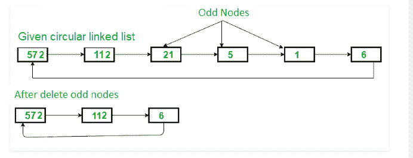

# 删除循环链表

> 原文：[https://www.geeksforgeeks.org/delete-all-odd-nodes-of-a-circular-linked-list/](https://www.geeksforgeeks.org/delete-all-odd-nodes-of-a-circular-linked-list/)

的所有奇数节点

**先决条件**：[删除循环链接列表](https://www.geeksforgeeks.org/delete-all-the-even-nodes-of-a-circular-linked-list/)的所有偶数节点

给定一个包含 N 个节点的循环单链接列表，任务是从列表中删除所有奇数节点。



**示例**：

> **输入**：572- > 112- > 21- > 5- > 1- > 6
> **输出**：572-> 112-> 6
> **说明**：所有奇数值节点均已删除
> 
> **输入**：9- > 11- > 32- > 6- > 13- > 20
> **输出**：32-> 6-> 20

**方法**：

想法是一个遍历循环单链表的节点，并获得具有奇数数据的节点的指针。 请按照中的[中使用的方法删除那些节点。](https://www.geeksforgeeks.org/deletion-circular-linked-list/)

以下是上述想法的实现：

## C++

```cpp

// C++ program to delete all odd 
// node from a Circular singly linked list 

#include <bits/stdc++.h> 
using namespace std; 

// Structure for a node 
struct Node { 
    int data; 
    struct Node* next; 
}; 

// Function to insert a node at the beginning 
// of a Circular linked list 
void push(struct Node** head_ref, int data) 
{ 
    struct Node* ptr1 = (struct Node*)malloc(sizeof(struct Node)); 
    struct Node* temp = *head_ref; 
    ptr1->data = data; 
    ptr1->next = *head_ref; 

    // If linked list is not NULL then 
    // set the next of last node 
    if (*head_ref != NULL) { 
        while (temp->next != *head_ref) 
            temp = temp->next; 
        temp->next = ptr1; 
    } 
    else
        // For the first node 
        ptr1->next = ptr1; 

    *head_ref = ptr1; 
} 

// Delete the node if it is odd 
void deleteNode(Node* head_ref, Node* del) 
{ 
    struct Node* temp = head_ref; 
    // If node to be deleted is head node 

    if (head_ref == del) 
        head_ref = del->next; 

    // Traverse list till not found 
    // delete node 
    while (temp->next != del) { 
        temp = temp->next; 
    } 

    // Copy address of node 
    temp->next = del->next; 

    // Finally, free the memory occupied by del 
    free(del); 
    return; 
} 

// Function to delete all odd nodes 
// from the singly circular linked list 
void deleteoddNodes(Node* head) 
{ 
    struct Node* ptr = head; 

    struct Node* next; 

    // Traverse list till the end 
    // if the node is odd then delete it 
    do { 
        // if node is odd 
        if ((ptr->data % 2) == 1) 

            deleteNode(head, ptr); 
        // point to next node 
        next = ptr->next; 
        ptr = next; 
    } while (ptr != head); 
} 

// Function to print nodes 
void printList(struct Node* head) 
{ 
    struct Node* temp = head; 
    if (head != NULL) { 
        do { 
            printf("%d ", temp->data); 
            temp = temp->next; 
        } while (temp != head); 
    } 
} 

// Driver code 
int main() 
{ 
    // Initialize lists as empty 
    struct Node* head = NULL; 

    // Created linked list will be 56->61->57->11->12->2 
    push(&head, 2); 
    push(&head, 12); 
    push(&head, 11); 
    push(&head, 57); 
    push(&head, 61); 
    push(&head, 56); 

    cout << "\nList after deletion : "; 
    deleteoddNodes(head); 
    printList(head); 

    return 0; 
} 

```

## Java

```java

// Java program to delete all prime 
// node from a Circular singly linked list 
class GFG { 

    // Structure for a node 
    static class Node { 
        int data; 
        Node next; 
    }; 

    // Function to insert a node at the beginning 
    // of a Circular linked list 
    static Node push(Node head_ref, int data) 
    { 
        Node ptr1 = new Node(); 
        Node temp = head_ref; 
        ptr1.data = data; 
        ptr1.next = head_ref; 

        // If linked list is not null then 
        // set the next of last node 
        if (head_ref != null) { 
            while (temp.next != head_ref) 
                temp = temp.next; 
            temp.next = ptr1; 
            return head_ref; 
        } 
        else
// For the first node 
            ptr1.next = ptr1;  

        head_ref = ptr1; 
        return head_ref; 
    } 

    // Delete the node if it is odd 
    static Node deleteNode(Node head_ref, Node del) 
    { 
        Node temp = head_ref; 
        // If node to be deleted is head node 

        if (head_ref == del) 
            head_ref = del.next; 

        // Traverse list till not found 
        // delete node 
        while (temp.next != del) { 
            temp = temp.next; 
        } 

        // Copy address of node 
        temp.next = del.next; 

        return head_ref; 
    } 

    // Function to delete all odd nodes 
    // from the singly circular linked list 
    static Node deleteoddNodes(Node head) 
    { 
        Node ptr = head; 

        Node next; 

        // Traverse list till the end 
        // if the node is odd then delete it 
        do { 
            // If node is odd 
            if (ptr.data % 2 == 1) 
                deleteNode(head, ptr); 

            // point to next node 
            next = ptr.next; 
            ptr = next; 
        } while (ptr != head); 
        return head; 
    } 

    // Function to print nodes 
    static void printList(Node head) 
    { 
        Node temp = head; 
        if (head != null) { 
            do { 
                System.out.printf("%d ", temp.data); 
                temp = temp.next; 
            } while (temp != head); 
        } 
    } 

    // Driver code 
    public static void main(String args[]) 
    { 
        // Initialize lists as empty 
        Node head = null; 

        // Created linked list will be 56->61->57->11->12->2 
        head = push(head, 2); 
        head = push(head, 12); 
        head = push(head, 11); 
        head = push(head, 57); 
        head = push(head, 61); 
        head = push(head, 56); 

        System.out.println("\nList after deletion : "); 
        head = deleteoddNodes(head); 
        printList(head); 
    } 
} 

```

## Python

```py

# Python3 program to delete all odd  
# node from a Circular singly linked list  
import math  

# Structure for a node  
class Node:   
    def __init__(self, data):   
        self.data = data   
        self.next = None

# Function to insert a node at the beginning  
# of a Circular linked list  
def push(head_ref, data):  
    ptr1 = Node(data)  
    temp = head_ref  
    ptr1.data = data  
    ptr1.next = head_ref  

    # If linked list is not None then  
    # set the next of last node  
    if (head_ref != None):  
        while (temp.next != head_ref):  
            temp = temp.next
        temp.next = ptr1  

    else:  
        ptr1.next = ptr1 # For the first node  

    head_ref = ptr1  
    return head_ref  

# Delete the node if it is odd  
def deleteNode(head_ref, delete):  
    temp = head_ref  

    # If node to be deleted is head node  
    if (head_ref == delete):  
        head_ref = delete.next

    # Traverse list till not found  
    # delete node  
    while (temp.next != delete):  
        temp = temp.next

    # Copy address of node  
    temp.next = delete.next

# Function to delete all odd nodes  
# from the singly circular linked list  
def deleteoddNodes(head):  
    ptr = head  
    next = None

    # Traverse list till the end  
    # if the node is odd then delete it  
    # if node is odd  
    next = ptr.next
    ptr = next
    while (ptr != head):  
        if (ptr.data % 2 == 1):  
            deleteNode(head, ptr)  

        # po to next node  
        next = ptr.next
        ptr = next
    return head  

# Function to pr nodes  
def prList(head):  
    temp = head  
    if (head != None):  
        print(temp.data, end = " ")  
        temp = temp.next
        while (temp != head):  
            print(temp.data, end = " ")  
            temp = temp.next

# Driver code  
if __name__=='__main__':   

    # Initialize lists as empty  
    head = None

    # Created linked list will be 56->61->57->11->12->2   
    head = push(head, 2)   
    head = push(head, 12)  
    head = push(head, 11)   
    head = push(head, 57)   
    head = push(head, 61)   
    head = push(head, 56)  

    print("List after deletion : ", end = "")  
    head = deleteoddNodes(head)  
    prList(head)  

```

## C#

```cs

// C# program to delete all prime 
// node from a Circular singly linked list 
using System; 

class GFG { 

    // Structure for a node 
    public class Node { 
        public int data; 
        public Node next; 
    }; 

    // Function to insert a node at the beginning 
    // of a Circular linked list 
    static Node push(Node head_ref, int data) 
    { 
        Node ptr1 = new Node(); 
        Node temp = head_ref; 
        ptr1.data = data; 
        ptr1.next = head_ref; 

        // If linked list is not null then 
        // set the next of last node 
        if (head_ref != null) { 
            while (temp.next != head_ref) 
                temp = temp.next; 
            temp.next = ptr1; 
            return head_ref; 
        } 
        else
            // For the first node 
            ptr1.next = ptr1; 

        head_ref = ptr1; 
        return head_ref; 
    } 

    // Delete the node if it is odd 
    static Node deleteNode(Node head_ref, Node del) 
    { 
        Node temp = head_ref; 

        // If node to be deleted is head node 
        if (head_ref == del) 
            head_ref = del.next; 

        // Traverse list till not found 
        // delete node 
        while (temp.next != del) { 
            temp = temp.next; 
        } 

        // copy address of node 
        temp.next = del.next; 

        return head_ref; 
    } 

    // Function to delete all odd nodes 
    // from the singly circular linked list 
    static Node deleteoddNodes(Node head) 
    { 
        Node ptr = head; 

        Node next; 

        // Traverse list till the end 
        // if the node is odd then delete it 
        do { 
            // If node is odd 
            if (ptr.data % 2 == 1) 
                deleteNode(head, ptr); 

            // Point to next node 
            next = ptr.next; 
            ptr = next; 
        } while (ptr != head); 
        return head; 
    } 

    // Function to print nodes 
    static void printList(Node head) 
    { 
        Node temp = head; 
        if (head != null) { 
            do { 
                Console.Write("{0} ", temp.data); 
                temp = temp.next; 
            } while (temp != head); 
        } 
    } 

    // Driver code 
    public static void Main(String[] args) 
    { 
        // Initialize lists as empty 
        Node head = null; 

        // Created linked list will be 56->61->57->11->12->2 
        head = push(head, 2); 
        head = push(head, 12); 
        head = push(head, 11); 
        head = push(head, 57); 
        head = push(head, 61); 
        head = push(head, 56); 

        Console.WriteLine("\nList after deletion : "); 
        head = deleteoddNodes(head); 
        printList(head); 
    } 
} 

```

**Output:**

```
List after deletion : 56 12 2

```


* * *

* * *

如果您喜欢 GeeksforGeeks 并希望做出贡献，则还可以使用 [tribution.geeksforgeeks.org](https://contribute.geeksforgeeks.org/) 撰写文章，或将您的文章邮寄至 tribution@geeksforgeeks.org。 查看您的文章出现在 GeeksforGeeks 主页上，并帮助其他 Geeks。

如果您发现任何不正确的地方，请单击下面的“改进文章”按钮，以改进本文。