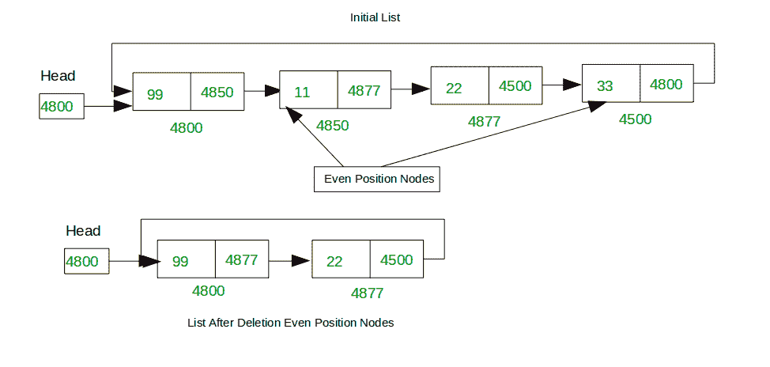

# 从循环链表

中删除所有奇数或偶数定位的节点

### 从循环链表中删除所有奇数位置节点

给定一个单循环链表，从第一个节点开始，删除其中的所有奇数位置节点。

**注意**：链接列表被认为具有从1开始的索引。 也就是说，链表中的第一个元素位于位置1。

**范例**：

```
Input : List = 99->11->22->33
Output : 11->33

Input : List = 90->10->20->30
Output : 10->30

```


想法是开始使用count变量遍历循环链接列表，以跟踪当前节点的位置。 如果当前节点位于奇数位置，则使用[从循环链表](https://www.geeksforgeeks.org/deletion-circular-linked-list/)中删除节点中讨论的方法删除该节点。

**删除所有奇数位置的节点的功能：**

*filter_none*

*编辑*
*关闭*

*play_arrow*

*链接*
*亮度_4*
*代码*

| `// Function to delete that all``// node whose index position is odd``void` `DeleteAllOddNode(` `struct` `Node** head)``{` `int` `len = Length(*head);` `int` `count = 0;` `struct` `Node *previous = *head, *next = *head;`的 `// check list have any node` `// if not then return` `if` `(*head == NULL) {` `printf` `(` `"\nDelete Last List is empty\n"` `);` `return` `;` `}` `// if list have single node means` `// odd position then delete it` `if` `(len == 1) {` `DeleteFirst(head);` `return` `;` `}` `// traverse first to last if` `// list have more than one node` `while` `(len > 0) {` `// delete first position node` `// which is odd position` `if` `(count == 0) {` `// Function to delete first node` `DeleteFirst(head);` `}` `// check position is odd or not` `// if yes then delete node` `if` `(count % 2 == 0 && count != 0) {` `deleteNode(*head, previous);` `}` `previous = previous->next;` `next = previous->next;` ] `len--;` `count++;` `}` `return` `;``}` |

*chevron_right**filter_none*

### 从循环链表中删除所有偶数位置节点

给出一个单循环链接列表。 任务是删除此列表中偶数位置的所有节点。 也就是从第二个节点开始，删除列表中的所有备用节点。

**范例**：

```
Input : List = 99->11->22->33
Output : 99->22

Input : List = 90->10->20->30
Output : 90->20

```

**注意**：链接列表被认为具有从1开始的索引。 也就是说，链表中的第一个元素位于位置1。



这个想法是使用count变量开始遍历循环链接列表，以跟踪当前节点的位置。 如果当前节点处于偶数位置，则使用[从循环链表](https://www.geeksforgeeks.org/deletion-circular-linked-list/)中删除节点中讨论的方法删除该节点。

**用于删除甚至定位的节点的功能：**

*filter_none*

*编辑*
*关闭*

*play_arrow*

*链接*
*亮度_4*
*代码*

| `// Function to delete all even position nodes``void` `DeleteAllEvenNode(` `struct` `Node** head)``{` `// Take size of list` `int` `len = Length(*head);` `int` `count = 1;` `struct` `Node *previous = *head, *next = *head;` `// Check list is empty` `// if empty simply return` `if` `(*head == NULL) {` `printf` `(` `"\nList is empty\n"` `);` `return` `;` `}` [ `// if list have single node` `// then return` `if` `(len < 2) {` `return` `;` `}` `// make first node is previous` `previous = *head;`[HT G144]  `// make second node is current` `next = previous->next;` `while` `(len > 0) {` `// check node number is even` `// if node is even then` `// delete that node` `if` `(count % 2 == 0) {` `previous->next = next->next;` `free` `(next);` `previous = next->next;` `next = previous->next;` `}` `len--;` `count++;` `}` `return` `;``}` |

*chevron_right**filter_none*

**删除偶数或奇数节点的程序**：

## C ++

*filter_none*

*编辑*
*关闭*

*play_arrow*

*链接*
*亮度_4*
*代码*

| `// CPP program to delete all even and odd position``// nodes from Singly Circular Linked list``#include <bits/stdc++.h>``// structure for a node``struct` `Node {``int` `data;``struct` `Node* next;``};``// Function return number of nodes present in list``int` `Length(``struct` `Node* head)``{``struct` `Node* current = head;``int` `count = 0;``// if list is empty simply return length zero``if` `(head == NULL) {``return` `0;``}``// traverse forst to last node``else` `{``do` `{``current = current->next;``count++;``}` `while` `(current != head);``}``return` `count;``}``// Function print data of list``void` `Display(``struct` `Node* head)``{``struct` `Node* current = head;``// if list is empty simply show message``if` `(head == NULL) {``printf``(``"\nDisplay List is empty\n"``);``return``;``}``// traverse forst to last node``else` `{``do` `{``printf``(``"%d "``, current->data);``current = current->next;``}` `while` `(current != head);``}``}``/* Function to insert a node at the end of ``a Circular linked list */``void` `Insert(``struct` `Node** head,` `int` `data)``{``struct` `Node* current = *head;``// Create a new node``struct` `Node* newNode =` `new` `Node;``// check node is created or not``if` `(!newNode) {``printf``(``"\nMemory Error\n"``);``return``;``}``// insert data into newly created node``newNode->data = data;``// check list is empty``// if not have any node then``// make first node it``if` `(*head == NULL) {``newNode->next = newNode;``*head = newNode;``return``;``}` `// if list have already some node``else` `{``// move firt node to last node``while` `(current->next != *head) {``current = current->next;``}``// put first or head node address in new node link``newNode->next = *head;``// put new node address into last node link(next)``current->next = newNode;``}``}``// Utitlity function to delete a Node``void` `deleteNode(``struct` `Node* head_ref,` `struct` `Node* del)``{``struct` `Node* temp = head_ref;``// If node to be deleted is head node``if` `(head_ref == del) {``head_ref = del->next;``}``// traverse list till not found``// delete node``while` `(temp->next != del) {``temp = temp->next;``}``// copy address of node``temp->next = del->next;``// Finally, free the memory``// occupied by del``free``(del);``return``;``}``// Function to delete First node of``// Circular Linked List``void` `DeleteFirst(``struct` `Node** head)``{``struct` `Node *previous = *head, *next = *head;``// check list have any node``// if not then return``if` `(*head == NULL) {``printf``(``"\nList is empty\n"``);``return``;``}``// check list have single node``// if yes then delete it and return``if` `(previous->next == previous) {``*head = NULL;``return``;``}``// traverse second to first``while` `(previous->next != *head) {``previous = previous->next;``next = previous->next;``}``// now previous is last node and``// next is first node of list``// first node(next) link address``// put in last node(previous) link``previous->next = next->next;``// make second node as head node``*head = previous->next;``free``(next);``return``;``}``// Function to delete odd position nodes``void` `DeleteAllOddNode(``struct` `Node** head)``{``int` `len = Length(*head);``int` `count = 0;``struct` `Node *previous = *head, *next = *head;``// check list have any node``// if not then return``if` `(*head == NULL) {``printf``(``"\nDelete Last List is empty\n"``);``return``;``}``// if list have single node means``// odd position then delete it``if` `(len == 1) {``DeleteFirst(head);``return``;``}``// traverse first to last if``// list have more than one node``while` `(len > 0) {``// delete first position node``// which is odd position``if` `(count == 0) {``// Function to delete first node``DeleteFirst(head);``}``// check position is odd or not``// if yes then delete node``// Note: Considered 1 based indexing``if` `(count % 2 == 0 && count != 0) {``deleteNode(*head, previous);``}``previous = previous->next;``next = previous->next;``len--;``count++;``}``return``;``}``// Function to delete all even position nodes``void` `DeleteAllEvenNode(``struct` `Node** head)``{``// Take size of list``int` `len = Length(*head);``int` `count = 1;``struct` `Node *previous = *head, *next = *head;``// Check list is empty``// if empty simply return``if` `(*head == NULL) {``printf``(``"\nList is empty\n"``);``return``;``}``// if list have single node``// then return``if` `(len < 2) {``return``;``}``// make first node is previous``previous = *head;``// make second node is current``next = previous->next;``while` `(len > 0) {``// check node number is even``// if node is even then``// delete that node``if` `(count % 2 == 0) {``previous->next = next->next;``free``(next);``previous = next->next;``next = previous->next;``}``len--;``count++;``}``return``;``}``// Driver Code``int` `main()``{``struct` `Node* head = NULL;``Insert(&head, 99);``Insert(&head, 11);``Insert(&head, 22);``Insert(&head, 33);``Insert(&head, 44);``Insert(&head, 55);``Insert(&head, 66);``// Deleting Odd positioned nodes``printf``(``"Initial List: "``);``Display(head);``printf``(``"\nAfter deleting Odd position nodes: "``);``DeleteAllOddNode(&head);``Display(head);``// Deleting Even positioned nodes``printf``(``"\n\nInitial List: "``);``Display(head);``printf``(``"\nAfter deleting even position nodes: "``);``DeleteAllEvenNode(&head);``Display(head);``return` `0;``}` |

*chevron_right**filter_none*