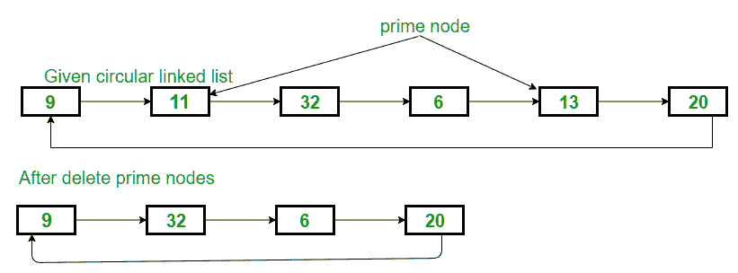

# 从循环单链接列表

中删除所有主要节点

给定一个包含N个节点的循环单链接列表。 任务是从列表中删除所有主要节点。



**示例：**

```
Input : 9->11->32->6->13->20 
Output : Given List : 9 11 32 6 13 20 
List After delete prime node : 9 32 6 20 

Input : 6->11->16->21->17->10 
Output : Given List : 6 11 16 21 17 10
List After delete prime node : 10 21 16 6 

```

**方法：**这个想法是一个遍历循环单链表的节点，并得到素数节点的指针。 通过按照帖子中使用的方法删除这些节点：[从循环链接列表](https://www.geeksforgeeks.org/deletion-circular-linked-list/)中删除一个节点。

以下是上述想法的实现：

## C ++

```

// CPP program to delete all prime 
// node from a Circular singly linked list 

#include <bits/stdc++.h> 
using namespace std; 

// Structure for a node 
struct Node { 
    int data; 
    struct Node* next; 
}; 

// Function to insert a node at the beginning 
// of a Circular linked list 
void push(struct Node** head_ref, int data) 
{ 
    struct Node* ptr1 = (struct Node*)malloc(sizeof(struct Node)); 
    struct Node* temp = *head_ref; 
    ptr1->data = data; 
    ptr1->next = *head_ref; 

    // If linked list is not NULL then 
    // set the next of last node 
    if (*head_ref != NULL) { 
        while (temp->next != *head_ref) 
            temp = temp->next; 
        temp->next = ptr1; 
    } 
    else
        ptr1->next = ptr1; // For the first node 

    *head_ref = ptr1; 
} 

// Delete the node if it is prime 
void deleteNode(Node* head_ref, Node* del) 
{ 
    struct Node* temp = head_ref; 
    // If node to be deleted is head node 

    if (head_ref == del) 
        head_ref = del->next; 

    // traverse list till not found 
    // delete node 
    while (temp->next != del) { 
        temp = temp->next; 
    } 

    // copy address of node 
    temp->next = del->next; 

    // Finally, free the memory 
    // occupied by del 
    free(del); 

    return; 
} 

// Function to check if a number is prime 
bool isPrime(int n) 
{ 
    // Corner cases 
    if (n <= 1) 
        return false; 

    if (n <= 3) 
        return true; 

    // This is checked so that we can skip 
    // middle five numbers in below loop 
    if (n % 2 == 0 || n % 3 == 0) 
        return false; 

    for (int i = 5; i * i <= n; i = i + 6) 
        if (n % i == 0 || n % (i + 2) == 0) 
            return false; 

    return true; 
} 

// Function to delete all prime nodes 
// from the singly circular linked list 
void deletePrimeNodes(Node* head) 
{ 
    struct Node* ptr = head; 

    struct Node* next; 

    // traverse list till the endl 
    // if node is prime then delete it 
    do { 
        // if node is prime 
        if (isPrime(ptr->data)) 
            deleteNode(head, ptr); 

        // point to next node 
        next = ptr->next; 
        ptr = next; 

    } while (ptr != head); 
} 

// Function to print nodes in a 
// given singly linked list 
void printList(struct Node* head) 
{ 
    struct Node* temp = head; 
    if (head != NULL) { 
        do { 
            printf("%d ", temp->data); 
            temp = temp->next; 
        } while (temp != head); 
    } 
} 

// Driver code 
int main() 
{ 
    // Initialize lists as empty 
    struct Node* head = NULL; 

    // Created linked list will be 
    // 9->11->32->6->13->20 
    push(&head, 20); 
    push(&head, 13); 
    push(&head, 6); 
    push(&head, 32); 
    push(&head, 11); 
    push(&head, 9); 

    cout << "Given List : "; 
    printList(head); 

    cout << "\nList After deleting prime nodes : "; 
    deletePrimeNodes(head); 
    printList(head); 

    return 0; 
} 

```

## 爪哇

```

// Java program to delete all prime  
// node from a Circular singly linked list  
class GFG 
{ 

// Structure for a node  
static class Node  
{  
    int data;  
    Node next;  
};  

// Function to insert a node at the beginning  
// of a Circular linked list  
static Node push(Node head_ref, int data)  
{  
    Node ptr1 = new Node();  
    Node temp = head_ref;  
    ptr1.data = data;  
    ptr1.next = head_ref;  

    // If linked list is not null then  
    // set the next of last node  
    if (head_ref != null)  
    {  
        while (temp.next != head_ref)  
            temp = temp.next;  
        temp.next = ptr1;  
    }  
    else
        ptr1.next = ptr1; // For the first node  

    head_ref = ptr1; 
    return head_ref; 
}  

// Delete the node if it is prime  
static Node deleteNode(Node head_ref, Node del)  
{  
    Node temp = head_ref;  

    // If node to be deleted is head node  
    if (head_ref == del)  
        head_ref = del.next;  

    // traverse list till not found  
    // delete node  
    while (temp.next != del) 
    {  
        temp = temp.next;  
    }  

    // copy address of node  
    temp.next = del.next;  
    return head_ref;  
}  

// Function to check if a number is prime  
static boolean isPrime(int n)  
{  
    // Corner cases  
    if (n <= 1)  
        return false;  

    if (n <= 3)  
        return true;  

    // This is checked so that we can skip  
    // middle five numbers in below loop  
    if (n % 2 == 0 || n % 3 == 0)  
        return false;  

    for (int i = 5; i * i <= n; i = i + 6)  
        if (n % i == 0 || n % (i + 2) == 0)  
            return false;  

    return true;  
}  

// Function to delete all prime nodes  
// from the singly circular linked list  
static Node deletePrimeNodes(Node head)  
{  
    Node ptr = head;  

    Node next;  

    // traverse list till the endl  
    // if node is prime then delete it  
    do 
    {  
        // if node is prime  
        if (isPrime(ptr.data))  
            deleteNode(head, ptr);  

        // point to next node  
        next = ptr.next;  
        ptr = next;  

    }  
    while (ptr != head);  
        return head; 
}  

// Function to print nodes in a  
// given singly linked list  
static void printList(Node head)  
{  
    Node temp = head;  
    if (head != null)  
    {  
        do
        {  
            System.out.printf("%d ", temp.data);  
            temp = temp.next;  
        }  
        while (temp != head);  
    }  
}  

// Driver code  
public static void main(String args[])  
{  
    // Initialize lists as empty  
    Node head = null;  

    // Created linked list will be  
    // 9.11.32.6.13.20  
    head=push(head, 20);  
    head=push(head, 13);  
    head=push(head, 6);  
    head=push(head, 32);  
    head=push(head, 11);  
    head=push(head, 9);  

    System.out.println("Given List : ");  
    printList(head);  

    System.out.println( "\nList After deleting prime nodes : ");  
    head=deletePrimeNodes(head);  
    printList(head);  
}  
} 

// This code is contributed by Arnab Kundu 

```

## Python3

```

# Python3 program to delete all prime 
# node from a Circular singly linked list 
import math  

# Structure for a node 
class Node:  
    def __init__(self, data):  
        self.data = data  
        self.next = None

# Function to insert a node at the  
# beginning of a Circular linked list 
def push(head_ref, data): 
    ptr1 = Node(data) 
    temp = head_ref 
    ptr1.data = data 
    ptr1.next = head_ref 

    # If linked list is not None then 
    # set the next of last node 
    if (head_ref != None) : 
        while (temp.next != head_ref): 
            temp = temp.next
        temp.next = ptr1 

    else: 
        ptr1.next = ptr1 # For the first node 

    head_ref = ptr1 
    return head_ref 

# Delete the node if it is prime 
def deleteNode(head_ref, delete): 
    temp = head_ref 

    # If node to be deleted is head node 
    if (head_ref == delete): 
        head_ref = delete.next

    # traverse list till not found 
    # delete node 
    while (temp.next != delete): 
        temp = temp.next

    # copy address of node 
    temp.next = delete.next

    # Finally, free the memory 
    # occupied by delete 
    # free(delete) 
    return head_ref 

# Function to check if a number is prime 
def isPrime(n): 

    # Corner cases 
    if (n <= 1): 
        return False

    if (n <= 3): 
        return True

    # This is checked so that we can skip 
    # middle five numbers in below loop 
    if (n % 2 == 0 or n % 3 == 0): 
        return False

    for i in range(5, n + 1, 6): 
        if (i * i < n + 2 and 
               (n % i == 0 or 
                n % (i + 2) == 0)): 
            return False

    return True

# Function to delete all prime nodes 
# from the singly circular linked list 
def deletePrimeNodes( head): 
    ptr = head 

    #next 

    # traverse list till the endl 
    # if node is prime then delete it 
    # if (isPrime(ptr.data)!=True): 
    # deleteNode(head, ptr) 

    # point to next node 
    next = ptr.next
    ptr = next
    while (ptr != head): 

        # if node is prime 
        if (isPrime(ptr.data) == True): 
            deleteNode(head, ptr) 

        # point to next node 
        next = ptr.next
        ptr = next

    return head  

# Function to print nodes in a 
# given singly linked list 
def printList(head): 
    temp = head 
    if (head != None) : 
        print(temp.data, end = " ") 
        temp = temp.next
        while (temp != head): 
            print(temp.data, end = " ") 
            temp = temp.next

# Driver code 
if __name__=='__main__':  

    # Initialize lists as empty 
    head = None

    # Created linked list will be 
    # 9.11.32.6.13.20 
    head = push(head, 20) 
    head = push(head, 13) 
    head = push(head, 6) 
    head = push(head, 32) 
    head = push(head, 11) 
    head = push(head, 9) 

    print("Given List : ", end = "") 
    printList(head) 

    print( "\nList After deleting",  
           "prime nodes : ", end = "") 
    head = deletePrimeNodes(head) 
    printList(head) 

# This code is contributed by Srathore 

```

## C＃

```

// C# program to delete all prime  
// node from a Circular singly linked list 
using System; 

class GFG 
{ 

// Structure for a node  
public class Node  
{  
    public int data;  
    public Node next;  
};  

// Function to insert a node at the beginning  
// of a Circular linked list  
static Node push(Node head_ref, int data)  
{  
    Node ptr1 = new Node();  
    Node temp = head_ref;  
    ptr1.data = data;  
    ptr1.next = head_ref;  

    // If linked list is not null then  
    // set the next of last node  
    if (head_ref != null)  
    {  
        while (temp.next != head_ref)  
            temp = temp.next;  
        temp.next = ptr1;  
    }  
    else
        ptr1.next = ptr1; // For the first node  

    head_ref = ptr1; 
    return head_ref; 
}  

// Delete the node if it is prime  
static Node deleteNode(Node head_ref, Node del)  
{  
    Node temp = head_ref;  

    // If node to be deleted is head node  
    if (head_ref == del)  
        head_ref = del.next;  

    // traverse list till not found  
    // delete node  
    while (temp.next != del) 
    {  
        temp = temp.next;  
    }  

    // copy address of node  
    temp.next = del.next;  
    return head_ref;  
}  

// Function to check if a number is prime  
static bool isPrime(int n)  
{  
    // Corner cases  
    if (n <= 1)  
        return false;  

    if (n <= 3)  
        return true;  

    // This is checked so that we can skip  
    // middle five numbers in below loop  
    if (n % 2 == 0 || n % 3 == 0)  
        return false;  

    for (int i = 5; i * i <= n; i = i + 6)  
        if (n % i == 0 || n % (i + 2) == 0)  
            return false;  

    return true;  
}  

// Function to delete all prime nodes  
// from the singly circular linked list  
static Node deletePrimeNodes(Node head)  
{  
    Node ptr = head;  

    Node next;  

    // traverse list till the endl  
    // if node is prime then delete it  
    do
    {  
        // if node is prime  
        if (isPrime(ptr.data))  
            deleteNode(head, ptr);  

        // point to next node  
        next = ptr.next;  
        ptr = next;  

    }  
    while (ptr != head);  
        return head; 
}  

// Function to print nodes in a  
// given singly linked list  
static void printList(Node head)  
{  
    Node temp = head;  
    if (head != null)  
    {  
        do
        {  
            Console.Write("{0} ", temp.data);  
            temp = temp.next;  
        }  
        while (temp != head);  
    }  
}  

// Driver code  
public static void Main()  
{  
    // Initialize lists as empty  
    Node head = null;  

    // Created linked list will be  
    // 9.11.32.6.13.20  
    head=push(head, 20);  
    head=push(head, 13);  
    head=push(head, 6);  
    head=push(head, 32);  
    head=push(head, 11);  
    head=push(head, 9);  

    Console.WriteLine("Given List : ");  
    printList(head);  

    Console.WriteLine( "\nList After deleting prime nodes : ");  
    head=deletePrimeNodes(head);  
    printList(head);  
}  
}  

/* This code contributed by PrinciRaj1992 */

```

**Output:**

```
Given List : 9 11 32 6 13 20 
List After deleting prime nodes : 9 32 6 20

```

注意读者！ 现在不要停止学习。 通过 [**DSA自学课程**](https://practice.geeksforgeeks.org/courses/dsa-self-paced?utm_source=geeksforgeeks&utm_medium=article&utm_campaign=gfg_article_dsa_content_bottom) 以对学生方便的价格掌握所有重要的DSA概念，并为行业做好准备。

* * *

* * *

如果您喜欢GeeksforGeeks并希望做出贡献，则还可以使用 [tribution.geeksforgeeks.org](https://contribute.geeksforgeeks.org/) 撰写文章，或将您的文章邮寄至tribution@geeksforgeeks.org。 查看您的文章出现在GeeksforGeeks主页上，并帮助其他Geeks。

如果您发现任何不正确的地方，请单击下面的“改进文章”按钮，以改进本文。