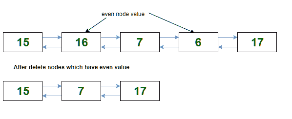

# 从双链表

中删除所有偶数节点

给定一个包含N个节点的双链表，任务是从列表中删除所有偶数节点。

**示例：**

> **输入：**初始列表= 15 < = > 16 < = > 6 < = > 7 < = > 17
> **输出：**最终列表= 15 < = > 7 < = > 17
> 
> **输入：**初始列表= 5 < = > 3 < = > 6 < = > 8 < = > 4 < = > 1 < = > 2 < = > 9
> **输出：**最终列表= 5 < = > 3 < = > 1 [ < = > 9

这个想法是一个遍历双向链表的节点，并得到具有数据的节点的指针。 请按照本帖子的[中使用的方法删除那些节点。](https://www.geeksforgeeks.org/delete-a-node-in-a-doubly-linked-list/)

以下是上述想法的实现：

## C ++

*filter_none*

*编辑*
*关闭*

*play_arrow*

*链接*
*亮度_4*
*代码*

| `// C++ implementation to delete all``// the even nodes from the doubly``// linked list``#include <bits/stdc++.h>`的`using` `namespace` `std;``// Node of the doubly linked list``struct` `Node {` `int` `data;` `Node *prev, *next;``};``// function to insert a node at the beginning``// of the Doubly Linked List``void` `push(Node** head_ref,` `int` `new_data)``{` `// allocate node` `Node* new_node = (Node*)` `malloc` `(` `sizeof` `(` `struct` `Node));` `// put in the data` `new_node->data = new_data;` `// since we are adding at the beginning,` `// prev is always NULL` `new_node->prev = NULL;` `// link the old list off the new node` `new_node->next = (*head_ref);`​​  `// change prev of head node to new node` `if` `((*head_ref) != NULL)` `(*head_ref)->prev = new_node;` `// move the head to point to the new node` `(*head_ref) = new_node;``}``// function to delete a node in a Doubly Linked List.``// head_ref --> pointer to head node pointer.``// del --> pointer to node to be deleted``void` `deleteNode(Node** head_ref, Node* del)``{` `// base case` `if` `(*head_ref == NULL &#124;&#124; del == NULL)` `return` `;` `// If node to be deleted is head node` `if` `(*head_ref == del)` `*head_ref = del->next;` `// Change next only if node to be` `// deleted is NOT the last node` `if` `(del->next != NULL)` `del->next->prev = del->prev;` `// Change prev only if node to be` ] `// deleted is NOT the first node` `if` `(del->prev != NULL)` `del->prev->next = del->next;` [ `// Finally, free the memory occupied by del` `free` `(del);` `return` `;``}``// function to delete all the even nodes``// from the doubly linked list``void` `deleteEvenNodes(Node** head_ref)``{` `Node* ptr = *head_ref;` `Node* next;` `while` `(ptr != NULL) {` `next = ptr->next;` `// if true, delete node 'ptr'` `if` `(ptr->data % 2 == 0)` `deleteNode(head_ref, ptr);` `ptr = next;` `}``}``// function to print nodes in a``// given doubly linked list``void` `printList(Node* head)``{` `while` `(head != NULL) {` `cout << head->data <<` `" "` `;` `head = head->next;` `}``}``// Driver program``int` `main()``{` `// start with the empty list` `Node* head = NULL;` `// create the doubly linked list` `// 15 <-> 16 <-> 7 <-> 6 <-> 17` `push(&head, 17);` `push(&head, 6);` `push(&head, 7);`]  `push(&head, 16);` `push(&head, 15);` `cout <<` `"Original List: "` `;` `printList(head);` `deleteEvenNodes(&head);` `"\nModified List: "` `;` `printList(head);``}` |

*chevron_right**filter_none*