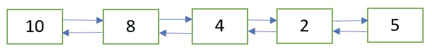

# 删除给定位置

> 原文：[https://www.geeksforgeeks.org/delete-doubly-linked-list-node-given-position/](https://www.geeksforgeeks.org/delete-doubly-linked-list-node-given-position/)

的双链表节点

给定双链表和位置`n`。 任务是从头开始删除给定位置`n`的节点。

初始双链表



删除位置`n = 2`

处的节点后的双链表


**方法**：以下是步骤：

1.  通过从双行遍历双链表到第`n`个节点，获得指向位置`n`处的节点的指针。

2.  使用在步骤 1 中获得的指针删除节点。请参阅[这篇帖子](https://www.geeksforgeeks.org/delete-a-node-in-a-doubly-linked-list/)。

## C++

```cpp

/* C++ implementation to delete a doubly Linked List node 
   at the given position */
#include <bits/stdc++.h>

using namespace std;

/* a node of the doubly linked list */
struct Node {
    int data;
    struct Node* next;
    struct Node* prev;
};

/* Function to delete a node in a Doubly Linked List.
   head_ref --> pointer to head node pointer.
   del  -->  pointer to node to be deleted. */
void deleteNode(struct Node** head_ref, struct Node* del)
{
    /* base case */
    if (*head_ref == NULL || del == NULL)
        return;

    /* If node to be deleted is head node */
    if (*head_ref == del)
        *head_ref = del->next;

    /* Change next only if node to be deleted is NOT 
       the last node */
    if (del->next != NULL)
        del->next->prev = del->prev;

    /* Change prev only if node to be deleted is NOT 
       the first node */
    if (del->prev != NULL)
        del->prev->next = del->next;

    /* Finally, free the memory occupied by del*/
    free(del);
}

/* Function to delete the node at the given position
   in the doubly linked list */
void deleteNodeAtGivenPos(struct Node** head_ref, int n)
{
    /* if list in NULL or invalid position is given */
    if (*head_ref == NULL || n <= 0)
        return;

    struct Node* current = *head_ref;
    int i;

    /* traverse up to the node at position 'n' from
       the beginning */
    for (int i = 1; current != NULL && i < n; i++)
        current = current->next;

    /* if 'n' is greater than the number of nodes
       in the doubly linked list */
    if (current == NULL)
        return;

    /* delete the node pointed to by 'current' */
    deleteNode(head_ref, current);
}

/* Function to insert a node at the beginning 
   of the Doubly Linked List */
void push(struct Node** head_ref, int new_data)
{
    /* allocate node */
    struct Node* new_node = 
         (struct Node*)malloc(sizeof(struct Node));

    /* put in the data  */
    new_node->data = new_data;

    /* since we are adding at the beginning,
    prev is always NULL */
    new_node->prev = NULL;

    /* link the old list off the new node */
    new_node->next = (*head_ref);

    /* change prev of head node to new node */
    if ((*head_ref) != NULL)
        (*head_ref)->prev = new_node;

    /* move the head to point to the new node */
    (*head_ref) = new_node;
}

/* Function to print nodes in a given doubly
   linked list */
void printList(struct Node* head)
{
    while (head != NULL) {
        cout << head->data << " ";
        head = head->next;
    }
}

/* Driver program to test above functions*/
int main()
{
    /* Start with the empty list */
    struct Node* head = NULL;

    /* Create the doubly linked list 10<->8<->4<->2<->5 */
    push(&head, 5);
    push(&head, 2);
    push(&head, 4);
    push(&head, 8);
    push(&head, 10);

    cout << "Doubly linked list before deletion:n";
    printList(head);

    int n = 2;

    /* delete node at the given position 'n' */
    deleteNodeAtGivenPos(&head, n);

    cout << "\nDoubly linked list after deletion:n";
    printList(head);

    return 0;
}

```

## Java

```java

/* Java implementation to delete a 
   doubly Linked List node 
   at the given position */

// A node of the doubly linked list 
class Node 
{
    int data;
    Node next, prev;
}

class GFG
{
    static Node head = null;
    // Function to delete a node 
    // in a Doubly Linked List.
    // head_ref --> pointer to head node pointer.
    // del --> pointer to node to be deleted.
    static Node deleteNode(Node del)
    {
        // base case
        if (head == null || del == null)
            return null;

        // If node to be deleted is head node
        if (head == del)
            head = del.next;

        // Change next only if node to be 
        // deleted is NOT the last node
        if (del.next != null)
            del.next.prev = del.prev;

        // Change prev only if node to be 
        // deleted is NOT the first node
        if (del.prev != null)
            del.prev.next = del.next;

        del = null;

        return head;
    }

    // Function to delete the node at the
    // given position in the doubly linked list
    static void deleteNodeAtGivenPos(int n)
    {
        /* if list in NULL or 
          invalid position is given */
        if (head == null || n <= 0)
            return;

        Node current = head;
        int i;

        /*
        * traverse up to the node at 
          position 'n' from the beginning
        */
        for (i = 1; current != null && i < n; i++)
        {
            current = current.next;
        }

        // if 'n' is greater than the number of nodes
        // in the doubly linked list
        if (current == null)
            return;

        // delete the node pointed to by 'current'
        deleteNode(current);
    }

    // Function to insert a node
    // at the beginning of the Doubly Linked List
    static void push(int new_data)
    {
        // allocate node
        Node new_node = new Node();

        // put in the data
        new_node.data = new_data;

        // since we are adding at the beginning,
        // prev is always NULL

        new_node.prev = null;

        // link the old list off the new node
        new_node.next = head;

        // change prev of head node to new node
        if (head != null)
            head.prev = new_node;

        // move the head to point to the new node
        head = new_node;
    }

    // Function to print nodes in a
    // given doubly linked list
    static void printList()
    {
        Node temp = head;
        if (temp == null)
            System.out.print("Doubly Linked list empty");

        while (temp != null) 
        {
            System.out.print(temp.data + " ");
            temp = temp.next;
        }
        System.out.println();
    }

    // Driver code
    public static void main(String[] args)
    {
        // Create the doubly linked list:
        // 10<->8<->4<->2<->5

        push(5);
        push(2);
        push(4);
        push(8);
        push(10);

        System.out.println("Doubly linked "
                           +"list before deletion:");
        printList();

        int n = 2;

        // delete node at the given position 'n'
        deleteNodeAtGivenPos(n);
        System.out.println("Doubly linked "
                           +"list after deletion:");
        printList();
    }
}

// Thia code is contributed by Vivekkumar Singh

```

## Python

```py

# Python implementation to delete
# a doubly Linked List node 
# at the given position 

# A node of the doubly linked list 
class Node: 

    # Constructor to create a new node 
    def __init__(self, data): 
        self.data = data 
        self.next = None
        self.prev = None

# Function to delete a node in a Doubly Linked List.
# head_ref -. pointer to head node pointer.
# del -. pointer to node to be deleted. 
def deleteNode(head_ref, del_):

    # base case 
    if (head_ref == None or del_ == None):
        return

    # If node to be deleted is head node 
    if (head_ref == del_):
        head_ref = del_.next

    # Change next only if node to be deleted is NOT 
    # the last node 
    if (del_.next != None):
        del_.next.prev = del_.prev

    # Change prev only if node to be deleted is NOT 
    # the first node 
    if (del_.prev != None):
        del_.prev.next = del_.next

    return head_ref

# Function to delete the node at the given position
# in the doubly linked list 
def deleteNodeAtGivenPos(head_ref,n):

    # if list in None or invalid position is given 
    if (head_ref == None or n <= 0):
        return

    current = head_ref
    i = 1

    # traverse up to the node at position 'n' from
    # the beginning 
    while ( current != None and i < n ):
        current = current.next
        i = i + 1

    # if 'n' is greater than the number of nodes
    # in the doubly linked list 
    if (current == None):
        return

    # delete the node pointed to by 'current' 
    deleteNode(head_ref, current)

    return head_ref

# Function to insert a node at the beginning 
# of the Doubly Linked List 
def push(head_ref, new_data):

    # allocate node 
    new_node = Node(0)

    # put in the data 
    new_node.data = new_data

    # since we are adding at the beginning,
    #prev is always None 
    new_node.prev = None

    # link the old list off the new node 
    new_node.next = (head_ref)

    # change prev of head node to new node 
    if ((head_ref) != None):
        (head_ref).prev = new_node

    # move the head to point to the new node 
    (head_ref) = new_node

    return head_ref

# Function to print nodes in a given doubly
# linked list 
def printList(head):

    while (head != None) :
        print( head.data ,end= " ")
        head = head.next

# Driver program to test above functions

# Start with the empty list 
head = None

# Create the doubly linked list 10<.8<.4<.2<.5 
head = push(head, 5)
head = push(head, 2)
head = push(head, 4)
head = push(head, 8)
head = push(head, 10)

print("Doubly linked list before deletion:")
printList(head)

n = 2

# delete node at the given position 'n' 
head = deleteNodeAtGivenPos(head, n)

print("\nDoubly linked list after deletion:")

printList(head)

# This code is contributed by Arnab Kundu

```

## C#

```cs

/* C# implementation to delete a doubly Linked List node 
at the given position */
using System;

// A node of the doubly linked list 
public class Node 
{ 
    public int data; 
    public Node next, prev; 
} 

class GFG 
{ 
    // Function to delete a node in a Doubly Linked List. 
    // head_ref --> pointer to head node pointer. 
    // del --> pointer to node to be deleted. 
    static Node deleteNode(Node head, Node del) 
    { 
        // base case 
        if (head == null || del == null) 
            return null; 

        // If node to be deleted is head node 
        if (head == del) 
            head = del.next; 

        // Change next only if node to be 
        // deleted is NOT the last node 
        if (del.next != null) 
            del.next.prev = del.prev; 

        // Change prev only if node to be 
        // deleted is NOT the first node 
        if (del.prev != null) 
            del.prev.next = del.next; 

        del = null; 

        return head; 
    } 

    // Function to delete the node at the 
    // given position in the doubly linked list 
    static void deleteNodeAtGivenPos(Node head, int n) 
    { 
        /* if list in NULL or invalid position is given */
        if (head == null || n <= 0) 
            return; 

        Node current = head; 
        int i; 

        /* 
        * traverse up to the node at position 'n' from the beginning 
        */
        for (i = 1; current != null && i < n; i++) 
        { 
            current = current.next; 
        } 

        // if 'n' is greater than the number of nodes 
        // in the doubly linked list 
        if (current == null) 
            return; 

        // delete the node pointed to by 'current' 
        deleteNode(head, current); 
    } 

    // Function to insert a node 
    // at the beginning of the Doubly Linked List 
    static Node push(Node head, int new_data) 
    { 
        // allocate node 
        Node new_node = new Node(); 

        // put in the data 
        new_node.data = new_data; 

        // since we are adding at the beginning, 
        // prev is always NULL 

        new_node.prev = null; 

        // link the old list off the new node 
        new_node.next = head; 

        // change prev of head node to new node 
        if (head != null) 
            head.prev = new_node; 

        // move the head to point to the new node 
        head = new_node; 

        return head; 
    } 

    // Function to print nodes in a 
    // given doubly linked list 
    static void printList(Node temp) 
    { 
        if (temp == null) 
            Console.Write("Doubly Linked list empty"); 

        while (temp != null) 
        { 
            Console.Write(temp.data + " "); 
            temp = temp.next; 
        } 
        Console.WriteLine(); 
    } 

    // Driver code 
    public static void Main(String []args) 
    { 
        // Start with the empty list 
        Node head = null; 

        // Create the doubly linked list: 
        // 2<->2<->10<->8<->4<->2<->5<->2 

        head = push(head, 2); 
        head = push(head, 5); 
        head = push(head, 4); 
        head = push(head, 8); 
        head = push(head, 10); 

        Console.WriteLine("Doubly linked list before deletion:"); 
        printList(head); 

        int n = 2; 

        // delete node at the given position 'n' 
        deleteNodeAtGivenPos(head, n); 
        Console.WriteLine("Doubly linked list after deletion:"); 
        printList(head); 
    } 
} 

// This code is contributed by Arnab Kundu

```

**输出**：

```
Doubly linked list before deletion:
10 8 4 2 5
Doubly linked list after deletion:
10 4 2 5

```

**时间复杂度**：`O(n)`，在最坏的情况下，其中`n`是双链表中的节点数。

本文由 **Ayush Jauhari** 提供。 如果您喜欢 GeeksforGeeks 并希望做出贡献，则还可以使用 [tribution.geeksforgeeks.org](http://www.contribute.geeksforgeeks.org) 撰写文章，或将您的文章邮寄至 tribution@geeksforgeeks.org。 查看您的文章出现在 GeeksforGeeks 主页上，并帮助其他 Geeks。

如果发现任何不正确的内容，或者想分享有关上述主题的更多信息，请发表评论。

