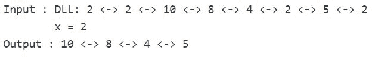

# 删除双链表中所有出现的给定键

> 原文：[https://www.geeksforgeeks.org/delete-occurrences-given-key-doubly-linked-list/](https://www.geeksforgeeks.org/delete-occurrences-given-key-doubly-linked-list/)

给定一个双链表和一个键`x`。 问题是从双链表中删除所有出现的给定密钥`x`。

例子：



**算法**：

```
delAllOccurOfGivenKey(head_ref, x)
      if head_ref == NULL
          return
      Initialize current = head_ref
      Declare next
      while current != NULL
           if current->data == x
               next = current->next
               deleteNode(head_ref, current)
               current = next
           else
               current = current->next

```

在[此帖子](https://www.geeksforgeeks.org/delete-a-node-in-a-doubly-linked-list/)中讨论了`deleteNode(head_ref, current)`（使用指向该节点的指针删除该节点）的算法。

## C++

```cpp

/* C++ implementation to delete all occurrences  
   of a given key in a doubly linked list */
#include <bits/stdc++.h> 

using namespace std; 

/* a node of the doubly linked list */
struct Node { 
    int data; 
    struct Node* next; 
    struct Node* prev; 
}; 

/* Function to delete a node in a Doubly Linked List. 
   head_ref --> pointer to head node pointer. 
   del  -->  pointer to node to be deleted. */
void deleteNode(struct Node** head_ref, struct Node* del) 
{ 
    /* base case */
    if (*head_ref == NULL || del == NULL) 
        return; 

    /* If node to be deleted is head node */
    if (*head_ref == del) 
        *head_ref = del->next; 

    /* Change next only if node to be deleted 
       is NOT the last node */
    if (del->next != NULL) 
        del->next->prev = del->prev; 

    /* Change prev only if node to be deleted  
       is NOT the first node */
    if (del->prev != NULL) 
        del->prev->next = del->next; 

    /* Finally, free the memory occupied by del*/
    free(del); 
} 

/* function to delete all occurrences of the given 
    key 'x' */
void deleteAllOccurOfX(struct Node** head_ref, int x) 
{ 
    /* if list is empty */
    if ((*head_ref) == NULL) 
        return; 

    struct Node* current = *head_ref; 
    struct Node* next; 

    /* traverse the list up to the end */
    while (current != NULL) { 

        /* if node found with the value 'x' */
        if (current->data == x) { 

            /* save current's next node in the  
               pointer 'next' */
            next = current->next; 

            /* delete the node pointed to by  
              'current' */
            deleteNode(head_ref, current); 

            /* update current */
            current = next; 
        } 

        /* else simply move to the next node */
        else
            current = current->next; 
    } 
} 

/* Function to insert a node at the beginning  
   of the Doubly Linked List */
void push(struct Node** head_ref, int new_data) 
{ 
    /* allocate node */
    struct Node* new_node =  
             (struct Node*)malloc(sizeof(struct Node)); 

    /* put in the data  */
    new_node->data = new_data; 

    /* since we are adding at the beginning, 
    prev is always NULL */
    new_node->prev = NULL; 

    /* link the old list off the new node */
    new_node->next = (*head_ref); 

    /* change prev of head node to new node */
    if ((*head_ref) != NULL) 
        (*head_ref)->prev = new_node; 

    /* move the head to point to the new node */
    (*head_ref) = new_node; 
} 

/* Function to print nodes in a given doubly 
   linked list */
void printList(struct Node* head) 
{ 
    /* if list is empty */
    if (head == NULL) 
        cout << "Doubly Linked list empty"; 

    while (head != NULL) { 
        cout << head->data << " "; 
        head = head->next; 
    } 
} 

/* Driver program to test above functions*/
int main() 
{ 
    /* Start with the empty list */
    struct Node* head = NULL; 

    /* Create the doubly linked list: 
           2<->2<->10<->8<->4<->2<->5<->2 */
    push(&head, 2); 
    push(&head, 5); 
    push(&head, 2); 
    push(&head, 4); 
    push(&head, 8); 
    push(&head, 10); 
    push(&head, 2); 
    push(&head, 2); 

    cout << "Original Doubly linked list:n"; 
    printList(head); 

    int x = 2; 

    /* delete all occurrences of 'x' */
    deleteAllOccurOfX(&head, x); 

    cout << "\nDoubly linked list after deletion of "
         << x << ":n"; 
    printList(head); 

    return 0; 
} 

```

## Java

```java

/* Java implementation to delete all occurrences  
of a given key in a doubly linked list */
import java.util.*; 
import java.io.*; 

// a node of the doubly linked list 
class Node  
{ 
    int data; 
    Node next, prev; 
} 

class GFG  
{ 
    /* Function to delete a node in a Doubly Linked List.  
        head_ref --> pointer to head node pointer.  
        del --> pointer to node to be deleted. */
    static Node deleteNode(Node head, Node del)  
    { 
        // base case 
        if (head == null || del == null) 
            return null; 

        /* If node to be deleted is head node */
        if (head == del) 
            head = del.next; 

        /* Change next only if node to be deleted  
            is NOT the last node */

        if (del.next != null) 
            del.next.prev = del.prev; 

        /* Change prev only if node to be deleted  
            is NOT the first node */
        if (del.prev != null) 
            del.prev.next = del.next; 

        del = null; 

        return head; 
    }  

    /* function to delete all occurrences of the given  
        key 'x' */
    static Node deleteAllOccurOfX(Node head, int x) 
    { 
        // if list is empty 
        if (head == null) 
            return null; 

        Node current = head; 
        Node next; 

        /* traverse the list up to the end */
        while (current != null) 
        { 
            // if node found with the value 'x'  
            if (current.data == x) 
            { 

                /* save current's next node in the  
                pointer 'next' */
                next = current.next; 

                /* delete the node pointed to by  
                'current' */
                head = deleteNode(head, current); 

                /* update current */
                current = next; 
            } 

            /* else simply move to the next node */
            else
                current = current.next; 

        } 

        return head; 

    } 

    /* Function to insert a node at the beginning  
        of the Doubly Linked List */
    static Node push (Node head, int new_data) 
    { 
        // allocate node  
        Node new_node = new Node(); 

        // put in the data 
        new_node.data = new_data; 

        /* since we are adding at the beginning,  
        prev is always NULL */
        new_node.prev = null; 

        // link the old list off the new node 
        new_node.next = head; 

        // change prev of head node to new node 
        if (head != null) 
            head.prev = new_node; 

        // move the head to point to the new node 
        head = new_node; 

        return head; 
    } 

    /* Function to print nodes in a given doubly  
        linked list */
    static void printList (Node temp) 
    { 
        if (temp == null) 
            System.out.print("Doubly Linked list empty"); 

        while (temp != null)  
        { 
                System.out.print(temp.data + " "); 
                temp = temp.next; 
        } 
    }  

    // Driver code 
    public static void main(String args[]) 
    { 
        // Start with the empty list 
        Node head = null; 

        /* Create the doubly linked list:  
        2<->2<->10<->8<->4<->2<->5<->2 */
        head = push(head, 2); 
        head = push(head, 5); 
        head = push(head, 2); 
        head = push(head, 4); 
        head = push(head, 8); 
        head = push(head, 10); 
        head = push(head, 2); 
        head = push(head, 2); 

        System.out.println("Original Doubly linked list: "); 
        printList(head);  

        int x = 2; 

        // delete all occurrences of 'x' 
        head = deleteAllOccurOfX(head, x); 
        System.out.println("\nDoubly linked list after deletion of" + x +":"); 
        printList(head); 
    } 
} 

// This code is contributed by rachana soma 

```

## Python3

```py

# Python3 implementation to delete all occurrences  
# of a given key in a doubly linked list  
import math 

# a node of the doubly linked list  
class Node:  
    def __init__(self,data):  
        self.data = data  
        self.next = None
        self.prev = None

# Function to delete a node in a Doubly Linked List. 
# head_ref --> pointer to head node pointer. 
# del --> pointer to node to be deleted.  
def deleteNode(head, delete): 
    # base case  
    if (head == None or delete == None): 
        return None

    # If node to be deleted is head node  
    if (head == delete): 
        head = delete.next

    # Change next only if node to be deleted 
    # is NOT the last node  
    if (delete.next != None): 
        delete.next.prev = delete.prev 

    # Change prev only if node to be deleted  
    # is NOT the first node  
    if (delete.prev != None): 
        delete.prev.next = delete.next

    # Finally, free the memory occupied by del 
    # free(del) 
    delete = None
    return head 

# function to delete all occurrences of the given 
# key 'x'  
def deleteAllOccurOfX(head, x): 
    # if list is empty  
    if (head == None): 
        return

    current = head 

    # traverse the list up to the end  
    while (current != None): 

        # if node found with the value 'x'  
        if (current.data == x): 

            # save current's next node in the  
            #pointer 'next'  
            next = current.next

            # delete the node pointed to by  
            # 'current'  
            head = deleteNode(head, current) 

            # update current  
            current = next

        # else simply move to the next node  
        else: 
            current = current.next

    return head 

# Function to insert a node at the beginning  
# of the Doubly Linked List  
def push(head,new_data): 
    # allocate node  
    new_node = Node(new_data) 

    # put in the data  
    new_node.data = new_data 

    # since we are adding at the beginning, 
    #prev is always None  
    new_node.prev = None

    # link the old list off the new node  
    new_node.next = head 

    # change prev of head node to new node  
    if (head != None): 
        head.prev = new_node 

    # move the head to point to the new node  
    head = new_node 
    return head 

# Function to print nodes in a given doubly 
# linked list  
def printList(head): 
    # if list is empty  
    if (head == None): 
        print("Doubly Linked list empty") 

    while (head != None) : 
        print(head.data,end=" ") 
        head = head.next

# Driver functions 
if __name__=='__main__':  
    # Start with the empty list  
    head = None

    # Create the doubly linked list: 
    #     2<->2<->10<->8<->4<->2<->5<->2  
    head = push(head, 2) 
    head = push(head, 5) 
    head = push(head, 2) 
    head = push(head, 4) 
    head = push(head, 8) 
    head = push(head, 10) 
    head = push(head, 2) 
    head = push(head, 2) 

    print("Original Doubly linked list:") 
    printList(head) 

    x = 2

    # delete all occurrences of 'x'  
    head = deleteAllOccurOfX(head, x) 

    print("\nDoubly linked list after deletion of ",x,":") 
    printList(head) 

# This article contributed by Srathore 

```

## C#

```cs

/* C# implementation to delete all occurrences  
of a given key in a doubly linked list */
using System; 
using System.Collections; 

// a node of the doubly linked list  
public class Node  
{  
    public int data;  
    public Node next, prev;  
}  

class GFG  
{  
    /* Function to delete a node in a Doubly Linked List.  
        head_ref --> pointer to head node pointer.  
        del --> pointer to node to be deleted. */
    static Node deleteNode(Node head, Node del)  
    {  
        // base case  
        if (head == null || del == null)  
            return null;  

        /* If node to be deleted is head node */
        if (head == del)  
            head = del.next;  

        /* Change next only if node to be deleted  
            is NOT the last node */

        if (del.next != null)  
            del.next.prev = del.prev;  

        /* Change prev only if node to be deleted  
            is NOT the first node */
        if (del.prev != null)  
            del.prev.next = del.next;  

        del = null;  

        return head;  
    }  

    /* function to delete all occurrences of the given  
        key 'x' */
    static Node deleteAllOccurOfX(Node head, int x)  
    {  
        // if list is empty  
        if (head == null)  
            return null;  

        Node current = head;  
        Node next;  

        /* traverse the list up to the end */
        while (current != null)  
        {  
            // if node found with the value 'x'  
            if (current.data == x)  
            {  

                /* save current's next node in the  
                pointer 'next' */
                next = current.next;  

                /* delete the node pointed to by  
                'current' */
                head = deleteNode(head, current);  

                /* update current */
                current = next;  
            }  

            /* else simply move to the next node */
            else
                current = current.next;  

        }  

        return head;  

    }  

    /* Function to insert a node at the beginning  
        of the Doubly Linked List */
    static Node push (Node head, int new_data)  
    {  
        // allocate node  
        Node new_node = new Node();  

        // put in the data  
        new_node.data = new_data;  

        /* since we are adding at the beginning,  
        prev is always NULL */
        new_node.prev = null;  

        // link the old list off the new node  
        new_node.next = head;  

        // change prev of head node to new node  
        if (head != null)  
            head.prev = new_node;  

        // move the head to point to the new node  
        head = new_node;  

        return head;  
    }  

    /* Function to print nodes in a given doubly  
        linked list */
    static void printList (Node temp)  
    {  
        if (temp == null)  
            Console.Write("Doubly Linked list empty");  

        while (temp != null)  
        {  
                Console.Write(temp.data + " ");  
                temp = temp.next;  
        }  
    }  

    // Driver code  
    public static void Main(String []args)  
    {  
        // Start with the empty list  
        Node head = null;  

        /* Create the doubly linked list:  
        2<->2<->10<->8<->4<->2<->5<->2 */
        head = push(head, 2);  
        head = push(head, 5);  
        head = push(head, 2);  
        head = push(head, 4);  
        head = push(head, 8);  
        head = push(head, 10);  
        head = push(head, 2);  
        head = push(head, 2);  

        Console.WriteLine("Original Doubly linked list: ");  
        printList(head);  

        int x = 2;  

        // delete all occurrences of 'x'  
        head = deleteAllOccurOfX(head, x);  
        Console.WriteLine("\nDoubly linked list after deletion of" + x +":");  
        printList(head);  
    }  
}  

// This code is contributed by Arnab Kundu 

```

**输出**：

```
Original Doubly linked list:
2 2 10 8 4 2 5 2
Doubly linked list after deletion of 2:
10 8 4 5

```

**时间复杂度**：`O(n)`

本文由 **Ayush Jauhari** 提供。 如果您喜欢 GeeksforGeeks 并希望做出贡献，则还可以使用 [tribution.geeksforgeeks.org](http://www.contribute.geeksforgeeks.org) 撰写文章，或将您的文章邮寄至 tribution@geeksforgeeks.org。 查看您的文章出现在 GeeksforGeeks 主页上，并帮助其他 Geeks。

如果发现任何不正确的地方，或者您想分享有关上述主题的更多信息，请发表评论。

