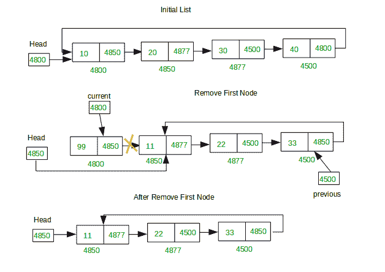
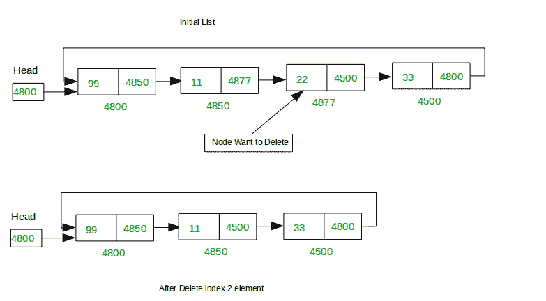

# 循环链表

> 原文：[https://www.geeksforgeeks.org/deletion-at-different-positions-in-a-circular-linked-list/](https://www.geeksforgeeks.org/deletion-at-different-positions-in-a-circular-linked-list/)

中不同位置的删除

给定一个循环链表。 任务是编写程序以从存在于此的列表中删除节点：

*   第一名。

*   最后位置。

*   在任何给定位置。

### **从单循环链表**中删除第一个节点

**示例**：

```
Input : 99->11->22->33->44->55->66
Output : 11->22->33->44->55->66

Input : 11->22->33->44->55->66
Output : 22->33->44->55->66

```



从循环链表中删除第一个节点

**方法**：

1.  取两个指针作为当前指针和上一个指针并遍历列表。

2.  保持指针当前固定指向第一个节点并向前移动直到到达最后一个节点。

3.  一旦指针先前到达最后一个节点，请执行以下操作：

    *   上一个->下一个=当前->下一个

    *   头=上一个->下一个;

**从单个循环链表**中删除第一个节点的功能：

```

// Function to delete First node of 
// Circular Linked List 
void DeleteFirst(struct Node** head) 
{ 
    struct Node *previous = *head, *firstNode = *head; 

    // check if list doesn't have any node 
    // if not then return 
    if (*head == NULL) { 
        printf("\nList is empty\n"); 
        return; 
    } 

    // check if list have single node 
    // if yes then delete it and return 
    if (previous->next == previous) { 
        *head = NULL; 
        return; 
    } 

    // traverse second node to first 
    while (previous->next != *head) { 

        previous = previous->next; 
    } 

    // now previous is last node and 
    // first node(firstNode) link address 
    // put in last node(previous) link 
    previous->next = firstNode->next; 

    // make second node as head node 
    *head = previous->next; 
    free(firstNode); 
    return; 
} 

```

### **删除循环 Linekd 列表**的最后一个节点

**示例**：

```
Input : 99->11->22->33->44->55->66
Output : 99->11->22->33->44->55

Input : 99->11->22->33->44->55
Output : 99->11->22->33->44

```


从循环链表中删除最后一个节点

**方法**：

1.  取两个指针作为当前指针和上一个指针并遍历列表。

2.  移动两个指针，使上一个指针的下一个始终指向当前指针。 继续将指针向前移动，直到当前到达最后一个节点并且当前指针位于倒数第二个节点为止。

3.  一旦指针电流到达最后一个节点，请执行以下操作：

    *   上一个->下一个=当前->下一个

    *   头=上一个->下一个;

**用于从列表**中删除最后一个节点的功能：

```

// Function delete last node of 
// Circular Linked List 
void DeleteLast(struct Node** head) 
{ 
    struct Node *current = *head, *temp = *head, *previous; 

    // check if list doesn't have any node 
    // if not then return 
    if (*head == NULL) { 
        printf("\nList is empty\n"); 
        return; 
    } 

    // check if list have single node 
    // if yes then delete it and return 
    if (current->next == current) { 
        *head = NULL; 
        return; 
    } 

    // move first node to last 
    // previous 
    while (current->next != *head) { 
        previous = current; 
        current = current->next; 
    } 

    previous->next = current->next; 
    *head = previous->next; 
    free(current); 
    return; 
} 

```

### **删除循环链表**中给定索引处的节点

**示例**：

```
Input : 99->11->22->33->44->55->66
        Index= 4
Output : 99->11->22->33->55->66

Input : 99->11->22->33->44->55->66
        Index= 2
Output : 99->11->33->44->55->66

```

**注意**：列表考虑基于 0 的索引。



**方法**：

1.  首先，找到列表的长度。 也就是说，列表中的节点数。

2.  以先前和当前的两个指针来遍历列表。 这样前一个在当前节点之后一个位置。

3.  将变量计数初始化为 0，以跟踪遍历的节点数。

4.  遍历列表，直到到达给定的索引。

5.  一旦达到给定的索引，执行**上一个-> next =当前->下一个**。

**用于从单循环链表**中删除给定索引或位置处的节点的功能：

```

// Function to delete node at given index 
// of Circular Linked List 
void DeleteAtPosition(struct Node** head, int index) 
{ 
    // find length of list 
    int len = Length(*head); 
    int count = 1; 
    struct Node *previous = *head, *next = *head; 

    // check if list doesn't have any node 
    // if not then return 
    if (*head == NULL) { 
        printf("\nDelete Last List is empty\n"); 
        return; 
    } 

    // given index is in list or not 
    if (index >= len || index < 0) { 
        printf("\nIndex is not Found\n"); 
        return; 
    } 

    // delete first node 
    if (index == 0) { 
        DeleteFirst(head); 
        return; 
    } 

    // traverse first to last node 
    while (len > 0) { 

        // if index found delete that node 
        if (index == count) { 
            previous->next = next->next; 
            free(next); 
            return; 
        } 
        previous = previous->next; 
        next = previous->next; 
        len--; 
        count++; 
    } 

    return; 
} 

```

### 实现上述所有三个功能的程序

## C++

```cpp

// C++ program to delete node at different 
// poisitions from a circular linked list 
#include <bits/stdc++.h> 
using namespace std; 

// structure for a node 
struct Node { 
    int data; 
    struct Node* next; 
}; 

// Function to insert a node at the end of 
// a Circular linked list 
void Insert(struct Node** head, int data) 
{ 
    struct Node* current = *head; 
    // Create a new node 
    struct Node* newNode = new Node; 

    // check node is created or not 
    if (!newNode) { 
        printf("\nMemory Error\n"); 
        return; 
    } 

    // insert data into newly created node 
    newNode->data = data; 

    // check list is empty 
    // if not have any node then 
    // make first node it 
    if (*head == NULL) { 
        newNode->next = newNode; 
        *head = newNode; 
        return; 
    }  

    // if list have already some node 
    else { 

        // move first node to last node 
        while (current->next != *head) { 
            current = current->next; 
        } 

        // put first or head node address 
        // in new node link 
        newNode->next = *head; 

        // put new node address into last 
        // node link(next) 
        current->next = newNode; 
    } 
} 

// Function print data of list 
void Display(struct Node* head) 
{ 
    struct Node* current = head; 

    // if list is empty, simply show message 
    if (head == NULL) { 
        printf("\nDisplay List is empty\n"); 
        return; 
    } 

    // traverse first to last node 
    else { 
        do { 
            printf("%d ", current->data); 
            current = current->next; 
        } while (current != head); 
    } 
} 

// Function return number of nodes present in list 
int Length(struct Node* head) 
{ 
    struct Node* current = head; 
    int count = 0; 

    // if list is empty simply return length zero 
    if (head == NULL) { 
        return 0; 
    } 

    // traverse forst to last node 
    else { 
        do { 
            current = current->next; 
            count++; 
        } while (current != head); 
    } 
    return count; 
} 

// Function delete First node of Circular Linked List 
void DeleteFirst(struct Node** head) 
{ 
    struct Node *previous = *head, *next = *head; 

    // check list have any node 
    // if not then return 
    if (*head == NULL) { 
        printf("\nList is empty\n"); 
        return; 
    } 

    // check list have single node 
    // if yes then delete it and return 
    if (previous->next == previous) { 
        *head = NULL; 
        return; 
    } 

    // traverse second to first 
    while (previous->next != *head) { 

        previous = previous->next; 
        next = previous->next; 
    } 

    // now previous is last node and 
    // next is first node of list 
    // first node(next) link address 
    // put in last node(previous) link 
    previous->next = next->next; 

    // make second node as head node 
    *head = previous->next; 
    free(next); 

    return; 
} 

// Function to delete last node of 
// Circular Linked List 
void DeleteLast(struct Node** head) 
{ 
    struct Node *current = *head, *temp = *head, *previous; 

    // check if list doesn't have any node 
    // if not then return 
    if (*head == NULL) { 
        printf("\nList is empty\n"); 
        return; 
    } 

    // check if list have single node 
    // if yes then delete it and return 
    if (current->next == current) { 
        *head = NULL; 
        return; 
    } 

    // move first node to last 
    // previous 
    while (current->next != *head) { 
        previous = current; 
        current = current->next; 
    } 

    previous->next = current->next; 
    *head = previous->next; 
    free(current); 

    return; 
} 

// Function delete node at a given poisition 
// of Circular Linked List 
void DeleteAtPosition(struct Node** head, int index) 
{ 
    // Find length of list 
    int len = Length(*head); 
    int count = 1; 
    struct Node *previous = *head, *next = *head; 

    // check list have any node 
    // if not then return 
    if (*head == NULL) { 
        printf("\nDelete Last List is empty\n"); 
        return; 
    } 

    // given index is in list or not 
    if (index >= len || index < 0) { 
        printf("\nIndex is not Found\n"); 
        return; 
    } 

    // delete first node 
    if (index == 0) { 
        DeleteFirst(head); 
        return; 
    } 

    // traverse first to last node 
    while (len > 0) { 

        // if index found delete that node 
        if (index == count) { 
            previous->next = next->next; 
            free(next); 
            return; 
        } 
        previous = previous->next; 
        next = previous->next; 
        len--; 
        count++; 
    } 
    return; 
} 

// Driver Code 
int main() 
{ 
    struct Node* head = NULL; 
    Insert(&head, 99); 
    Insert(&head, 11); 
    Insert(&head, 22); 
    Insert(&head, 33); 
    Insert(&head, 44); 
    Insert(&head, 55); 
    Insert(&head, 66); 

    // Deleting Node at position 
    printf("Initial List: "); 
    Display(head); 
    printf("\nAfter Deleting node at index 4: "); 
    DeleteAtPosition(&head, 4); 
    Display(head); 

    // Deleting first Node 
    printf("\n\nInitial List: "); 
    Display(head); 
    printf("\nAfter Deleting first node: "); 
    DeleteFirst(&head); 
    Display(head); 

    // Deleting last Node 
    printf("\n\nInitial List: "); 
    Display(head); 
    printf("\nAfter Deleting last node: "); 
    DeleteLast(&head); 
    Display(head); 

    return 0; 
} 

```

## Java

```java

// Java program to delete node at different 
// poisitions from a circular linked list 
import java.util.*; 
import java.lang.*; 
import java.io.*; 

class GFG 
{ 

// structure for a node 
static class Node  
{ 
    int data; 
    Node next; 
}; 

// Function to insert a node at the end of 
// a Circular linked list 
static Node Insert(Node head, int data) 
{ 
    Node current = head; 

    // Create a new node 
    Node newNode = new Node(); 

    // check node is created or not 
    if (newNode == null) 
    { 
        System.out.printf("\nMemory Error\n"); 
        return null; 
    } 

    // insert data into newly created node 
    newNode.data = data; 

    // check list is empty 
    // if not have any node then 
    // make first node it 
    if (head == null)  
    { 
        newNode.next = newNode; 
        head = newNode; 
        return head; 
    }  

    // if list have already some node 
    else 
    { 

        // move first node to last node 
        while (current.next != head) 
        { 
            current = current.next; 
        } 

        // put first or head node address 
        // in new node link 
        newNode.next = head; 

        // put new node address into last 
        // node link(next) 
        current.next = newNode; 
    } 
    return head; 
} 

// Function print data of list 
static void Display( Node head) 
{ 
    Node current = head; 

    // if list is empty, simply show message 
    if (head == null) 
    { 
        System.out.printf("\nDisplay List is empty\n"); 
        return; 
    } 

    // traverse first to last node 
    else 
    { 
        do 
        { 
            System.out.printf("%d ", current.data); 
            current = current.next; 
        } while (current != head); 
    } 
} 

// Function return number of nodes present in list 
static int Length(Node head) 
{ 
    Node current = head; 
    int count = 0; 

    // if list is empty  
    // simply return length zero 
    if (head == null)  
    { 
        return 0; 
    } 

    // traverse forst to last node 
    else 
    { 
        do
        { 
            current = current.next; 
            count++; 
        } while (current != head); 
    } 
    return count; 
} 

// Function delete First node of 
// Circular Linked List 
static Node DeleteFirst(Node head) 
{ 
    Node previous = head, next = head; 

    // check list have any node 
    // if not then return 
    if (head == null)  
    { 
        System.out.printf("\nList is empty\n"); 
        return null; 
    } 

    // check list have single node 
    // if yes then delete it and return 
    if (previous.next == previous)  
    { 
        head = null; 
        return null; 
    } 

    // traverse second to first 
    while (previous.next != head) 
    { 
        previous = previous.next; 
        next = previous.next; 
    } 

    // now previous is last node and 
    // next is first node of list 
    // first node(next) link address 
    // put in last node(previous) link 
    previous.next = next.next; 

    // make second node as head node 
    head = previous.next; 

    return head; 
} 

// Function to delete last node of 
// Circular Linked List 
static Node DeleteLast(Node head) 
{ 
    Node current = head, temp = head, previous=null; 

    // check if list doesn't have any node 
    // if not then return 
    if (head == null) 
    { 
        System.out.printf("\nList is empty\n"); 
        return null; 
    } 

    // check if list have single node 
    // if yes then delete it and return 
    if (current.next == current)  
    { 
        head = null; 
        return null; 
    } 

    // move first node to last 
    // previous 
    while (current.next != head) 
    { 
        previous = current; 
        current = current.next; 
    } 

    previous.next = current.next; 
    head = previous.next; 

    return head; 
} 

// Function delete node at a given poisition 
// of Circular Linked List 
static Node DeleteAtPosition( Node head, int index) 
{ 
    // Find length of list 
    int len = Length(head); 
    int count = 1; 
    Node previous = head, next = head; 

    // check list have any node 
    // if not then return 
    if (head == null) 
    { 
        System.out.printf("\nDelete Last List is empty\n"); 
        return null; 
    } 

    // given index is in list or not 
    if (index >= len || index < 0)  
    { 
        System.out.printf("\nIndex is not Found\n"); 
        return null; 
    } 

    // delete first node 
    if (index == 0)  
    { 
        head = DeleteFirst(head); 
        return head; 
    } 

    // traverse first to last node 
    while (len > 0) 
    { 

        // if index found delete that node 
        if (index == count) 
        { 
            previous.next = next.next; 

            return head; 
        } 
        previous = previous.next; 
        next = previous.next; 
        len--; 
        count++; 
    } 
    return head; 
} 

// Driver Code 
public static void main(String args[]) 
{ 
    Node head = null; 
    head = Insert(head, 99); 
    head = Insert(head, 11); 
    head = Insert(head, 22); 
    head = Insert(head, 33); 
    head = Insert(head, 44); 
    head = Insert(head, 55); 
    head = Insert(head, 66); 

    // Deleting Node at position 
    System.out.printf("Initial List: "); 
    Display(head); 
    System.out.printf("\nAfter Deleting node at index 4: "); 
    head = DeleteAtPosition(head, 4); 
    Display(head); 

    // Deleting first Node 
    System.out.printf("\n\nInitial List: "); 
    Display(head); 
    System.out.printf("\nAfter Deleting first node: "); 
    head = DeleteFirst(head); 
    Display(head); 

    // Deleting last Node 
    System.out.printf("\n\nInitial List: "); 
    Display(head); 
    System.out.printf("\nAfter Deleting last node: "); 
    head = DeleteLast(head); 
    Display(head); 
} 
} 

// This code is contributed by Arnab Kundu 

```

## Python

```py

# Python program to delete node at different 
# positions from a circular linked list 

# A linked list node 
class Node:  
    def __init__(self, new_data):  
        self.data = new_data  
        self.next = None
        self.prev = None

# Function to insert a node at the end of 
# a Circular linked list 
def Insert(head, data): 

    current = head 

    # Create a new node 
    newNode = Node(0) 

    # check node is created or not 
    if (newNode == None): 

        print("\nMemory Error\n") 
        return None

    # insert data into newly created node 
    newNode.data = data 

    # check list is empty 
    # if not have any node then 
    # make first node it 
    if (head == None) : 
        newNode.next = newNode 
        head = newNode 
        return head 

    # if list have already some node 
    else: 

        # move first node to last node 
        while (current.next != head): 

            current = current.next

        # put first or head node address 
        # in new node link 
        newNode.next = head 

        # put new node address into last 
        # node link(next) 
        current.next = newNode 

    return head 

# Function print data of list 
def Display(head): 

    current = head 

    # if list is empty, simply show message 
    if (head == None): 

        print("\nDisplay List is empty\n") 
        return

    # traverse first to last node 
    else: 

        while(True): 

            print( current.data,end=" ") 
            current = current.next
            if (current == head): 
                break; 

# Function return number of nodes present in list 
def Length(head): 
    current = head 
    count = 0

    # if list is empty  
    # simply return length zero 
    if (head == None):  

        return 0

    # traverse forst to last node 
    else: 

        while(True): 

            current = current.next
            count = count + 1
            if (current == head): 
                break; 

    return count 

# Function delete First node of 
# Circular Linked List 
def DeleteFirst(head): 
    previous = head 
    next = head 

    # check list have any node 
    # if not then return 
    if (head == None) : 

        print("\nList is empty") 
        return None

    # check list have single node 
    # if yes then delete it and return 
    if (previous.next == previous) : 

        head = None
        return None

    # traverse second to first 
    while (previous.next != head): 
        previous = previous.next
        next = previous.next

    # now previous is last node and 
    # next is first node of list 
    # first node(next) link address 
    # put in last node(previous) link 
    previous.next = next.next

    # make second node as head node 
    head = previous.next

    return head 

# Function to delete last node of 
# Circular Linked List 
def DeleteLast(head): 
    current = head 
    temp = head 
    previous = None

    # check if list doesn't have any node 
    # if not then return 
    if (head == None): 
        print("\nList is empty") 
        return None

    # check if list have single node 
    # if yes then delete it and return 
    if (current.next == current) : 
        head = None
        return None

    # move first node to last 
    # previous 
    while (current.next != head): 
        previous = current 
        current = current.next

    previous.next = current.next
    head = previous.next

    return head 

# Function delete node at a given poisition 
# of Circular Linked List 
def DeleteAtPosition(head, index): 

    # Find length of list 
    len = Length(head) 
    count = 1
    previous = head 
    next = head 

    # check list have any node 
    # if not then return 
    if (head == None): 
        print("\nDelete Last List is empty") 
        return None

    # given index is in list or not 
    if (index >= len or index < 0) : 
        print("\nIndex is not Found") 
        return None

    # delete first node 
    if (index == 0) : 
        head = DeleteFirst(head) 
        return head 

    # traverse first to last node 
    while (len > 0): 

        # if index found delete that node 
        if (index == count): 
            previous.next = next.next

            return head 

        previous = previous.next
        next = previous.next
        len = len - 1
        count = count + 1

    return head 

# Driver Code 

head = None
head = Insert(head, 99) 
head = Insert(head, 11) 
head = Insert(head, 22) 
head = Insert(head, 33) 
head = Insert(head, 44) 
head = Insert(head, 55) 
head = Insert(head, 66) 

# Deleting Node at position 
print("Initial List: ") 
Display(head) 
print("\nAfter Deleting node at index 4: ") 
head = DeleteAtPosition(head, 4) 
Display(head) 

# Deleting first Node 
print("\n\nInitial List: ") 
Display(head) 
print("\nAfter Deleting first node: ") 
head = DeleteFirst(head) 
Display(head) 

# Deleting last Node 
print("\n\nInitial List: ") 
Display(head) 
print("\nAfter Deleting last node: ") 
head = DeleteLast(head) 
Display(head) 

# This code is contributed by Arnab Kundu 

```

## C#

```cs

// C# program to delete node at different  
// positions from a circular linked list  
using System; 

class GFG  
{  

// structure for a node  
class Node  
{  
    public int data;  
    public Node next;  
};  

// Function to insert a node at the end of  
// a Circular linked list  
static Node Insert(Node head, int data)  
{  
    Node current = head;  

    // Create a new node  
    Node newNode = new Node();  

    // check node is created or not  
    if (newNode == null)  
    {  
        Console.Write("\nMemory Error\n");  
        return null;  
    }  

    // insert data into newly created node  
    newNode.data = data;  

    // check list is empty  
    // if not have any node then  
    // make first node it  
    if (head == null)  
    {  
        newNode.next = newNode;  
        head = newNode;  
        return head;  
    }  

    // if list have already some node  
    else
    {  

        // move first node to last node  
        while (current.next != head)  
        {  
            current = current.next;  
        }  

        // put first or head node address  
        // in new node link  
        newNode.next = head;  

        // put new node address into last  
        // node link(next)  
        current.next = newNode;  
    }  
    return head;  
}  

// Function print data of list  
static void Display( Node head)  
{  
    Node current = head;  

    // if list is empty, simply show message  
    if (head == null)  
    {  
        Console.Write("\nDisplay List is empty\n");  
        return;  
    }  

    // traverse first to last node  
    else
    {  
        do
        {  
            Console.Write("{0} ", current.data);  
            current = current.next;  
        } while (current != head);  
    }  
}  

// Function return number of nodes present in list  
static int Length(Node head)  
{  
    Node current = head;  
    int count = 0;  

    // if list is empty  
    // simply return length zero  
    if (head == null)  
    {  
        return 0;  
    }  

    // traverse forst to last node  
    else
    {  
        do
        {  
            current = current.next;  
            count++;  
        } while (current != head);  
    }  
    return count;  
}  

// Function delete First node of  
// Circular Linked List  
static Node DeleteFirst(Node head)  
{  
    Node previous = head, next = head;  

    // check list have any node  
    // if not then return  
    if (head == null)  
    {  
        Console.Write("\nList is empty\n");  
        return null;  
    }  

    // check list have single node  
    // if yes then delete it and return  
    if (previous.next == previous)  
    {  
        head = null;  
        return null;  
    }  

    // traverse second to first  
    while (previous.next != head)  
    {  
        previous = previous.next;  
        next = previous.next;  
    }  

    // now previous is last node and  
    // next is first node of list  
    // first node(next) link address  
    // put in last node(previous) link  
    previous.next = next.next;  

    // make second node as head node  
    head = previous.next;  

    return head;  
}  

// Function to delete last node of  
// Circular Linked List  
static Node DeleteLast(Node head)  
{  
    Node current = head, temp = head, previous = null;  

    // check if list doesn't have any node  
    // if not then return  
    if (head == null)  
    {  
        Console.Write("\nList is empty\n");  
        return null;  
    }  

    // check if list have single node  
    // if yes then delete it and return  
    if (current.next == current)  
    {  
        head = null;  
        return null;  
    }  

    // move first node to last  
    // previous  
    while (current.next != head)  
    {  
        previous = current;  
        current = current.next;  
    }  

    previous.next = current.next;  
    head = previous.next;  

    return head;  
}  

// Function delete node at a given poisition  
// of Circular Linked List  
static Node DeleteAtPosition( Node head, int index)  
{  
    // Find length of list  
    int len = Length(head);  
    int count = 1;  
    Node previous = head, next = head;  

    // check list have any node  
    // if not then return  
    if (head == null)  
    {  
        Console.Write("\nDelete Last List is empty\n");  
        return null;  
    }  

    // given index is in list or not  
    if (index >= len || index < 0)  
    {  
        Console.Write("\nIndex is not Found\n");  
        return null;  
    }  

    // delete first node  
    if (index == 0)  
    {  
        head = DeleteFirst(head);  
        return head;  
    }  

    // traverse first to last node  
    while (len > 0)  
    {  

        // if index found delete that node  
        if (index == count)  
        {  
            previous.next = next.next;  

            return head;  
        }  
        previous = previous.next;  
        next = previous.next;  
        len--;  
        count++;  
    }  
    return head;  
}  

// Driver Code  
public static void Main(String []args)  
{  
    Node head = null;  
    head = Insert(head, 99);  
    head = Insert(head, 11);  
    head = Insert(head, 22);  
    head = Insert(head, 33);  
    head = Insert(head, 44);  
    head = Insert(head, 55);  
    head = Insert(head, 66);  

    // Deleting Node at position  
    Console.Write("Initial List: ");  
    Display(head);  
    Console.Write("\nAfter Deleting node at index 4: ");  
    head = DeleteAtPosition(head, 4);  
    Display(head);  

    // Deleting first Node  
    Console.Write("\n\nInitial List: ");  
    Display(head);  
    Console.Write("\nAfter Deleting first node: ");  
    head = DeleteFirst(head);  
    Display(head);  

    // Deleting last Node  
    Console.Write("\n\nInitial List: ");  
    Display(head);  
    Console.Write("\nAfter Deleting last node: ");  
    head = DeleteLast(head);  
    Display(head);  
}  
}  

// This code is contributed by Rajput-Ji 

```

**Output:**

```
Initial List: 99 11 22 33 44 55 66 
After Deleting node at index 4: 99 11 22 33 55 66 

Initial List: 99 11 22 33 55 66 
After Deleting first node: 11 22 33 55 66 

Initial List: 11 22 33 55 66 
After Deleting last node: 11 22 33 55

```


* * *

* * *

如果您喜欢 GeeksforGeeks 并希望做出贡献，则还可以使用 [tribution.geeksforgeeks.org](https://contribute.geeksforgeeks.org/) 撰写文章，或将您的文章邮寄至 tribution@geeksforgeeks.org。 查看您的文章出现在 GeeksforGeeks 主页上，并帮助其他 Geeks。

如果您发现任何不正确的地方，请单击下面的“改进文章”按钮，以改进本文。