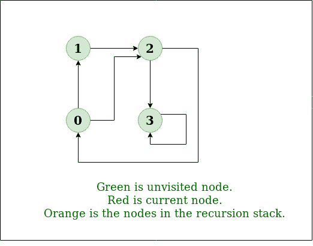
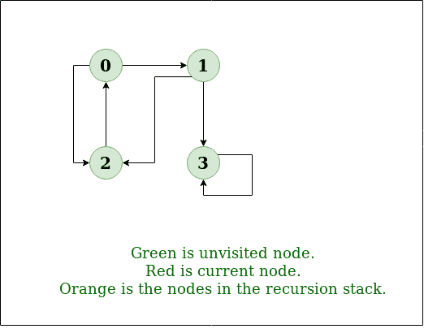

# 图表

的深度优先搜索或 DFS

> 原文： [https://www.geeksforgeeks.org/depth-first-search-or-dfs-for-a-graph/](https://www.geeksforgeeks.org/depth-first-search-or-dfs-for-a-graph/)

图的[深度优先遍历（或搜索）](http://en.wikipedia.org/wiki/Depth-first_search)与树的深度优先遍历类似。 唯一的问题是，与树不同，图可能包含循环，一个节点可能被访问两次。 为避免多次处理节点，请使用布尔访问数组。

**示例**：

> **输入**：n = 4，e = 6
> 0-> 1，0-> 2，1，-> 2，2-> 0，2-> 3，3-> 3
> **输出**：来自顶点 1 的 DFS：1 2 0 3
> **说明**：
> DFS 图：
> 
> 
> 
> **输入**：n = 4，e = 6
> 2-> 0，0-> 2，1-> 2，0-> 1，3-> 3，1-> 3
> **输出**：来自顶点 2 的 DFS：2 0 1 3
> **说明**：
> DFS 图：
> 
> 

**先决条件**：有关深度优先遍历的所有应用，请参见此文章的[。

以下是简单的深度优先遍历的实现。 C++实现使用图形的](https://www.geeksforgeeks.org/archives/11644)[邻接表表示](https://www.geeksforgeeks.org/graph-and-its-representations/)。 [STL](https://www.geeksforgeeks.org/the-c-standard-template-library-stl/) 的[列表容器](http://www.yolinux.com/TUTORIALS/LinuxTutorialC++STL.html#LIST)用于存储相邻节点的列表。

**<u>解决方案：</u>**

*   **方法**：深度优先搜索是一种用于遍历或搜索树或图形数据结构的算法。 该算法从根节点开始（在图形的情况下，选择一些任意节点作为根节点），并在回溯之前尽可能沿着每个分支进行探索。 因此，基本思想是从根节点或任意节点开始，标记该节点，然后移至相邻的未标记节点，然后继续此循环，直到没有未标记的相邻节点为止。 然后回溯并检查其他未标记的节点并遍历它们。 最后打印路径中的节点。

*   **算法**：

    1.  创建一个递归函数，该函数采用节点和已访问数组的索引。

    2.  将当前节点标记为已访问并打印该节点。

    3.  遍历所有相邻和未标记的节点，并使用相邻节点的索引调用递归函数。

**实施**：

## C++

```cpp

// C++ program to print DFS traversal from
// a given vertex in a  given graph
#include <bits/stdc++.h>
using namespace std;

// Graph class represents a directed graph
// using adjacency list representation
class Graph {
    int V; // No. of vertices

    // Pointer to an array containing
    // adjacency lists
    list<int>* adj;

    // A recursive function used by DFS
    void DFSUtil(int v, bool visited[]);

public:
    Graph(int V); // Constructor

    // function to add an edge to graph
    void addEdge(int v, int w);

    // DFS traversal of the vertices
    // reachable from v
    void DFS(int v);
};

Graph::Graph(int V)
{
    this->V = V;
    adj = new list<int>[V];
}

void Graph::addEdge(int v, int w)
{
    adj[v].push_back(w); // Add w to v’s list.
}

void Graph::DFSUtil(int v, bool visited[])
{
    // Mark the current node as visited and
    // print it
    visited[v] = true;
    cout << v << " ";

    // Recur for all the vertices adjacent
    // to this vertex
    list<int>::iterator i;
    for (i = adj[v].begin(); i != adj[v].end(); ++i)
        if (!visited[*i])
            DFSUtil(*i, visited);
}

// DFS traversal of the vertices reachable from v.
// It uses recursive DFSUtil()
void Graph::DFS(int v)
{
    // Mark all the vertices as not visited
    bool* visited = new bool[V];
    for (int i = 0; i < V; i++)
        visited[i] = false;

    // Call the recursive helper function
    // to print DFS traversal
    DFSUtil(v, visited);
}

// Driver code
int main()
{
    // Create a graph given in the above diagram
    Graph g(4);
    g.addEdge(0, 1);
    g.addEdge(0, 2);
    g.addEdge(1, 2);
    g.addEdge(2, 0);
    g.addEdge(2, 3);
    g.addEdge(3, 3);

    cout << "Following is Depth First Traversal"
            " (starting from vertex 2) \n";
    g.DFS(2);

    return 0;
}

```

## Java

```java

// Java program to print DFS
//mtraversal from a given given
// graph
import java.io.*;
import java.util.*;

// This class represents a 
// directed graph using adjacency
// list representation
class Graph {
    private int V; // No. of vertices

    // Array  of lists for 
    // Adjacency List Representation
    private LinkedList<Integer> adj[];

    // Constructor
    @SuppressWarnings("unchecked") Graph(int v)
    {
        V = v;
        adj = new LinkedList[v];
        for (int i = 0; i < v; ++i)
            adj[i] = new LinkedList();
    }

    // Function to add an edge into the graph
    void addEdge(int v, int w)
    {
        adj[v].add(w); // Add w to v's list.
    }

    // A function used by DFS
    void DFSUtil(int v, boolean visited[])
    {
        // Mark the current node as visited and print it
        visited[v] = true;
        System.out.print(v + " ");

        // Recur for all the vertices adjacent to this
        // vertex
        Iterator<Integer> i = adj[v].listIterator();
        while (i.hasNext()) 
        {
            int n = i.next();
            if (!visited[n])
                DFSUtil(n, visited);
        }
    }

    // The function to do DFS traversal.
    // It uses recursive
    // DFSUtil()
    void DFS(int v)
    {
        // Mark all the vertices as 
        // not visited(set as
        // false by default in java)
        boolean visited[] = new boolean[V];

        // Call the recursive helper 
        // function to print DFS
        // traversal
        DFSUtil(v, visited);
    }

    // Driver Code
    public static void main(String args[])
    {
        Graph g = new Graph(4);

        g.addEdge(0, 1);
        g.addEdge(0, 2);
        g.addEdge(1, 2);
        g.addEdge(2, 0);
        g.addEdge(2, 3);
        g.addEdge(3, 3);

        System.out.println(
            "Following is Depth First Traversal "
            + "(starting from vertex 2)");

        g.DFS(2);
    }
}
// This code is contributed by Aakash Hasija

```

## Python

```py

# Python3 program to print DFS traversal
# from a given given graph
from collections import defaultdict

# This class represents a directed graph using
# adjacency list representation

class Graph:

    # Constructor
    def __init__(self):

        # default dictionary to store graph
        self.graph = defaultdict(list)

    # function to add an edge to graph
    def addEdge(self, u, v):
        self.graph[u].append(v)

    # A function used by DFS
    def DFSUtil(self, v, visited):

        # Mark the current node as visited
        # and print it
        visited.add(v)
        print(v, end=' ')

        # Recur for all the vertices
        # adjacent to this vertex
        for neighbour in self.graph[v]:
            if neighbour not in visited:
                self.DFSUtil(neighbour, visited)

    # The function to do DFS traversal. It uses
    # recursive DFSUtil()
    def DFS(self, v):

        # Create a set to store visited vertices
        visited = set()

        # Call the recursive helper function
        # to print DFS traversal
        self.DFSUtil(v, visited)

# Driver code

# Create a graph given
# in the above diagram
g = Graph()
g.addEdge(0, 1)
g.addEdge(0, 2)
g.addEdge(1, 2)
g.addEdge(2, 0)
g.addEdge(2, 3)
g.addEdge(3, 3)

print("Following is DFS from (starting from vertex 2)")
g.DFS(2)

# This code is contributed by Neelam Yadav

```

## C#

```cs

// C# program to print DFS traversal
// from a given graph
using System;
using System.Collections.Generic;

// This class represents a directed graph
// using adjacency list representation
class Graph {
    private int V; // No. of vertices

    // Array of lists for
    // Adjacency List Representation
    private List<int>[] adj;

    // Constructor
    Graph(int v)
    {
        V = v;
        adj = new List<int>[ v ];
        for (int i = 0; i < v; ++i)
            adj[i] = new List<int>();
    }

    // Function to Add an edge into the graph
    void AddEdge(int v, int w)
    {
        adj[v].Add(w); // Add w to v's list.
    }

    // A function used by DFS
    void DFSUtil(int v, bool[] visited)
    {
        // Mark the current node as visited
        // and print it
        visited[v] = true;
        Console.Write(v + " ");

        // Recur for all the vertices
        // adjacent to this vertex
        List<int> vList = adj[v];
        foreach(var n in vList)
        {
            if (!visited[n])
                DFSUtil(n, visited);
        }
    }

    // The function to do DFS traversal.
    // It uses recursive DFSUtil()
    void DFS(int v)
    {
        // Mark all the vertices as not visited
        // (set as false by default in c#)
        bool[] visited = new bool[V];

        // Call the recursive helper function
        // to print DFS traversal
        DFSUtil(v, visited);
    }

    // Driver Code
    public static void Main(String[] args)
    {
        Graph g = new Graph(4);

        g.AddEdge(0, 1);
        g.AddEdge(0, 2);
        g.AddEdge(1, 2);
        g.AddEdge(2, 0);
        g.AddEdge(2, 3);
        g.AddEdge(3, 3);

        Console.WriteLine(
            "Following is Depth First Traversal "
            + "(starting from vertex 2)");

        g.DFS(2);
        Console.ReadKey();
    }
}

// This code is contributed by techno2mahi

```

**输出**：

```
Following is Depth First Traversal (starting from vertex 2)
2 0 1 3
```

**复杂度分析**：

*   **时间复杂度**：O（V + E），其中 V 是顶点数量，E 是图形中边的数量。

*   **空间复杂度**：O（V）。

    由于，因此需要一个额外的 V 大小的访问数组。

**<u>处理断开连接图</u>**

*   **解决方案**：这将通过处理拐角处的情况发生。

    上面的代码仅遍历从给定源顶点可到达的顶点。 像“断开图”的情况一样，可能无法从给定的顶点到达所有顶点。 要完成此类图的 DFS 遍历，请在 DFS 之后从所有未访问的节点运行 DFS。

    *递归功能保持不变。*

*   **算法**：

    1.  创建一个递归函数，该函数采用节点和已访问数组的索引。

    2.  将当前节点标记为已访问并打印该节点。

    3.  遍历所有相邻和未标记的节点，并使用相邻节点的索引调用递归函数。

    4.  运行从 0 到顶点数的循环，并检查是否在以前的 DFS 中未访问该节点，然后使用当前节点调用递归函数。

**实施**：

## C++

```cpp

// C++ program to print DFS
// traversal for a given given
// graph
#include <bits/stdc++.h>
using namespace std;

class Graph {
    int V; // No. of vertices

    // Pointer to an array containing
    // adjacency lists
    list<int>* adj;

    // A function used by DFS
    void DFSUtil(int v, bool visited[]);

public:
    Graph(int V); // Constructor

    // function to add an edge to graph
    void addEdge(int v, int w);

    // prints DFS traversal of the complete graph
    void DFS();
};

Graph::Graph(int V)
{
    this->V = V;
    adj = new list<int>[V];
}

void Graph::addEdge(int v, int w)
{
    adj[v].push_back(w); // Add w to v’s list.
}

void Graph::DFSUtil(int v, bool visited[])
{
    // Mark the current node as visited and print it
    visited[v] = true;
    cout << v << " ";

    // Recur for all the vertices adjacent to this vertex
    list<int>::iterator i;
    for (i = adj[v].begin(); i != adj[v].end(); ++i)
        if (!visited[*i])
            DFSUtil(*i, visited);
}

// The function to do DFS traversal. It uses recursive
// DFSUtil()
void Graph::DFS()
{
    // Mark all the vertices as not visited
    bool* visited = new bool[V];
    for (int i = 0; i < V; i++)
        visited[i] = false;

    // Call the recursive helper function to print DFS
    // traversal starting from all vertices one by one
    for (int i = 0; i < V; i++)
        if (visited[i] == false)
            DFSUtil(i, visited);
}

// Driver  Code
int main()
{
    // Create a graph given in the above diagram
    Graph g(4);
    g.addEdge(0, 1);
    g.addEdge(0, 2);
    g.addEdge(1, 2);
    g.addEdge(2, 0);
    g.addEdge(2, 3);
    g.addEdge(3, 3);

    cout << "Following is Depth First Traversal \n";
    g.DFS();

    return 0;
}

```

## Java

```java

// Java program to print DFS
// traversal from a given given
// graph
import java.io.*;
import java.util.*;

// This class represents a
// directed graph using adjacency
// list representation
class Graph {
    private int V; // No. of vertices

    // Array  of lists for
    // Adjacency List Representation
    private LinkedList<Integer> adj[];

    // Constructor
    @SuppressWarnings("unchecked") Graph(int v)
    {
        V = v;
        adj = new LinkedList[v];
        for (int i = 0; i < v; ++i)
            adj[i] = new LinkedList();
    }

    // Function to add an edge into the graph
    void addEdge(int v, int w)
    {
        adj[v].add(w); // Add w to v's list.
    }

    // A function used by DFS
    void DFSUtil(int v, boolean visited[])
    {
        // Mark the current node as visited and print it
        visited[v] = true;
        System.out.print(v + " ");

        // Recur for all the vertices adjacent to this
        // vertex
        Iterator<Integer> i = adj[v].listIterator();
        while (i.hasNext()) {
            int n = i.next();
            if (!visited[n])
                DFSUtil(n, visited);
        }
    }

    // The function to do DFS traversal. It uses recursive
    // DFSUtil()
    void DFS()
    {
        // Mark all the vertices as not visited(set as
        // false by default in java)
        boolean visited[] = new boolean[V];

        // Call the recursive helper function to print DFS
        // traversal starting from all vertices one by one
        for (int i = 0; i < V; ++i)
            if (visited[i] == false)
                DFSUtil(i, visited);
    }

    // Driver Code
    public static void main(String args[])
    {
        Graph g = new Graph(4);

        g.addEdge(0, 1);
        g.addEdge(0, 2);
        g.addEdge(1, 2);
        g.addEdge(2, 0);
        g.addEdge(2, 3);
        g.addEdge(3, 3);

        System.out.println(
            "Following is Depth First Traversal");

        g.DFS();
    }
}
// This code is contributed by Aakash Hasija

```

## Python

```py

# Python program to print DFS
# traversal for complete graph
from collections import defaultdict

# This class represents a
# directed graph using adjacency
# list representation

class Graph:

    # Constructor
    def __init__(self):

        # default dictionary to store graph
        self.graph = defaultdict(list)

    # function to add an edge to graph
    def addEdge(self, u, v):
        self.graph[u].append(v)

    # A function used by DFS
    def DFSUtil(self, v, visited):

        # Mark the current node as visited and print it
        visited.add(v)
        print v,

        # Recur for all the vertices adjacent to
        # this vertex
        for neighbour in self.graph[v]:
            if neighbour not in visited:
                self.DFSUtil(neighbour, visited)

    # The function to do DFS traversal. It uses
    # recursive DFSUtil()

    def DFS(self):

        # Create a set to store all visited vertices
        visited = set()

        # Call the recursive helper function to print
        # DFS traversal starting from all vertices one
        # by one
        for vertex in list(self.graph):
            if vertex not in visited:
                self.DFSUtil(vertex, visited)

# Driver code
# Create a graph given in the above diagram
g = Graph()
g.addEdge(0, 1)
g.addEdge(0, 2)
g.addEdge(1, 2)
g.addEdge(2, 0)
g.addEdge(2, 3)
g.addEdge(3, 3)

print "Following is Depth First Traversal"
g.DFS()

# This code is contributed by Neelam Yadav

```

## C#

```cs

// C# program to print DFS
// traversal from a given given
// graph
using System;
using System.Collections.Generic;

// This class represents a
// directed graph using adjacency
// list representation
public class Graph {
    private int V; // No. of vertices

    // Array of lists for
    // Adjacency List Representation
    private List<int>[] adj;

    // Constructor
    Graph(int v)
    {
        V = v;
        adj = new List<int>[ v ];
        for (int i = 0; i < v; ++i)
            adj[i] = new List<int>();
    }

    // Function to add an edge into the graph
    void addEdge(int v, int w)
    {
        adj[v].Add(w); // Add w to v's list.
    }

    // A function used by DFS
    void DFSUtil(int v, bool[] visited)
    {
        // Mark the current
        // node as visited and print it
        visited[v] = true;
        Console.Write(v + " ");

        // Recur for all the
        // vertices adjacent to this
        // vertex
        foreach(int i in adj[v])
        {
            int n = i;
            if (!visited[n])
                DFSUtil(n, visited);
        }
    }

    // The function to do
    // DFS traversal. It uses recursive
    // DFSUtil()
    void DFS()
    {
        // Mark all the vertices as not visited(set as
        // false by default in java)
        bool[] visited = new bool[V];

        // Call the recursive helper
        // function to print DFS
        // traversal starting from
        // all vertices one by one
        for (int i = 0; i < V; ++i)
            if (visited[i] == false)
                DFSUtil(i, visited);
    }

    // Driver code
    public static void Main(String[] args)
    {
        Graph g = new Graph(4);

        g.addEdge(0, 1);
        g.addEdge(0, 2);
        g.addEdge(1, 2);
        g.addEdge(2, 0);
        g.addEdge(2, 3);
        g.addEdge(3, 3);

        Console.WriteLine(
            "Following is Depth First Traversal");

        g.DFS();
    }
}

// This code is contributed by PrinciRaj1992

```

**输出**：

```
Following is Depth First Traversal
0 1 2 3
```

**复杂度分析**：

*   **时间复杂度**：O（V + E），其中 V 是顶点数量，E 是图形中边的数量。

*   **空间复杂度**：O（V）。

    由于需要一个额外的 V 大小的访问数组。

https://youtu.be/Y40bRyPQQr0

*   [**DFS 的应用。**](https://www.geeksforgeeks.org/applications-of-depth-first-search/)

*   [**图**](https://www.geeksforgeeks.org/breadth-first-traversal-for-a-graph/) 的广度优先遍历

*   [**关于 DFS 的最新文章**](https://www.geeksforgeeks.org/tag/dfs/)

如果发现任何不正确的地方，或者想分享有关上述主题的更多信息，请写评论。

