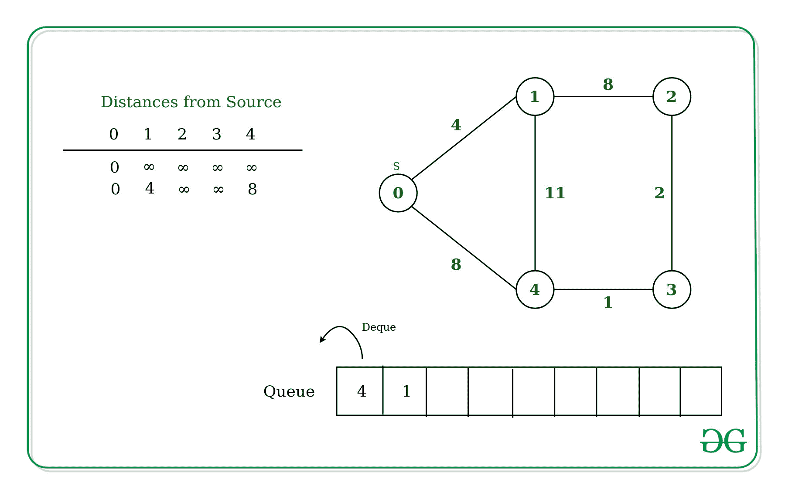

# D’Esopo-Pape 算法：单一来源最短路径

> 原文： [https://www.geeksforgeeks.org/desopo-pape-algorithm-single-source-shortest-path/](https://www.geeksforgeeks.org/desopo-pape-algorithm-single-source-shortest-path/)

给定一个图和**加权无向图**中的源顶点 **src** ，找到从 src 到给定图中所有顶点的最短路径。 该图可能包含负权重边缘。

针对此问题，我们已经讨论了 [Dijkstra 的算法](https://www.geeksforgeeks.org/dijkstras-shortest-path-algorithm-greedy-algo-7/)和 [Bellman-Ford 算法](https://www.geeksforgeeks.org/bellman-ford-algorithm-dp-23/)。 但是 D’Esopo-Pape 算法在大多数情况下的效果都很好。 但是，在某些情况下会花费指数时间。

## [推荐：请先在“ ***<u>实践</u>*** ”上解决它，然后再继续进行解决。](https://practice.geeksforgeeks.org/problems/negative-weight-cycle/0)

**算法**：

**输入**：图形和源顶点 src 的邻接列表。
**输出**：从 src 到所有顶点的最短距离。

该算法使用双向队列来存储要操作的顶点。
以下是该算法的详细步骤。

1.  初始化顶点在数组中从源到无限的距离。
2.  维护一个 **[队列](http://www.geeksforgeeks.org/queue-data-structure/)** ，该队列将存储要操作的顶点，并且还为顶点维护一个布尔数组，该布尔数组将用于确定该顶点是否已存在于队列中。
3.  在队列中附加源顶点。
4.  从队列开始弹出顶点，直到队列为空，并对每个弹出的顶点执行以下步骤（让`U`为弹出的顶点）：
    *   将顶点`U`设置为不存在于队列中。
    *   对于`U`的每个相邻顶点`V`，检查其当前的最小 **Distance [V]** 是否大于通过`U`的距离，
        ，即**距离[U] +连接 U 和 V 的边缘的重量**。
    *   If yes, update Distance[V] = Distance[U] + weight of edge connecting U and V.
        Check If V is not present in the queue with the help of Boolean Array:
        1.  如果`V`首次进入队列，请在队列的**后面附加 V，并借助布尔数组将顶点 V 设置为队列中存在的值。**
        2.  否则，将其追加到队列的**前面，并将 V 顶点设置为队列中存在的顶点。**
5.  返回列表**距离**，其中每个顶点到源顶点的距离最短。

**例如**：
最初，从源到其自身的距离将为 0，对于其他顶点，该距离将是无限的。
[](https://media.geeksforgeeks.org/wp-content/uploads/20200213180911/Untitled-Diagram231.jpg) 
现在，在这种情况下，对于源的每个相邻顶点`0`，[1，4]更新距离并将顶点标记为 的权重分别为 4 和 8。
[](https://media.geeksforgeeks.org/wp-content/uploads/20200213181429/Untitled-Diagram241.jpg) 
现在，从队列中取出顶点`4`，然后将相邻的顶点连接到顶点 4 –

*   **顶点 1** -由于顶点 1 已经访问并且到达顶点 1 的权重为 4，因此当从源通过边 4_1 移到顶点 1 时，总权重将为 11，这会更大 比存储在距离数组中的权重。
*   **顶点 3** –由于未访问顶点 3 且队列中也没有该顶点，因此顶点 3 的距离已更新为 9，并且也排入了队列的最前面。

[](https://media.geeksforgeeks.org/wp-content/uploads/20200213192435/Untitled-Diagram251.jpg) 
类似地，从队列中取出顶点 3，并更新相邻顶点的值。 顶点 3 的相邻顶点是顶点 4 和顶点 2。

*   **顶点 4** –由于已经访问了顶点 4，并且权重已经很小，因此不会更新距离。
*   **顶点 2** –由于未访问顶点 2 并且队列中也没有该顶点 2，因此，距离 3 的距离更新为 11，并且也排入了队列的最前面。

[](https://media.geeksforgeeks.org/wp-content/uploads/20200213194415/Untitled-Diagram271.jpg)

下面是上述方法的实现。

## Python3

```

# Python implementation for 
# D'Esopo-Pape algorithm 

from collections import defaultdict, deque 

def desopo(graph): 
    # Number of vertices in graph 
    v = len(graph) 

    # Adjacency list of graph  
    adj = defaultdict(list) 
    for i in range(v): 
        for j in range(i + 1, v): 
            if graph[i][j] != 0: 
                adj[i].append( 
                    [graph[i][j], j] 
                ) 
                adj[j].append( 
                    [graph[i][j], i] 
                ) 

    # Queue to store unoperated vertices 
    q = deque([]) 

    # Distance from source vertex 
    distance =[float('inf')]*v 

    # Status of vertex 
    is_in_queue =[False]*v 

    # let 0 be the source vertex 
    source = 0
    distance= 0
    q.append(source) 
    is_in_queue= True

    while q: 
        # Pop from front of the queue 
        u = q.popleft()  
        is_in_queue[u]= False

        # scan adjacent vertices of u 
        for e in adj[u]: 
            # e <- [weight, vertex] 
            if distance[e[1]] > distance[u]+e[0]: 
                distance[e[1]]= distance[u]+e[0] 
                if is_in_queue[e[1]]== False: 
                    # if e[1] is entering  
                    # first time in the queue 
                    if distance[e[1]]== float('inf'): 
                        # Append at back of queue 
                        q.append(e[1])  
                    else: 
                        # Append at front of queue 
                        q.appendleft(e[1]) 
                    is_in_queue[e[1]] = True
    return distance 

# Driver Code 
if __name__ == "__main__": 
    # Adjacency matrix of graph 
    graph = [[0, 4, 0, 0, 8], 
            [0, 0, 8, 0, 11], 
            [0, 8, 0, 2, 0], 
            [0, 0, 2, 0, 1], 
            [8, 11, 0, 1, 0] 
            ] 
    print(desopo(graph)) 

```